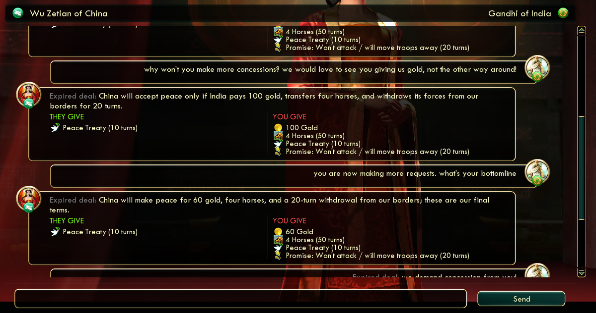
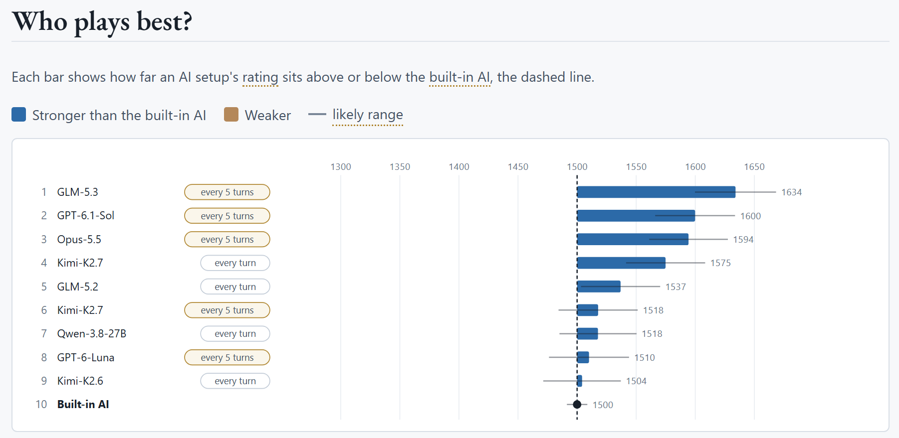

# Vox Deorum

Play Civilization V with AI-enhanced opponents powered by GPT, Claude, and other large language models. Built on [Community Patch + Vox Populi](https://github.com/LoneGazebo/Community-Patch-DLL).

**Version 0.13.6 - Beta**

**Vox Deorum** is a modmod for Vox Populi that lets LLMs play Civilization V alongside or against you. The LLM takes care of the grand strategy, and Vox Populi's AI takes care of the rest. Therefore, you won't go broke just by playing one more turn.

| The LLM decides | Vox Populi's AI handles |
| --- | --- |
| What victory to pursue, how friendly or hostile to be, economic and military priorities, technologies, policies | What to build and how to fight |

| What you can do | Where to look |
| --- | --- |
| Play against or with LLM leaders | [Getting Started](docs/players/getting-started.md) |
| Chat with leaders and barter deals | [Interactive diplomacy](docs/players/playing.md#using-interactive-diplomacy) |
| See which models play best | [CivBench](#can-they-play-well) |
| Rewatch any game | [Replayer](docs/players/replay.md) |

## Can I chat with the models?

Yes. Diplomacy should feel like a back-and-forth exchange, and deal-making more like bartering. You can even convince models to trade promises (for example, "don't settle near me") or change their strategies, which works best when they are your teammates.
- You can chat with **any** leader, not just LLM-controlled ones. With a non-LLM leader, only the chat itself costs tokens, so you won't lose a kidney for that.
- Only when an LLM controls a civilization can you shift its **strategies**.

## Can they play well?

They hold up on their own, but they are far from good players. In **[CivBench](https://vox-deorum.github.io/civ-bench-latest/index.html)**, our controlled benchmark, models rotate through the same three fixed starts. As of Oct 2026, the best model (GLM-5.3) sits over 130 Elo above Vox Populi's strategic AI at Prince level, making decisions every five turns (or when something important comes up).

Unfortunately, to play better in the game, you currently need exponential compute. The site also covers cost per game, favorite victory types, and diplomatic behavior. Check out some replays:

- [GLM-5.3: China, Cultural victory](https://vox-deorum.github.io/vox-deorum-replay/?file=https%3A%2F%2Fvox-deorum.github.io%2Fciv-bench-latest%2Fsaves%2Fglm-5.3-standard-fixed-per-5%2Fecaa06bb-af9b-43ed-8218-70dbebb35067.Civ5Save)
- [Opus-5.5: Morocco, Cultural victory](https://vox-deorum.github.io/vox-deorum-replay/?file=https%3A%2F%2Fvox-deorum.github.io%2Fciv-bench-latest%2Fsaves%2Fclaude-opus-5.5-standard-fixed-per-5%2Fc5208546-bae4-4eb1-808f-ea85b5da9a45.Civ5Save)
- [Qwen-3.8-27B: China, Science victory](https://vox-deorum.github.io/vox-deorum-replay/?file=https%3A%2F%2Fvox-deorum.github.io%2Fciv-bench-latest%2Fsaves%2Fqwen-3.8-27b-standard-fixed%2F06f08285-6126-42e7-99c9-6dcff2b0dc25.Civ5Save)

## Do I have to spend tons of money?

Not necessarily.

- Cheap models such as GPT-6-Luna (about as strong as Vox Populi's strategic AI) cost around $1 per player per standard game in API costs.
- You can use existing Claude or ChatGPT subscriptions as well.
- Asking models to decide every X turns cuts the cost further.

## Play

Can't set this thing up? Start with **[Getting Started](docs/players/getting-started.md)** for prerequisites, the installer, and your first launch. From there the [player guide](docs/README.md) covers playing, configuring your LLM provider, reviewing sessions with the replayer, and troubleshooting. Still stuck? Ask in [Vox Populi's Discord server](https://forums.civfanatics.com/threads/official-vox-populi-discord-server.640955/).

## Develop

Want to understand or change the code? Start with **[Architecture](docs/developers/architecture.md)**: the components, how data flows between them, and why each layer exists. The [developer guide](docs/README.md) continues into setup, the end-to-end protocol, diplomacy, testing, operations, releasing, and a folder per component. Development needs Node.js 22.23.3 or newer; see [developer setup](docs/developers/setup.md).

## Documentation

All documentation lives under **[docs/](docs/README.md)**. Pick the player door or the developer door from the index. Working rules for contributors and agents are in [AGENTS.md](AGENTS.md).

## License

Author: John Chen (with assistance from Claude Code). Assistant Professor, University of Arizona, College of Information Science

Different licenses are used for submodules:

- `civ5-dll` - GPL 3.0 (following the upstream license)
- `bridge-service`, `vox-agents`, `mcp-server`, `civ5-mod` - [CC BY-NC-SA 4.0](LICENSE.md)
