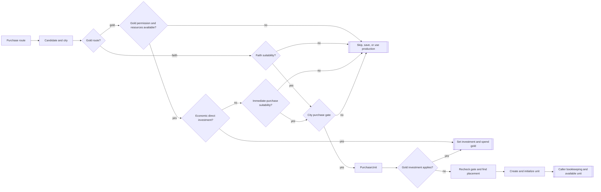
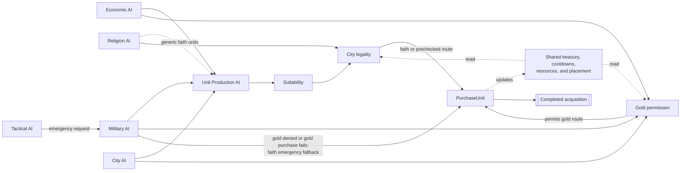
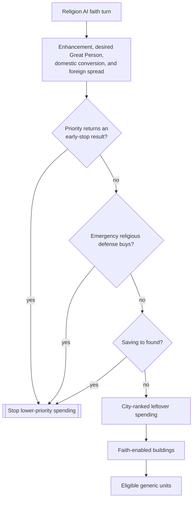

# Unit AI: Acquisition

**Acquisition** spends gold or faith to obtain a unit immediately. A caller identifies the purpose, candidate, and city, and the city validates and executes the purchase. [Production](production.md) covers queue selection, while [military production](military-production.md) explains formation demand that can request an acquisition.

The primary implementation is in `civ5-dll/CvGameCoreDLL_Expansion2/CvEconomicAI.cpp`, `CvCityStrategyAI.cpp`, `CvReligionClasses.cpp`, `CvMilitaryAI.cpp`, `CvAIOperation.cpp`, `CvTacticalAI.cpp`, `CvCity.cpp`, and `CvUnitProductionAI.cpp`.

## Runtime route map

Each **purchase route** establishes why a unit is needed, selects a candidate, and applies route-specific policy before city execution. The routes run in this order: Economic AI, Military AI, Religion AI, City AI, then Tactical AI. Completed routes update the shared treasury, cooldown, resource, and placement state used by later routes. A **savings request** reserves gold for a purchase category in Economic AI's priority ledger.

| Route | Purpose and candidate | Currency and route policy |
| --- | --- | --- |
| Ordinary hurry | `CvEconomicAI::DoHurry` ranks each eligible city's leading flavor-weighted candidate and special diplomat candidates. | Gold. It keeps a game-speed and era-adjusted treasury cushion and respects savings requests. |
| Final operation slot | `CvMilitaryAI::MakeEmergencyPurchases` fills the only remaining uncommitted slot in a recruiting operation. | The military helper tries gold, then faith when gold purchase execution does not complete. |
| City operation or army need | `CvCity::CheckForOperationUnits` selects a role through `CvUnitProductionAI::RecommendUnit`. | Gold. A suitable production candidate can replace a purchase candidate when training finishes soon. |
| Tactical defense | `CvTacticalAI::PlotEmergencyPurchases` responds to a threatened land zone or besieged city. | The military helper chooses a ranged unit for an ungarrisoned city when appropriate, otherwise a defensive unit, then tries gold and faith. |
| Religious priority | `CvReligionAI::DoFaithPurchases` and `DoFaithPurchasesInCities` prioritize religious units, Great People, buildings, and eligible leftover units. | Faith. Higher-priority choices may reserve faith for a later turn. |
| Religious defense | `CvReligionAI::DoReligionDefenseInCities` reacts to a nearby foreign prophet. | Faith purchases an inquisitor in a city with the chosen religion. |

Final-slot purchases require a player who is outside the at-war strategy or winning every active war. Tactical emergency purchases avoid water zones and cities likely to fall. City operation purchases exclude razing, automated, minor-civilization, barbarian, and ordinary puppet cities; they also wait when average income is negative or a military unit is already queued.

Takeaway: a route can skip a purchase, preserve funds, use production, or set an investment. A gold `PurchaseUnit` call can also invest rather than create a unit.

## Shared execution boundaries

| Boundary | Owner | Behavior |
| --- | --- | --- |
| **Gold permission** | `CvEconomicAI::CanWithdrawMoneyForPurchase` | Compares the requested amount with the treasury after higher-priority savings requests. It grants permission without spending gold. |
| **Suitability** | `CvUnitProductionAI::CheckUnitBuildSanity` | Applies strategy checks and, in purchase mode, a gold purchase precheck. Economic AI, City AI operation needs, and the military helper use it. |
| **Purchase gate** | `CvCity::IsCanPurchase` | Validates city state, placement, trainability, unlocks, currency, and the relevant cooldowns for a specific unit and yield. |
| **Purchase execution** | `CvCity::PurchaseUnit` | Rechecks `IsCanPurchase`, finds placement before payment, creates and initializes the unit, spends the selected currency, and updates cooldowns. Gold and faith purchases fire the city-trained hook with their purchase reason. |
| **Faith priority** | Religion AI | Orders faith spending from immediate religious goals to city-ranked leftover spending. It reads faith and religion state independently of the gold savings ledger. |

Purchased units receive the purchase experience and damage rules, and normally finish their movement for the turn. A unit entry can allow movement after purchase. Faith purchases also initialize unit religion and update faith-purchased Great Person counters.

Takeaway: callers share suitability, funding, legality, and mutable purchase state. `PurchaseUnit` is their common execution point, and the military helper can enter it with faith after its gold attempt fails.

## Ordinary gold execution and investment

**Ordinary PurchaseUnit execution** creates a unit through `CvCity::PurchaseUnit`. `DoHurry` collects positive flavor-weighted unit and building candidates, adds operation and army candidates in gold mode, and adjusts their weights by construction time. It chooses city leaders and considers the empire-level list while gold remains above its cushion. Before an ordinary unit purchase, the immediate-purchase branch rechecks savings priorities, strategic resources, and `CheckUnitBuildSanity`.

An **investment** is Economic AI's alternative gold branch for a spaceship-project unit, or for ordinary units when `MOD_BALANCE_UNIT_INVESTMENTS` is active. The branch spends gold and sets the city unit-class investment state. It proceeds from the selected candidate without an execution-time `IsCanPurchase` recheck, does not call `CreateUnit`, and does not fire `CityTrained` at investment time. Some direct routes can also place the invested unit in the production queue.

An ordinary candidate, operation request, and army request can name the same unit independently. A successful operation purchase resets its operation skip counter, and a successful settler purchase resets the settler skip counter.

Direct military routes begin with a required `UnitAI` role. They use `CvUnitProductionAI::RecommendUnit` to select a trainable concrete unit, then apply suitability and city execution. `CvAIOperation::BuyFinalUnit` assigns a successful purchase to the final open operation slot. `CvMilitaryAI::BuyEmergencyUnit` asks Economic AI for gold permission, then attempts faith after gold execution fails. Its purchase-mode suitability still applies the gold purchase precheck before that attempt.

## Faith priority and legality

Religion AI considers enhancement, a desired faith Great Person, domestic conversion, and foreign spread before emergency religious defense, founding savings, and city-ranked leftover spending. `CvReligionAI::DoTurn` reaches emergency defense only when `DoFaithPurchases` returns false. The leftover pass ranks cities by faith output, favors holy cities, and penalizes puppets. It then considers faith-enabled buildings and eligible units when the empire is converted, has positive gold income, and has supply capacity. Missionaries and inquisitors use dedicated demand paths. Generic spending excludes them, special units, and units without a positive base faith cost.

Takeaway: only priority paths that return an early-stop result preserve faith before defense and city-ranked leftovers run. A successful priority purchase can continue through the later checks.

| Legality layer | Gold | Faith |
| --- | --- | --- |
| City and placement | Valid city state, placement, and trainability are required. | The same city and placement evaluation applies, with the applicable faith building exception for puppets. |
| Unlocks | Normal unit, resource, instance-limit, and required-building checks apply. | Religion, belief, policy, era, domain, and trait rules apply. Air units require their specific faith route; naval units require the applicable trait route. |
| Currency and cooldown | Treasury gold and local combat or civilian cooldowns apply. | Faith and global or local faith cooldowns apply, including local combat and civilian tracking. |

The generic faith unit path calls `ChooseHurry` in unit-only faith mode. Its `CheckUnitBuildSanity` call uses the gold form of `IsCanPurchase` while purchase mode is active. This **generic-faith gold-legality quirk** can remove a faith-legal unit when the same city cannot buy it with gold. Dedicated religious purchases call the faith purchase gate directly.

## Implementation and diagnostics

1. A route identifies an ordinary spending, formation, defense, religious, or city need.
2. City strategy or a route-specific helper selects candidates. Most unit routes call `CheckUnitBuildSanity`.
3. Gold routes request Economic AI permission when their savings policy applies. City execution handles `IsCanPurchase` and `PurchaseUnit`; the Economic AI investment branch records an investment directly.
4. The caller records the route outcome, such as filling an operation slot, resetting a skip counter, cleaning a queue, or promoting a late emergency unit.

With AI logging enabled, city hurry logs show `PRE` candidates after entry and duration adjustment and `POST` candidates after suitability. `HurryCityPriorities.csv` records Economic AI's empire-level `BUY` list. Homeland, Tactical, and Religion logs record successful direct purchases. A `POST` candidate can later lose eligibility when an earlier route spends currency, reserves gold, consumes a resource, or occupies its placement.
