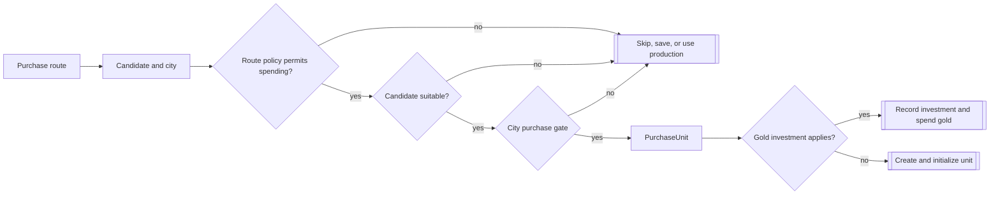
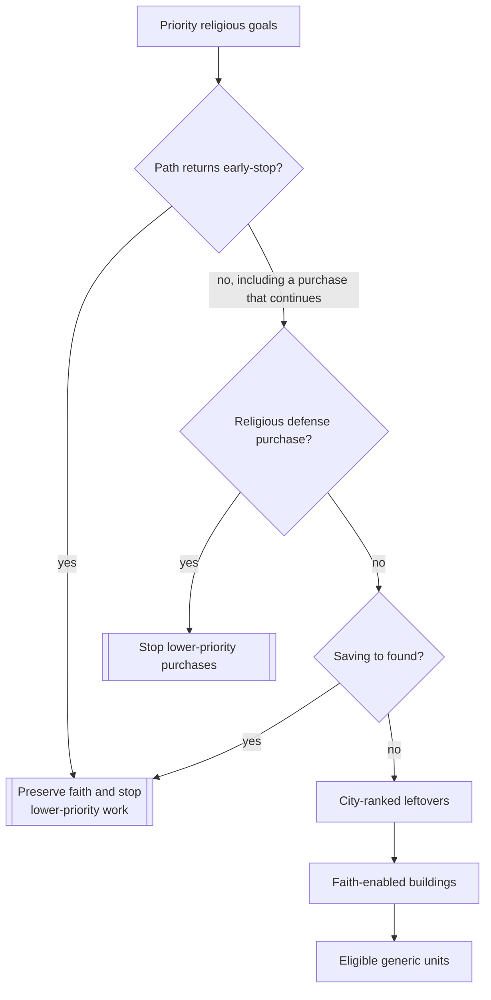

# Unit AI: Acquisition

**Acquisition** spends gold or faith to obtain a unit immediately. A caller establishes the need, concrete candidate, and city. The city then checks legality and executes the purchase. [Production](production.md) covers queue selection. For military formation demand, first read [formation requests and commitments](military-production.md#formation-requests-and-commitments): a weighted request can select a queue order without committing a formation slot, while city commitment and direct purchases have separate effects.

The main implementation is in `civ5-dll/CvGameCoreDLL_Expansion2/CvEconomicAI.cpp`, `CvCityStrategyAI.cpp`, `CvReligionClasses.cpp`, `CvMilitaryAI.cpp`, `CvAIOperation.cpp`, `CvTacticalAI.cpp`, `CvCity.cpp`, and `CvUnitProductionAI.cpp`.

## Common purchase path

Most unit routes follow the same sequence: select a city and candidate, apply the route's funding and suitability policy, pass the city gate, and execute. The outcome can be a purchase, a gold investment, a queued production fallback, or no action. The route table below identifies the outcomes available to each caller.

`CvEconomicAI::CanWithdrawMoneyForPurchase` grants gold permission after higher-priority savings reservations. It does not spend gold. `CvUnitProductionAI::CheckUnitBuildSanity` applies strategy rules and, in purchase mode, a gold purchase precheck. `CvCity::IsCanPurchase` validates the specific unit and yield; `CvCity::PurchaseUnit` rechecks it, finds placement before payment, creates and initializes an immediate-purchase unit, spends the currency, and updates cooldowns. Immediate gold and faith purchases fire the city-trained hook with their purchase reason. Gold investments record investment state instead.

Purchased units receive the applicable experience and damage rules and normally lose movement for the turn, unless the unit entry permits post-purchase movement. Faith purchases also initialize unit religion and update faith-purchased Great Person counters.

## Purchase routes

Routes run in this order: Economic AI, Military AI, Religion AI, City AI, then Tactical AI. Earlier routes can change the treasury, resources, cooldowns, or placement that a later route sees. A **savings request** gives a category priority and can reserve gold in Economic AI's ledger.

| Route | Purpose and candidate | Currency and route policy |
| --- | --- | --- |
| Ordinary hurry | `CvEconomicAI::DoHurry` ranks each eligible city's leading flavor-weighted candidate and special diplomat candidates. | Gold. It keeps a game-speed and era-adjusted treasury cushion and respects savings requests. |
| Final operation slot | `CvMilitaryAI::MakeEmergencyPurchases` fills the only remaining uncommitted slot in a recruiting persistent operation. | The military helper tries gold when permitted, then faith when no gold unit was obtained. |
| City operation or army need | `CvCity::CheckForOperationUnits` selects a role through `CvUnitProductionAI::RecommendUnit`. | Gold. A suitable production candidate can replace a purchase candidate when training finishes soon. |
| Tactical defense | `CvTacticalAI::PlotEmergencyPurchases` responds to a threatened land zone or besieged city. | The military helper chooses a ranged unit for an ungarrisoned city when appropriate, otherwise a defensive unit, then tries gold and faith. |
| Religious priority | `CvReligionAI::DoFaithPurchases` and `DoFaithPurchasesInCities` prioritize religious units, Great People, buildings, and eligible leftover units. | Faith. Higher-priority choices may reserve faith for a later turn. |
| Religious defense | `CvReligionAI::DoReligionDefenseInCities` reacts to a nearby foreign prophet. | Faith purchases an inquisitor in a city with the chosen religion. |

Final-slot purchases require a player outside the at-war strategy or [winning every active war](concepts.md#war-states). Tactical emergencies exclude water zones and cities likely to fall. City operation purchases exclude razing, automated, minor-civilization, barbarian, and ordinary puppet cities; they wait when average income is negative or a military unit is already queued.

Direct military paths start from a required [UnitAI role](concepts.md#unitai-roles), resolve a trainable type with `RecommendUnit`, then apply suitability and city execution. `CvAIOperation::BuyFinalUnit` assigns a successful final-slot purchase to its formation slot. `CvMilitaryAI::BuyEmergencyUnit` requests gold permission and tries faith if gold execution yields no unit. Its purchase-mode suitability still uses the gold purchase precheck. See [formation requests and commitments](military-production.md#formation-requests-and-commitments) for when `CheckForOperationUnits` commits a slot, queues production, or assigns a purchase directly.

## Savings and investment

Economic AI stores one savings request per purchase type. A newer request for that type replaces the previous one. Gold permission subtracts higher-priority reserved amounts before testing the caller's cost.

| Request | Priority | Reserved amount |
| --- | --- | --- |
| Major-civilization trade deal | 1 | Planned deal gold |
| Tile purchase | 2, replaced by the plot score at each check | Tile cost |
| Minor-civilization gift | 150 plus 25 per diplomacy-flavor point; 350 for buyout or marriage | Planned gift, buyout, or marriage cost |
| Defensive building | 250 | None |
| Unit | 500 | None |
| Unit upgrade | 500 plus 100 per military-training-flavor point; at war the flavor counts fifty-fold | First deferred [upgrade price](upgrade.md#ranking-and-reservation) |

Unit and defensive-building requests set priority but reserve no gold. Trade, tile, gift, and upgrade requests do reserve it. `DoHurry` also requires gold above twice the total reserved amount, excluding the zero-reservation categories. A wartime upgrade request with a positive military-training flavor outranks every other request in the table; a zero flavor ties the ordinary unit request.

An **investment** spends gold and records city unit-class investment state instead of creating a unit. Economic AI uses it for spaceship-project units and, when `MOD_BALANCE_UNIT_INVESTMENTS` is active, ordinary units. It skips the execution-time `IsCanPurchase` recheck and the city-trained hook. Some direct routes can add the invested unit to the production queue. Successful operation and settler purchases reset their respective skip counters.

## Faith priority and legality

Religion AI considers enhancement, a desired faith Great Person, domestic conversion, and foreign spread first. It then considers religious defense, founding savings, and city-ranked leftovers. An early-stop result on a priority path preserves faith for a later turn, while a successful priority purchase can continue into later checks. Leftover spending ranks cities by faith output, favors holy cities, penalizes puppets, and then considers faith-enabled buildings and eligible units. The generic unit branch requires conversion, positive gold income, and supply capacity. It excludes missionaries and inquisitors, which use dedicated demand, as well as special units and units without a positive base faith cost.

| Legality layer | Gold | Faith |
| --- | --- | --- |
| City and placement | Valid city state, placement, and trainability are required. | The same evaluation applies, with the applicable faith-building exception for puppets. |
| Unlocks | Normal unit, resource, instance-limit, and required-building checks apply. | Religion, belief, policy, era, domain, and trait rules apply. Air units need their specific faith route; naval units need the applicable trait route. |
| Currency and cooldown | Treasury gold and local combat or civilian cooldowns apply. | Faith and global or local faith cooldowns apply, including local combat and civilian tracking. |

The generic faith unit path calls `ChooseHurry` in unit-only faith mode, but its purchase-mode sanity check uses the gold form of `IsCanPurchase`. This **generic-faith gold-legality quirk** can reject a faith-legal unit when the city cannot buy it with gold. Dedicated religious purchases use the faith gate directly.

With AI logging enabled, city hurry logs show `PRE` candidates after entry and duration adjustment and `POST` candidates after suitability. `HurryCityPriorities.csv` records the empire `BUY` list; Homeland, Tactical, and Religion logs record direct purchases. For a candidate that disappears after `POST`, inspect earlier spending, savings reservations, strategic resources, and placement.
