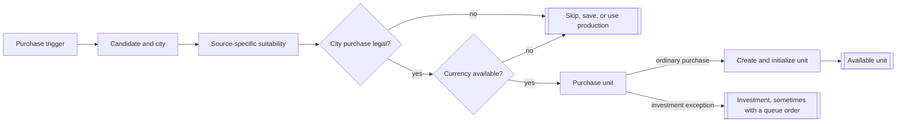
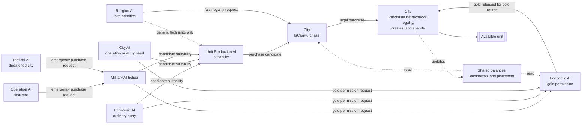
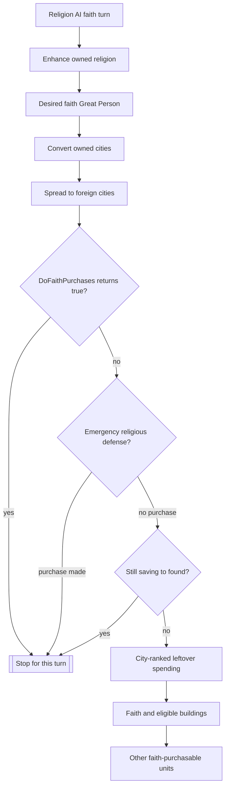

# Unit AI: Acquisition

Acquisition creates a unit immediately by spending gold or faith. The trigger chooses a purpose, candidate, and city, while the city owns the final legality check and unit creation. It does not add an ordinary production order. See [production](production.md) for queue selection and [military production](military-production.md) for formation demand that can also request a purchase.

The relevant code is in `civ5-dll/CvGameCoreDLL_Expansion2`, primarily `CvEconomicAI.cpp`, `CvCityStrategyAI.cpp`, `CvReligionClasses.cpp`, `CvMilitaryAI.cpp`, `CvAIOperation.cpp`, `CvTacticalAI.cpp`, `CvCity.cpp`, and `CvUnitProductionAI.cpp`.

## Shared purchase lifecycle

The trigger owns why the empire wants a unit. Ordinary gold spending compares flavor-weighted city options, operations request formation roles, Tactical AI reacts to a threatened city, and Religion AI allocates faith. Most AI routes call `CvUnitProductionAI::CheckUnitBuildSanity` before the purchase, so [military](military-production.md#force-demand-and-suitability) and [civilian](civilian-production.md#role-scoring) demand still affects acquisition.

`CvCity::IsCanPurchase` is the final shared gate. `CvCity::PurchaseUnit` repeats that check, spends the selected currency, and calls `CvCity::CreateUnit`. The creation path finds a placement plot, initializes the unit, applies purchase experience and damage rules, and normally consumes its movement for the turn.

Gold purchases of spaceship-project units use the built-in investment path. They spend gold and mark the unit class as invested instead of creating it immediately. Some direct routes also place the invested unit in the production queue. The optional `MOD_BALANCE_UNIT_INVESTMENTS` modmod applies investment behavior to ordinary units as well.

## Coordination and permission

The AI modules coordinate through helper calls and shared state, not a central coordinator. The diagram distinguishes those calls from currency, cooldown, and placement state that earlier purchases can change.

| Boundary | Owner and behavior |
| --- | --- |
| Gold release | `CvEconomicAI::CanWithdrawMoneyForPurchase` compares the requested amount with the treasury after higher-priority savings requests. It grants or denies permission but does not spend gold. Ordinary hurry, City AI operation needs, and the Military AI emergency helper use it. |
| Suitability | `CvUnitProductionAI::CheckUnitBuildSanity` applies unit strategy checks and, in purchase mode, a gold purchase precheck. Economic AI, City AI operation needs, and the Military AI helper use it. Generic faith-unit selection also uses it, so it can exclude a unit that is legal only for faith. |
| City and currency legality | `CvCity::IsCanPurchase` is the final legality gate for both gold and faith. It checks city state, placement, trainability, unlocks, currency balance, and the relevant cooldowns. |
| Faith priority | Religion AI orders faith spending through its own priority paths and current faith state. Faith purchases bypass Economic AI's gold reservation ledger, although they still pass City AI's faith legality check. |
| Execution | `CvCity::PurchaseUnit` repeats `IsCanPurchase`, creates the unit, spends the selected currency, and updates purchase cooldowns. Tactical AI does not perform these checks itself. It asks the Military AI helper to make the emergency purchase. |

## Runtime purchase routes

The routes run in Economic AI, Military AI, Religion AI, City AI, then Tactical AI order, so earlier routes can change the shared state available to later ones.

| Route | Trigger and purpose | Currency behavior |
| --- | --- | --- |
| Ordinary hurry | `CvEconomicAI::DoHurry` compares one leading purchase from each eligible city, plus special diplomat candidates. | Gold only. It respects the treasury cushion and Economic AI savings requests. |
| Final operation slot | `CvMilitaryAI::MakeEmergencyPurchases` asks a recruiting operation with exactly one uncommitted required slot to buy its final unit. | `CvMilitaryAI::BuyEmergencyUnit` tries gold first, then faith if the gold purchase does not complete. |
| City operation need | `CvCity::CheckForOperationUnits` tries to fill the next operation slot at its muster city before normal city production. | Gold only. When purchase-mode suitability rejects the unit, the city can reconsider it for production when training would finish quickly. A denied gold release does not enter that fallback. |
| Sneak-attack army need | `CvCity::CheckForOperationUnits` can buy the recommended unit for a free army slot while the player wants a sneak attack. | Gold only, with production as the fallback. |
| Tactical defense | `CvTacticalAI::PlotEmergencyPurchases` reacts to a threatened land zone or a city under siege. | The military helper tries gold, then faith. It may prefer a ranged unit for an ungarrisoned city or a defensive unit otherwise. |
| Religious priorities | `CvReligionAI::DoFaithPurchases` handles religious units and Great People, then `DoFaithPurchasesInCities` considers eligible buildings and other units. | Faith only. An early return from a higher religious priority can prevent lower-priority spending while faith accumulates. |
| Religious defense | `CvReligionAI::DoReligionDefenseInCities` responds to a nearby foreign prophet. | Faith buys an inquisitor in a city of the desired religion. |

The final-slot route runs only when the player is not using the at-war strategy or is winning every current war. Tactical emergency purchases skip water zones and cities considered likely to fall. These are trigger rules, not additions to the shared legality check.

## Ordinary gold purchases

`CvEconomicAI::DoHurry` first protects a game-speed and era-adjusted treasury cushion. It also withholds a multiple of the gold requested by savings categories other than ordinary units and buildings. If spendable gold remains, each eligible city calls `CvCityStrategyAI::ChooseHurry`.

The city's purchase comparison resembles production, but its lifecycle differs in important ways:

1. It collects gold-purchasable units and buildings with positive flavor-derived weights. Gold mode also adds operation and army request candidates.
2. It adjusts the precheck weights by construction time before applying type-specific suitability.
3. It makes a weighted choice among the surviving leaders. There is no all-failed fallback.
4. `DoHurry` combines the chosen city entries with special diplomat entries, sorts the empire list, and considers them in order while gold remains above the treasury cushion.
5. Immediately before a unit purchase, it checks the Economic AI savings priorities, strategic resources, and unit suitability again. A failed late check skips that entry.

An ordinary candidate, an operation request, and an army request can name the same unit as separate entries. Operation pressure uses the operation skip counter, and a successful operation purchase resets it. A successful settler purchase resets the settler skip counter.

## Operation and tactical purchases

Direct military routes do not run the full ordinary hurry comparison. They begin with a required `UnitAI` role, use `CvUnitProductionAI::RecommendUnit` to choose a concrete trainable unit, then apply purchase suitability and the shared city gate.

`CvAIOperation::BuyFinalUnit` assigns a successful purchase directly to the operation's last open slot. `CvCity::CheckForOperationUnits` can likewise recruit a purchased unit into an operation, but it first rejects razing, automated, minor-civilization, barbarian, and ordinary puppet cities. It also skips purchases while average income is negative or any military unit is already queued.

`CvMilitaryAI::BuyEmergencyUnit` is shared by final-slot and Tactical AI purchases. It requests Economic AI permission at the unit-purchase priority before spending gold. If gold is protected by a higher-priority savings request or the gold purchase otherwise fails, it tries the same unit with faith. Because its suitability check is in purchase mode, the candidate must pass the gold purchase legality check before that faith fallback is reached.

## Faith purchases

Religion AI treats faith as a priority chain rather than a gold-style savings ledger.

`CvReligionAI::DoFaithPurchases` first considers a Prophet for enhancement, then a desired faith Great Person once the era permits it. Both use `BuyGreatPerson` to select a valid city before the purchase. The priority pass next considers missionaries or inquisitors for the player's own cities and foreign spread. A priority can buy now or return early to stop lower spending while faith accumulates. Because `CvReligionAI::DoTurn` uses short-circuit evaluation, `DoReligionDefenseInCities` checks for an emergency inquisitor only when `DoFaithPurchases` returns false.

Leftover spending ranks eligible cities by faith output, with bonuses for holy cities and a penalty for puppets. Each city considers religious buildings, other faith-enabled buildings, then nonreligious units if the empire is converted, has positive gold income, and is not out of supply. The unit step calls `ChooseHurry` in unit-only faith mode, so flavors, duration, and unit suitability select among faith-legal candidates.

Missionaries and inquisitors are excluded from that generic unit comparison because their dedicated religious-demand paths own them. The generic faith path also excludes special units and units without a positive base faith cost.

One implementation quirk narrows generic faith purchases further. `CheckUnitBuildSanity` uses the gold form of `IsCanPurchase` whenever purchase mode is active, even when `ChooseHurry` is evaluating faith. A unit can therefore be legal for faith but still disappear from this generic path because the city cannot currently buy the same unit with gold. Dedicated religious purchases call the faith legality path directly and do not depend on this generic comparison.

## Purchase legality and result

| Gate | Gold | Faith |
| --- | --- | --- |
| City state | Normally rejects puppets, resistance, and razing. Puppet exceptions come from traits, city state, or entry-specific rules. | Uses the same city-state rules, with an optional faith-building exception for puppets. |
| Placement and trainability | Requires a valid placement and a unit the city can train for purchase. | Requires placement and the applicable trainability rules for the faith unlock. |
| Unlock | Applies unit, resource, instance-limit, and required-building rules through the normal trainability checks. | Applies religion, belief, policy, era, domain, and trait rules. Air units cannot use the general era-based faith unlock, and naval units need the applicable trait route. |
| Currency | Requires enough treasury gold. Economic AI routes can protect additional gold through prioritized savings requests. | Requires enough faith. Religion AI priority returns provide the saving behavior. |
| Cooldown | Uses separate local combat and civilian unit purchase cooldowns. | Can apply global and local faith cooldowns, with separate local combat and civilian tracking. |

On success, `CvCity::PurchaseUnit` creates the unit before deducting currency, so a placement failure does not charge the player. Gold and faith purchases fire the city-trained hook with their purchase reason. Faith purchases also initialize the unit's religion and update faith-purchased Great Person counters. Purchased units normally finish their movement immediately, unless their unit entry explicitly allows movement after purchase.

Acquisition does not include free building or policy grants, specialist-driven Great Person creation, city-state gifts, captures, conversions, or barbarian spawning. Those routes create or transfer units without this purchase decision. [Upgrade](upgrade.md) is also separate because it replaces an existing unit.

## Implementation trace

1. A source-owned trigger identifies a purpose, such as ordinary spending, a formation gap, city defense, religious spread, or faith overflow.
2. `CvCityStrategyAI::ChooseHurry` supplies weighted city candidates for ordinary gold and generic faith spending. Direct military and religious routes choose their candidates with their own helpers.
3. Most unit routes apply `CvUnitProductionAI::CheckUnitBuildSanity`; all completed purchases pass `CvCity::IsCanPurchase`.
4. Gold AI routes ask `CvEconomicAI::CanWithdrawMoneyForPurchase` when they must respect savings priorities.
5. `CvCity::PurchaseUnit` spends gold or faith and calls `CvCity::CreateUnit`, except for a gold investment.
6. The caller performs route-specific bookkeeping, such as filling an operation slot, resetting a skip counter, cleaning the queue, or promoting a late emergency unit.

## Reading acquisition logs

With AI logging enabled, city hurry logs record `PRE` entries after candidate entry and duration adjustment, then `POST` entries that survive suitability. `HurryCityPriorities.csv` records the empire-level `BUY` list considered by Economic AI. Homeland, Tactical, and Religion logs record successful direct purchases and their purposes. A candidate in `POST` can still fail later because another route spent the currency, a savings request protected the gold, a resource disappeared, or the city could no longer place the unit.
