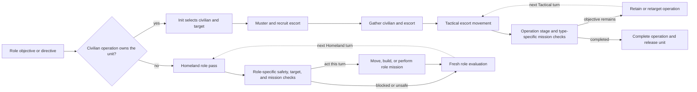

# Unit AI: Civilian Operation

A **civilian operation** is a persistent `CvAIOperation` that gives a civilian unit a durable target and, when needed, an escort army. A **role objective** is the strategic result a civilian role pursues, such as a settlement site, improvement, or religious action. A **directive** is a durable instruction for an individual Great Person, such as creating a work or constructing an improvement. A **Homeland pass** is an ordered `CvHomelandAI` role assignment pass for units outside an operation. An **escorted operation** recruits a military formation, gathers it with the civilian, and moves the pair through Tactical AI.

The primary implementation is in `civ5-dll/CvGameCoreDLL_Expansion2/CvHomelandAI.cpp`, `CvAIOperation.cpp`, `CvEconomicAI.cpp`, `CvBuilderTaskingAI.cpp`, `CvTradeClasses.cpp`, `CvReligionClasses.cpp`, and `CvPlayerAI.cpp`. [Operation](operation.md) explains the shared per-turn ownership and processed-state rules.

## Ownership map

| Role or unit | Operation ownership | Homeland ownership |
| --- | --- | --- |
| Settler | Found-city operation supplies the durable settle target and optional escort. | First-city settlement and safe, immediate opportunistic founding. |
| Great Merchant | Merchant-delegation operation performs foreign trade or city-state purchase. | Directives outside the delegation mission. |
| Great Diplomat | Diplomat-delegation operation performs influence missions. | Embassy construction. Messenger units also use their direct Homeland mission. |
| Great Musician | Concert-tour operation performs the one-shot tourism mission. | Directives outside the tour. |
| Worker, work boat, explorer, ordinary religious unit, trade unit, archaeologist, spaceship part, treasure | No civilian operation path. | Role objectives, safety, movement, and final missions. |
| Writer, artist, scientist, engineer, Great General, Great Admiral | No civilian operation path for their ordinary directives. | Great Person directive, support, or improvement action. |

`CvPlayerAI::ProcessGreatPeople` supplies directives, and Homeland execution verifies the target and mission when the unit acts. Builder Tasking AI supplies worker directives and routes; Trade AI supplies route choices; Religion AI supplies founding, enhancement, spread, conversion, protection, and holy-site objectives.

## Escorted-operation lifecycle

Takeaway: a civilian operation keeps its civilian under Tactical control until it completes or aborts. Civilians outside operations receive independent Homeland role evaluation each turn.

`CvAIOperationCivilian::Init` selects the civilian, target, and escort formation, then assigns the civilian to slot zero. It starts muster at the civilian's current plot. An escorted non-naval civilian outside owner territory relocates muster to the closest friendly city only when its current plot is also outside friendly territory. An escorted naval civilian outside owner territory seeks the closest friendly coastal city. The operation can remove the escort requirement when the civilian can reach the target immediately.

The operation recruits or waits for its escort, gathers the army, and uses `CvTacticalAI::PlotArmyMovesEscort` for movement. Its type-specific `PerformMission` validates range, movement, and mission legality before founding a city, conducting a delegation, or beginning a concert tour. A lost civilian ends the operation. The operation can retarget an eligible target. Invalid operation state ends through its normal abort path.

## Homeland role order

`CvHomelandAI::AssignHomelandMoves` applies civilian roles in an order that gives urgent and specialized work the first claim:

1. First-turn settlers found the initial city.
2. Gifts, conservative healing, opportunistic settlement, and exploration run early.
3. Great Person passes run before workers and religious units.
4. Workers and religious units receive role actions.
5. The safety pass moves endangered remaining units.
6. Great Diplomat embassy and messenger missions run after military positioning.
7. Spaceship parts, treasure, trade units, and archaeologists run near the end.
8. The unassigned review continues a valid mission or applies movement, skip, or stranded-unit handling.

Army membership gives an operated civilian an army ID and excludes it from Homeland recruitment until the operation releases it. A Great General with a field-command directive can enter Tactical AI as combat support. [Military organization](military-organization.md#organization-and-control) defines the shared operation, army, and slot state.

## Role execution

| Role | Objective and execution |
| --- | --- |
| Settler and explorer | Economic AI evaluates settlement plots. Homeland handles the initial city and an unassigned settler already on a safe site. Explorers repeatedly claim reachable unknown targets, avoid duplicate claims, and can remove stuck automation. |
| Worker and work boat | `PlanImprovements` refreshes Builder Tasking AI. At peace, `PlanWorkerDistribution` allocates connected city regions by improvement need. Homeland applies movement, danger, regional transfer, and the final build mission. |
| Great People | Writers, artists, scientists, and engineers execute their directive, such as a power, work, Golden Age, production hurry, or improvement. Generals and Admirals supply support or move to safe useful positions. Improvement directives use the worker path. |
| Religion | Homeland moves prophets, missionaries, and inquisitors toward Religion AI objectives and issues their action after its legality check. |
| Trade, archaeology, and delivery | Trade units travel to the selected origin, create a route, or follow their role fallback. Archaeologists select safe reachable sites and start the legal dig build. Spaceship parts and treasure deliver to their valid destination. |

## Safety and diagnostics

Homeland's safety pass handles civilians remaining after their main role passes. A role executor can choose a safe plot when its objective becomes unsafe. Operations retain or retarget their durable goal for later turns, while Homeland roles receive a fresh objective evaluation on recruitment.

With AI logging enabled, use `PlayerHomelandAILog.csv` for role passes and `OperationalAILog.csv` for civilian operation state, armies, targets, transitions, and aborts. [Operation diagnostics](operation.md#implementation-and-diagnostics) covers cross-system diagnosis.
