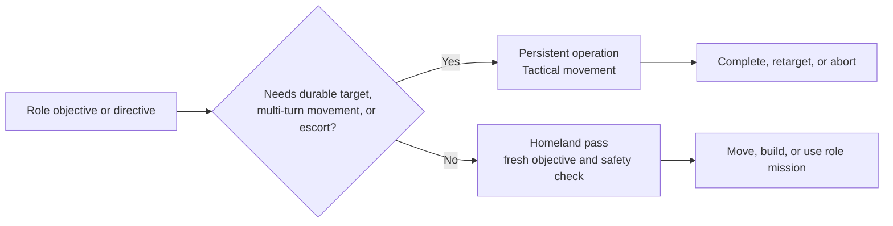
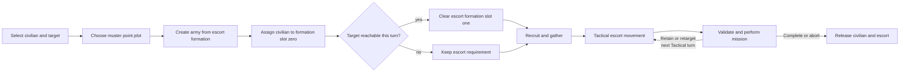

# Unit AI: Civilian Operation

A civilian role uses a **persistent operation** when it needs a durable target, multi-turn movement, or a military escort. The operation keeps the civilian under Tactical control until the mission completes or aborts. A role that can choose and execute work independently uses a **Homeland pass** instead, receiving a fresh objective and safety check each turn.

A **role objective** is the strategic result a civilian role pursues, such as a settlement site, improvement, or religious action. A **directive** is a durable instruction for an individual Great Person, such as creating a work or constructing an improvement. [Operation lifecycle](operation.md) is the authority for shared claims, processed state, and handoff.

The main implementation is in `civ5-dll/CvGameCoreDLL_Expansion2/CvHomelandAI.cpp`, `CvAIOperation.cpp`, `CvEconomicAI.cpp`, `CvBuilderTaskingAI.cpp`, `CvTradeClasses.cpp`, `CvReligionClasses.cpp`, and `CvPlayerAI.cpp`.

## Ownership

| Role or unit | Persistent operation | Homeland pass |
| --- | --- | --- |
| Settler | Found-city operation keeps a settle target and optional escort. | First-city settlement and safe immediate founding. |
| Great Merchant | Merchant delegation performs foreign trade or a city-state purchase. | Directives outside that mission. |
| Great Diplomat | Diplomat delegation performs influence missions. | Embassy construction and messenger missions. |
| Great Musician | Concert tour performs the tourism mission. | Directives outside the tour. |
| Worker, work boat, explorer, ordinary religious unit, trade unit, archaeologist, spaceship part, treasure | No operation path. | Objective selection, safety, movement, and mission. |
| Writer, artist, scientist, engineer, Great General, Great Admiral | No operation for ordinary directives. | Directive, support, or improvement action. |

`CvPlayerAI::ProcessGreatPeople` supplies directives. Builder Tasking AI supplies worker directives and routes, Trade AI supplies route choices, and Religion AI supplies religious objectives.

## Escorted civilian operations

`CvAIOperationCivilian::Init` selects the civilian and target, then starts with the civilian's plot as the muster point. For an escorted naval operation on a plot the player does not own, it looks for the closest friendly coastal city. An escorted land operation relocates only from non-friendly territory. It then creates the army, assigns the civilian to formation slot zero, and clears escort formation slot one when the civilian can reach the target this turn.

The operation recruits and gathers the escort, then `CvTacticalAI::PlotArmyMovesEscort` moves the army. Its `PerformMission` verifies range, movement, and legality before founding a city, conducting a delegation, or beginning a concert tour. Losing the civilian ends the operation. The operation can retain a valid replacement target, but invalid state follows the normal abort path. [Operation completion, abort, and cleanup](operation.md#completion-abort-and-cleanup) summarizes the shared terminal checks.

Army membership excludes an operated civilian from Homeland recruitment until release. See [military organization](military-organization.md) for the shared Army ID and formation-slot rules.

## Homeland role order

`CvHomelandAI::AssignHomelandMoves` gives urgent and specialized work the first claim:

1. First-turn settlement, city-state gifts, conservative healing, opportunistic settlement, and exploration.
2. Great Person directives, then worker and religious actions.
3. Safety moves for endangered remaining units.
4. Embassy and messenger missions after military positioning.
5. Spaceship parts, treasure, trade units, archaeologists, then the unassigned review.

The final review continues a valid mission or applies movement, skip, or stranded-unit handling. A Great General with a field-command directive can instead enter Tactical AI as combat support.

## Role behavior

| Role | Homeland behavior |
| --- | --- |
| Settler and explorer | Economic AI evaluates [settlement sites](civilian-production.md#settler-demand). Homeland handles the initial city and a safe settler already on a site. Explorers claim reachable unknown targets, avoid duplicate claims, and can remove stuck automation. |
| Worker and work boat | [Worker demand](civilian-production.md#worker-demand) refreshes Builder Tasking AI. Homeland applies danger, regional transfer, movement, and the build mission. |
| Great People | Directives trigger powers, works, Golden Ages, production hurry, improvements, support, or safe positioning. Improvement directives use the worker path. |
| Religion | [Faith acquisition](acquisition.md#faith-priority-and-legality) supplies religious units and objectives. Homeland moves prophets, missionaries, and inquisitors, then checks action legality. |
| Trade, archaeology, and delivery | [Trade](civilian-production.md#trade-unit-demand) and [archaeology](civilian-production.md#archaeologist-demand) supply demand. Units create routes, excavate safe reachable sites, or deliver spaceship parts and treasure to valid destinations. |

The safety pass handles civilians left after their role pass. A role executor can choose a safe plot when its objective becomes unsafe; a persistent operation retains or retargets its goal for a later turn.

## Diagnostics

Use `PlayerHomelandAILog.csv` for role passes and `OperationalAILog.csv` for civilian operation state, armies, targets, transitions, and aborts. Start with the shared [operation diagnostics](operation.md#diagnostics).
