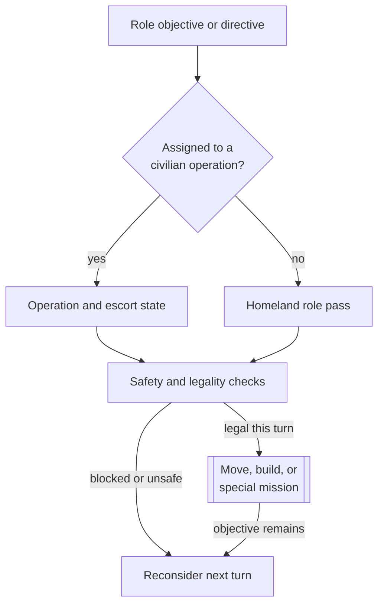

# Unit AI: Civilian operation

Civilian operation turns role-owned objectives into movement, builds, and special missions for units that already exist. Most roles run through ordered Homeland AI passes. Settlers and selected Great People can instead enter persistent escorted operations. See [unit operation](unit-operation.md#per-turn-lifecycle) for recruitment, fallthrough, and processed-state rules.

The relevant code is in `civ5-dll/CvGameCoreDLL_Expansion2`, primarily `CvHomelandAI.cpp`, `CvAIOperation.cpp`, `CvEconomicAI.cpp`, `CvBuilderTaskingAI.cpp`, `CvTradeClasses.cpp`, `CvReligionClasses.cpp`, and `CvPlayerAI.cpp`.

## Distributed objectives

Civilian roles do not share one action score. Each role supplies its own targets, directives, and mission checks, while Homeland AI ordering decides which eligible pass sees the unit first.

| Role | Objective source | Normal execution path |
| --- | --- | --- |
| Settler | Economic AI expansion state and settle-plot evaluation | Found-city operation, plus first-turn and opportunistic Homeland paths |
| Worker and work boat | Builder Tasking AI directives and worker-region demand | Homeland worker pass |
| Explorer | Economic AI exploration plots, danger, and reachable unknown territory | Homeland explorer pass |
| Writer, artist, scientist, engineer, merchant, and musician | Great Person directive and role-specific target evaluation | Homeland pass, except merchant delegations and concert tours |
| Great Diplomat and messenger | Embassy or influence target selection | Homeland embassy or messenger pass, except Great Diplomat delegations |
| Prophet, missionary, and inquisitor | Religion AI objectives and city religion state | Homeland religious passes |
| Trade unit | Trade AI route selection and origin-city positioning | Homeland trade-unit pass |
| Archaeologist | Safe antiquity-site selection and build legality | Homeland archaeologist pass |
| Spaceship part and treasure | Capital or delivery destination | Dedicated Homeland transport pass |

`CvPlayerAI::ProcessGreatPeople` assigns directives such as creating a Great Work, starting a Golden Age, using a power, constructing an improvement, or serving as field command. Homeland execution reads those directives, but still checks that the action and target remain legal.

## Civilian operations

Four `CvAIOperation` families give a civilian a durable target and, when needed, a military escort:

| Operation | Civilian mission | Target owner |
| --- | --- | --- |
| Found city | Found on the selected plot | Settle-plot evaluation |
| Merchant delegation | Conduct a trade mission or buy a city-state | Great Merchant target evaluation |
| Diplomat delegation | Conduct an influence mission | Messenger-style city-state target evaluation |
| Concert tour | Perform the one-shot tourism mission | Great Musician target evaluation |

Economic AI starts these operations when it finds an eligible loose civilian and the matching strategic condition. `CvAIOperationCivilian::Init` selects the civilian, chooses a target, creates the role's escort formation, puts the civilian in slot zero, and musters in friendly territory, at the civilian's plot or the nearest friendly city. It can clear the escort requirement when the civilian can reach the target immediately.

The operation recruits or waits for the escort, gathers the pair, and then moves them through `CvTacticalAI::PlotArmyMovesEscort`. On arrival, the type-specific `PerformMission` checks range, movement, and mission legality before issuing the final action. A lost civilian aborts the operation. An invalid target can cause retargeting or an abort.

A civilian operation is not a generic path for every civilian. Workers, ordinary religious units, trade units, archaeologists, and most Great Person directives remain under Homeland AI. Great Diplomat embassies also stay in Homeland AI; the diplomat operation is specifically for influence.

## Homeland order

The civilian portion of `CvHomelandAI::AssignHomelandMoves` runs in a deliberate order:

1. A first-turn settler founds the initial city without fleeing.
2. Unit gifts, conservative healing, opportunistic settlement, and exploration run early.
3. Great Person passes run before workers and religious units.
4. Workers and religious units receive their role actions.
5. The safety pass moves endangered remaining units before routine military positioning.
6. Great Diplomat embassies and messenger missions run after military positioning.
7. Spaceship parts, treasure, trade units, and archaeologists run near the end.
8. The unassigned review continues a valid mission or applies a movement, skip, or stranded-unit fallback.

Earlier ownership still applies. A civilian in an operation has an army ID and is excluded from Homeland recruitment. The [military organization guide](military-organization.md#organization-and-control) explains the shared operation, army, and slot machinery. A Great General with a field-command directive can be recruited by Tactical AI as combat support instead of reaching the ordinary Great General Homeland pass.

## Role behavior

### Settlers and explorers

Economic AI normally creates a found-city operation for a loose settler with an acceptable site. The operation reevaluates the site and path, retargets when a better valid plot appears, and focuses Tactical AI near a newly founded frontier city. Homeland AI separately handles the first city and can immediately found with an unassigned settler already standing on a safe acceptable plot.

Explorers are explicitly excluded from normal Tactical recruitment. Homeland AI repeatedly selects exploration targets while movement remains, avoids assigning the same target to multiple explorers, and can use special exploration actions. A stuck automated explorer can lose automation so it does not loop indefinitely.

### Workers and work boats

`CvHomelandAI::PlanImprovements` refreshes `CvBuilderTaskingAI` before role assignment. For a normal major AI at peace, `PlanWorkerDistribution` divides connected city regions by terrain-improvement need and redistributes workers toward underserved regions.

The worker pass includes land workers, sea workers, automated builders, combat units that can build, and Great People assigned to construct improvements. `CvBuilderTaskingAI` evaluates legal builds and routes, while Homeland AI handles movement, danger, regional transfer, and the final build mission.

### Great People

Writers, artists, scientists, and engineers normally follow their current directive: use a one-shot power, create a work, start a Golden Age, hurry production, or construct an improvement. Merchants and musicians use escorted operations for foreign trade or tourism missions, while their Homeland paths cover directives that do not belong to those operations.

Great Generals and Admirals can act as support units or move to safe useful positions. A field-command support unit is eligible for Tactical AI. Citadel-style improvement directives reenter the worker path. This role overlap is resolved by directives, Tactical eligibility, army membership, and pass order rather than by a single Great Person controller.

### Diplomacy and religion

The Great Diplomat delegation conducts influence missions through a civilian operation. Homeland AI handles embassy construction for loose Great Diplomats and direct missions for messenger-role units. Target selection rejects invalid or inaccessible city-state opportunities before spending the unit.

Prophets, missionaries, and inquisitors use Religion AI objectives to select founding, enhancement, spread, conversion, protection, or holy-site actions. Homeland AI supplies movement and safety, then issues the religious mission only when its legality checks pass.

### Trade, archaeology, and delivery units

Trade AI chooses route opportunities. Homeland AI can move a trade unit to the correct origin city, create the selected route when ready, or disband an unusable unit under its role-specific fallback.

Archaeologists select reachable safe dig sites, travel to the assignment, and start the archaeological build when legal. Spaceship parts and treasure use simpler delivery behavior toward the capital or another valid destination and perform their final mission on arrival.

## Safety and fallthrough

Ordinary civilians are normally absent from Tactical AI's recruited list. Its late nondefender-safety pass can still protect eligible combat-support or embarked units. Homeland AI owns the general civilian safety pass after the main early roles, and a role executor can also choose a safe plot when its objective becomes unsafe.

Safety does not erase the durable objective automatically. A civilian operation can keep or retarget its goal on a later turn, and a Homeland role is reconsidered when the unit is recruited again. If a pass consumes the unit or marks it processed, later passes do not give it a second action.

## Implementation trace

1. Strategic systems create civilian operation state, exploration plots, Great Person directives, religious objectives, trade priorities, and builder directives.
2. `CvTacticalAI::PlotOperationalArmyMoves` moves civilians that belong to escorted operations.
3. `CvHomelandAI::Update` refreshes Builder Tasking AI and worker distribution, then finds Homeland targets.
4. `CvHomelandAI::AssignHomelandMoves` runs role-specific plot and execute methods in order.
5. The executor pushes movement, build, trade, religion, found-city, or special missions and calls `UnitProcessed` when the role is finished for the turn.

For the creation pressure behind these roles, see [civilian production](civilian-production.md). For cross-system logs and claim diagnostics, see [reading operation logs](unit-operation.md#reading-operation-logs).
