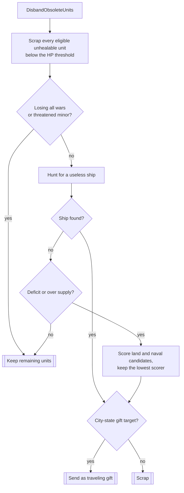

# Unit AI: Cleanup

**Cleanup** removes or gifts away units the empire no longer needs. It is the terminal lifecycle stage: where [upgrade](upgrade.md) replaces a unit that still earns its keep, cleanup releases the gold, [supply](concepts.md#supply), and strategic resources tied up in a unit that does not. Three owners share the work. Military AI disbands obsolete or unaffordable combat units, Economic AI runs fixed-order disband passes for civilian roles, and Homeland AI gifts units to city-states before other assignment passes can claim them.

The relevant code is in `civ5-dll/CvGameCoreDLL_Expansion2/CvMilitaryAI.cpp`, `CvEconomicAI.cpp`, `CvHomelandAI.cpp`, `CvPlayer.cpp`, and `CvMinorCivAI.cpp`.

## Military disband

`CvMilitaryAI::DisbandObsoleteUnits` runs each turn from `CvMilitaryAI::DoTurn`, after operations update and emergency purchases. It skips barbarians and the first 25 game turns. Its first act is a sweep that scraps every unit below 75 hit points that cannot heal, provided it is scrappable, non-plagued, and not already marked for death. After the sweep, a player losing every active war skips the later candidate selection ([war states](concepts.md#war-states) explains the all-wars aggregate), and a minor civilization does the same while barbarians threaten it.

Takeaway: the low-health sweep can remove multiple units. Afterward, the path selects at most one further unit: a useless ship goes even in good times, and every selected unit is offered to a city-state before it is scrapped.

Two pressures force a scrap when no useless ship exists. A **deficit** means the `ECONOMICAISTRATEGY_LOSING_MONEY` [strategy flag](concepts.md#strategy-flags) is active. **Over-supply** means the number of units beyond the supply cap exceeds an allowance of 3 under the world-conquest grand strategy and 1 otherwise. Under either pressure, `FindUnitToScrap` scores each combat candidate as unit power times production cost, plus the unit level as a tiebreaker, and the lowest score dies; the score is halved when the unit consumes a strategic resource the player lacks. Candidates must be scrappable and usable for operations, and the scan excludes:

- No-maintenance units under deficit pressure and no-supply units under over-supply pressure, since scrapping them would not relieve the pressure.
- Explorers, in either domain, while the recon state still demands them ([UnitAI roles](concepts.md#unitai-roles) covers role state).
- Settler-type units while fewer than three cities have been founded.
- Units whose obsolete technology is researched but which still have an upgrade path and the resources to take it. Such a unit is upgrade's candidate, not cleanup's; it only becomes disband material when the upgrade resources are missing.

The **useless-ship hunt** runs every turn regardless of pressure. A ship is useless when neither its current water body nor any water body reachable within two turns of movement needs a naval presence. Candidates are checked in ascending experience order, so veterans are scrapped last.

A separate forced path exists outside Military AI's turn: when the treasury projects a balance of −5 gold or worse, `CvPlayer::DoBankruptcy` zeroes the treasury and, if the player owns more military units than 3 plus its era plus its city count, scraps the lower-scoring of the best land and naval candidates using the same scoring helper, preferring the domain whose defense is less urgent.

## Civilian disband passes

`CvEconomicAI::DoTurn` finishes by running eight disband passes in fixed order. Each pass owns one civilian problem, and most release at most one unit per turn.

| Pass | Trigger and selection |
| --- | --- |
| `DisbandExtraWorkers` | More than one worker per four cities, over 66 percent of valid owned land plots improved, and more idle workers sitting in cities than cities. Skipped through turn 100 while fewer than four cities are founded. |
| `DisbandExtraArchaeologists` | Archaeologist count exceeds half the visible dig sites plus one. The Exploration finisher policy adds hidden sites to the count. |
| `DisbandLongObsoleteUnits` | A unit whose prerequisite-technology era trails the player's era by more than two, with the Information Era treated as the cap. Only units that have an upgrade path they never took qualify, and units in armies moving to or at their destination are skipped. |
| `DisbandUselessSettlers` | More than two settlers while `ECONOMICAISTRATEGY_ENOUGH_EXPANSION` is active and no good settlement plot remains. Skipped through turn 150 while four or fewer cities are founded. The finder only matches settlers attached to an army, so in practice this releases a settler stuck in an escort operation. |
| `DisbandUselessDiplomats` | For a major civilization, runs only when no city-states remain alive: messenger-role units are scrapped then, and diplomat-role units only when no city-state ever existed. A minor civilization scraps both outright. |
| `DisbandExtraWorkboats` | Work boats outnumber the owned unimproved sea-resource plots, and fewer cities demand naval tile improvements than there are work boats. Same early-game guard as workers. |
| `DisbandMiscUnits` | Minor civilizations only: scraps any unit with remaining religious spread charges. |
| `DisbandUnitsToFreeSpaceshipResources` | While pursuing or close to a spaceship victory, computes the aluminum shortfall for remaining parts and core-city buildings, then scraps aluminum-consuming units cheapest-first until it is covered. A unit's keep-value is its power per aluminum required, raised 50 percent in an army and 20 percent per level. Buildings are sold if units are not enough. |

Unlike military disband, these passes scrap directly and never consider gifting.

## City-state gifting

`CvHomelandAI::ExecuteUnitGift` is nearly the first act of the Homeland assignment pass, before any other pass can claim a unit, and only major civilizations run it. It serves two purposes in order:

1. **Quest gifts.** For an active `MINOR_CIV_QUEST_GIFT_SPECIFIC_UNIT` quest from a city-state the player does not view with hostility, and with no gift from this player already traveling there, Homeland sends the matching unit type with the lowest experience that still meets the quest's experience minimum.
2. **Influence gifts.** A player whose trait grants influence per gifted unit, or instant yields from gifting, keeps gifting off-quest. This path is blocked while the player forbids new wars or is losing all its wars, and each domain requires an adequate defense state. Candidates exclude siege units, units below 85 percent of the power of the strongest buildable unit in the domain, and units that either side's technology could already upgrade, since the city-state would just disband those. The lowest-experience survivor is sent.

Both paths pick the destination with `CvPlayer::GetBestGiftTarget`. It skips city-states that are unmet, unrevealed, at war with the player, landlocked for a sea gift, already awaiting a gift from this player, permanently allied, recently bullied, or running a horde or rebellion quest. Survivors score from a base of 100 under a friendly approach and 50 otherwise, doubled for a trait matching the player's victory push, multiplied by five during an influence quest, and raised for resources the player lacks. Ally arithmetic then reshapes the score: it quarters when another major's influence is far out of reach, quadruples when the gift could pass them, and shrinks when a teammate or genuine friend holds the alliance.

A sent gift dies immediately and travels as a **snapshot**, stored state that recreates the unit at the city-state's capital after 3 turns (`MINOR_UNIT_GIFT_TRAVEL_TURNS`). On arrival, `CvMinorCivAI::DoUnitGiftFromMajor` awards influence and completes any matching quest. The Vox Populi base is 15 influence per unit, doubled during an active proxy war and otherwise reduced by 1 per military unit the city-state already owns, down to half. A Great Person is killed on arrival: the city-state keeps nothing, and the sender receives only trait-provided influence.

The military disband path reuses the same target scoring: `DisbandObsoleteUnits` and `DoBankruptcy` both call `GetBestGiftTarget` and send their candidate as a gift instead of scrapping it whenever any target qualifies.

## Runtime order and interactions

| Stage in the AI turn | Cleanup work |
| --- | --- |
| Treasury update | `CvPlayer::DoBankruptcy` forces a disband or gift on a deep deficit. |
| Economic AI | The eight civilian disband passes run at the end of `CvEconomicAI::DoTurn`, after ordinary purchases. |
| Military AI | `DisbandObsoleteUnits` runs after operations update and emergency purchases, so a unit bought this turn is never immediately judged. |
| Homeland AI | `ExecuteUnitGift` runs at the top of `AssignHomelandMoves`, so a gifted unit is marked processed before healing, exploration, or patrol passes can use it. |

The [overview's runtime order](overview.md#runtime-order-and-conflicts) places these phases in the full turn. Cleanup's effects feed back into the earlier lifecycle stages:

- **Supply**: every scrap or gift lowers the supply count, which can reopen city training at the hard cap and raise [military demand](military-production.md#military-demand) the next turn. The over-supply pressure is self-limiting because one release per turn steadily walks the excess back under the allowance.
- **Upgrade**: military disband and [upgrade](upgrade.md) split the obsolete population between them. A unit that can still be upgraded is protected from disband; a unit whose upgrade path is blocked by resources, or which never took its path for more than two eras, falls to cleanup.
- **War state**: losing all wars suspends the later military candidate selection and influence gifting, but not the low-health sweep. The same condition elsewhere loosens the soft supply cap.
- **Gifting versus disband**: because the gift check precedes every scrap on the military path, an AI with a friendly city-state available converts forced downsizing into influence instead of losing the unit's value outright.

## Implementation and diagnostics

1. `CvTreasury::DoGold` calls `CvPlayer::DoBankruptcy` when the projected balance crosses the deficit-disband threshold.
2. `CvEconomicAI::DoTurn` runs the eight civilian passes in the fixed order listed above.
3. `CvMilitaryAI::DoTurn` calls `DisbandObsoleteUnits`, which uses `FindUselessShip`, `FindUnitToScrap`, and `CvPlayer::GetBestGiftTarget`.
4. `CvHomelandAI::AssignHomelandMoves` calls `ExecuteUnitGift`, which uses `SendUnitGift` for influence gifts.
5. `CvPlayer::AddIncomingUnit` kills the gifted unit and starts the travel countdown; `CvMinorCivAI::doIncomingUnitGifts` respawns it and applies influence.

With AI logging enabled, `MilitaryAILog.csv` records each military scrap or gift with the deficit and supply pressure that caused it, and the civilian passes write disband lines with their worker, city, and plot counts to the Homeland AI log. When a unit disappears unexpectedly, check the treasury balance, the losing-money strategy, the units-out-of-supply count, and the unit's upgrade path and resource state.
