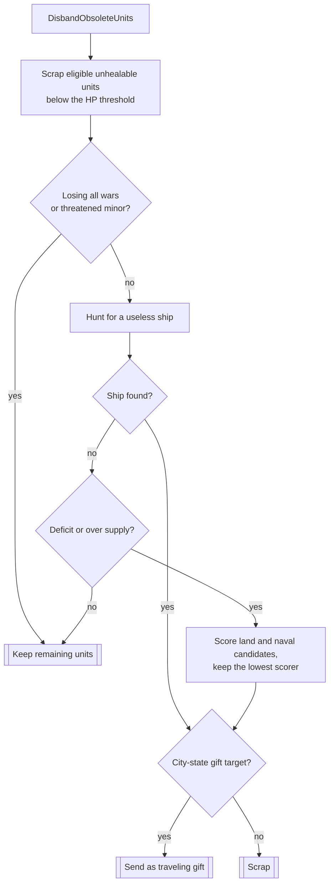

# Unit AI: Cleanup

**Cleanup** removes or gifts units the empire no longer needs. It is the final lifecycle stage: [upgrade](upgrade.md) replaces a useful unit, while cleanup releases the gold, [supply](concepts.md#supply), and strategic resources tied to an unneeded unit. Military AI handles combat units, Economic AI runs civilian passes, and Homeland AI handles city-state gifts.

The relevant code is in `civ5-dll/CvGameCoreDLL_Expansion2/CvMilitaryAI.cpp`, `CvEconomicAI.cpp`, `CvHomelandAI.cpp`, `CvPlayer.cpp`, and `CvMinorCivAI.cpp`.

## Runtime order

| Stage in the AI turn | Cleanup work |
| --- | --- |
| Treasury update | `CvPlayer::DoBankruptcy` forces a disband or gift on a deep deficit. |
| Economic AI | Eight civilian disband passes run at the end of `CvEconomicAI::DoTurn`, after ordinary purchases. |
| Military AI | `DisbandObsoleteUnits` runs after persistent operations update and emergency purchases. It can assess units acquired earlier in the turn. |
| Homeland AI | `ExecuteUnitGift` runs at the top of `AssignHomelandMoves`, marking a gift processed before healing, exploration, or patrol work can claim it. |

The [overview](overview.md#runtime-order-and-conflicts) places these steps in the full operation lifecycle.

## Military disband

`CvMilitaryAI::DisbandObsoleteUnits` skips barbarians and the first 25 turns. It first scraps every scrappable, non-plagued, live unit that cannot heal and is below 75 hit points. This sweep can remove multiple units. A player [losing every active war](concepts.md#war-states) skips the remaining selection, as does a threatened minor civilization.

After the sweep, the path selects at most one more unit. A useless ship is selected even without pressure; otherwise selection requires a **deficit** (`ECONOMICAISTRATEGY_LOSING_MONEY`) or **over-supply**, which means the excess above the supply cap is more than 3 under world conquest or more than 1 otherwise. `FindUnitToScrap` selects the lowest power-and-production-cost candidate, using level as a tiebreaker and discounting a unit that consumes a missing strategic resource.

Candidates must be scrappable and usable by the operation lifecycle. The scan keeps no-maintenance units under deficit pressure and no-supply units under over-supply pressure, active explorers, settlers while fewer than three cities exist, and obsolete units with a resolved upgrade target that pass the replacement resource check. That last exemption applies only to this disband selection. It does not prove the unit passes every real-time upgrade gate. The useless-ship search checks nearby reachable water bodies for naval need and considers lower-experience ships first.

`CvPlayer::DoBankruptcy` is a separate forced path. At a projected balance of -5 gold or worse, it zeroes the treasury and, when military units exceed 3 plus era plus city count, removes the lower-scoring of the best land and naval candidates. It prefers the domain with less urgent defense.

## Civilian disband passes

`CvEconomicAI::DoTurn` runs these passes in fixed order. Most remove no more than one unit per turn. Unlike military disband, they scrap directly and do not consider gifts.

| Pass | Trigger and selection |
| --- | --- |
| `DisbandExtraWorkers` | More than one worker per four cities, over 66 percent of valid owned land improved, and more idle city workers than cities. Skips through turn 100 with fewer than four cities. |
| `DisbandExtraArchaeologists` | More archaeologists than half the visible dig sites plus one. The Exploration finisher includes hidden sites. |
| `DisbandLongObsoleteUnits` | A unit is more than two eras behind, has an untaken upgrade path, and is not in an army moving to or at its destination. Information Era is the cap. |
| `DisbandUselessSettlers` | More than two settlers, `ENOUGH_EXPANSION` active, and no good settlement plot. Skips through turn 150 with four or fewer cities. In practice it releases a settler stuck in an escort army. |
| `DisbandUselessDiplomats` | With no living city-states, a major scraps messenger roles and scraps diplomat roles only when no city-state ever existed. A minor scraps both. |
| `DisbandExtraWorkboats` | More work boats than unimproved owned sea resources, with fewer naval-improvement demands than work boats. Uses the worker early-game guard. |
| `DisbandMiscUnits` | Minor civilizations scrap units with remaining religious spread charges. |
| `DisbandUnitsToFreeSpaceshipResources` | While pursuing or near spaceship victory, release aluminum-consuming units by lowest keep-value until the aluminum shortfall for remaining parts and core-city buildings is covered; sell buildings if units are insufficient. Army membership and level raise a unit's keep-value. |

## City-state gifting

`CvHomelandAI::ExecuteUnitGift` runs only for major civilizations and before other Homeland passes claim units.

### Eligibility

1. **Quest gifts:** An active `MINOR_CIV_QUEST_GIFT_SPECIFIC_UNIT` from a city-state the player does not view with hostility, no existing gift in transit from that player, and a matching unit that meets the quest experience minimum. Homeland sends the lowest-experience match.
2. **Influence gifts:** The player trait grants influence per unit or instant yields from gifting. This route is blocked when the player forbids new wars or loses every war, and each domain needs adequate defense. It excludes siege units, units below 85 percent of the strongest buildable domain unit's power, and units either side could upgrade, because the recipient would disband them. Homeland sends the lowest-experience survivor.

### Target

`CvPlayer::GetBestGiftTarget` excludes unmet or unrevealed city-states, current enemies, landlocked targets for sea gifts, targets already awaiting this player's gift, permanent allies, recently bullied targets, and horde or rebellion quests. The score starts at 100 for a friendly approach or 50 otherwise. Victory-trait alignment doubles it, an influence quest multiplies it by five, and missing resources increase it. Alliance prospects can lower an unreachable rival's target, raise a target the gift could take, or reduce a teammate's or genuine friend's target.

### Delivery

A sent gift dies immediately and travels as a **snapshot** that recreates the unit at the city-state capital after 3 turns (`MINOR_UNIT_GIFT_TRAVEL_TURNS`). On arrival, `CvMinorCivAI::DoUnitGiftFromMajor` grants influence and completes a matching quest. The Vox Populi base is 15 influence per unit, doubled for an active proxy war and otherwise reduced by one for each military unit the city-state owns, to a minimum of half. A Great Person dies on arrival: the city-state receives no unit, and the sender gets only trait-provided influence.

Military disband and bankruptcy reuse this target scoring and send their chosen unit as a gift whenever a qualifying target exists.

## Interactions and diagnostics

Every scrap or gift lowers supply. This can reopen hard-cap training and increase [military demand](military-production.md#military-demand) on the next turn. Upgrade and military disband split obsolete units: a failed replacement-resource check or an upgrade path left untaken for more than two eras can lead to cleanup. Losing all wars suspends later military selection and influence gifts, but never the low-health sweep. On the military path, a qualifying city-state gift takes precedence over scrapping.

With AI logging enabled, `MilitaryAILog.csv` records military scraps and gifts with the applicable deficit or supply pressure. Civilian passes log their worker, city, and plot counts to the Homeland AI log. For an unexpected disappearance, inspect treasury balance, the losing-money flag, units out of supply, and the unit's upgrade target and resource state.
