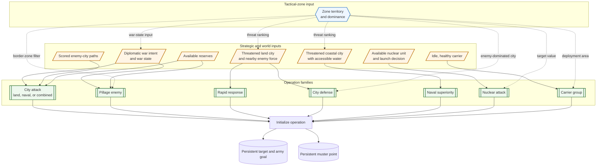
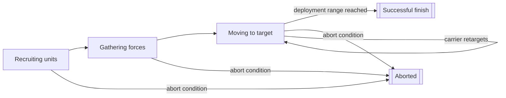
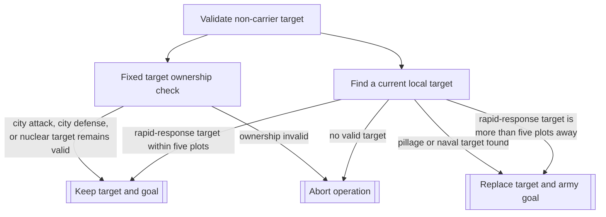
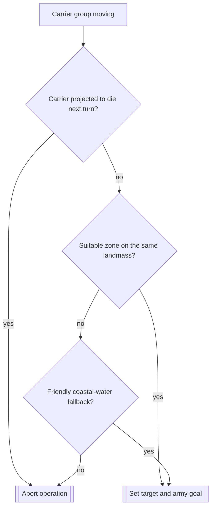
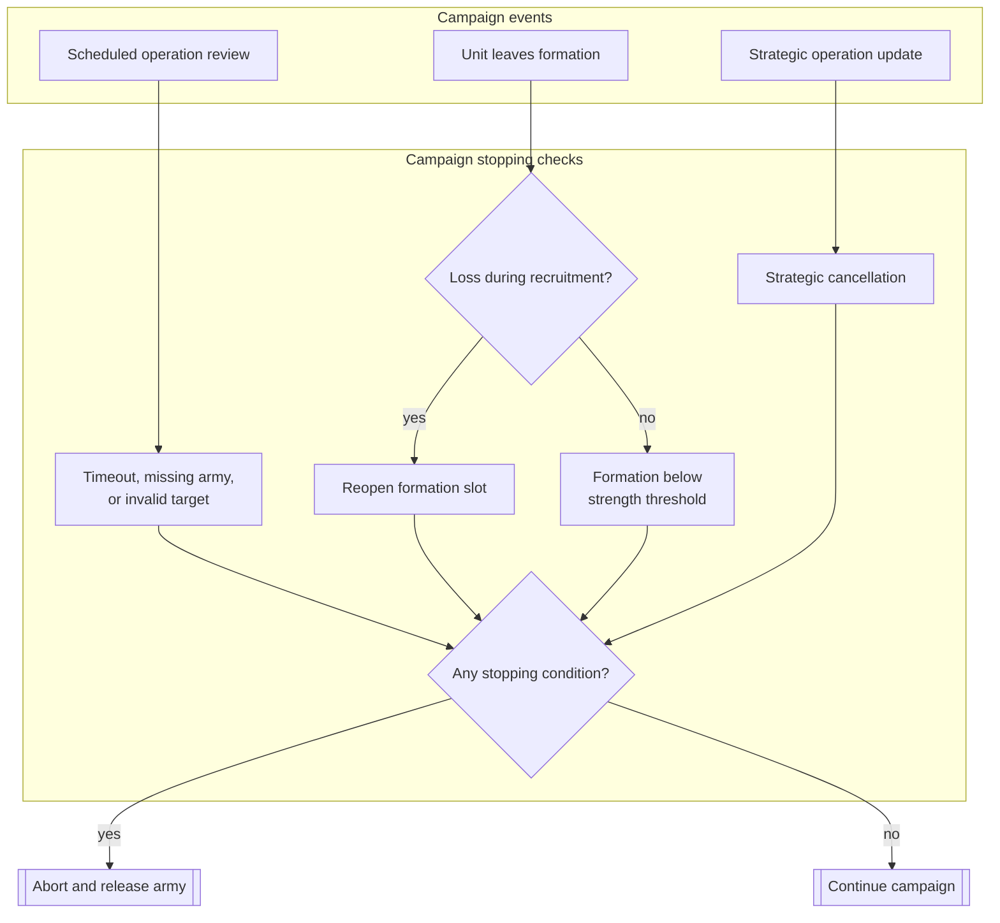

# Unit AI: Military Campaign

Military campaign decides when an AI player creates a persistent military operation, where its army gathers, and what lasting goal it pursues. Tactical AI moves the operation army and handles local fighting, while campaign logic keeps the operation, muster point, target, and completion or abort state across turns. See [military operation](military-operation.md) for the overall military unit-control model.

The relevant code is in `civ5-dll/CvGameCoreDLL_Expansion2`, primarily `CvMilitaryAI.cpp`, `CvAIOperation.cpp`, `CvArmyAI.cpp`, `CvDiplomacyAI.cpp`, and `CvTacticalAnalysisMap.cpp`.

## Creating a campaign

`CvMilitaryAI::UpdateOperations` reviews wars, threatened cities, attack candidates, and available forces before unit movement. It does not rank every operation type in one shared score. Each family has a distinct trigger and then supplies its own target and muster logic.

The orange strategic inputs, blue tactical-zone input, and green operation families separate the sources of a campaign decision. The blue, dashed connections are deliberately narrow. A dominance zone normally chooses a local posture for Tactical AI, not a campaign. It crosses the boundary only where campaign selection needs local threat or deployment context. [Military tactics](military-tactics.md#dominance-zones) explains zones and postures; [military organization](military-organization.md) explains how an operation turns its selected formation into an army.

### City attacks

`UpdateAttackTargets` rebuilds enemy-city candidates from land and water paths every Military AI turn. For each path, it compares land, naval, and combined approaches. The selected approach must be the best of the three and have a score greater than 30. Candidate ranking then accounts for distance, city value, conquest and liberation value, and relevant city-state quests.

Diplomacy AI can request a city attack while preparing a war, and Military AI can request one during an existing war when reserves and war state allow it. That war intent comes from `CvDiplomacyAI::DoUpdateWarTargets`, which turns approach scores and cooperative-war commitments into `CIV_APPROACH_WAR`. For an existing war, `CvDiplomacyAI::DoUpdateWarStates` grades each enemy into a `WarStateTypes` value from war score, endangered and besieged cities, important-city damage, and tactical dominance. `RequestCityAttack` maps the chosen approach to `CITY_ATTACK_LAND`, `CITY_ATTACK_NAVAL`, or `CITY_ATTACK_COMBINED`. Bullying reuses the land or naval city-attack operation that fits the shared land or water area.

### Operation families

| Family | Creation input | Initial target and muster |
| --- | --- | --- |
| City attack | A reachable, scored enemy city and the corresponding land, naval, or combined approach | Land attacks use the selected city and muster city. Naval and combined attacks use coastal-water plots beside the requested target and muster cities. |
| Pillage enemy | A wartime offensive request with enough available units | The best enemy border-zone city by worked luxury and strategic resources supplies the target. The nearest compatible friendly city supplies muster. |
| Rapid response | A threatened land city, or a nearby enemy land force during defense review | At war declaration it begins at the threatened city. Later it can start from the city owning the selected nearby enemy plot and seeks a blocking position. |
| City defense | A threatened land city in an enemy-dominated tactical zone | The threatened city is both the persistent defensive target and the initial destination. |
| Naval superiority | A threatened coastal city with a valid adjacent water plot | It musters at nearby friendly coastal water and initially targets water beside the threatened city. |
| Nuclear attack | A nuclear unit is available and the active-war launch decision succeeds | The highest-value eligible enemy city in range is the target. The selected nuclear unit's plot is muster. |
| Carrier group | An unassigned carrier that does not need healing | A suitable deployment zone nearest home is preferred. With no zone, the carrier stays at its current plot, or at adjacent coastal water when it begins in a city. |

For nuclear attacks, target evaluation avoids cities about to fall or originally owned by the attacker, scores units and improvements in the blast radius, and reduces the score for a city in a friendly-dominated land or water zone. A carrier deployment zone is a movable water zone beside enemy territory that is not under friendly dominance, is itself not enemy-dominated, has a valid move plot for the player, and is not already targeted by another carrier operation. Initial carrier selection ranks those zones by city-distance from home. It does not test a carrier path.

## Flavors and tactical zones

Flavors do not provide a general operation-selection or target-selection weight. `FLAVOR_USE_NUKE` directly changes the chance that an eligible nuclear operation is requested. `FLAVOR_NAVAL`, `FLAVOR_DEFENSE`, and `FLAVOR_OFFENSE` shape recommended force allocation, so they can determine whether enough units are available for an attack. `FLAVOR_OFFENSE` also changes Tactical AI's tolerance for unit losses. That is a per-turn combat choice, not campaign selection.

Tactical zones contribute more specific local facts:

- Enemy dominance at a threatened city can request `CITY_DEFENSE` and can prompt another naval-superiority operation for a threatened coast.
- Pillage selects only enemy cities whose land zone borders one of the attacker's zones.
- Friendly dominance reduces a nuclear target's value. Carrier groups derive their deployment areas from neighboring enemy and water zones.
- Threatened-city ranking considers local tactical conditions alongside focus areas and revealed foreign territory. It is separate from volatile plot danger and from diplomatic warmonger threat.

These inputs make campaigns responsive to a front without giving zone posture control of the whole campaign. Per-turn contact movement and combat decisions remain in [military tactics](military-tactics.md).

## Persistent campaign state

Operation initialization creates the family operation, stores its target and muster plot, and sets the army goal. The goal normally begins as the target. While recruiting or gathering, the army moves toward muster. Once it is moving, it moves toward its goal. [Military organization](military-organization.md#organization-and-control) covers formations, slots, and army membership.

| State | Persistent work |
| --- | --- |
| Recruiting units | The operation waits for its formation to become ready. |
| Gathering forces | The army converges at muster. |
| Moving to target | The army follows its operation goal until it reaches deployment range or is stopped. |
| Successful or aborted | Cleanup removes the operation and releases its units for later control. |

Ordinary military operations do not remain in the generic at-target state, `AI_OPERATION_STATE_AT_TARGET`. Reaching deployment range marks them successful, then cleanup disbands the army. Carrier groups are different: they are never-ending operations and can keep moving as their deployment target changes. [Military organization](military-organization.md#organization-and-control) explains the operation-to-army relationship.

## Non-carrier target changes

Target validation runs during operation checks, including before and after army movement. A replacement changes the stored target and army goal, but not the muster point. Most dynamic families switch whenever they find a valid replacement. They do not require the new target to beat the old one by a score margin.

City attacks keep their target while the plot is unowned or owned by the intended enemy. City defense keeps its city while it remains friendly, and a nuclear attack keeps its city while it remains enemy-owned. Pillage reevaluates the best valid border-city resource target. Naval superiority picks the shortest valid water path among the three highest-ranked threatened coastal cities.

Rapid response finds the strongest visible enemy land cluster near the homeland. It replaces its target only when that cluster is more than five plots from the stored target. Tactical AI handles the local response within that radius.

### Carrier target changes

Carrier groups reconsider their target only after reaching the moving stage. They are never-ending operations, so reaching a deployment area does not complete the campaign.

It ranks suitable zones by plot distance from the carrier's current position, after limiting them to its landmass. If no zone remains, it targets friendly coastal water. This is distance ranking, not path reachability. A carrier projected to die next turn aborts the operation, and losing the carrier's required slot cancels it immediately.

## Abandonment and cleanup

An operation can end through invalid targets, the army's losses, or a strategic cancellation. It also has a hard safety timeout: an operation that has run for more than 42 turns aborts, except for the never-ending carrier group.

During recruitment, a removed unit reopens its formation slot. During gathering, movement, or the at-target state, the operation aborts when filled slots fall below half the formation's original required slots, using integer division. A two-required-slot formation has a stricter exception: it aborts as soon as fewer than two slots remain filled. Offensive operations also remove badly hurt units and units whose latest checkpoint ETA has not improved over the oldest value in a three-sample window, which can trigger the same strength check. A stalled army does not abort its operation by itself: blocked group movement only produces a diagnostic log line, and the operation ends only through those per-unit removals, the strength check, an invalid target, or the timeout.

`UpdateOperations` can cancel operations in bulk when forced peace applies, when an opponent cannot be attacked, when a threatened-city list disappears for a domain, or when the war state requires a defensive pullback. A city-defense operation is not cancelled merely because its tactical zone is no longer enemy-dominated. It remains tied to its city until a target, loss, timeout, or strategic rule ends it.

## Implementation trace

1. `CvMilitaryAI::DoTurn` refreshes military counts, strategies, and war type, then runs `UpdateAttackTargets` and `UpdateOperations`, all before unit movement.
2. `CvDiplomacyAI::DoUpdateWarTargets` and `DoUpdateWarStates` supply the war intent and per-enemy war state that gate offensive requests and defensive pullbacks.
3. `CvPlayer::UpdateCityThreatCriteria` scores each city's threat from tactical dominance, borders, focus areas, and nearby enemies, producing the threatened-city ranking `UpdateOperations` consumes.
4. Operation `Init` methods store the target and muster plots and set the army goal, and each family's `VerifyOrAdjustTarget` applies the retargeting rules above during operation checks.

For formation recruitment and army membership, see [military organization](military-organization.md). For per-turn operation movement, Tactical ownership, and the Homeland handoff, see [military tactics](military-tactics.md).
