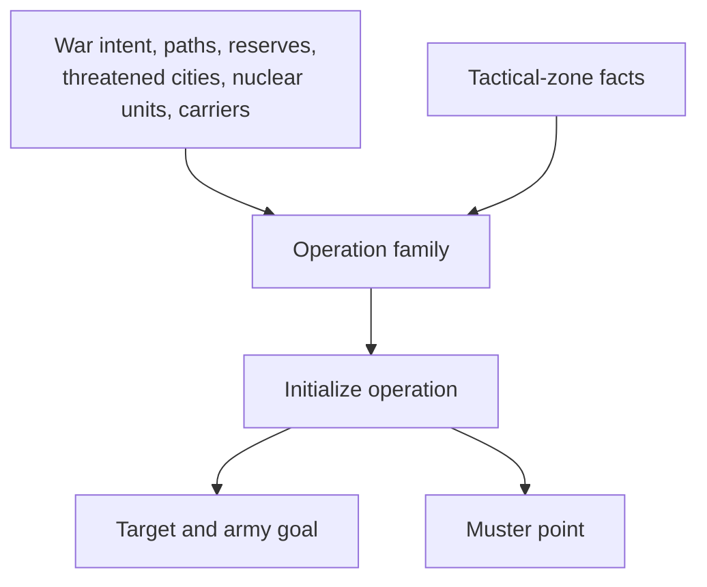
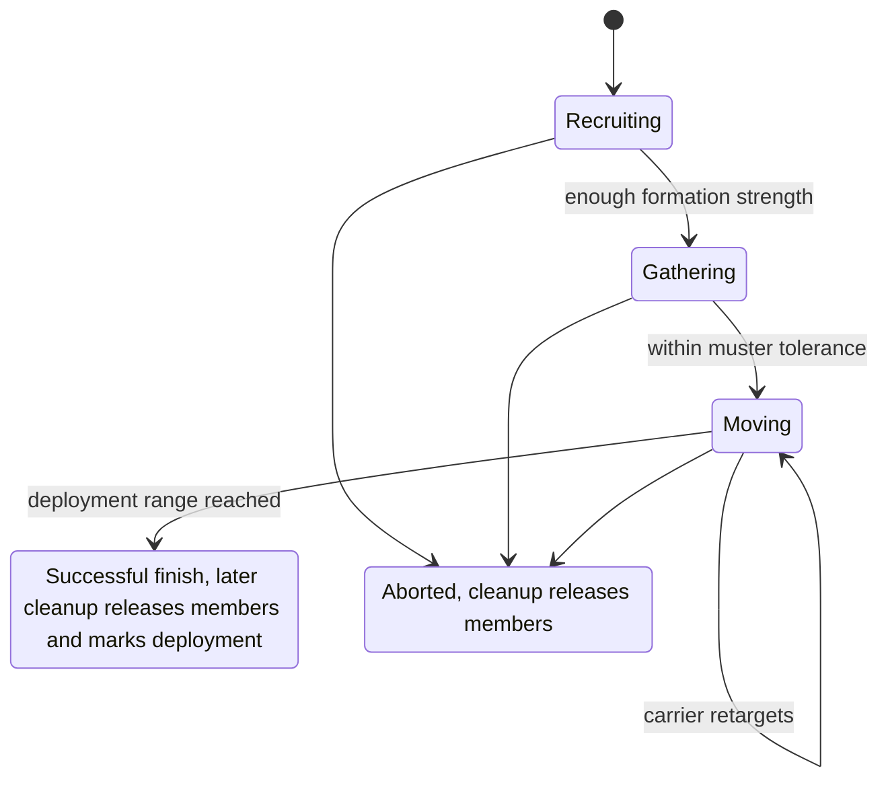

# Unit AI: Military Campaign

**Military campaign** logic decides when an AI player creates a persistent military operation and maintains its strategic destination until success or abort. An **operation target** is that lasting destination. An **army goal** is the active movement waypoint, normally initialized and retargeted from the target. A **muster point** is the assembly plot selected for the army, often from a **muster city**, the city that supplies the assembly location. [Military organization](military-organization.md) owns recruitment and formation state; [military tactics](military-tactics.md) owns per-turn movement and combat.

The relevant code is in `civ5-dll/CvGameCoreDLL_Expansion2`, primarily `CvMilitaryAI.cpp`, `CvAIOperation.cpp`, `CvArmyAI.cpp`, `CvDiplomacyAI.cpp`, and `CvTacticalAnalysisMap.cpp`.

## Campaign families and triggers

`CvMilitaryAI::UpdateOperations` reviews wars, threatened cities, attack candidates, and available forces before unit movement. Each **operation family** has its own trigger and initial target and muster logic.

| Family | Creation input | Initial target and muster |
| --- | --- | --- |
| City attack | Reachable scored enemy city with a land, naval, or combined approach | Land uses the selected city and muster city. Naval and combined use water plots beside the requested target and muster cities. |
| Pillage enemy | Wartime offensive request with sufficient available units | The best enemy border-zone city by worked luxury and strategic resources is the target. The nearest compatible friendly city supplies muster. |
| Rapid response | Threatened land city, or nearby enemy land force during defense review | At war declaration, the threatened city is the target. Later, the city owning the selected enemy plot supplies the target, and the army seeks a blocking position. |
| City defense | Threatened land city in an enemy-dominated tactical zone | The threatened city is the persistent target and initial destination. |
| Naval superiority | Threatened coastal city with a valid adjacent water plot | Nearby friendly coastal water is muster, and water beside the threatened city is the target. |
| Nuclear attack | Available nuclear unit and successful [launch decision](#nuclear-campaigns) | The highest-value eligible enemy city in range is the target. The selected unit's plot is muster. |
| Carrier group | Unassigned carrier that does not need healing | The nearest suitable deployment zone is preferred. Otherwise the carrier holds its current plot or adjacent coastal water when it begins in a city. |

### City attacks

`UpdateAttackTargets` rebuilds enemy-city candidates from land and water paths each Military AI turn. Each path compares land, naval, and combined approaches. The selected approach must be best among the three and score above 30. Candidate ranking includes distance, city value, conquest value, liberation value, and relevant city-state quests.

`CvDiplomacyAI::DoUpdateWarTargets` can request an attack while preparing war through `CIV_APPROACH_WAR`. In an existing war, the per-enemy [war state](concepts.md#war-states) gates attacks and defensive pullbacks. `RequestCityAttack` maps the selected approach to `CITY_ATTACK_LAND`, `CITY_ATTACK_NAVAL`, or `CITY_ATTACK_COMBINED`. Bullying uses the compatible land or naval city-attack operation.

### Specialized family selection

Nuclear stockpiling, launch decisions, and target scoring follow their own rules in [nuclear campaigns](#nuclear-campaigns). A carrier deployment zone is movable water beside an enemy zone that has a valid player move plot. Its water zone cannot be enemy-dominated, the adjacent enemy land zone cannot be friendly-dominated, and another carrier operation cannot already target it. Initial carrier selection ranks those zones by city-distance from home without testing a carrier path.

### Muster selection

For city attacks, the muster is chosen with the target rather than after it. `CvMilitaryAI::UpdateAttackTargets` tries every own city as a path origin: `GetArmyPathsFromCity` builds land and water army paths from that city to each enemy city, and `ScoreAttackTarget` scores every viable path. The origin city of the best-scoring path is stored as the muster, so the muster city is the best launching pad for that particular target, not simply the closest city.

Other families derive their muster from the target or from the units involved:

| Family | Muster source |
| --- | --- |
| Naval operations | The closest friendly coastal city that can sail toward the target. |
| Land operations without a precomputed path | The closest own city within range of the target. |
| Naval city attack on a non-coastal target | The closest own-and-enemy coastal city pair replaces both muster and target. |
| Civilian operations | The civilian's own plot, or a nearby city when an escorted civilian starts outside friendly territory. |
| Rapid response | The target plot itself. |
| Nuclear attack | The selected nuclear unit's plot. |

The muster point can also drift: while the army recruits and gathers, once its members cluster, `CvAIOperation::CheckTransitionToNextStage` can move the muster to the army's center of mass so latecomers head for where the army actually is. On the production side, only the city that owns the muster plot accepts the operation's unit request; [military production](military-production.md#shared-muster-city-gate) defines that gate.

## Nuclear campaigns

Nuclear weapons have their own stockpile strategy and launch ladder, and they bypass most of the operation machinery above.

**Stockpiling.** The `MILITARYAISTRATEGY_NEED_NUKE` [strategy flag](concepts.md#strategy-flags) holds while the player owns fewer nuclear units than `FLAVOR_NUKE / 3`, keeping nuclear production attractive (`MilitaryAIHelpers::IsTestStrategy_NeedANuke`). It never activates in a no-nukes game, and the Nuclear Gandhi personality override keeps it permanently on.

**Launching.** `CvMilitaryAI::DoNuke` reviews each war enemy during operation updates. It launches unconditionally when the player is losing badly — the enemy's relative military strength is immense, or the [war state](concepts.md#war-states) is nearly defeated — or, against a major civilization, after any nuclear exchange in either direction. Otherwise it rolls a number from zero to nine and launches when the roll is at most `FLAVOR_USE_NUKE`, the diplomacy personality flavor. That roll is attempted only when the AI is outmatched — enemy strength rated powerful, or the war troubled or worse — or its opinion of the enemy is hostile, or it pursues or nears world conquest, or the enemy is close to a victory condition. Against city-states, only the losing-badly branch fires.

**Targeting.** A launch request creates the nuclear-attack operation, and `CvAIOperationNukeAttack::FindBestTarget` pairs every owned nuclear unit with every enemy city in its range, skipping cities in danger of falling and cities originally owned by the attacker. Each pairing scores the blast radius plot by plot:

| Radius content | Score effect |
| --- | --- |
| Enemy plots, improvements, resources, and visible units | Add value; units and resources weigh far more than bare plots. |
| Own plots, improvements, resources, and units | Subtract value symmetrically. |
| Existing fallout in the target owner's territory | Subtracts heavily, steering repeat strikes elsewhere. |
| Third-party plots, or units of a third party the AI does not already lean toward war with | Subtract 10000 each, because collateral damage starts a new war. |

A pairing with a positive radius score then adds the city's economic value and remaining hit points, doubles for a capital, and halves for each of the city's land and water [dominance zones](concepts.md#dominance-zones) the attacker already dominates, sending nukes where conventional force is not winning. The best pairing sets the target city, and the selected unit's plot becomes the muster.

**Firing.** The operation completes directly from recruiting, with no gathering or movement stage. Once its nuclear unit can strike the target, it orders every movable own unit out of the blast radius, then pushes the nuke mission itself. Nuclear units never enter the [tactical simulation](military-tactical-simulation.md): tactical recruitment excludes their [role](concepts.md#unitai-roles), and the launch bypasses Tactical AI entirely.

## Tactical-zone inputs

A **dominance zone** is a per-turn tactical region with territory and local strength data. Its **posture** chooses local combat behavior. Campaign logic reads zone facts only where family selection needs local threat, borders, target value, or deployment context. [Shared concepts](concepts.md#dominance-zones) defines zones and their calculations; [military tactics](military-tactics.md#postures-and-local-combat) owns postures.

| Zone fact | Campaign use |
| --- | --- |
| Enemy dominance at a threatened city | Requests city defense and can request naval superiority for a threatened coast. |
| Enemy-zone border | Limits pillage candidates to enemy cities whose land zone borders an attacker zone. |
| Friendly dominance | Reduces [nuclear target](#nuclear-campaigns) value. |
| Neighboring enemy and water zones | Defines carrier deployment areas. |
| Local conditions, focus areas, and revealed foreign territory | Contribute to threatened-city ranking. |

`FLAVOR_USE_NUKE` sets the launch roll in [nuclear campaigns](#nuclear-campaigns). `FLAVOR_NAVAL`, `FLAVOR_DEFENSE`, and `FLAVOR_OFFENSE` shape recommended force allocation. `FLAVOR_OFFENSE` also changes Tactical AI loss tolerance in the [tactical simulation](military-tactical-simulation.md#entry-points-and-aggression). Family selection and city-target scoring remain family-specific.

## Persistent target lifecycle

Initialization stores the target and muster point, then sets the army goal. Recruiting and gathering direct the army to the muster point. Moving directs it to its goal.

The diagram shows the standard lifecycle. An operation with no required open slots can begin moving immediately. Nuclear attacks complete from recruiting after firing, and carrier groups continue moving as their target changes.

Ordinary military operations complete when their center of mass reaches deployment range and their furthest member is within twice that range. While at peace, discovery by more than two enemy-visible members also completes the operation. Cleanup releases their units. Carrier groups continue indefinitely and remain active when they reach a deployment area so their target can change.

### Non-carrier retargeting

Target validation runs during operation checks, including before and after army movement. A replacement updates the target and army goal while preserving the muster point.

| Family | Validation and replacement |
| --- | --- |
| City attack | Keeps its city while unowned or owned by the intended enemy. Ownership loss aborts it. |
| City defense | Keeps its city while friendly. Ownership loss aborts it. |
| Nuclear attack | Keeps its city while enemy-owned. Ownership loss aborts it. |
| Pillage | Replaces the target with the best valid border-city resource target, or aborts when none exists. |
| Naval superiority | Uses the shortest valid water path among the three highest-ranked threatened coastal cities, or aborts when none exists. |
| Rapid response | Finds the strongest visible enemy land cluster near the homeland. It replaces a target more than five plots away and keeps the current target within five plots. |

Pillage and naval-superiority families accept a valid replacement immediately. Their retargeting has no score margin over the current target.

### Carrier retargeting

Carrier groups reconsider the target after reaching the moving stage. They rank suitable zones on the carrier's landmass by plot distance from its current position. When no zone is available there, they target friendly coastal water or abort when no fallback water exists. A carrier projected to die next turn aborts the operation, as does loss of the carrier's required slot.

## Abandonment and cleanup

An operation aborts for invalid targets, specified strategic cancellations, army-strength loss, lost path, or timeout. The timeout is more than 42 turns, except for carrier groups, which continue indefinitely.

| Event | Result |
| --- | --- |
| Member leaves during recruiting | Reopens its formation slot for recruitment or production. |
| Member leaves during gathering, moving, or at target | Aborts when filled slots fall below half the formation's original required slots, using integer division. A formation with two required slots aborts as soon as fewer than two remain. |
| Offensive maintenance | Removes badly hurt members and members whose newest checkpoint ETA fails to improve over the oldest value in a three-sample window. Resulting losses use the same strength check. |
| No step path | `CvTacticalAI::PlotArmyMovesCombat` sets `AI_ABORT_LOST_PATH` when `ComputeTargetPlotForThisTurn` yields no step path. |
| Blocked center of mass | `CvAIOperation::Move` writes a diagnostic warning when the center of mass fails to progress with sufficient variance. It does not itself abort the operation. |
| Strategic review | `UpdateOperations` cancels for forced peace, an unattacked opponent, a disappearing threatened-city list for a domain, or a war-state defensive pullback. |

A city-defense operation remains attached to its city after that city's tactical zone ceases to be enemy-dominated. It ends through target loss, member loss, timeout, or an applicable strategic rule.

## Implementation trace

1. `CvMilitaryAI::DoTurn` refreshes military counts, strategies, and war type, then runs `UpdateAttackTargets` and `UpdateOperations` before unit movement.
2. `CvDiplomacyAI::DoUpdateWarTargets` and `DoUpdateWarStates` provide war intent and per-enemy state.
3. `CvPlayer::UpdateCityThreatCriteria` ranks city threats from tactical dominance, borders, focus areas, and nearby enemies.
4. Family `Init` methods store target and muster data. Each family's `VerifyOrAdjustTarget` validates or replaces its target during operation checks.

For formation recruitment and membership, see [military organization](military-organization.md). For movement, local combat, and the Homeland handoff, see [military tactics](military-tactics.md).
