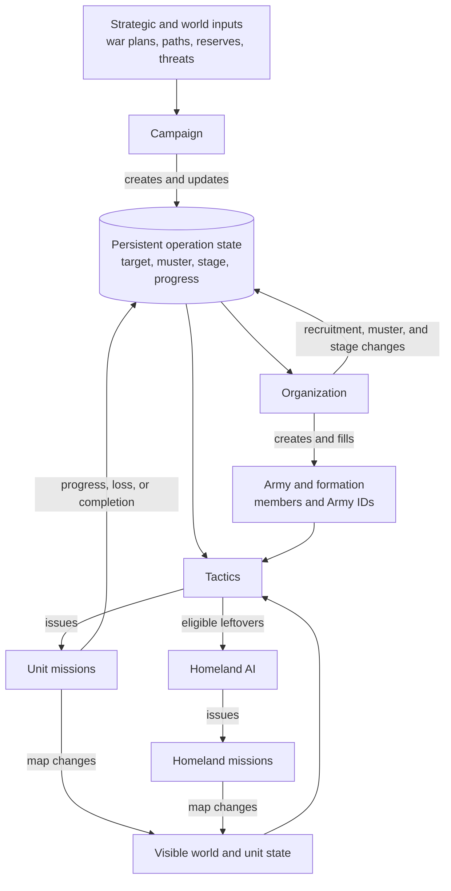

# Unit AI: Military Operation

A **military operation** is the persistent control record for one AI campaign. It keeps the campaign's target, muster point, formation, and stage across turns while the Unit AI chooses missions for individual units. This page maps the three control layers. The detailed pages own their respective rules.

| Layer | Responsibility | Detailed guide |
| --- | --- | --- |
| **Campaign** | Creates an operation, selects and validates its destination, and ends or aborts it. | [Military campaign](military-campaign.md) |
| **Organization** | Creates the army, fills its formation, gathers members, and releases them. | [Military organization](military-organization.md) |
| **Tactics** | Converts the current map and operation state into this turn's movement, combat, and Homeland work. | [Military tactics](military-tactics.md) |

Persistent operation state connects campaign decisions across turns to army structure and current-turn missions. Homeland AI handles eligible units outside an army.

The shared [operation lifecycle](operation.md#per-turn-lifecycle) explains the Tactical-to-Homeland handoff for all units. The relevant code is in `civ5-dll/CvGameCoreDLL_Expansion2`, primarily `CvMilitaryAI.cpp`, `CvAIOperation.cpp`, `CvArmyAI.cpp`, `CvTacticalAI.cpp`, `CvTacticalAnalysisMap.cpp`, `CvHomelandAI.cpp`, and `CvUnit.cpp`.

## Persistent control

An **operation target** is the lasting campaign destination, usually a city plot or adjacent coastal water. An **army goal** is the army's active movement waypoint. Initialization and retargeting normally set the goal to the target, while campaign families can use a deployment plot instead. [Military campaign](military-campaign.md#persistent-target-lifecycle) defines family-specific target, goal, completion, and abort rules.

A **muster point** is the plot where an army assembles before moving toward its goal. A **muster city** is the city selected as the source of that plot. The target and muster point persist separately, so retargeting replaces the target and goal without relocating the muster point. [Military organization](military-organization.md#recruitment-and-stages) explains how the formation gathers there.

Built-in military operations create one army. A member's **Army ID** is its current army claim, which routes it through operation movement until release. Army members can receive army-controlled movement, safety moves, and nearby contact fights. Routine Tactical and Homeland recruitment leave the member with its operation. The army-member upgrade exception is described in [membership changes and release](military-organization.md#membership-changes-and-release).

## Campaign inputs and tactical decisions

Campaign logic uses war plans, paths, reserves, threatened cities, and selected tactical-zone facts to create operations. **Tactical zones** and their postures supply local threat, pillage, carrier-deployment, and nuclear-value inputs, then Tactical AI recomputes them every turn for local movement and combat. [Military campaign](military-campaign.md#tactical-zone-inputs) describes the narrow campaign inputs; [shared concepts](concepts.md#dominance-zones) defines zones, and [military tactics](military-tactics.md#postures-and-local-combat) owns postures and zone processing.

`FLAVOR_USE_NUKE` directly affects nuclear-operation requests. `FLAVOR_NAVAL`, `FLAVOR_DEFENSE`, and `FLAVOR_OFFENSE` shape force allocation. `FLAVOR_OFFENSE` also adjusts Tactical AI risk thresholds in the [tactical simulation](military-tactical-simulation.md#entry-points-and-aggression). Family-specific campaign rules select the operation family, target, and approach.

## Implementation map

| Focus | Main entry points | Guide |
| --- | --- | --- |
| Campaign creation, targets, and completion | `CvDiplomacyAI::DoUpdateWarTargets`, `CvMilitaryAI::UpdateAttackTargets`, `CvMilitaryAI::UpdateOperations`, operation `Init` methods | [Military campaign](military-campaign.md) |
| Army membership, recruitment, and mustering | `CvAIOperation::SetUpArmy`, `GrabUnitsFromTheReserves`, `CvArmyAI::AddUnit`, `CvArmyAI::RemoveUnit` | [Military organization](military-organization.md) |
| Per-turn army and unit missions | `CvTacticalAI::Update`, `ProcessDominanceZones`, `PlotArmyMovesCombat`, `CvHomelandAI::AssignHomelandMoves` | [Military tactics](military-tactics.md) and [military tactical simulation](military-tactical-simulation.md) |

For logs and claim diagnostics, see [operation diagnostics](operation.md#implementation-and-diagnostics).
