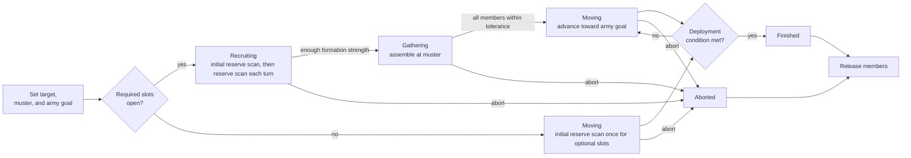
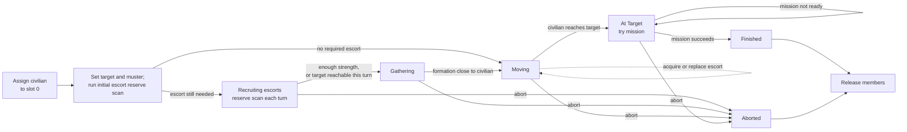
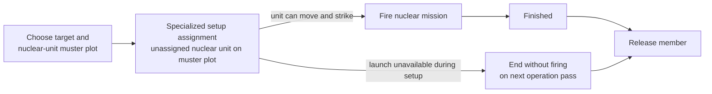
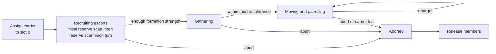
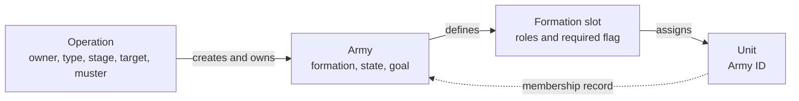

# Unit AI: Military Organization

**Military organization** gives a persistent military operation its durable unit structure. The operation owns campaign state, the army owns a formation, and **formation slots** identify its members. This page defines formations, formation slots, Army IDs, stages, recruitment, and release. [Military campaign](military-campaign.md) defines targets and stopping rules; [military tactics](military-tactics.md) defines current-turn missions.

The relevant code is in `civ5-dll/CvGameCoreDLL_Expansion2`, primarily `CvAIOperation.cpp`, `CvArmyAI.cpp`, `CvTacticalAI.cpp`, `CvMilitaryAI.cpp`, `CvHomelandAI.cpp`, and `CvUnit.cpp`.

## Lifecycle overview

An **operation stage** records campaign progress. The army carries a matching movement state: waiting for reinforcements, gathering, moving, or at the destination. An **initial reserve scan** runs once when the army is created. **Recruiting** repeats the reserve scan each operation turn. **Direct assignments and replacements**, such as the initial civilian or a replacement escort, do not depend on Recruiting.

### Standard military operations

Land, naval, combined, pillage, defense, rapid-response, and naval-superiority operations use the same stage sequence.

Recruiting ends when the formation has enough strength, even if required slots remain open. Gathering ends when every member is within the operation's muster tolerance. Standard military operations finish at deployment range. They do not use the operation's At Target stage.

### Escorted civilian operations

Civilian operations assign their civilian before setup. They use an At Target stage because arriving and performing the civilian mission can be separate events.

While Moving, an unescorted civilian can acquire a suitable defender on its route, and a blocked escort can be replaced. These direct assignments do not return the operation to Recruiting.

### Nuclear attacks

Nuclear attacks use a specialized setup path and skip Gathering, Moving, and At Target.

The normal path recruits and fires during setup. Nuclear armies have no ordinary movement phase, so an operation that cannot launch does not wait and retry through Gathering or Moving.

### Carrier groups

Carrier groups use the standard Recruiting and Gathering transitions, but remain in Moving while they patrol and retarget.

Carrier groups have no successful Finished transition. They remain in Moving until an abort or carrier loss releases the formation. Carried aircraft are not formation members and rebase independently.

## Ownership

| Record | Meaning and control effect |
| --- | --- |
| **Operation** | Records owner, enemy, type, stage, target, muster point, and Army IDs. Player ownership does not change when a unit joins. |
| **Army** | Records the formation, current state, and army goal. Recruiting and gathering use the muster point; moving normally uses the campaign target. |
| **Formation** | Defines the army's required and optional UnitAI roles. |
| **Formation slot** | Defines primary and secondary roles, a required flag, and the assigned unit ID. The army uses it to find, move, remove, and replace the member. |
| **Army ID** | The unit-side membership record. It routes the unit through operation movement and excludes it from routine Tactical and Homeland recruitment. |

A formation slot accepts a unit when either slot role matches the unit's current role or an eligible role for its type. A slot with no primary role is a wildcard. Reserve scans exclude explorers and settlers. Built-in military operations create one army and use its first stored Army ID for movement, recruitment, and stage transitions.

## Recruitment

**Reserve scans** search the player's unassigned units for compatible formation members. **Direct assignments and replacements** place a known unit into a known slot during setup, purchase, escort handling, or replacement. `CvArmyAI::AddUnit` performs the insertion, while its callers decide whether the stage, unit, and slot are eligible.

The timing rule is:

- Setup always runs one initial reserve scan, even when the operation starts in Moving.
- Recruiting runs one reserve scan per operation turn.
- Gathering, Moving, and At Target neither run reserve scans nor return to Recruiting.
- Direct assignments and replacements can add a member outside Recruiting when their own conditions hold.

### When members can be added

| Addition path | When it runs | Result |
| --- | --- | --- |
| Initial reserve scan | Once during every `SetUpArmy`, even when no required slot is open and the operation starts in Moving. | Fills any compatible open required or optional slot. |
| Reinforcement scan | Once per operation turn while the army is waiting for reinforcements in Recruiting. | Refills compatible open slots and records unfilled required slots as production needs. It stops after the operation enters Gathering. |
| City production | While an operation exposes an uncommitted required-slot need created by a reserve scan or a Recruiting-stage removal. | During war, a queue-head order commits to the need; a peacetime appended order does not. Normal `ORDER_TRAIN` completion restores any wartime commitment and leaves the trained unit unattached, so a later reserve scan may assign it to any compatible operation. |
| City purchase | While a suitable Recruiting operation has an open required slot. | A purchased unit can be offered to Recruiting operations; the emergency path directly assigns the last uncommitted required slot. See [military production](military-production.md#formation-requests-and-commitments). |
| Civilian or carrier setup | Before normal stage setup. | Directly assigns the selected civilian or carrier to slot 0, then runs the initial reserve scan for the remaining slots. |
| Nuclear setup | During the nuclear operation's specialized Recruiting path. | Directly assigns an unassigned nuclear unit already on the muster plot and fires immediately when legal. |
| Escort acquisition or replacement | While a civilian operation is Moving. | Directly assigns a suitable defender on the route to an empty escort slot, or replaces a blocked escort with a nearby defender. |
| Upgrade replacement | During the Homeland upgrade pass, regardless of operation stage. | Temporarily removes the old member and directly assigns the upgraded replacement to the same slot. |

After an operation reaches Gathering, it does not return to Recruiting. A later non-temporary loss either leaves the operation at its current stage or triggers its formation-strength abort rule.

### Reserve eligibility and ranking

Each reserve scan considers a unit only when all of these conditions hold:

- **Available:** it has no Army ID and is not an essential garrison, in a contested city zone, near an enemy, or holding an important border citadel.
- **Ready:** it is not healing or recently deployed, meets the configured health threshold, and is not assigned to exploration or settlement.
- **Compatible:** its current or supported UnitAI role matches an open slot, or the slot is a wildcard.
- **Reachable:** it can reach the muster point within the operation's recruitment horizon and has the required embark or ocean capability.
- **Not locally committed:** it is not close enough to the operation target to remain with local Tactical AI.

Candidates rank primarily by power and travel time. Friendly territory, landmass changes, and border-citadel duty break close choices. A scan fills several slots when enough suitable units exist.

### Formation readiness

Recruiting advances only after at least one required slot is filled. Two filled optional slots can compensate for one open required slot when testing whether the formation is strong enough to Gather. Reserve scans record unfilled required slots as operation production needs. A non-temporary removal during Recruiting reopens its need. These records can remain after the operation leaves Recruiting.

An operation with no open required slots at setup starts in Moving instead of Recruiting. Its one-time initial reserve scan still runs and can fill optional slots.

## Membership and release

An army member stays in operation movement rather than the independent-unit pool. It can still receive army movement, safety moves, and nearby contact fights. Formation positioning leaves the member in place after it acts or exhausts movement. [Military tactics](military-tactics.md#operation-army-movement) covers those moves. [Operation lifecycle](operation.md#tactical-to-homeland-handoff) defines shared claim order and the later Homeland handoff.

Reserve scans pass unassigned units to `CvArmyAI::AddUnit`. The method fills the slot, assigns the Army ID and Tactical operation move, records an estimated arrival time, and can upgrade the unit immediately when allowed. The caller supplies the stage, suitability, and slot checks.

| Removal trigger | Membership result |
| --- | --- |
| Unit destruction | Remove the dead unit from its formation slot. |
| Operation or army teardown | Release every member when an operation finishes or aborts, an army is destroyed or reset, or its formation changes. |
| Pre-move army maintenance | Releases a member of an offensive operation that needs healing. Also releases a member outside gathering tolerance when repeated checkpoint estimates show no progress. |
| Tactical healing | Split a wounded member from a non-civilian army so it can heal independently, except while the army is waiting for reinforcements. |
| Escort replacement | Temporarily detach a blocked escort and place a suitable nearby defender in its slot. |
| Upgrade | The Homeland upgrade pass temporarily detaches an army member, upgrades it, then places the replacement in the same slot when successful. |

`CvArmyAI::RemoveUnit` clears the formation slot and Army ID, resets the Tactical move state, and restores the unit's [default role](concepts.md#unitai-roles), the XML default rather than its role on joining. A surviving unit returns to the current-turn Tactical pool only if it can still move. Temporary removal skips the operation notification for escort replacement and upgrades. Other removals notify the operation.

A non-temporary removal during Recruiting reopens a production need. Later losses apply the campaign's formation-strength abort rule; losing the civilian of any civilian operation or the carrier of a carrier group aborts the operation outright. On success or abort, the operation releases every member. A successful deployment marks members as recently deployed, excluding them from reserve suitability for the configured temporary-zone interval, five turns by default.
