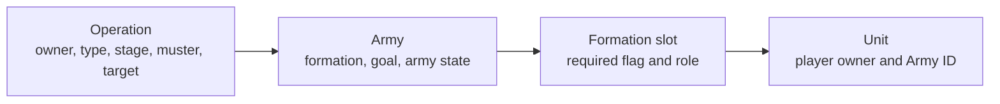
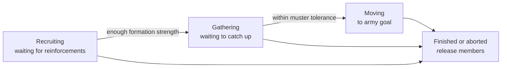

# Unit AI: Military Organization

Military operations give selected combat units a durable structure across turns. An operation holds the campaign state, an army records a formation, and each occupied formation slot identifies one unit. This page explains that organization and how it changes during recruiting, mustering, movement, and cleanup. For operation goals and the wider turn flow, see the [military operation overview](military-operation.md).

The relevant code is in `civ5-dll/CvGameCoreDLL_Expansion2`, primarily `CvAIOperation.cpp`, `CvArmyAI.cpp`, `CvTacticalAI.cpp`, `CvMilitaryAI.cpp`, `CvHomelandAI.cpp`, and `CvUnit.cpp`.

## Organization and control

An operation persists its owner, enemy, type, stage, muster point, target, and army IDs. Its army persists the formation definition, army state, goal, and one entry for each formation slot. A slot has primary and secondary `UnitAI` roles and a required flag. Filling it records the unit ID and makes that unit an army member.

| State | Meaning |
| --- | --- |
| Player ownership | The player owns the operation, army, and unit. Assigning a unit does not change the unit's player owner. |
| Army assignment | The unit receives the army's ID and operation Tactical move tag. Tactical AI routes it through army movement, and Homeland AI does not recruit it. |
| Formation membership | The slot is the army's record of the assigned unit. The unit's Army ID is the unit-side record of that claim. |

The structure stores a list of army IDs, but the implemented military movement, recruitment, and stage-transition paths use the first army. Built-in military operations create one army. Treat a unit's Army ID as a single current control assignment, not as a supported cross-army transfer mechanism. Normal recruitment rejects units that already belong to an army.

## Recruitment and stages

The operation and army states change together, but have different jobs. The operation records the campaign stage. The army records whether it is waiting for reinforcements, waiting for its members to catch up, moving, or at its destination.

| Stage | Membership and movement behavior |
| --- | --- |
| Recruiting | The army waits for reinforcements. A reserve scan can fill compatible open slots, then unfilled required slots become operation production needs. |
| Gathering | The operation has enough formation strength. Assigned units converge around the muster point, within a tolerance that accounts for formation size, domain, and usable space. |
| Moving | The army moves toward its goal, normally the operation target or a selected deployment plot. Local combat can interrupt that movement. |
| Finished or aborted | The operation releases members and later cleanup deletes the completed army and operation. |

### Reserves and production

`CvAIOperation::SetUpArmy` performs an initial reserve scan. After that, `CvAIOperation::Move` runs a reserve scan only while the army is `ARMYAISTATE_WAITING_FOR_UNITS_TO_REINFORCE`. It does not scan reserves while the army is gathering, moving, or at its destination.

One scan considers all open slots, ranks suitable available units, and can fill multiple slots in that same scan. It excludes units already assigned or unsuitable because of health, role, recent deployment, path, or domain. A suitable unit is assigned to one compatible slot, then receives its Army ID and operation move tag.

Recruiting ends only after at least one required slot is filled. Optional members can compensate for some missing required slots, so gathering does not imply that every required slot is occupied.

After the scan, every still-open required slot is stored as an operation need. A city can commit to train one of those slots. The commitment moves the slot from the need list to the committed list, and cancellation returns it to the need list. When the city finishes its unit, player and city bookkeeping clear the commitment and recruit the produced unit into the operation when it is suitable. This is a production commitment, not an immediate unit purchase. With exactly one uncommitted required slot during recruiting, the operation can instead buy a primary-role match in a suitable nearby city. See [military production](military-production.md) for the production candidate and purchase rules.

Nuclear attack operations override these recruitment and completion hooks. Their slot-fill check accepts only an unassigned nuclear unit already standing on the muster plot instead of searching and scoring reserves, and their stage transition skips the normal formation-readiness and gathering checks. The mechanics in this section therefore describe every built-in military operation except the nuclear attack.

### Mustering and assignment

Recruiting and gathering both point army positioning at the muster point. They are not idle stages. Tactical AI positions current army members around that point, while the operation waits for the required formation to arrive and then for the furthest member to be inside the gather tolerance.

While assigned, a unit is not available to unrelated Tactical zones or to Homeland AI. It can participate in army-controlled movement, but not also receive an independent Tactical or Homeland assignment that turn. If it has no movement or has already acted, formation positioning leaves it alone. See [military tactics](military-tactics.md) for army contact and local-combat behavior.

## Replacement, loss, and release

`CvArmyAI::AddUnit` places a unit in a specified free slot. If the unit can upgrade immediately, it upgrades first and the replacement unit becomes the slot member. Homeland AI's upgrade pass also has explicit bookkeeping for an army member: it temporarily removes the old unit without reporting a loss, upgrades it, then restores the replacement to the same slot when the upgrade succeeds.

An assigned unit can leave an army for several reasons:

- An offensive operation removes a member that needs healing, so Tactical AI can handle recovery.
- Each turn, the army records arrival estimates at its current checkpoint. It removes a unit when the latest ETA in a three-sample window has not improved over the oldest ETA.
- A destroyed, explicitly removed, or released unit clears its slot, Army ID, and operation move tag. Its default `UnitAI` role is restored. A surviving movable unit returns to the current Tactical pool.

Losses have different effects by stage. During recruiting, a removed member reopens that slot as a production need. During gathering, moving, or the at-target state, the operation instead checks whether the remaining formation is strong enough to continue. [Military campaign](military-campaign.md#abandonment-and-cleanup) gives the operation-level consequence and threshold.

On either abort or success, the operation releases its army members. Successful operations additionally mark each released unit with its deployment turn. The reserve suitability check rejects recently deployed units for the configured temporary-zone interval, five turns by default, which prevents an immediately successful army from being recruited straight into another operation.

Carrier groups are a useful boundary case. The carrier itself occupies the formation's first slot and moves with the army. Aircraft carried by it are not formation members: they rebase independently and remain outside the carrier operation's slot bookkeeping.

For campaign targets and operation-level stopping conditions, see [military campaign](military-campaign.md). For the shared claim order and later Homeland handoff, see [unit operation](unit-operation.md#control-state).
