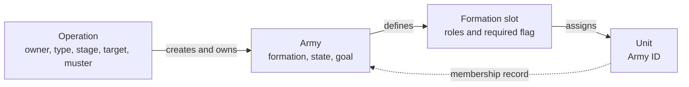
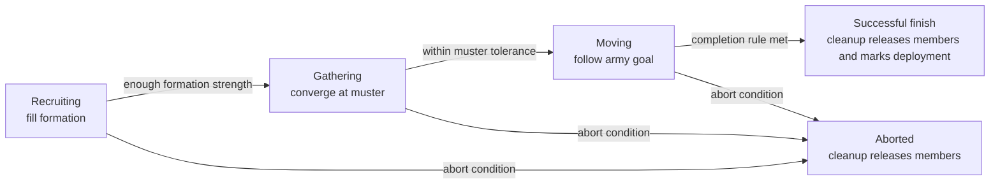

# Unit AI: Military Organization

**Military organization** gives a campaign's units durable structure across turns. An operation owns the campaign state, its army owns a formation, and formation slots identify the army's members. This page covers membership, recruitment, stage changes, and release. [Military campaign](military-campaign.md) owns the operation's target and stopping rules; [military tactics](military-tactics.md) owns each turn's missions.

The relevant code is in `civ5-dll/CvGameCoreDLL_Expansion2`, primarily `CvAIOperation.cpp`, `CvArmyAI.cpp`, `CvTacticalAI.cpp`, `CvMilitaryAI.cpp`, `CvHomelandAI.cpp`, and `CvUnit.cpp`.

## Organization and control

The operation owns the army, and each occupied formation slot gives its unit the Army ID that records that membership.

An **operation** records its owner, enemy, type, stage, target, **muster point**, and army IDs. The muster point is the assembly plot, selected from a **muster city** when that family uses a city source. An **army** records its formation, current state, and **army goal**, the waypoint it is currently moving toward. The army goal usually matches the campaign's operation target once the army moves, while recruiting and gathering use the muster point.

A **formation** is the definition of an army's required and optional roles. Each **formation slot** holds primary and secondary [UnitAI roles](concepts.md#unitai-roles), a required flag, and an assigned unit ID when occupied. A slot accepts a unit when either slot role matches the unit's current role or appears in its type's eligible-role set, and a slot with no primary role is a wildcard that accepts any suitable unit. Units currently serving as explorers or settlers are never recruited. The unit's **Army ID** is the unit-side record of that membership and drives its Tactical operation move tag.

| Record | Control effect |
| --- | --- |
| Player ownership | The player retains ownership of the operation, army, and unit. Assignment does not transfer the unit to another player. |
| Formation slot | The army uses the slot to find, move, remove, and replace its member. |
| Army ID | Tactical AI sends the unit through army movement. Routine Homeland and independent-Tactical recruitment leave it with the army. |

Built-in military operations create one army and use the first stored army ID in their movement, recruitment, and stage transitions. Normal reserve recruitment accepts unassigned units. `CvArmyAI::AddUnit` can transfer an already assigned unit after removing it from its previous army, but that path does not make concurrent membership a supported state.

## Recruitment and stages

The diagram shows the standard lifecycle. An operation with no required open slots can begin moving immediately. Nuclear attacks complete from recruiting after firing, and carrier groups continue moving as their target changes.

Success preserves the completed deployment record for temporary reserve exclusion, while abort returns surviving members without that deployment mark.

| Stage | Army work |
| --- | --- |
| **Recruiting** | Fills compatible open slots from reserves and records remaining required slots as production needs. |
| **Gathering** | Positions members around the muster point until the formation is within a tolerance for formation size, domain, and usable space. |
| **Moving** | Moves members toward the army goal, with Tactical AI able to handle local combat and contact. |
| **Finished or aborted** | Releases members, then later cleanup removes the army and operation. |

`CvAIOperation::SetUpArmy` performs the first reserve scan. `CvAIOperation::Move` repeats that scan only while the army is `ARMYAISTATE_WAITING_FOR_UNITS_TO_REINFORCE`. A scan ranks available units for all open slots and can fill several slots. It excludes units whose assignment, health, role, recent deployment, path, or domain makes them unsuitable.

Recruiting advances after at least one required slot is filled. Optional slots can supply enough formation strength while required slots remain empty. Each remaining required slot becomes an operation need. A city can commit to train one need, moving it to the committed list. The commitment does not reserve the trained unit: when the training order completes or is cancelled, the slot returns unconditionally to the need list and the finished unit joins the reserves unattached. Each operation's reserve scan rebuilds its need list from scratch and claims suitable free units in operation-processing order, so a different army can take the unit the city trained for its committed slot. Only a gold-purchased operation unit is placed directly into its slot: with exactly one uncommitted required slot during recruiting, the operation can buy a primary-role match in a suitable nearby city and assign it immediately. [Military production](military-production.md#weighted-request-and-commitment-paths) details candidate selection and purchase rules.

**Nuclear attack operations** use specialized recruitment: their slot-fill check accepts an unassigned nuclear unit already on the muster plot, and their stage transition skips normal formation-readiness and gathering checks.

## Membership changes and release

While a unit is an army member, Tactical AI positions it through the operation rather than the **independent unit** pool. An independent unit is a movable, unprocessed combat-capable unit with no Army ID that Tactical AI can assign to local zones and global priorities. A member can still receive army movement, safety moves, and nearby contact fights. [Military tactics](military-tactics.md#operation-army-movement) covers those moves.

Formation positioning leaves a member in place when it has already acted or has no movement left.

`CvArmyAI::AddUnit` upgrades a unit before placing it in a free slot when an immediate upgrade is available. The Homeland upgrade pass also supports an army member: it temporarily removes the old unit without reporting a loss, upgrades it, then restores the replacement to the same slot when the upgrade succeeds. This is the exception to the routine Homeland rule that requires no Army ID.

Members leave an army when they are destroyed, explicitly removed, released, or removed by army maintenance:

- Offensive operations release badly hurt members for Tactical recovery.
- Each army records checkpoint arrival estimates. It removes a member when the newest estimate in a three-sample window is at least two turns and has not improved over the oldest estimate.
- Removal clears the slot, Army ID, and operation move tag, then restores the unit's [default role](concepts.md#unitai-roles) — the XML default, not the role it held when it joined. A surviving movable unit can rejoin the current Tactical pool.

During recruiting, removal reopens the slot as a production need. Later stages apply the formation-strength abort rules in [military campaign](military-campaign.md#abandonment-and-cleanup). On success or abort, the operation releases every member. Success marks members with the deployment turn, and reserve suitability excludes recently deployed units for the configured temporary-zone interval, five turns by default.

**Carrier groups** place the carrier in the formation's first slot. Its carried aircraft remain outside the formation and rebase independently.

For the shared claim order and later Homeland handoff, see [operation control state](operation.md#control-state-and-claims).
