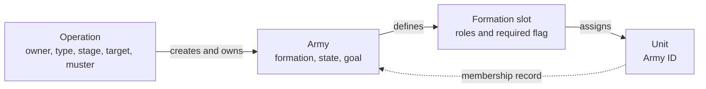
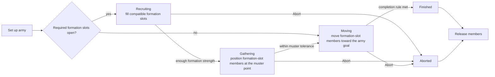

# Unit AI: Military Organization

**Military organization** gives a persistent military operation its durable unit structure. An operation owns the campaign state, its army owns a formation, and **formation slots** identify the members. This page is the authority for formations, formation slots, Army IDs, stages, recruitment, and release. [Military campaign](military-campaign.md) owns targets and stopping rules; [military tactics](military-tactics.md) owns current-turn missions.

The relevant code is in `civ5-dll/CvGameCoreDLL_Expansion2`, primarily `CvAIOperation.cpp`, `CvArmyAI.cpp`, `CvTacticalAI.cpp`, `CvMilitaryAI.cpp`, `CvHomelandAI.cpp`, and `CvUnit.cpp`.

## Ownership

| Record | Meaning and control effect |
| --- | --- |
| **Operation** | Records owner, enemy, type, stage, target, muster point, and Army IDs. Player ownership does not change when a unit joins. |
| **Army** | Records the formation, current state, and army goal. Recruiting and gathering use the muster point; moving normally uses the campaign target. |
| **Formation** | Defines the army's required and optional UnitAI roles. |
| **Formation slot** | Defines primary and secondary roles, a required flag, and the assigned unit ID. The army uses it to find, move, remove, and replace its member. |
| **Army ID** | Unit-side record of membership. It routes the unit through operation movement and excludes it from routine Tactical and Homeland recruitment. |

A formation slot accepts a unit when either formation-slot role matches the unit's current role or an eligible role for its type. A formation slot with no primary role is a wildcard. Explorers and settlers are never recruited. Built-in military operations create one army and use its first stored Army ID for movement, recruitment, and stage transitions.

## Stages and recruitment

| Stage | Army work |
| --- | --- |
| **Recruiting** | Fills compatible formation slots from reserves and records unfilled required formation slots as production needs. |
| **Gathering** | Positions members around the muster point until the formation meets its domain-, size-, and space-dependent tolerance. |
| **Moving** | Moves members toward the army goal. Tactical AI can handle local combat and contact. |
| **Finished or aborted** | Releases members; later cleanup removes the army and operation. |

An army can move once it has enough formation strength. An operation with no open required formation slots can move immediately. Nuclear attacks use their own readiness check and skip gathering after firing; carrier groups keep moving as campaign targets change. See [military campaign](military-campaign.md#target-lifecycle) for completion and abort rules.

`CvAIOperation::SetUpArmy` performs the first reserve scan. `CvAIOperation::Move` repeats the scan only while the army waits for reinforcements. Each scan ranks available units for every open formation slot and can fill several slots. Assignment, health, role, recent deployment, path, and domain can make a unit unsuitable.

Recruiting advances after at least one required formation slot is filled. Optional slots can provide enough formation strength even while required slots remain open. Each open required slot becomes an operation need.

| Recruitment path | Result |
| --- | --- |
| Reserve scan | Claims suitable unassigned units in operation-processing order. |
| City production | A city can commit to one need. Completion or cancellation returns the need to the list and the produced unit joins reserves unattached, so a later scan can assign it to another army. |
| Gold purchase | With exactly one uncommitted required formation slot in Recruiting, a suitable nearby city can purchase a primary-role match and assign it directly. |

See [military production](military-production.md#formation-requests-and-commitments) for candidate selection and purchasing. Nuclear attacks instead accept an unassigned nuclear unit already on their muster point.

## Membership and release

An army member remains in operation movement rather than the independent-unit pool. It can still receive army movement, safety moves, and nearby contact fights. Formation positioning leaves a member in place after it acts or exhausts movement. [Military tactics](military-tactics.md#operation-army-movement) covers those moves. Shared claim order and the later Homeland handoff are defined in [operation lifecycle](operation.md#tactical-to-homeland-handoff).

`CvArmyAI::AddUnit` can transfer a unit after removing it from its previous army; concurrent membership is not supported. It also upgrades a unit before placement when an immediate upgrade is available. The Homeland upgrade pass is the exception to normal Army ID eligibility: it temporarily removes an army member, upgrades it, then restores the replacement to the same formation slot when successful.

Members leave when destroyed, explicitly removed, released, or removed by offensive maintenance. Removal clears the formation slot, Army ID, and operation move tag, then restores the unit's [default role](concepts.md#unitai-roles), which is the XML default rather than its role on joining. A surviving movable unit can rejoin the Tactical pool.

During Recruiting, removal reopens a production need. Later losses apply the campaign's formation-strength abort rule. On success or abort, the operation releases every member. A successful deployment marks members as recently deployed, excluding them from reserve suitability for the configured temporary-zone interval, five turns by default.

Carrier groups place the carrier in the first formation slot. Carried aircraft stay outside the formation and rebase independently.
