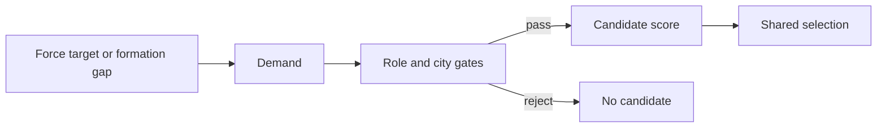

# Unit AI: Military Production

**Force demand** is the empire's need for land, naval, and explorer strength. **Formation gaps** are unfilled required formation slots. **Military production** turns both into weighted unit candidates for one city. The [shared candidate lifecycle](production.md#candidate-lifecycle) then compares them with all other buildables, and the [shared candidate gates](production.md#shared-candidate-gates) apply before unit suitability.

The main implementation is in `civ5-dll/CvGameCoreDLL_Expansion2`, primarily `CvMilitaryAI.cpp`, `CvUnitProductionAI.cpp`, `CvCityStrategyAI.cpp`, `CvCity.cpp`, `CvPlayerAI.cpp`, `CvAIOperation.cpp`, and `CvArmyAI.cpp`.

## Military demand

Military demand gives city production a current reason to train a military unit. The table is an index: each demand type has its own owner and produces a separate candidate or score signal. The diagram shows dependencies rather than exact statement order.

| Demand type | Primary owner | Production effect |
| --- | --- | --- |
| [Land-force demand](#land-force-demand) | Military AI | Limits and rewards combat land candidates. |
| [Naval-force demand](#naval-force-demand) | Military AI | Limits and rewards combat naval candidates. |
| [Explorer demand](#explorer-demand) | Economic AI and Military AI | Limits and rewards supply-consuming explorers. |
| [Operation formation demand](#operation-formation-demand) | Active operation | Adds a weighted candidate for its next required slot. |
| [Army formation demand](#army-formation-demand) | Army formations | Adds a weighted candidate for a free required slot. |

Ordinary unit candidacy is flavor-derived rather than a demand type. [Candidate sources and base weights](production.md#candidate-sources-and-base-weights) explains that base weight.

Every demand follows the same path after its owner supplies the current need:

### Land-force demand

`CvMilitaryAI::SetRecommendedArmyNavySize` calculates the land target. For major civilizations, it starts from the [soft supply cap](concepts.md#supply), reserves explorer capacity, and rebalances domain overages after allocating capacity to land and naval forces. Cities, active settlers, exposed cities, attack targets, and offense, defense, and naval signals shape the target; the defensive, offensive, and naval weights scale with `FLAVOR_DEFENSE`, `FLAVOR_OFFENSE`, and `FLAVOR_NAVAL`, so [custom flavors](concepts.md#flavors) steer force sizing directly. Minor civilizations use a simpler calculation.

For the production gate, the current land count includes units in production except the city's current queue item under evaluation, and it excludes explorers. Supply-consuming land candidates stop entering normal selection once that count reaches the target. A shortfall, especially in war context, increases the score of combat land candidates.

### Naval-force demand

Military AI calculates the naval target from the soft supply allocation, then rebalances domain overages with land demand. Coastal-city count, naval flavor, and offense and defense signals guide the target.

Supply-consuming naval candidates stop entering normal selection at the target. Combat naval candidates also need ocean access. A shortfall, war state, and naval-need strategies raise their score.

### Explorer demand

Economic AI estimates the explorer need, while Military AI converts it into a supply-aware recommendation. The target is the lower of one quarter of the soft supply cap and Economic AI's need, then falls further when supply is constrained. [Civilian land-explorer demand](civilian-production.md#land-explorer-demand) describes the candidate that consumes this recommendation.

A shortfall increases the explorer score. The recommended-force gate applies to supply-consuming explorers, and this baseline has no active naval-explorer production adjustment.

### Operation formation demand

An active operation supplies demand through its next required formation slot when that slot is valid, free, and has a muster point with suitable landmass or ocean access. `CvCity::GetUnitForOperation` tries the slot's primary role, then its secondary role. `CvUnitProductionAI::RecommendUnit` resolves each role to the best concrete trainable candidate, including construction time.

The request weight combines the operation base value, offense flavor, operation skip pressure, and ordinary unit weight. The normal queue accepts it only in a qualifying [muster city](#formation-requests-and-commitments).

### Army formation demand

`CvMilitaryAI::GetUnitTypeForArmy` scans all armies' free required slots, tries each primary role before its secondary role, and favors the army with the fewest open required slots. `RecommendUnit` resolves the selected role to a trainable unit, but the candidate does not retain the army or slot identity.

Its initial weight combines the army base value and offense flavor. Suitability also applies the operation-unit bonus and current operation skip pressure. The normal queue's muster check can leave the request in `PRE`, the precheck state, without reaching suitability; hurry evaluation skips that gate but retains the suitability bonuses.

## Hard gates

The shared [candidate gates](production.md#shared-candidate-gates) cover trainability, puppets, developing cities, siege, and the request muster-city gate. Military suitability adds these hard gates:

| Gate | Result |
| --- | --- |
| Recommended-force limit | Supply-consuming land, naval, and explorer units stop entering normal selection once their respective recommendation is met. Units training count toward the limit. |
| Strategic resource | A unit requiring an unavailable resource is rejected. |
| Deployment and access | A candidate needs valid deployment space and suitable naval access where required. |
| City development and maintenance | Underdeveloped cities and maintenance risk can reject the candidate. |
| Obsolescence | Obsolete choices can be rejected. |

## Score effects

`CvUnitProductionAI::CheckUnitBuildSanity` applies these effects after a candidate reaches suitability. The `MILITARYAISTRATEGY_*` names identify Vox Populi [strategy flags](concepts.md#strategy-flags) that provide role gates and score signals. Vox Deorum custom flavors remain the main steering input, while the state flags continue to supply role-specific effects. With custom flavors active, `CvCitySpecializationAI.cpp` also shifts the empire's military-training specialization weight by `(FLAVOR_MOBILIZATION − 5) × 80`. This steers entire cities toward or away from the military specialization, whose flavor adjustments feed unit base weights.

| Effect | Military signal |
| --- | --- |
| Force shortage | Rewards shortages in land, naval, and explorer strength. |
| Role balance | Adjusts weight for need and enough states such as siege, archers, mobile units, aircraft, and naval roles. |
| Threat and mission | Uses war domain, city threat, garrison demand, air balance, barbarian pressure, and operation context. City threat favors combat candidates and penalizes noncombat candidates during war. |
| City feasibility | Adjusts for construction time, maintenance, resources, deployment space, naval access, and available upgrades. |

Both request weights read offense flavor through `GetPersonalityAndGrandStrategy`. With Vox Deorum custom flavors active, that call omits the active grand-strategy modifier.

## Formation requests and commitments

A **muster point** is the assembly plot. Its **muster city** is the associated city, when the operation has one. [Military campaign](military-campaign.md#city-attacks-and-muster) explains how each family selects them.

| Path | Selection and membership effect |
| --- | --- |
| Normal queue | Operation requests receive a large initial weight and gain pressure when skipped. Army requests receive less priority. Both remain ordinary production candidates and can lose shared selection. A trained unit enters play unattached. |
| Muster-city gate | During normal queue selection, a request proceeds only in the city associated with the next operation request's muster point and with suitable landmass or ocean access. This shared check can also prevent an army request from reaching suitability. |
| Operation commitment | `CvCity::CheckForOperationUnits` can add a training order when purchase-mode sanity rejects a unit but production sanity accepts it. Wartime orders go to the queue head and commit the formation slot; peacetime orders are only appended. Insufficient funds after a successful purchase-mode check do not trigger this fallback. |
| Direct purchase | A successful purchase assigns the unit directly to a committed formation slot or offers it to the recruiting operation closest to completion. Military AI can also buy the last uncommitted required slot for an eligible recruiting operation. |

A training commitment reserves the need, not the finished unit. Completion returns the formation slot to the need list, and reserve recruitment may assign the new unit to any compatible operation. Direct purchase is the only path that immediately fills a formation slot.

[Military organization](military-organization.md#stages-and-recruitment) explains how reserve recruitment and direct purchases become formation membership.
