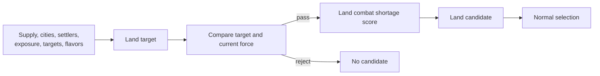
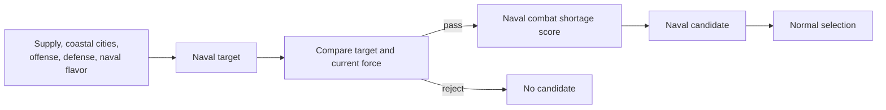
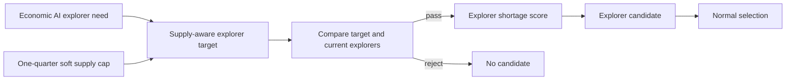
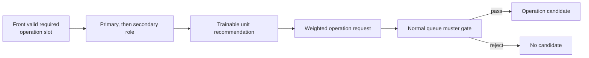
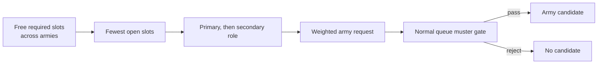

# Unit AI: Military Production

**Force demand** is the empire's need for land, naval, and explorer strength. **Formation gaps** are unfilled required army or operation slots. **Military production** turns both into weighted unit candidates for one city. The [shared candidate lifecycle](production.md#candidate-lifecycle) then compares them with all other buildables, and the [shared candidate gates](production.md#shared-candidate-gates) apply before unit suitability.

The main implementation is in `civ5-dll/CvGameCoreDLL_Expansion2`, primarily `CvMilitaryAI.cpp`, `CvUnitProductionAI.cpp`, `CvCityStrategyAI.cpp`, `CvCity.cpp`, `CvPlayerAI.cpp`, `CvAIOperation.cpp`, and `CvArmyAI.cpp`.

## Military demand

Military demand gives city production a current reason to train a military unit. The table is an index: each demand type has its own owner and produces a separate candidate or score signal. The diagrams show dependencies rather than exact statement order.

| Demand type | Primary owner | Production effect |
| --- | --- | --- |
| [Land-force demand](#land-force-demand) | Military AI | Limits and rewards combat land candidates. |
| [Naval-force demand](#naval-force-demand) | Military AI | Limits and rewards combat naval candidates. |
| [Explorer demand](#explorer-demand) | Economic AI and Military AI | Limits and rewards supply-consuming explorers. |
| [Operation formation demand](#operation-formation-demand) | Active operation | Adds a weighted candidate for its next required slot. |
| [Army formation demand](#army-formation-demand) | Army formations | Adds a weighted candidate for a free required slot. |

Ordinary unit candidacy is flavor-derived rather than a demand type. [Candidate sources and base weights](production.md#candidate-sources-and-base-weights) explains that base weight.

### Land-force demand

`CvMilitaryAI::SetRecommendedArmyNavySize` calculates the land target. For major civilizations, it starts from the [soft supply cap](concepts.md#supply), reserves explorer capacity, and rebalances domain overages after allocating capacity to land and naval forces. Cities, active settlers, exposed cities, attack targets, and offense, defense, and naval signals shape the target; the defensive, offensive, and naval weights scale with `FLAVOR_DEFENSE`, `FLAVOR_OFFENSE`, and `FLAVOR_NAVAL`, so [custom flavors](concepts.md#flavors) steer force sizing directly. Minor civilizations use a simpler calculation.

For the production gate, the current land count includes units in production except the city's current queue item under evaluation, and it excludes explorers. Supply-consuming land candidates stop entering normal selection once that count reaches the target. A shortfall, especially in war context, increases the score of combat land candidates.

### Naval-force demand

Military AI calculates the naval target from the soft supply allocation, then rebalances domain overages with land demand. Coastal-city count, naval flavor, and offense and defense signals guide the target.

Supply-consuming naval candidates stop entering normal selection at the target. Combat naval candidates also need ocean access. A shortfall, war state, and naval-need strategies raise their score.

### Explorer demand

Economic AI estimates the explorer need, while Military AI converts it into a supply-aware recommendation. The target is the lower of one quarter of the soft supply cap and Economic AI's need, then falls further when supply is constrained. [Civilian land-explorer demand](civilian-production.md#land-explorer-demand) describes the candidate that consumes this recommendation.

A shortfall increases the explorer score. The recommended-force gate applies to supply-consuming explorers, and this baseline has no active naval-explorer production adjustment.

### Operation formation demand

An active operation supplies demand through its front next-needed slot when that slot is valid, free, required, and has a muster point with suitable landmass or ocean access. `CvCity::GetUnitForOperation` tries the slot's primary role, then its secondary role. `CvUnitProductionAI::RecommendUnit` resolves each role to the best concrete trainable candidate, including construction time.

The request weight combines the operation base value, offense flavor, operation skip pressure, and ordinary unit weight. The normal queue accepts it only in a qualifying [muster city](#shared-muster-city-gate).

### Army formation demand

`CvMilitaryAI::GetUnitTypeForArmy` scans all armies' free required slots, tries each primary role before its secondary role, and favors the army with the fewest open required slots. `RecommendUnit` resolves the selected role to a trainable unit, but the candidate does not retain the army or slot identity.

Its initial weight combines the army base value and offense flavor. In normal queue selection, suitability also applies the operation-unit bonus and current operation skip pressure. The shared operation-muster check can leave the request in `PRE`, the precheck state, without reaching suitability. Hurry evaluation considers army requests separately, without the normal-queue gate or operation skip pressure.

## Hard gates

The shared [candidate gates](production.md#shared-candidate-gates) cover trainability, puppets, developing cities, siege, and the request muster-city gate. Military suitability adds these hard gates:

| Gate | Result |
| --- | --- |
| Recommended-force limit | Supply-consuming land, naval, and explorer units stop entering normal selection once their respective recommendation is met. Units training count toward the limit. |
| Strategic resource | A unit requiring an unavailable resource is rejected. |
| Deployment and access | A candidate needs valid deployment space and suitable naval access where required. |
| City development and maintenance | Underdeveloped cities and maintenance risk can reject the candidate. |
| Obsolescence | Obsolete choices can be rejected. |

## Score effects

`CvUnitProductionAI::CheckUnitBuildSanity` applies these effects after a candidate reaches suitability. The `MILITARYAISTRATEGY_*` names identify Vox Populi [strategy flags](concepts.md#strategy-flags) that provide role gates and score signals. Vox Deorum custom flavors remain the main steering input, and the state flags continue to supply their role-specific effects. With custom flavors active, an explicit branch in `CvCitySpecializationAI.cpp` also shifts the empire's military-training specialization weight by `(FLAVOR_MOBILIZATION − 5) × 80`, steering whole cities toward or away from the military specialization whose flavor adjustments feed unit base weights.

| Effect | Military signal |
| --- | --- |
| Force shortage | Rewards shortages in land, naval, and explorer strength. |
| Role balance | Adjusts weight for need and enough states such as siege, archers, mobile units, aircraft, and naval roles. |
| Threat and mission | Uses war domain, city threat, garrison demand, air balance, barbarian pressure, and operation context. City threat favors combat candidates and penalizes noncombat candidates during war. |
| City feasibility | Adjusts for construction time, maintenance, resources, deployment space, naval access, and available upgrades. |

Both request weights read offense flavor through `GetPersonalityAndGrandStrategy`. With Vox Deorum custom flavors active, that call omits the active grand-strategy modifier.

## Formation requests and the muster-city gate

A **muster city** is the city named as the assembly point for an operation's next required slot. The formation-demand sections explain how requests are found; this section explains what they weigh and where the normal queue accepts them. [Military campaign](military-campaign.md#muster-selection) explains how each operation family picks its muster in the first place.

### Request weights and magnitudes

`CvCityStrategyAI::ChooseProduction` seeds the two request types differently:

| Request | Precheck weight |
| --- | --- |
| Operation request | 5000, plus 250 × (offense flavor + operation skip counter), plus the unit's flavor-derived weight. |
| Army request | 750, plus 250 × offense flavor. No skip counter and no flavor-derived weight. |

Suitability keeps adding: `CheckUnitBuildSanity` bonuses are additive, and a combat candidate carrying the operation flag gains 500 plus 100 per recorded skip. At the end, an occupied city with occupation unhappiness divides any unit candidate's final weight by five.

The magnitudes are the point. Ordinary flavor-derived candidates typically weigh a few hundred, so a qualifying operation request outweighs them by roughly an order of magnitude and normally wins selection. The [operation skip counter](production.md#timing-and-feedback) also ratchets: it increments whenever the request merely enters precheck — in every city that lists it, selected or not — and resets only on selection or commitment, so a repeatedly passed-over request grows by 250 per skip at precheck plus 100 per skip at suitability.

### Shared muster-city gate

The shared muster-city gate applies only during normal queue selection. `CvPlayerAI::PeekAtNextUnitToBuildForOperationSlot` walks the operations for the next free required slot and reports whether the asking city qualifies: the city must be the muster plot's owning city and have landmass or ocean access to that plot. Operation and army request candidates reach `CheckUnitBuildSanity` only when that check accepts the current city. This directs operation candidates to their assembly point, but it also affects army candidates whose slots may belong to another army. When no qualifying operation request exists, an army request can remain in `PRE` without reaching suitability. Hurry evaluation keeps this gate for operation requests but scores army requests without it — and without the operation flag, so they receive no operation bonus or skip pressure there. If all candidates fail suitability, the [all-failed fallback](production.md#candidate-lifecycle) restores that army request from the precheck list.

## Weighted request and commitment paths

An operation-request candidate is a weighted ordinary-production candidate. It can lose to another candidate after shared selection, and even winning selection starts an ordinary training order without binding the unit to the slot.

**Operation commitment** is a separate path in `CvCity::CheckForOperationUnits`, which runs during the city's turn. It resolves the next required slot's role to a concrete unit and buys that unit outright when the treasury allows. When it cannot buy, it can push a training order instead. At war that order goes to the head of the queue and commits the slot — the slot moves from the operation's need list to its committed list, and the city remembers the order; in peacetime the order is merely appended, without a commitment. That wartime training branch is the only place a slot is ever committed.

The commitment does not bind the finished unit. When the training order completes, the city unconditionally returns the slot to the operation's need list, and the new unit enters play unattached. Each operation's reserve scan rebuilds its need list from scratch and claims any suitable free unit, so the unit joins whichever operation reaches it first — possibly a different army than the one whose slot prompted the build.

A unit is placed directly into a slot only when gold changes hands. The purchase branch of `CheckForOperationUnits` fills the city's committed slot immediately when one exists and otherwise offers the purchased unit to the recruiting operation closest to completion. **Final-slot purchase** is a separate military path: `CvMilitaryAI::MakeEmergencyPurchases` considers it when the player is not using the at-war strategy or is winning every war. For a recruiting operation with one uncommitted required slot, `CvAIOperation::BuyFinalUnit` can purchase a primary-role match and assign it to that slot.

[Military organization](military-organization.md#recruitment-and-stages) explains how reserve recruitment and direct purchases become formation membership.

## Implementation trace

1. `CvMilitaryAI::SetRecommendedArmyNavySize` updates force and explorer recommendations.
2. `CvCityStrategyAI::ChooseProduction` creates ordinary candidates and asks `CvCity::GetUnitForOperation` and `CvMilitaryAI::GetUnitTypeForArmy` for request candidates.
3. `CvUnitProductionAI::CheckUnitBuildSanity` scores or rejects candidates that pass the shared gates.
4. The shared lifecycle applies duration adjustment and selection across units, buildings, projects, and processes.
