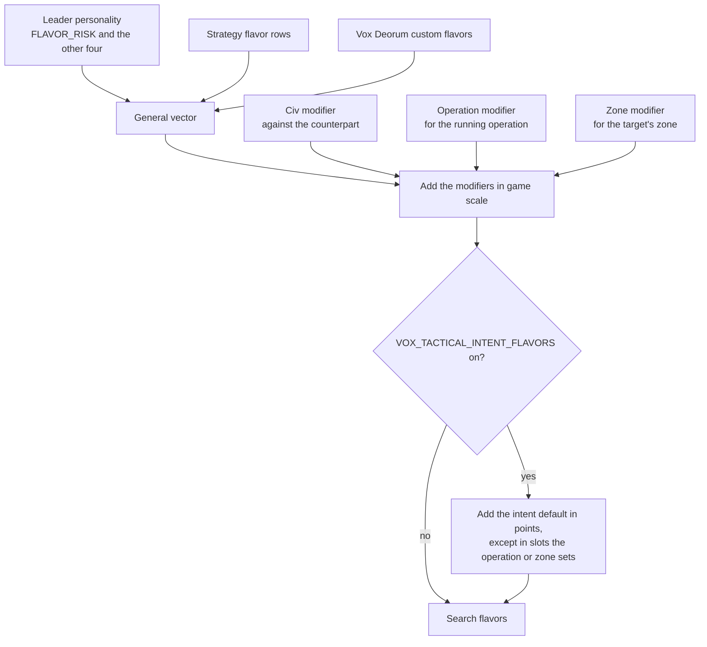
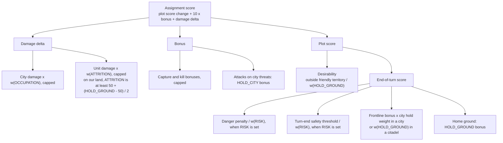

# Unit AI: Military Tactical Flavors

**Military tactical flavors** are five 0 to 100 dials that change how [tactical simulation](military-tactical-simulation.md) judges a plan. They don't add new moves or remove safety checks. They change how much the search cares about cities, enemy units, its own cities and territory, and danger. As a result, a different plan can win among the moves the search would already consider.

Every flavor is neutral at 50. A search with all five at 50 and RISK unset keeps stock scoring.

Each search gets its own flavors in three layers:

1. The player's **general vector**, from the leader's personality, the active strategies, and Vox Deorum custom flavors.
2. **Modifiers** set against the civ being fought, for the running operation, or for the target's dominance zone.
3. An optional **intent default** for the kind of search, behind a mod option that is off by default.

The code lives in a few places:

- `CvTacticalAI.cpp` and `CvTacticalAI.h` hold the `STacticalFlavors` struct, the resolution helpers in `TacticalAIHelpers`, the scoring terms, and the intent table.
- `CvFlavorManager` holds the conversion between the 0 to 100 scale and the game scale.
- `CvMilitaryAI`, `CvAIOperation`, and `CvTacticalAnalysisMap` hold the civ, operation, and zone modifiers.

## The five flavors

| Flavor | Question it answers | Higher value means |
| --- | --- | --- |
| **RISK** | How much danger and loss will we accept? | More risk-taking: fewer HP needed to hold the line, one loss allowed in large groups, less weight on danger, and a more tolerant turn-end HP-versus-danger check |
| **OCCUPATION** | How much do cities matter as targets? | City damage and captures count more |
| **ATTRITION** | How much does damaging enemy units matter? | Unit damage and kills count more |
| **HOLD_CITY** | How much should units guard our threatened cities? | Units hold friendly frontline cities and focus attacks on enemies threatening friendly cities in the search area |
| **HOLD_GROUND** | How much should units hold friendly ground? | Units stand on good ground at home, are pulled less into enemy territory, and value hits on enemies standing on our land |

## Where a search's flavors come from

Both search callers, the coordinated engagement and the ranged opportunity attack, resolve the flavors once through `TacticalAIHelpers::ResolveSearchFlavors` and pass them to every retry. A caller that passes no flavors gets the player's general vector.

### The general vector

`TacticalAIHelpers::GetGeneralTacticalFlavors` builds one value per slot:

| Part | RISK | The other four |
| --- | --- | --- |
| Default | 10 x the leader's `FLAVOR_RISK`, read with the grand strategy applied. A leader without `FLAVOR_RISK` uses its offense instead (see below). | 50 |
| Strategy change | The active strategies' change to the flavor, applied in game scale | Same |
| Custom flavors | While active, the custom value replaces the default, and the strategy change still applies. A leader without `FLAVOR_RISK` keeps following its offense. | Same |

Vox Deorum's options SQL only adds the five flavor types, and no leader gets a `FLAVOR_RISK` row. When a leader has no `FLAVOR_RISK` (or the database has no such type), the DLL starts RISK from 10 x the leader's offense, read with the grand strategy applied, which is the stock rule (see [RISK thresholds](#risk-thresholds)). It reads offense at runtime because the game randomizes each leader's personality flavors at the start: a copy made in SQL would be randomized on its own and drift from the offense the game actually uses. Strategy rows on `FLAVOR_RISK` still move RISK from that start. Leader rows are detected by a nonzero base personality, since the game never randomizes a zero flavor.

A strategy or Vox Populi data row can name one of the five flavors to move it, the same way strategies move any other flavor.

### The game scale

Strategy rows, custom flavors, and modifiers all work in the **game scale**, the signed scale the game uses for flavor changes. `CvFlavorManager` converts with a fixed 101-entry table, `FLAVOR_GAME_SCALE`, which is Vox Deorum's exponential custom flavor mapping: 50 maps to 0, and 0 and 100 map to -300 and +300. Small moves near 50 are fine-grained, and moves near the ends are coarse.

- `FlavorToGameScale` reads the table.
- `FlavorFromGameScale` finds the nearest entry, with ties going toward 50.
- `ShiftFlavor` moves a 0 to 100 value by a game-scale change, so the same change moves a neutral flavor further than one near an end.

| Start | +40 in game scale | -40 in game scale |
| --- | --- | --- |
| 50 | 71 | 29 |
| 80 | 86 | 72 |

### Modifiers

Modifiers are signed game-scale changes, one per slot. The three scopes add up first, then shift the general vector once.

| Scope | Stored in | Lasts | Set by |
| --- | --- | --- | --- |
| Civ | `CvMilitaryAI`, one row per other player | Saved with the game until changed | Lua: `Player:SetTacticalFlavorModifiers(otherPlayer, { FLAVOR_RISK = 40, ... })`. Listed slots are replaced and others are kept. `Player:GetTacticalFlavorModifiers(otherPlayer)` returns the nonzero slots. |
| Operation | `CvAIOperation` | Saved for the operation's life | C++ producers only |
| Zone | `CvTacticalAnalysisMap`, by zone ID | Until the zones are rebuilt, since zone IDs change then | C++ producers only |

Values are clamped to -1000 to 1000. Reading a player's general vector from Lua goes through `Player:GetCustomFlavors`.

Which modifiers a search picks up:

- **Civ.** The counterpart is the owner of the target's dominance zone if we are at war with it, otherwise the owner of the target plot if we are at war with it. The search applies our row against that counterpart. The lookup runs only while the player has any civ modifier.
- **Operation.** The innermost operation the player is running when the search starts. Operation turns are tracked as they run, so this is the same operation the search reports as its parent.
- **Zone.** The zone that contains the target plot.

### Intent defaults

With the `VOX_TACTICAL_INTENT_FLAVORS` mod option on, each search also adds a default for its **search intent**, the purpose label each caller passes, such as a city assault or a reinforcement move. The defaults are in 0 to 100 points, added after the modifiers and clamped to 0 to 100. The default stands in for an operation or zone that has no say of its own, so in any slot where the operation or zone modifier is set (nonzero), that modifier wins and the slot's intent default is skipped. A civ modifier doesn't do this, since it describes the enemy rather than the kind of fight. The defaults live in one table, `TACTICAL_INTENT_FLAVOR_DEFAULTS` in `CvTacticalAI.cpp`, with one row per intent and one column per flavor. Edit the numbers there. The build fails if a search intent is added without a matching row.

### When RISK counts as set

RISK always sets the [thresholds](#risk-thresholds). It also weighs the danger penalty and scales the turn-end safety threshold, but only when it is **set**, meaning something beyond the leader default moved it:

- a strategy or custom flavor changed the general RISK,
- a civ, operation, or zone modifier changes RISK,
- the applied intent default changes RISK, or
- a caller such as the simulator pins RISK.

Without this rule, every leader whose offense isn't 5 would score danger differently from stock.

## How flavors change scoring

### The weight curve

The search turns each flavor into a weight once, at the root position, and every child position copies it:

`weight = 2 ^ (strength x (flavor - 50) / 50)`

| Flavor value | 0 | 25 | 50 | 75 | 100 |
| --- | --- | --- | --- | --- | --- |
| Weight at strength 1 | 0.5 | 0.71 | 1 | 1.41 | 2 |
| Weight at strength 2 | 0.25 | 0.5 | 1 | 2 | 4 |

- **Strength** sets how far the extremes reach. Live play uses 1; the simulator can set it per slot.
- **Neutral is exact.** A weight of exactly 1, including RISK while unset, returns every term untouched with no rounding.
- **Rounding.** Weights are stored in thousandths, and scaled terms round half away from zero.
- **Three ways a weight applies.** A term can be multiplied by the weight, divided by it (an inverse term), or get a **bonus** of (weight - 1) x a base value. A bonus is zero at 50 and negative below it.

### Where the weights land

Damage and bonuses count ten times as much as plot score in the [assignment score](military-tactical-simulation.md#scoring). To keep a large hit at a high weight from saturating the 16-bit score, each attack term may change by at most 500 through its flavor, before the x10. This cap is `TACTICAL_FLAVOR_ATTACK_SHIFT_LIMIT`.

### Attacks: `ScoreAttackDamage`

| Part | Stock rule | Flavored rule |
| --- | --- | --- |
| City damage | As forecast | x w(OCCUPATION), change capped at 500, with the positive shift faded by trade quality and safety (below) |
| Unit damage | As forecast | x w(ATTRITION), change capped at 500, with the positive shift faded the same way. On an enemy land unit standing on a plot our team owns, ATTRITION is read as max(ATTRITION, 50 + (HOLD_GROUND - 50) / 2), so HOLD_GROUND 100 counts as ATTRITION 75, HOLD_GROUND 50 lifts a low ATTRITION to neutral, and the two never stack |
| City capture bonus | +100 | x w(OCCUPATION), capped. The bonus keeps its full shift, but the city and garrison damage on a capture still fades |
| Unit kill bonus | +15 | x w(ATTRITION), capped, with the same HOLD_GROUND rule on our land, and faded by safety alone |
| Attacks on city threats | None | HOLD_CITY above 50 rewards damage to enemies that threaten friendly cities in the search area. Each enemy gets one credit budget; both that budget and the extra bonus per attack are capped at 500. |
| Damage taken, focus fire, kill effects, melee trade veto | As stock | Same, unscaled |

A flavor above 50 lifts a damage score only as far as the attack is worth. The positive part of each damage shift is faded by two factors, each between 0 and 1. **Trade quality** is the damage dealt minus the damage taken (taken floored at 0), over the damage dealt. **Safety** is 1 minus k x danger over HP squared after the attack, where k is the same RISK-adjusted threshold `ScoreCombatUnitTurnEnd` uses (see [Positions](#positions-scoreplotforcombatunitmove-and-scorecombatunitturnend)), and danger is measured at the plot the attacker ends on: the target plot for an advancing kill, otherwise its attack plot. City and unit damage shifts fade by both factors; the kill bonus shift fades by safety alone. Negative shifts, the subtraction of damage taken, and the native bonuses never fade, so an attack with neutral flavors scores exactly as stock, and the fade takes no exemptions, not BRAVEHEART and not a frontline city. One limitation: the fade reads immediate post-attack exposure with raw danger, without the turn-end cover halving or edge floor, so it can undervalue a hit-and-retreat attack by a mobile ranged unit. The single-enemy condition that lowers k to 12 is read before the attack in the fade and after it at turn end.

### Positions: `ScorePlotForCombatUnitMove` and `ScoreCombatUnitTurnEnd`

| Part | Stock rule | Flavored rule |
| --- | --- | --- |
| Desirability with enemies present | Line-distance table, or a flat 12 in a friendly city or when HP is below the minimum HP | With HOLD_GROUND above 50, a land unit's positive desirability on a plot outside our territory is divided by w(HOLD_GROUND). The minimum HP comes from RISK. |
| Danger penalty | Danger relative to HP, flattened, adjusted for experience, doubled when alone | Divided by w(RISK) when RISK is set |
| Turn-end safety threshold | `ScoreCombatUnitTurnEnd` rejects an end-turn plot when HP squared is below k x danger, with k 42, 23 after a kill or when the unit has no safe plot to flee to, or 12 for a kill while one enemy is counted | When RISK is set, k becomes k x 1000 / w(RISK), so at strength 1 a RISK of 100 halves k and a RISK of 0 doubles it; unset RISK or a RISK of 50 keeps k exactly. The stock exemptions for a frontline city or citadel and BRAVEHEART aggression, and the other gates, are unchanged. `canProbablyEndTurnAfterAssignment` runs the same check, so the effect applies there too |
| Frontline bonus | +67 in a city or our own citadel within two plots of an enemy, or +33 in the weaker case | In a friendly-team city, x w(HOLD_CITY) at 50 or above, and x HOLD_CITY / 50 below it, so the bonus fades linearly to nothing at 0. A city captured during the search keeps the stock bonus. In an own citadel, x w(HOLD_GROUND) |
| Terrain defense | Defense modifier / 5 | Same, unscaled |
| Home ground | None | A land unit ending on a plot our team owns gets a HOLD_GROUND bonus on 5 + defense / 5. Below 50 the base is just 5, so a low flavor never makes cover look worse. |
| Other terms | Friendlies, air cover, hiding, enemy citadels, domain, city distance, moves left | Same, unscaled |

There is no city-ring reward. City threat preparation runs only above neutral HOLD_CITY, with a friendly-team city and an enemy in the root tactical plots. It reuses existing possible-attacker lists and estimates each relevant enemy/city pair once with the native quick damage forecast, current garrison, and no interception. Each enemy's budget is (weight - 1) times its strongest predicted city hit, capped at 500.

An attack earns credit for the fraction of the enemy's search-root remaining HP it removes. Scoring subtracts cumulative credit before the hit from credit after it, so split hits, kills, and overkill cannot claim the budget twice. There is no extra kill premium. Candidate scoring uses cached values and integer arithmetic. A search with no actual threat skips bonus lookups entirely. The rule needs no city-distance map and also works for minor civs.

## RISK thresholds

`TacticalAIHelpers::SetSearchRiskThresholds` sets two values once per search:

| Value | Rule | What it controls |
| --- | --- | --- |
| **Loss allowance** | 1 when RISK is 70 or more and more than six units take part, otherwise 0 | A finished plan can leave this many units, plus one per enemy killed, on unacceptable plots, if those units are below median experience. |
| **Minimum HP** | 50 - RISK / 5 | A unit below this HP stops following the line-distance table, so danger and the other terms decide where it stands. |

| RISK | 0 | 30 | 50 | 70 | 100 |
| --- | --- | --- | --- | --- | --- |
| Loss allowance (more than six units) | 0 | 0 | 0 | 1 | 1 |
| Minimum HP | 50 | 44 | 40 | 36 | 30 |

With the default RISK of 10 x offense, these match stock Vox Populi: one loss when offense is above 6, and a minimum HP of 50 - 2 x offense.

## Values at the extremes

At strength 1. "Bonus" terms are zero at 50.

| Flavor | Term | Stock value | At 0 | At 100 |
| --- | --- | --- | --- | --- |
| RISK (set) | Danger penalty | -60 for example | -120 | -30 |
| RISK (set) | Turn-end rejection threshold | k 42 for example | k 84 | k 21 |
| OCCUPATION | City damage | As forecast | Half | Double, change at most 500 |
| OCCUPATION | City capture bonus | +100 | +50 | +200 |
| ATTRITION | Unit damage | As forecast | Half | Double, change at most 500 |
| ATTRITION | Unit kill bonus | +15 | +8 | +30 |
| HOLD_CITY | Frontline bonus in our own city | +67, or +33 | None | +134 or +66 |
| HOLD_CITY | Friendly city threat, full budget earned | None | None | Up to +500 per enemy; total extra attack bonus up to +500 |
| HOLD_GROUND | Frontline bonus in our own citadel | +67, or +33 | +34 or +17 | +134 or +66 |
| HOLD_GROUND | Home ground, 25% hill | None | -3 | +10 |
| HOLD_GROUND | Desirability 12 outside our territory | 12 | 12 | 6 |
| HOLD_GROUND | Unit damage on our land, ATTRITION 0 | As forecast, as ATTRITION 50 | x 0.71, as ATTRITION 25 | x 1.41, as ATTRITION 75 |

### Example: choosing a target

An archer can shoot a city for 20 damage or an adjacent spearman for 25. Neither shot kills.

| Flavors | City shot | Spearman shot | Choice |
| --- | --- | --- | --- |
| All 50 (stock) | 20 | 25 | Spearman |
| OCCUPATION 100 | 40 | 25 | City |
| ATTRITION 0 | 20 | 13 | City |
| ATTRITION 100 | 20 | 50 | Spearman, by a wider margin |

### Example: holding a hill at home

A unit could end its turn on a 25% hill in our territory with a danger penalty of 60, or retreat.

| | HOLD_GROUND 0 | 50 | 100 | 100, with RISK 100 set |
| --- | --- | --- | --- | --- |
| Danger penalty | -60 | -60 | -60 | -30 |
| Terrain defense | +5 | +5 | +5 | +5 |
| Home ground | -3 | 0 | +10 | +10 |
| Net on the hill | -58 | -55 | -45 | -15 |

HOLD_GROUND makes holding friendly ground more attractive without making danger smaller. RISK is the dial that discounts danger.

## Cost

Flavors are on the search's hot path, so the neutral case stays close to free:

- A neutral weight returns the term without arithmetic.
- Resolution runs once per engagement. With no modifiers and the mod option off, it costs a few checks beyond reading the general vector. A cached count skips the civ lookup when no civ modifier exists.
- City threat budgets are prepared once per search only when there is a local friendly city and a root enemy, and only above neutral HOLD_CITY. Scoring reuses cached integer budgets; searches with no actual threat skip bonus lookups.

## What flavors don't change

- **Hard gates.** Death-trap checks, edge-of-vision checks, the melee trade veto, and the final extreme-danger block remain, with their stock exceptions for frontline cities and citadels. A flavor can make a plot more attractive, but it can't make a forbidden plot legal.
- **Aggression.** The caller's [aggression level](military-tactical-simulation.md#entry-points-and-aggression) still decides which attacks are allowed and how much provisional danger is tolerated.
- **What the search explores.** Search bounds, the 13-unit limit, duplicate pruning, and replay don't change.

## The simulator

The tactical simulator in `vox-deorum-rl` extracts this code from the DLL source instead of keeping copies: the conversion table and its helpers, the intent table, the resolution helpers, the RISK thresholds, and every scoring term. The capture records each search's final vector, whether RISK was set, the counterpart, and the modifiers in force, so simulated searches resolve the same way.
