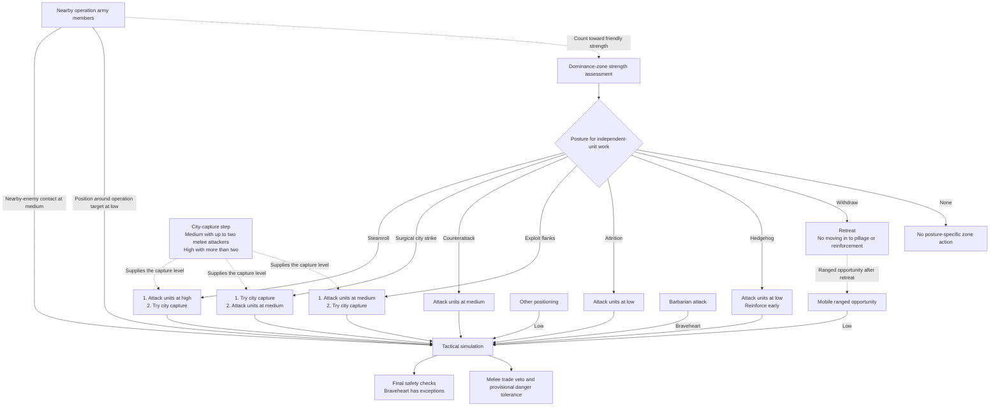
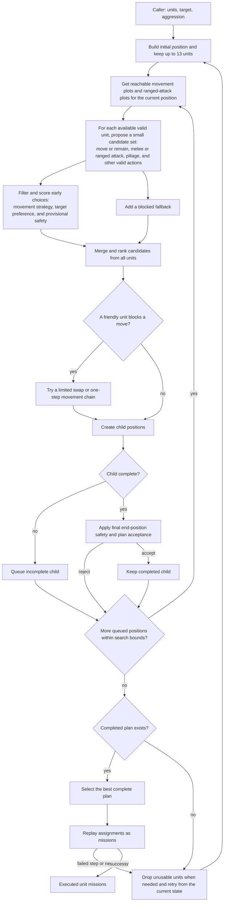

# Unit AI: Military Tactical Simulation

**Tactical simulation** plans a coordinated current-turn action for nearby units and one target plot. [Military tactics](military-tactics.md) supplies the group, target, and aggression level; the simulation searches hypothetical outcomes, selects the best complete plan, and replays it as real missions.

This page has two related jobs. Read [coordinated combat search](#coordinated-combat-search) to change attacks, positioning, acceptance, or support. Read [pathfinding policy](#pathfinding-policy) to change which routes and end-of-turn plots any AI movement may use. The same pathfinder supports both jobs, but combat search consumes reachable plots while pathfinding policy supplies them.

The relevant code is in `civ5-dll/CvGameCoreDLL_Expansion2`, primarily `CvTacticalAI.cpp`, `CvTacticalAI.h`, `CvAStar.cpp`, and `CvUnit.h`.

## Coordinated combat search

A **position** is a hypothetical battle state: simulated unit locations and moves, expected damage, killed enemies, freed plots, and the actions taken so far. `CvTacticalPosition` stores it. An **assignment** is one recorded move, attack, special action, or end-state for one unit. The search extends positions one action at a time and reuses unchanged state, allowing a preallocated pool of 6,000 positions to cover a run.

A unit that finishes the selected plan is committed and processed under the shared [operation lifecycle control state](operation.md#control-state). A unit the simulation blocks remains available to later Tactical passes.

### Entry points and aggression

Aggression is supplied by the caller rather than chosen inside the simulation. A [zone posture](military-tactics.md#postures-and-local-combat) selects the independent units' action order and aggression for attacks on units. City capture chooses its own level. Nearby operation army members contribute to the zone's friendly strength and can therefore change its posture, but they do not inherit that posture. The operation supplies their movement target: positioning around it uses low aggression, while a nearby-enemy contact fight uses medium.

The corresponding entry points are `ExecuteAttackWithUnits` for zone and barbarian combat, `PositionUnitsAroundTarget` for gathering, reinforcement, and defense, and `CheckForEnemiesNearArmy` for army contact. `PerformRangedOpportunityAttack` uses low-aggression simulation when movement or post-attack repositioning is possible; otherwise it chooses a direct ranged attack without simulation. An enemy-unit target records the last aggression used against it and is retried only when a later pass raises the level.

Aggression controls the melee counter-damage trade veto and provisional danger tolerance. The veto applies only when a melee attack takes counter-damage and has a safe reachable alternative. It scales expected damage dealt by the friendly-to-enemy force balance, database damage weight, and level multiplier without changing normal attack scoring. It rejects a non-killing attack when the scaled trade is unfavorable and projected HP or danger crosses the level's threshold. Ranged attacks take zero simulated counter-damage, so they skip the veto, but completed plans still face final end-position safety checks.

| Level | Melee trade multiplier | Veto trigger for an unfavorable non-killing trade |
| --- | --- | --- |
| None | Not applicable | Not used by a current simulation entry point. |
| Low | 0.7x | HP below 40 or danger above maximum HP. |
| Medium | 1.1x | HP below 20 or danger above maximum HP. |
| High | 2.3x | Danger above maximum HP. The literal HP threshold is -5, so there is no practical HP floor. |
| Braveheart | 4.2x | Danger above maximum HP. The literal HP threshold is 0, so there is no survivable HP floor. |

Within this block, every non-Braveheart level rejects an attack below three projected HP, including a killing attack. Braveheart bypasses that veto and the final extreme-danger block, but retains adjacent-enemy death-trap and limited-visibility edge checks.

`FLAVOR_OFFENSE` can allow one casualty for large groups and lowers the HP threshold below which wounded units stop following preferred-line positioning scores. Final danger validation still applies.

### Search procedure

The initial position includes the target area, nearby enemies, and participating units. It filters duplicate or inactive units and units stacked outside their native domain, except in cities. Each retained unit receives a movement strategy from its default [UnitAI role](concepts.md#unitai-roles) and attack range: first line, second line, third line, support, or embarked. The strategy defines its preferred enemy distance. The [reachable-plots query](#reachable-plots) supplies movement candidates.

At most 13 units enter the search. If more are available, it keeps the units with the best single moves and blocks the rest for later passes. It begins with broad, best-first expansion, then drives promising lines to completion through narrower depth-first expansion. Difficulty settings bound branches, choices per unit, and completed positions. A blocked assignment leaves the unit unprocessed, keeping its remaining actions available for later Tactical work.

Equivalent sibling states are discarded, so action order does not create duplicate plans. A simulated move that reveals a new enemy records a restart, ending that branch and requiring a fresh run with current information.

### Acceptance and replay

A position completes when all starting enemies are dead or all units have exhausted their options. The final safety check permits limited casualties, with one allowance per enemy killed and a bias toward protecting experienced units. If there is no kill, restart, or great-person power use, the plan must improve more units' distance to their preferred line than it worsens. Ties consider movement toward the target, attacks in place, and healing.

Provisional danger screening becomes more permissive at higher aggression, but final safety does not scale from Low through High. Every level retains adjacent-enemy death-trap and limited-visibility edge checks. Braveheart alone bypasses the remaining extreme-danger block, while frontline land cities and friendly citadels have specific exemptions. A non-killing melee attack also fails if a safer reachable retreat exists and it would leave the unit too weak or too exposed.

`ExecuteUnitAssignments` replays the selected hypothetical plan against the real game. Each step verifies expected unit positions and target state, then verifies the result because combat may differ from the forecast. Replay ignores ordinary danger stopping because the plan has already evaluated danger, but it stops for a newly revealed enemy. A failed check, interrupted move, or restart triggers a new search. The wrapper retries up to four times, dropping unusable units when planning cannot find a complete position.

### Support placement

Great Generals, Great Admirals, and siege towers stay outside the main combat search. Once a combat plan wins, `AddSupportMoves` runs a smaller search over its assignment sequence and can insert support moves before attacks. A move must add new relevant coverage: generals aid land attackers, admirals aid naval attackers, and siege towers improve city attacks. Support units must still end safely.

## Pathfinding policy

The pathfinder in `CvAStar.cpp` receives each caller's path type, turn and movement limits, optional zone-of-control exceptions, and move flags from `CvUnit.h`. Those inputs turn route finding into policy: they state what the unit may risk, ignore, or refuse.

| Policy | Effect |
| --- | --- |
| Abort in danger | Rejects unsafe near-term stops and makes combat danger more expensive. Civilians use stricter limits. |
| Stop for a new enemy | Interrupts movement as soon as an additional enemy becomes visible, so the simulation can re-plan. |
| Safe embarkation | Allows embarkation only onto a zero-danger plot. |
| Ignore danger | Removes danger costs for calculations that are themselves computing danger. |
| Approximate target | Accepts a plot near the target, optionally only in the unit's native domain. |
| Avoid enemy territory | Refuses enemy-owned plots unless the unit already stands there. |
| Maximize exploration | Prefers steps that reveal unseen plots. |
| Assume the map is revealed | Lets the AI recognize dead ends rather than march into unknown ones. |
| Selective zone-of-control exception | Ignores control from enemy units the simulation has already planned to kill. |
| Hypothetical reachability | Can ignore control, enemies, or stacking for questions such as where an enemy could reach. |

Other flags cover narrower movement rules, including no embarkation, no ocean, worker visibility, escorted-civilian stacking, and canal planning.

### Reachable plots

A **reachable-plots query** runs pathfinding without a destination and returns every plot reachable within the caller's turn and remaining-movement limits. The query inherits the caller's policy, so combat search, danger evaluation, and army contact checks all receive legal candidate plots. When a simulated kill frees a plot, the next query ignores that dead unit's zone of control.

### Danger in path cost

For AI units, end-of-turn path cost penalizes risky water, foreign or unowned territory, poor terrain, and unknown plots. Its main cost is projected danger relative to the unit's current health. Near-term stops in high danger become increasingly expensive; later stops matter less because they will be re-planned. Civilians and embarked units receive stronger penalties and can be rejected outright by the abort-in-danger policy.

The danger model uses pathfinding to estimate hostile reach. Its own searches ignore danger, and the pathfinder refreshes danger before ordinary searches. This separation prevents danger evaluation, pathfinding, and tactical simulation from recursing into each other.
