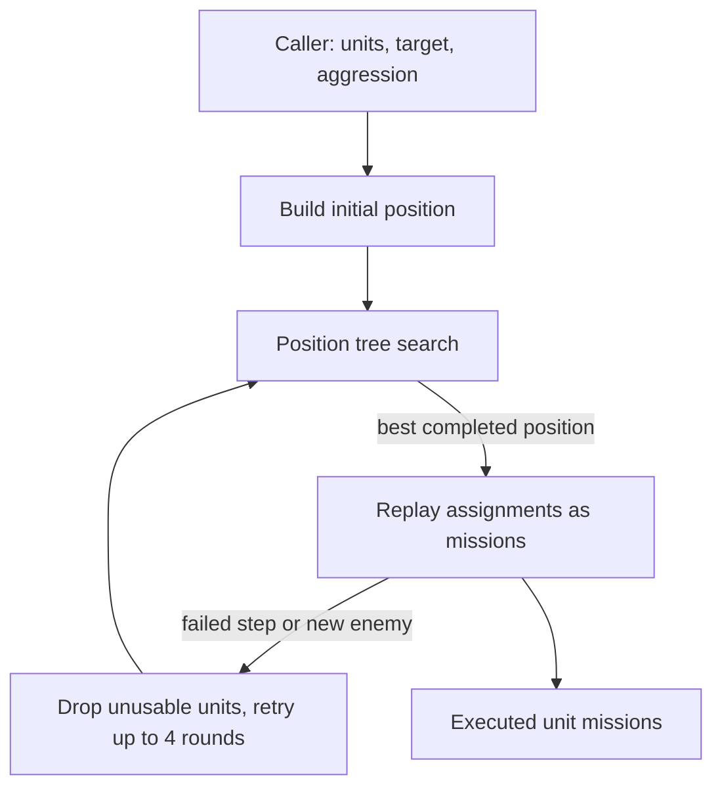

# Unit AI: Military Tactical Simulation

**Tactical simulation** turns a group of nearby units and a single target plot into one coordinated set of moves and attacks for the current turn. Instead of committing each unit to the first acceptable action, [military tactics](military-tactics.md) hands the whole group to a search over hypothetical futures, picks the best complete outcome, and replays it as real unit missions. The second half of this page covers **pathfinding as AI policy**: the move flags, reachable-plot queries, and danger costs through which the same pathfinder that finds routes also enforces behavioral rules for every AI unit.

The relevant code is in `civ5-dll/CvGameCoreDLL_Expansion2`, primarily `CvTacticalAI.cpp`, `CvTacticalAI.h`, `CvAStar.cpp`, and `CvUnit.h`.

## Positions and assignments

A **position** is one complete hypothetical state of the battle: the visible plots around the target, each unit's simulated location, remaining moves, attacks, and accumulated self-damage, a damage ledger for every enemy unit and city, the plots freed by simulated kills, and the ordered list of actions taken so far. `CvTacticalPosition` implements it. Positions form a tree in which each child extends its parent by one round of actions and shares unchanged data copy-on-write, so a preallocated pool of 6,000 positions holds an entire search.

An **assignment** is one atomic action by one unit, recorded as an `STacticalAssignment` with its origin, destination, remaining movement, and expected damage.

| Group | Assignment types | Meaning |
| --- | --- | --- |
| Movement | `A_MOVE`, `A_MOVE_FORCED`, `A_MOVE_SWAP` and `A_MOVE_SWAP_REVERSE`, `A_MOVE_DOUBLE` | Move to a plot, including paired swaps that resolve friendly blocking. |
| Attack | `A_MELEEATTACK`, `A_MELEEKILL`, `A_MELEEKILL_NO_ADVANCE`, `A_RANGEATTACK`, `A_RANGEKILL` | Damage or kill an enemy unit or city; melee kills advance into the vacated plot unless marked otherwise. |
| Special action | `A_PILLAGE`, `A_CAPTURE`, `A_USE_POWER`, `A_HEAL` | Pillage, capture a civilian, expend a great person charge such as a citadel, or hold in place to heal. |
| Bookkeeping | `A_INITIAL`, `A_FINISH`, `A_FINISH_TEMP`, `A_WAIT`, `A_BLOCKED`, `A_RESTART` | Record starting plots, end a unit's turn, leave a unit unused, or force a full re-run after a simulated move reveals new enemies. |

A unit that ends the simulation with `A_FINISH` is committed and marked processed under the shared [control-state rules](operation.md#control-state-and-claims); a unit left `A_BLOCKED` merely skips this simulation and stays available for later tactical passes.

## Entry points and aggression

Four callers run the simulation, each through `FindAndExecuteBestUnitAssignments`, and each fixes the **aggression level** that governs how much damage the plan may accept. The first three arise during the [zone and army processing](military-tactics.md#independent-units-and-priorities) that military tactics runs over its [dominance zones](concepts.md#dominance-zones).

| Caller | Occasion | Aggression |
| --- | --- | --- |
| `ExecuteAttackWithUnits` | Zone combat: capture a city or destroy units at a tactical target | From the zone [posture](military-tactics.md#postures-and-local-combat) for unit targets; city capture uses high with more than two melee attackers, otherwise medium. Barbarians attack units at braveheart. |
| `PositionUnitsAroundTarget` | Gather, reinforce, or defend around a plot without a committed attack | Low |
| `CheckForEnemiesNearArmy` | An operation army meets enemies near its path and holds for a contact fight | Medium |
| `PerformRangedOpportunityAttack` | A single ranged unit that can shoot and still move takes a free shot | Low, with only that unit in the simulation |

Each melee attack that costs the attacker hit points is judged by its weighted damage: damage dealt times the level's multiplier, times an **aggression bias**, the square root of the friendly-to-enemy unit ratio with a floor of 0.9, times a database weight (`COMBAT_AI_OFFENSE_DAMAGEWEIGHT`, default 100 percent).

| Level | Damage weight | Hit-point floor after attack | Character |
| --- | --- | --- | --- |
| `AL_NONE` | No attacks planned | — | Marker only; every live caller passes at least low. |
| `AL_LOW` | ×0.7 | 40 | Wants to deal more damage than it takes. |
| `AL_MEDIUM` | ×1.1 | 20 | Accepts a slightly unfavorable trade. |
| `AL_HIGH` | ×2.3 | None (−5) | Trades freely; survival is checked through danger instead. |
| `AL_BRAVEHEART` | ×4.2 | 0 | Accepts attacks that need luck to survive. |

The floor values come from the `hpLimit` array in `ScoreAttackDamage`, indexed by the five-level enumeration. Its source comment lists 70/40/20/−5 for the four attacking levels, but the indexing includes `AL_NONE`, so the floors actually applied are the shifted values shown above; braveheart reads the array's implicit trailing zero.

The simulation rejects a non-killing melee attack when its weighted damage falls below the damage received and the attacker would finish below the floor or in danger exceeding its maximum hit points — and only when the attacker has a safe reachable plot it could flee to instead. It also rejects any melee attack that would leave the attacker under 3 hit points, except at braveheart. Ranged attacks take no counter-damage and skip these checks entirely.

`FLAVOR_OFFENSE` tunes two global knobs before every run. The default casualty budget (see [Acceptance](#acceptance)) becomes 1 instead of 0 when the flavor exceeds 6 and more than six units participate. The wounded-unit threshold is `50 − 2 × flavor` hit points: units below it are no longer held to their formation line and may claim any safe plot.

## Search procedure



The initial position covers the visible plots within five plots of the target, plus two rings around every enemy found there and one ring around each participating unit. Duplicate units, units that cannot act, and units stacked outside their native domain (except in cities) are filtered out, and the group's median experience is recorded for later casualty decisions.

Each accepted unit receives a **movement strategy** in `addAvailableUnit`, derived from its default [UnitAI role](concepts.md#unitai-roles) and attack range. The strategy defines the enemy distance the unit should fight at.

| Strategy | Assigned to | Ideal enemy distance |
| --- | --- | --- |
| First line | Melee and range-1 ranged units | 1 |
| Second line | Range-2 units and mobile shoot-and-scoot skirmishers | 2 |
| Third line | Range 3+, interceptors, carriers, explorers, very fast naval ranged | 3, or out of reach |
| Support | Great generals, admirals, and siege towers | Behind the lines (see [Support placement](#support-placement)) |
| Embarked | Land combat units heading out of their domain with no enemies present | Away from enemies |

At most `TACTSIM_MAX_UNITS` (13) units enter the search. With more, `dropSuperfluousUnits` scores each unit's single best move, keeps the best thirteen, and records the rest as blocked so a later pass can still use them.

The search itself is a best-first expansion over a heap of open positions. Difficulty sets its width through three `Handicaps` database columns, clamped in code: `TacticalSimMaxBranches` (children per position, 2–9, default 3), `TacticalSimMaxChoicesPerUnit` (candidate moves per unit, 2–9, default 3), and `TacticalSimMaxCompletedPositions` (finished positions before the search stops, 1–4000, default 23). The first three generations expand breadth-first; after that the heap switches to depth-first and branching collapses to one child with two choices per unit, driving each promising line quickly to completion. A run that exhausts the position pool is abandoned with whatever complete positions it found.

Candidate moves for each unit come from its cached [reachable plots](#reachable-plots), scored by lookup tables of movement strategy against enemy distance — separate tables for land attack, sea attack, and escort duty — with danger as a secondary criterion. Friendly cities and, below the wounded threshold, any safe plot score as wildcards. A do-nothing blocked option with a small penalty is always appended so a unit can sit out rather than force a bad move. When a friendly unit occupies a desired plot, the search builds combo moves: a swap of the two units, or a chained move where the blocker steps away first.

Two mechanisms keep the tree honest. New positions are discarded unless `isUnique` confirms no equivalent sibling exists within three generations, comparing assignment sequences up to cyclic permutation, since the same moves in a different order produce the same outcome. And when a simulated move changes visibility — typically revealing a hidden enemy — the position gains an `A_RESTART`, which ends planning on that branch and later forces the whole simulation to re-run with current knowledge.

## Acceptance

A position is complete in two cases. An **early finish** means every enemy present at the start is dead. Otherwise, when all units have exhausted their options, `addFinishMovesIfAcceptable` checks each unit's final plot for the coming enemy turn: a unit may stand in an unacceptable plot only while the **casualty budget** lasts — the `FLAVOR_OFFENSE` default plus one per enemy killed in this position — and only if its experience is below the group median, protecting veterans over rookies.

Positions that pass then face `isKillOrImprovedPosition`: a kill, a restart, or a great-person power use is always good enough; failing that, more units must have improved than worsened their distance to the enemy relative to their strategy's ideal, with ties broken by net movement toward the target, attacks in place, or healing. The final per-plot check also divides projected danger by the aggression level, so higher aggression tolerates proportionally more exposure. Several hard vetoes stay in force below braveheart:

- A plot adjacent to more than three enemies — or exactly three while outnumbered — is a death trap unless it holds a citadel or city.
- Ranged, siege, and carrier units refuse plots where danger exceeds their current hit points.
- Any unit refuses a plot where its squared hit points fall below a caution constant times the danger.

If no position completes, the units most often responsible for dead ends are flagged unusable, and the caller retries without them.

## Execution and replay

The winning position is a plan for hypothetical units; `ExecuteUnitAssignments` replays it against the real game. Every step carries a precondition (the unit stands where the plan expects, the enemy is still there or still absent) and a postcondition (the move landed, the kill actually happened — combat randomness can defy the forecast). Movement missions run with `MOVEFLAG_IGNORE_DANGER`, `MOVEFLAG_NO_STOPNODES`, and `MOVEFLAG_ABORT_IF_NEW_ENEMY_REVEALED`, because the plan has already priced the danger and must only be interrupted by genuine surprises.

Any failed condition, an aborted move, or a stored `A_RESTART` stops the replay and returns failure. The wrapper `FindAndExecuteBestUnitAssignments` then re-runs the whole simulation with the remaining units — up to four rounds in total, dropping flagged units between rounds — so a revealed submarine or an unlucky attack costs a re-plan, not a broken turn.

## Support placement

Support units — great generals, admirals, and siege towers, movement strategy `MS_SUPPORT` — never enter the main simulation. Once a combat position wins, `AddSupportMoves` runs a second, smaller position search (`CvSupportPosition`) over the winning assignment sequence. It may interleave a support move before each attack, so a general can arrive exactly when the attack it boosts is made.

Support scoring rewards only new coverage: a general or admiral scores for moving where it grants its combat bonus to an attacker that does not already have one, and only in its matching domain — generals for land attackers, admirals for naval. A siege tower scores for the improvement it adds to attacks on a city within its effect range. A support move that adds nothing an existing aura does not already provide is rejected, and every support unit must end the turn safe: on a plot with no danger, or stacked with a defender projected to keep at least a third of its hit points.

## Pathfinding as AI policy

The pathfinder in `CvAStar.cpp` is where unit intent becomes movement rules. Every search carries an `SPathFinderUserData` with the path type, a maximum turn count, a minimum-moves-left requirement, an optional list of plots whose zone of control should be ignored, and a bitfield of **move flags** defined in `CvUnit.h`. The flags let each caller state policy — what the unit may risk, pretend, or refuse — without writing its own movement code.

| Move flag | Policy |
| --- | --- |
| `MOVEFLAG_AI_ABORT_IN_DANGER` | Reject a near-term stop above half a civilian's current hit points or above 1.5 times a combat unit's. It doubles combat danger costs, and a mission stops at its first turn destination only when danger exceeds current hit points and is worse than the starting plot or fatal. |
| `MOVEFLAG_ABORT_IF_NEW_ENEMY_REVEALED` | Stop the mission the moment an additional enemy becomes visible, regardless of danger — the simulation's trigger for re-planning around surprises. |
| `MOVEFLAG_SAFE_EMBARK_ONLY` | Allow embarkation only onto plots with zero danger. |
| `MOVEFLAG_IGNORE_DANGER` | Skip all danger costs; essential where danger itself is being computed, since the [danger model](concepts.md#danger) paths enemy units and would otherwise recurse forever. |
| `MOVEFLAG_APPROX_TARGET_RING1` / `_RING2` | Accept any plot within one or two rings of the target instead of the exact plot; `_NATIVE_DOMAIN` additionally forbids ending embarked there. |
| `MOVEFLAG_NO_ENEMY_TERRITORY` | Refuse plots owned by a team at war with the unit; automatically stripped when the unit already stands in enemy territory so it is never stuck. |
| `MOVEFLAG_MAXIMIZE_EXPLORE` | Prefer steps that reveal the most unseen plots. |
| `MOVEFLAG_PRETEND_ALL_REVEALED` | Path as if the whole map were known — a deliberate information leak that lets the AI recognize dead ends instead of marching into them. |
| `MOVEFLAG_SELECTIVE_ZOC` | Ignore zone of control from enemies on listed plots — used by the simulation for plots its plan has already freed by kills, and by the two-pass danger mode. |
| `MOVEFLAG_IGNORE_ZOC`, `MOVEFLAG_IGNORE_ENEMIES`, `MOVEFLAG_IGNORE_STACKING_SELF`, `MOVEFLAG_IGNORE_STACKING_NEUTRAL` | Relaxations that pretend zone of control, enemy units, or stacking limits away — used for hypothetical questions such as "where could this enemy reach". |

Other flags cover narrower rules — `MOVEFLAG_NO_EMBARK`, `MOVEFLAG_NO_OCEAN`, `MOVEFLAG_VISIBLE_ONLY` for workers, `MOVEFLAG_DONT_STACK_WITH_NEUTRAL` for escorted civilians, `MOVEFLAG_PRETEND_CANALS` for canal planning — all in the same enumeration in `CvUnit.h`.

## Reachable plots

A **reachable-plots query** (`CvPathFinder::GetPlotsInReach`) runs a pathfinder search with no destination and harvests every closed node instead of one path, returning all plots the unit can reach within the request's turn limit and minimum remaining movement. The same flags apply, so the result already respects the caller's policy.

Reachable plots are the currency of tactical planning: the simulation caches one set per unit and simulated situation to generate movement candidates, the danger model computes them for every hostile unit to learn who could strike where, and army movement uses them for contact checks. When a simulated position includes kills, the freed plots are passed back through `MOVEFLAG_SELECTIVE_ZOC` so follow-up moves are not blocked by the zone of control of units that will already be dead.

## Danger in path cost

For AI-controlled units, `PathEndTurnCost` prices every plot where a path would end a turn, which makes route choice double as positioning policy. It penalizes ending on water for land units, in foreign or unowned territory, off roads, on low-defense terrain, and on invisible plots that could hide anything. Its dominant term is danger, read from the danger model and compared against the unit's current hit points in three tiers:

```text
danger above 1/3 of hit points:  45 × base cost   (worth 1.5 plots of detour)
danger at or above hit points:   75 × base cost   (worth 2.5 plots of detour)
danger at or above 3 × hit points: 115 × base cost (worth 3.5 plots of detour)
```

The base cost is 120 per movement point, so the comments' plot equivalents assume a one-move unit; faster units detour further. Each penalty is multiplied by `max(1, 4 − turns in the future)`, weighting the first turn's stop most heavily because later stops will be re-planned anyway. Civilians and embarked units are stricter: any danger at all costs the low tier, danger above their hit points costs four times the high tier, and with `MOVEFLAG_AI_ABORT_IN_DANGER` a near-term stop above half their hit points is rejected outright.

Because computing danger itself paths every enemy unit, the pathfinder forces a danger refresh in `CvTwoLayerPathFinder::Configure` before each search begins, and the danger model runs all of its own searches with `MOVEFLAG_IGNORE_DANGER` — the pair of rules that keeps danger, pathfinding, and the tactical simulation from calling each other in circles.
