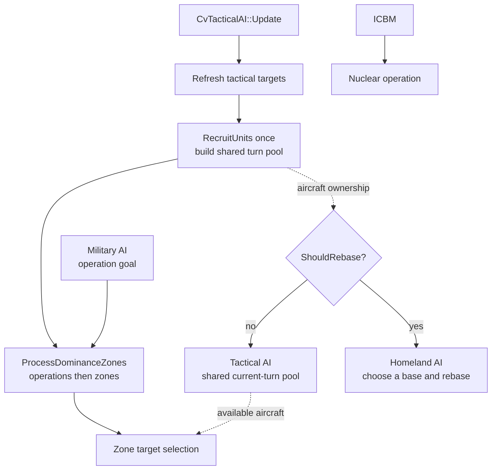
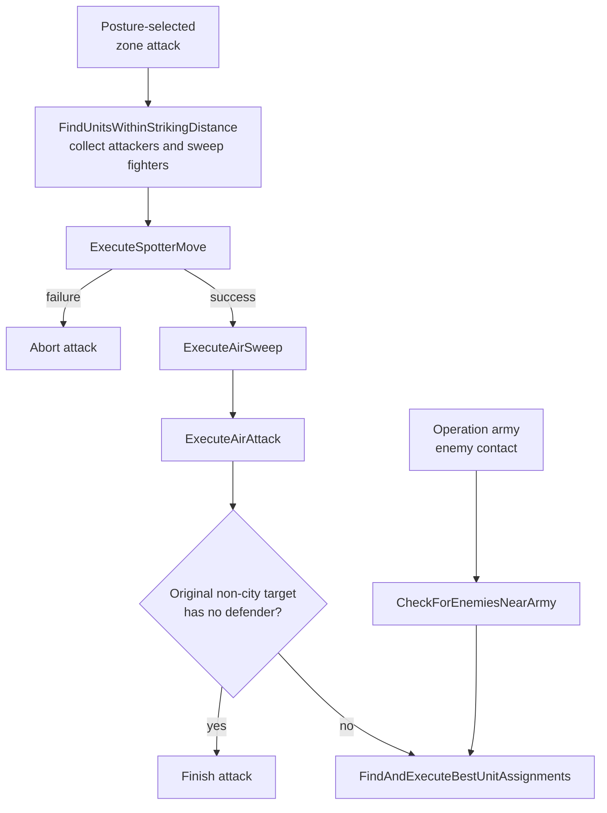

# Unit AI: Military Tactics

**Military tactics** turns the visible map into this turn's military missions. It moves persistent-operation armies first, assigns local combat and support to **independent units**, then leaves eligible units for Homeland AI. An independent unit is a movable, unprocessed combat-capable unit with no Army ID.

This page owns Tactical AI's turn order, postures, priorities, and specialized moves. [Operation lifecycle](operation.md#operation-lifecycle) defines shared claims and Tactical-to-Homeland handoff. [Military campaign](military-campaign.md) defines targets, army goals, muster points, and muster cities; [military organization](military-organization.md) defines formation slots, Army IDs, recruitment, stages, and release. [Shared concepts](concepts.md#dominance-zones) defines dominance zones. Coordinated combat search and pathfinding policy are in [military tactical simulation](military-tactical-simulation.md).

The relevant code is in `civ5-dll/CvGameCoreDLL_Expansion2`, primarily `CvTacticalAI.cpp`, `CvTacticalAnalysisMap.cpp`, `CvAIOperation.cpp`, `CvHomelandAI.cpp`, and `CvUnit.cpp`.

## Tactical turn order

`CvTacticalAI::Update` refreshes visibility, tactical targets, and focus areas; recruits current-turn units; then processes army movement, zone combat, reinforcement, global priorities, and review. Eligible remaining units pass to Homeland AI.

A **tactical target** is a plot worth acting on this turn. Its recorded type and dominance zone let zone passes select local targets while global passes sweep a type across the map.

| Tactical-target type | Examples |
| --- | --- |
| Enemy | City, combat unit, civilian, trade unit, citadel, or blockade point. |
| Opportunity | Barbarian camp, goody hut, improvement, or resource improvement to pillage. |
| Friendly | City, defensive bastion, or improvement to hold or defend. |

## Operation army movement

`PlotOperationalArmyMoves` calls each persistent operation's `DoTurn` as the first step of `ProcessDominanceZones`, before the per-zone posture loop. Land, naval, and combined armies use `PlotArmyMovesCombat`; escorted civilian armies use the escort path. Recruiting and gathering armies move around their muster point, while moving armies follow their army goal.

Operation state and the current turn target control army behavior; zone posture controls the independent-unit behavior in the next section. Both tables record the routine, behavior, and simulation aggression for their path. `PositionUnitsAroundTarget` is also used by non-army positioning passes.

| Army phase or condition | C++ routine | Behavior | Simulation and aggression |
| --- | --- | --- | --- |
| No reachable step path | `PlotArmyMovesCombat` | Record `AI_ABORT_LOST_PATH` for the operation. | None |
| Contact safety veto | `CheckForEnemiesNearArmy` | Skip the fight when the zone associated with the closest city to the selected enemy is enemy territory and enemy-dominated. Continue the operation without aborting it. | None |
| Eligible enemy contact | `CheckForEnemiesNearArmy`, called by `PlotArmyMovesCombat` | Gather healthy army members and suitable nearby friendly attackers, including members of another army. A successful fight holds the army's movement target at its center of mass. | Medium |
| Gather, advance, or hold formation | `ExecuteGatherMoves` → `PositionUnitsAroundTarget` | Move formation members toward the muster point, operation target, or current turn target, subject to reachable-plot and danger checks. | Initial simulation: Low. Subsequent positioning does not simulate. |
| Unprocessed army member still in danger | `PositionUnitsAroundTarget` | Try to move the member to a safe healing plot or, failing that, the safest reachable plot. Finish its turn. | No new combat simulation |
| Pre-move army maintenance | `CvArmyAI::UpdateCheckpointTurnsAndRemoveBadUnits` | Release members that are unfit to continue before moving the army. | None |
| Escort replacement | `SwitchEscort` | Temporarily swap a blocked escort for a suitable nearby defender. | None |

`CvArmyAI::RemoveUnit` can return a surviving, movable member to the current-turn independent-unit pool. It receives posture work only if its zone has not already been processed. [Military organization](military-organization.md#membership-and-release) lists the removal triggers and operation effects.

## Postures and local combat

Tactical AI refreshes a **posture**, a current-turn strategy for each dominance zone, then processes zones from highest to lowest value. Territory, overall and ranged dominance, melee balance, and city danger choose the posture; water zones use naval strengths. After extracting the zone's targets, `ProcessDominanceZones` dispatches the posture routine that selects the local work and aggression passed to the [tactical simulation](military-tactical-simulation.md#entry-points-and-aggression).

| Territory | Dominance and local condition | Posture |
| --- | --- | --- |
| Wilderness | Any | Exploit flanks |
| Enemy | City in danger of falling | Surgical city strike |
| Enemy | Enemy dominant, or ranged-heavy force facing much stronger enemy melee | Withdraw |
| Enemy | Friendly dominant | Steamroll |
| Enemy | Even, friendly ranged dominant, enemy melee stronger | Attrition |
| Enemy | Even, friendly ranged dominant, enemy melee no stronger | Steamroll |
| Enemy | Other | Attrition or exploit flanks according to ranged dominance |
| Neutral | Enemy dominant with friendly ranged dominance | Attrition or exploit flanks according to enemy melee strength |
| Neutral | Enemy dominant without friendly ranged dominance | Withdraw |
| Neutral | Other | Attrition with friendly ranged dominance, otherwise exploit flanks |
| Friendly | Enemy dominant | Hedgehog |
| Friendly | Other | Counterattack |

| Zone posture | C++ routine | Behavior | Simulation and aggression |
| --- | --- | --- | --- |
| None | No routine | Do no posture-specific work. | None |
| Withdraw | `PlotWithdrawMoves` → `ExecuteWithdrawMoves` | Retreat toward the safest neighboring zone or city. Take a ranged opportunity shot after a successful withdrawal when possible; if no safe route exists, pillage in place when worthwhile and move to the safest reachable plot. | No posture attack; the ranged opportunity exception uses Low when simulated. |
| Hedgehog | `PlotHedgehogMoves` | Attack enemy units, then call `PlotReinforcementMoves` for early reinforcement before attacks in other zones. | Low |
| Attrition | `PlotAttritionAttacks` | Attack enemy units with lower-risk target ordering. | Low |
| Exploit flanks | `PlotExploitFlanksMoves` | Unit attacks → city capture. | Unit attacks: Medium. City capture: melee-count rule. |
| Counterattack | `PlotCounterattackMoves` | Attack priority enemy-unit targets. | Medium |
| Surgical city strike | `PlotSurgicalCityStrikeMoves` | City capture → remaining unit attacks. | City capture: melee-count rule. Unit attacks: Medium. |
| Steamroll | `PlotSteamrollMoves` | Unit attacks → city capture. | Unit attacks: High. City capture: melee-count rule. |

The city-capture rule is independent of posture: `ExecuteCaptureCityMoves` uses Medium with up to two melee attackers and High with more than two.

Nearby army members affect the friendly strength used to calculate a zone's posture, but army members do not enter these posture routines. Operation movement runs first and the operation's goal controls army movement; zone dominance affects an army only through the contact safety veto above. Neighboring zones can still refine a posture, including naval steamroll near a stronger enemy land zone and withdrawal outside friendly territory near an enemy-dominated zone in the same domain.

## Independent units and priorities

Routine Tactical recruitment accepts movable, unprocessed combat, ranged, air, and combat-support units with no Army ID. It excludes delayed-death units, explorers, carrier-role ships, and nuclear-role units. Tactical AI does not process human units; Homeland AI handles automated human units.

| Priority | Main work |
| --- | --- |
| Global high | Heal frontline units, move operation armies, urgent garrisons, and sorties. |
| Zone combat | Emergency purchase, then posture-directed local work. |
| Reinforcement | Move suitable independent units toward zones needing strength. |
| Global middle | Air patrol, camps and goody huts, civilian attacks, bastions, safety, healing, pillage, trade plunder, and blockade. |
| Global low | Guard improvements, escort embarked units, and move exposed remaining units. |
| Review | Final safety move, then pass eligible units to Homeland AI. |

Zone value prioritizes city importance and urgency: focus-area cities, damaged visible cities, operation or [preferred attack targets](military-campaign.md#attack-targets), land zones, and dominance that threatens friendly or enemy territory raise the value. War state can further prioritize friendly territory while losing or enemy territory while winning. A city-state enemy resets city-based factors. Barbarians skip zone processing and use their own ladder.

## Air operations

Air control is split by job. [Military campaign](military-campaign.md) creates persistent operation goals; Tactical AI executes operation movement, including carrier movement. Aircraft aboard a carrier are assigned independently to Tactical or Homeland AI. This section covers conventional fighters, bombers, and missiles. ICBMs follow the [operational nuclear path](military-campaign.md#nuclear-campaigns).

`CvTacticalAI::Update` calls `RecruitUnits` once per turn, after refreshing targets and before operation or zone processing. Neither campaigns nor zones call it. Later target collectors select from the resulting shared pool.

For aircraft, `RecruitUnits` requires `canUseForTacticalAI`, then applies `ShouldRebase`. That check returns true when a city may fall, a carrier is projected to die, or a healing aircraft is at a dangerous base. In wartime, a fighter remains Tactical when an enemy aircraft is nearby or `GetBestAirSweepTarget` finds a target. A bomber or conventional missile remains Tactical only when an `ENEMY_COMBAT_UNIT` target is within range. A city alone does not qualify. At peace, conventional aircraft go to Homeland. This assigns ownership; it does not promise a rebase or patrol mission.

### Zone attacks and target selection

A **zone attack** is an attack on a posture-selected target during `ProcessDominanceZones`. Aircraft are not attached to persistent zones, so its target collector can use one for any reachable assignment, including one in a different zone. An air strike can select an enemy combat unit or city within three plots of the requested target.

The operation-contact branch bypasses `ExecuteAttackWithUnits`: it sends eligible land and naval participants directly to the simulator and launches no sweep or strike missions. Thus campaign goals can bring a carrier into an operation, but immediate army contact does not enlist its aircraft through this path.

[Operation completion and cleanup](operation.md#completion-abort-and-cleanup) release deployed army members for independent zone work. Before release, a later zone attack can still use independent aircraft against the same enemies. Available bombers or missiles can trigger that attack even without independent ground units, subject to target, damage, and visibility checks. Aircraft alone cannot capture a city. With no eligible strike aircraft or other attackers, this path launches no air missions; fighters alone do not qualify.

When the collector adds an attacking aircraft, `FindAirUnitsToAirSweep` chooses the player's available sweep-capable fighters. It chooses up to the number of visible, eligible enemy interceptors, with a minimum of one fighter for possible reconnaissance. `ExecuteAirSweep` skips the sweep when that interceptor count is zero. A completed sweep consumes an enemy interception allowance, but later strikes can still encounter ready interceptors.

`FindAirTargetNearTarget` scores expected damage, distance, defensive retaliation, and visible interception risk. Defense fighters are omitted from ordinary strike collection because they are reserved for interception and sweeps. Missiles value defender damage and kills but skip an ungarrisoned city. In the zone-attack path, the land and naval simulator therefore sees the real damage and survivors left by earlier air missions, plus the current air-cover flag. It does not search air actions itself.

The dominance map has a separate, coarser use for aircraft. `CvTacticalAnalysisMap` adds their ranged strength to land or naval strength according to whether the aircraft's base plot is land or water. This contribution can change a zone's posture, but it is not an evaluation of air superiority.

### Interception and air superiority

There is no single air superiority number. Tactical behavior combines nearby aircraft counts, per target interceptor readiness, strike penalties, and the fighter and bomber mix at each base.

| Signal | What the code measures |
| --- | --- |
| Nearby enemy aircraft | `GetNumEnemyAirUnitsInRange` counts enemy aircraft without requiring visibility. Proximity is the enemy aircraft range capped at 12 plus half the querying aircraft's range. Fighters and bombers can be counted separately. |
| Eligible interceptor | `CvPlot::GetBestInterceptor` filters by range, war status, airspace, capability, and current readiness. It ranks attack strength with interception modifiers and probability, applies aircraft health, then breaks ties by distance. Combat can select an interceptor that is not visible. |
| Air cover | `CvPlot::HasAirCover` is a snapshot of at least one own interceptor in range with remaining allowance. The tactical simulator uses this snapshot and adds a small three point positioning preference for covered plots. It does not plan aircraft movements. |
| Base defense | After zone combat, `PlotAirPatrolMoves` sets a patrol quota per base: `floor(bombers / 2) + floor(fighters / 4)`. A lone bomber counts as two. Both counts refer to nearby enemy aircraft. |

Patrol selection takes still-available, patrol-capable aircraft from the Tactical pool in iteration order until each base's quota is filled. It does not rank their strength or promotions. `ExecuteAirPatrolMoves` issues `MISSION_AIRPATROL` and marks the selected fighters processed. A fighter whose sweep exhausted its actions cannot join this pass. AI aircraft wake from intercept duty each turn so their assignment is reconsidered. Homeland also attempts patrol as a fallback when a combat-ready aircraft considered for rebasing gets no rebase destination.

An interceptor must be capable, not embarked, and have an unused interception allowance. Aircraft must also be on intercept duty, which patrol missions establish; land and naval anti-air units do not use patrol missions. During actual air combat, `GenerateAirCombatInfo` checks evasion and interception chance. If interception deals damage, the bombing run ends before target damage. The attempt consumes an allowance even when evasion or chance prevents a hit, and a sweep also consumes an allowance. A simulation can therefore begin with air cover even though no interceptor remains ready for a later strike.

### Homeland rebasing

`CvHomelandAI::ExecuteAircraftMoves` scores owned cities and carrier bases with `ScoreAirBase`, excluding unsafe or unsuitable cities. Healing aircraft seek a lower scoring city. Combat-ready aircraft prefer a higher scoring base when `IsGoodUnitMix` permits the fighter and offensive balance. If the destination is out of range, Homeland executes the first rebase leg found by the air pathfinder, so reaching a distant base can take several turns. Tactical AI moves the carrier for its campaign operation while aircraft follow these Tactical and Homeland decisions.

## Barbarian priorities

Barbarians skip dominance zones and process one global target list through this priority ladder.

| Priority | Work |
| --- | --- |
| 1 | Camp defense: garrison and hold every camp. |
| 2 | Theft from an adjacent city, or takeover of a weakened city-state. |
| 3 | Unit attacks through the tactical simulation at braveheart aggression, then vulnerable-city capture. |
| 4 | Civilian attacks. |
| 5 | Immediate pillage: improved resources first, then other improvements. |
| 6 | Trade-route plunder, land then sea. |
| 7 | Roaming toward the best target in range. |
| 8 | Safety: a barbarian that reaches this pass did not attack, so it flees. |

A camp defender stays assigned. Ranged defenders fire from camp; melee defenders act only when they can return in the same turn. An empty camp recalls the nearest available land unit within five turns. Roaming range follows the game handicap's land and sea target ranges. Land units can enter an undefended civilian or improvement to pillage but do not linger beside combat targets; sea units do not pillage. Captured civilians return toward a camp.

## Specialized execution

**Amphibious landings** run after city capture for embarked units still near the target. `ExecuteLandingOperation` greedily assigns units to reachable coastal plots, favoring survivable plots close to the target, ranged hills, legal landmass access, positive attacks, and clustered landings. This is not a simulated position search.

**Paradrops** are opportunistic. During immediate pillage, paratroopers in range are tried before ground units against enemy citadels and improved resources. No other pass plans a drop, so drops never enter the tactical simulation.

**Support units** are outside the main simulation. After combat planning succeeds, a second search can interleave Great General, Great Admiral, or siege-tower moves before each attack so the relevant aura is present. See [support placement](military-tactical-simulation.md#support-placement).

## Homeland handoff

Tactical AI retains a unit only while a later pass can use it. Homeland AI receives a movable, unprocessed military unit with no Army ID.

| Homeland pass | Remaining military work |
| --- | --- |
| Conservative heal | Preserve wounded units before routine positioning. |
| Aircraft rebase | Move aircraft to a suitable city or carrier. |
| Safety | Move exposed units from danger after civilian role passes. |
| Upgrade and opportunity attack | Upgrade eligible units or take a safe local attack without leaving an essential garrison. |
| Garrison, heal, sentry, and patrol | Fill city needs and position remaining land and naval units. |
| Final review | Continue a valid mission or move idle units toward friendly cities or water. |

The Army ID condition governs routine Homeland recruitment. The upgrade pass is the exception: it temporarily removes an army member, upgrades it, then restores the replacement to its formation slot. [Military organization](military-organization.md#membership-and-release) documents the membership changes.

## Implementation trace

`CvTacticalAI::Update` refreshes targets and recruits units. `ProcessDominanceZones` runs army movement, postures, reinforcement, global priorities, and review. Operation `DoTurn` and `Move` record progress and stage transitions; assignment helpers issue unit missions; `CvHomelandAI` claims eligible leftovers. For cross-system logs, see [operation diagnostics](operation.md#diagnostics).
