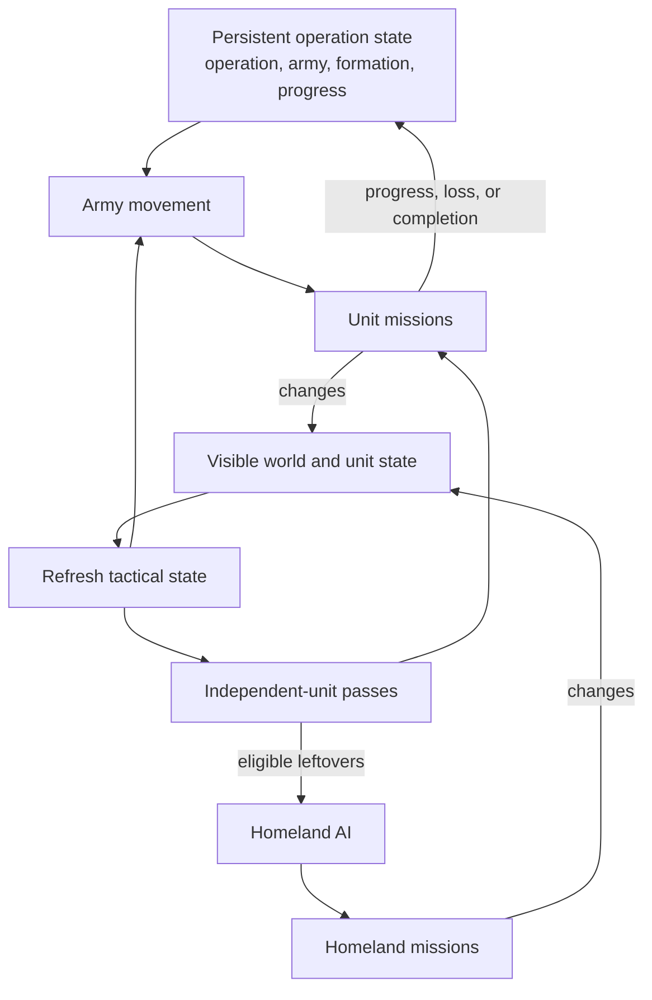

# Unit AI: Military Tactics

**Military tactics** turns persistent operation state and the visible map into unit missions for the current turn. It moves operation armies first, assigns local combat and support to **independent units**, then passes eligible leftovers to Homeland AI. An independent unit is a movable, unprocessed combat-capable unit with no Army ID. [Military campaign](military-campaign.md) owns campaign creation and targets; [military organization](military-organization.md) owns armies, slots, recruitment, and release.

The relevant code is in `civ5-dll/CvGameCoreDLL_Expansion2`, primarily `CvTacticalAI.cpp`, `CvTacticalAnalysisMap.cpp`, `CvAIOperation.cpp`, `CvHomelandAI.cpp`, and `CvUnit.cpp`.

## Persistent inputs and current-turn state

An **operation target** is the persistent campaign destination. An **army goal** is the army's current movement waypoint, normally set from that target. A **muster point** is the persistent assembly plot used while the army recruits or gathers. Tactical AI reads these values and computes current-turn state from visible information.

| Persistent campaign input | Tactical use |
| --- | --- |
| Operation target and army goal | Moving armies use the goal as their waypoint. Retargeting replaces both values. |
| Muster point | Recruiting and gathering armies position around it. |
| Formation and army stage | Determines which members move and whether they gather or advance. |



Army and independent-unit missions update the visible world and persistent operation progress. Homeland AI assigns follow-up missions to eligible leftovers.

## Tactical turn order

`CvTacticalAI::Update` follows this sequence:

1. Refresh visibility, **tactical targets**, and expired focus areas.
2. Recruit current-turn units. Army members receive operation movement handling; eligible unassigned units enter the independent pool.
3. Move operation armies, process zone combat and reinforcement, then run global priorities and review.
4. Pass remaining eligible units to Homeland AI.

A tactical target is a plot worth acting on this turn. The refresh records its type and dominance zone so a zone pass can select its own targets while global passes sweep types across the map.

| Tactical-target type | Examples |
| --- | --- |
| Enemy | City, combat unit, high- or low-priority civilian, land or sea trade unit, citadel, blockade point |
| Opportunity | Barbarian camp, goody hut, improvement, or resource improvement to pillage |
| Friendly | City, defensive bastion, or improvement to hold or defend |

## Operation army movement

`PlotOperationalArmyMoves` calls each operation's `DoTurn`. Normal land, naval, and combined armies use `PlotArmyMovesCombat`; escorted civilian armies follow the escort path. Tactical AI positions members individually around the waypoint.

| Army stage | Waypoint |
| --- | --- |
| Recruiting or gathering | Muster point |
| Moving | Army goal |

`PlotArmyMovesCombat` directly sets `AI_ABORT_LOST_PATH` when `ComputeTargetPlotForThisTurn` returns no step path. Nearby enemy contact can hold the advance at the army's center of mass for the turn while healthy members take an opportunity fight with suitable independent support. Contact movement and normal formation positioning use reachable-plot and danger checks. A hostile local zone can make the contact fight too dangerous.

## Dominance zones

A **dominance zone** is a tactical-map region that combines territory, nearby military strength, and a current combat assessment. Each player builds the map from its own perspective, lazily and at most once per game turn when Tactical AI needs it.

Every revealed plot within five plots of its nearest city joins that city’s land or water zone. Cityless plots form **wilderness zones**, grouped by connected land or water areas. Zone construction also merges across small lakes and islands: neighboring plots join when they share an area or either connected area has fewer than four tiles. All unrevealed plots share one unknown zone.

| Zone | Territory |
| --- | --- |
| City zone owned by the player's team | Friendly |
| City zone whose team is at war with the player | Enemy |
| Other city zone | Neutral |
| Wilderness zone | Neutral |
| Unknown zone | None |

Zones accumulate melee, ranged, naval, and naval-ranged strength. The unit owner's diplomatic side determines its contribution.

| Unit owner | Zone side |
| --- | --- |
| Team at war with the map's player | Enemy |
| Map player's team | Friendly |
| City-state ally on that city-state's map | Friendly |
| Major civilization at war with exactly the same players | Friendly |
| Other player | Neutral, tracked separately from dominance |
| Barbarian | Ignored |

Army members contribute like other combat units. Civilians do not contribute, and the zone city adds its strength to its side's ranged total.

```text
city contribution = city strength value × remaining hit points / maximum hit points

unit contribution = base attack or ranged strength × (100 + modifiers) / 100
  modifiers, additive:
    −50  embarked, not visible, or wrong domain for the zone
    +50  range or base moves above 2
    +50  within three plots of the zone city
   +100  standing in an owned citadel

overall strength = melee × 4/3 + ranged + naval + naval ranged
```

The unseen-unit modifier keeps a known but currently unseen enemy at half strength. The dominance margin, `AI_TACTICAL_MAP_DOMINANCE_PERCENTAGE`, is 70: the game database sets this value, overriding the compiled fallback of 40.

```text
friendly dominant when enemy strength is zero and at least one friendly unit exists
friendly dominant when round(100 × friendly / max(1, enemy)) > 100 + margin + (30 in enemy territory)
enemy dominant when round(100 × enemy / max(1, friendly)) > 100 + margin
even otherwise
```

No strength on either side yields no units visible. One enemy unit against at most one friendly unit yields even. The additional 30 in enemy territory accounts for unseen defenders. The friendly test clamps the margin to at least 10 and the enemy test clamps it to at most 90.

## Postures and local combat

A **posture** is a current-turn zone strategy that orders its local attacks and sets the combat search's acceptable risk. Territory, overall dominance, ranged dominance, melee balance, and city danger select it during every refresh. Water zones use naval strengths.

| Territory | Dominance and local condition | Posture |
| --- | --- | --- |
| Wilderness | Any | Exploit flanks |
| Enemy | City in danger of falling | Surgical city strike |
| Enemy | Enemy dominant, or ranged-heavy force facing much stronger enemy melee | Withdraw |
| Enemy | Friendly dominant | Steamroll |
| Enemy | Even, friendly ranged dominant, and enemy melee stronger | Attrition |
| Enemy | Even, friendly ranged dominant, and enemy melee no stronger | Steamroll |
| Enemy | Other | Attrition or exploit flanks according to ranged dominance |
| Neutral | Enemy dominant with friendly ranged dominance | Attrition or exploit flanks according to enemy melee strength |
| Neutral | Enemy dominant without friendly ranged dominance | Withdraw |
| Neutral | Other | Attrition with friendly ranged dominance, otherwise exploit flanks |
| Friendly | Enemy dominant | Hedgehog |
| Friendly | Other | Counterattack |

| Posture | Zone behavior | Aggression |
| --- | --- | --- |
| Withdraw | Retreat toward the safest neighboring zone without attacks. | None |
| Hedgehog | Attack units and pull reinforcements before the normal pass. | Low |
| Attrition | Attack units. | Low |
| Exploit flanks | Attack units, then capture an undefended city when available. | Medium |
| Counterattack | Attack units. | Medium |
| Surgical city strike | Capture cities before attacking remaining units. | Medium |
| Steamroll | Attack units, then capture cities. | High |

```text
low aggression:    damage dealt × 0.7, hit-point floor 70
medium aggression: damage dealt × 1.1, hit-point floor 40
high aggression:   damage dealt × 2.3, hit-point floor 20
```

The combat position search rejects a non-killing attack when weighted damage dealt is below damage received and the attacker would finish below its posture's hit-point floor. It also rejects a near-fatal melee attack when the attacker takes damage and has a safe reachable plot available, except at `AL_BRAVEHEART`. Reachability, danger, support, stacking, and remaining movement constrain every assignment.

Postures direct independent units. Army members use fixed medium aggression for contact fights. An army still affects the zone's strength totals, and an enemy-dominated city zone at its destination can reject an unsafe contact fight. Tactical AI recomputes the posture from current-turn state at every refresh.

Neighboring zones refine the initial posture: a water zone changes steamroll to exploit flanks when an adjacent enemy-dominated land zone outranges its naval ranged strength. A zone outside friendly territory changes to withdraw when a same-domain friendly neighbor is enemy-dominated and its city is not already about to fall.

## Independent units and priorities

Routine Tactical recruitment accepts movable, unprocessed combat, ranged, air, and combat-support units with no Army ID. It excludes delayed-death units, explorers, carrier-role ships, and nuclear-role units. Combat-ready aircraft enter unless Tactical AI leaves them for Homeland rebasing. Tactical AI does not process human units, while a separate Homeland pass handles their automated units.

For a normal civilization, `ProcessDominanceZones` gives earlier passes the first claim on units and targets.

| Priority | Main work |
| --- | --- |
| Global high | Heal frontline units, move operation armies, urgent garrison moves, and sorties. |
| Zone combat | Consider emergency purchase, then apply the zone posture to local targets. |
| Reinforcement | Move suitable independent units toward zones needing strength. |
| Global middle | Air patrol, goody and camp capture, civilian attacks, bastions, safety, healing, pillage, trade plunder, and blockade. |
| Global low | Guard improvements, escort embarked units, and move exposed remaining units. |
| Review | Try a final safety move and leave eligible units for Homeland AI. |

Zone combat processes zones in descending **zone value**. The value combines the city’s economic value, when that city can access the zone area, relative to the player's best city, then applies these multipliers:

| Factor | Multiplier |
| --- | --- |
| Focus-area city | ×3 |
| Visible city, with damage | ×2, then up to ×10 more |
| Operation target or preferred attack target | ×2 |
| Land zone | ×3 |
| Enemy dominance in friendly territory | ×8 |
| Friendly dominance in enemy territory | ×8 |
| Even dominance with a real fight in friendly or enemy territory | ×4 |
| Enemy territory while winning every war | ×4 |
| Friendly territory while losing | ×4 |

The base value is `1 + square root of the zone city's economic value as a percentage of the player's best city`. A city-state whose ally the player fights resets city factors to 1. Barbarians follow their own camp, attack, pillage, roam, and safety order.

Earlier passes claim units and targets first, while an assignment can leave movement for a later pass.

## Homeland handoff

Tactical AI retains a unit only while a later pass can use it. Homeland AI receives a military unit when it remains movable, unprocessed, and has no Army ID. [Operation control state](operation.md#control-state-and-claims) defines the shared claim rules.

| Homeland pass | Remaining military work |
| --- | --- |
| Conservative heal | Preserve wounded units before routine positioning. |
| Aircraft rebase | Move aircraft to a suitable city or carrier. |
| Safety | Move exposed units from danger after civilian role passes. |
| Upgrade and opportunity attack | Upgrade eligible units or take a safe local attack without leaving an essential garrison. |
| Garrison, heal, sentry, and patrol | Fill city needs and position remaining land and naval units. |
| Final review | Continue a valid mission or move idle units toward friendly cities or water. |

The no-Army-ID condition governs routine Homeland recruitment. The upgrade pass has an army-member exception: it temporarily removes the member, upgrades it, then restores the replacement to the original formation slot. [Military organization](military-organization.md#membership-changes-and-release) details that bookkeeping.

## Implementation trace

1. `CvTacticalAI::Update` refreshes targets and recruits units.
2. `CvTacticalAI::ProcessDominanceZones` runs army movement, postures, reinforcement, global priorities, and review.
3. `CvAIOperation::DoTurn` and `Move` consume the persistent army stage and record progress or transitions.
4. Tactical assignment helpers issue individual `CvUnit` missions and record claim state.
5. `CvHomelandAI::RecruitUnits` and `AssignHomelandMoves` claim eligible leftovers.

For cross-system logs, see [operation diagnostics](operation.md#implementation-and-diagnostics).
