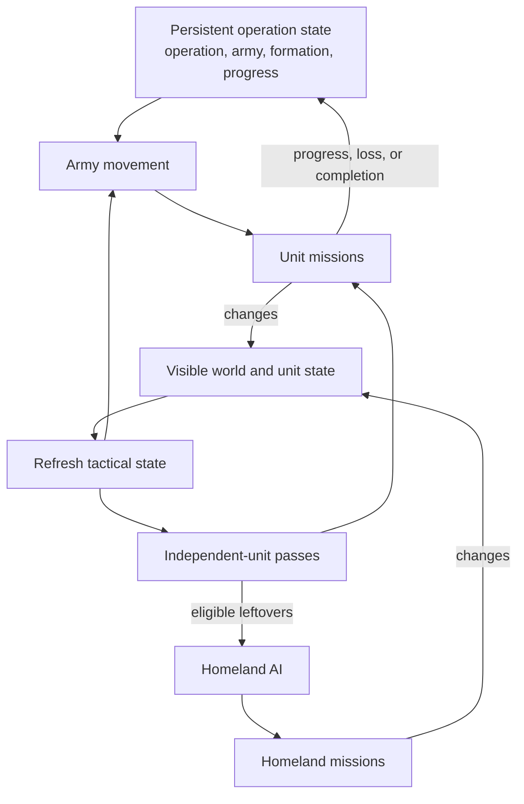

# Unit AI: Military Tactics

**Military tactics** turns persistent operation state and the visible map into unit missions for the current turn. It moves operation armies first, assigns local combat and support to **independent units**, then passes eligible leftovers to Homeland AI. An independent unit is a movable, unprocessed combat-capable unit with no Army ID. Coordinated attacks and positioning are delegated to the [tactical simulation](military-tactical-simulation.md), while air units, barbarians, and a few specialized moves follow their own procedures on this page. [Military campaign](military-campaign.md) owns campaign creation and targets; [military organization](military-organization.md) owns armies, slots, recruitment, and release.

The relevant code is in `civ5-dll/CvGameCoreDLL_Expansion2`, primarily `CvTacticalAI.cpp`, `CvTacticalAnalysisMap.cpp`, `CvAIOperation.cpp`, `CvHomelandAI.cpp`, and `CvUnit.cpp`.

## Persistent inputs and current-turn state

An **operation target** is the persistent campaign destination. An **army goal** is the army's current movement waypoint, normally set from that target. A **muster point** is the persistent assembly plot used while the army recruits or gathers. Tactical AI reads these values and computes current-turn state from visible information.

| Persistent campaign input | Tactical use |
| --- | --- |
| Operation target and army goal | Moving armies use the goal as their waypoint. Retargeting replaces both values. |
| Muster point | Recruiting and gathering armies position around it. |
| Formation and army stage | Determines which members move and whether they gather or advance. |

Army and independent-unit missions update the visible world and persistent operation progress. Homeland AI assigns follow-up missions to eligible leftovers.

## Tactical turn order

`CvTacticalAI::Update` follows this sequence:

1. Refresh visibility, **tactical targets**, and expired focus areas.
2. Recruit current-turn units. Army members receive operation movement handling; eligible unassigned units enter the independent pool.
3. Move operation armies, process zone combat and reinforcement, then run global priorities and review.
4. Pass remaining eligible units to Homeland AI.

A tactical target is a plot worth acting on this turn. The refresh records its type and dominance zone so a zone pass can select its own targets while global passes sweep types across the map.

| Tactical-target type | Examples |
| --- | --- |
| Enemy | City, combat unit, high- or low-priority civilian, land or sea trade unit, citadel, blockade point |
| Opportunity | Barbarian camp, goody hut, improvement, or resource improvement to pillage |
| Friendly | City, defensive bastion, or improvement to hold or defend |

## Operation army movement

`PlotOperationalArmyMoves` calls each operation's `DoTurn`. Normal land, naval, and combined armies use `PlotArmyMovesCombat`; escorted civilian armies follow the escort path. Tactical AI positions members individually around the waypoint.

| Army stage | Waypoint |
| --- | --- |
| Recruiting or gathering | Muster point |
| Moving | Army goal |

`PlotArmyMovesCombat` directly sets `AI_ABORT_LOST_PATH` when `ComputeTargetPlotForThisTurn` returns no step path. Nearby enemy contact can hold the advance at the army's center of mass for the turn while healthy members take an opportunity fight with suitable independent support. Contact movement and normal formation positioning use reachable-plot and danger checks. A hostile local zone can make the contact fight too dangerous.

## Dominance zones

A **dominance zone** is a tactical-map region that combines territory, nearby military strength, and a current combat assessment; [shared concepts](concepts.md#dominance-zones) defines zone construction, the territory and side classifications, and the strength and dominance formulas. Tactical AI is the map's main consumer: every refresh assigns each zone a posture from its current dominance, and zone combat processes zones in descending zone value. The rest of this page covers what Tactical AI does with the zones.

## Postures and local combat

A **posture** is a current-turn zone strategy that orders its local attacks and sets the acceptable risk for the [tactical simulation](military-tactical-simulation.md). Territory, overall dominance, ranged dominance, melee balance, and city danger select it during every refresh. Water zones use naval strengths.

| Territory | Dominance and local condition | Posture |
| --- | --- | --- |
| Wilderness | Any | Exploit flanks |
| Enemy | City in danger of falling | Surgical city strike |
| Enemy | Enemy dominant, or ranged-heavy force facing much stronger enemy melee | Withdraw |
| Enemy | Friendly dominant | Steamroll |
| Enemy | Even, friendly ranged dominant, and enemy melee stronger | Attrition |
| Enemy | Even, friendly ranged dominant, and enemy melee no stronger | Steamroll |
| Enemy | Other | Attrition or exploit flanks according to ranged dominance |
| Neutral | Enemy dominant with friendly ranged dominance | Attrition or exploit flanks according to enemy melee strength |
| Neutral | Enemy dominant without friendly ranged dominance | Withdraw |
| Neutral | Other | Attrition with friendly ranged dominance, otherwise exploit flanks |
| Friendly | Enemy dominant | Hedgehog |
| Friendly | Other | Counterattack |

| Posture | Zone behavior | Aggression |
| --- | --- | --- |
| Withdraw | Retreat toward the safest neighboring zone without attacks. | None |
| Hedgehog | Attack units and pull reinforcements before the normal pass. | Low |
| Attrition | Attack units. | Low |
| Exploit flanks | Attack units, then capture an undefended city when available. | Medium |
| Counterattack | Attack units. | Medium |
| Surgical city strike | Capture cities before attacking remaining units. | Medium |
| Steamroll | Attack units, then capture cities. | High |

The aggression column names the level the zone's attacks pass to the tactical simulation, which turns it into a damage weight, a post-attack hit-point floor, and attack-rejection rules; [entry points and aggression](military-tactical-simulation.md#entry-points-and-aggression) documents the levels and their exact values.

Postures direct independent units. Army members use fixed medium aggression for contact fights. An army still affects the zone's strength totals, and an enemy-dominated city zone at its destination can reject an unsafe contact fight. Tactical AI recomputes the posture from current-turn state at every refresh.

Neighboring zones refine the initial posture: a water zone changes steamroll to exploit flanks when an adjacent enemy-dominated land zone outranges its naval ranged strength. A zone outside friendly territory changes to withdraw when a same-domain friendly neighbor is enemy-dominated and its city is not already about to fall.

## Posture and operation precedence

When an operation's goal conflicts with a zone's posture, the operation wins unconditionally. Recruitment never adds army members to Tactical AI's current-turn unit list, so posture handlers cannot see them; operation army moves run in the global high-priority pass, before any per-zone processing; and an operation abort weighs turn counts, ownership, and army strength, never zone dominance. A withdraw posture therefore cannot recall an army fighting in the same zone.

Three interactions do run from posture to operation-adjacent behavior:

- Reinforcement moves never reinforce into a zone whose posture is withdraw, and never pull a unit out of a zone that is not friendly-dominant unless that zone's posture is withdraw. Embarked units, and land units standing safe inside a city, may be taken regardless.
- Pillage moves skip targets in withdraw zones: a unit retreating from a zone may still pillage on its way out, but nothing moves in just to pillage.
- Withdraw moves skip units recently deployed from a completed operation while they hold more than half their hit points, so a fresh invasion force attacks instead of turning around.

## Independent units and priorities

Routine Tactical recruitment accepts movable, unprocessed combat, ranged, air, and combat-support units with no Army ID. It excludes delayed-death units, explorers, carrier-role ships, and nuclear-role units. Combat-ready aircraft enter unless Tactical AI leaves them for Homeland rebasing ([Air operations](#air-operations)). Tactical AI does not process human units, while a separate Homeland pass handles their automated units.

For a normal civilization, `ProcessDominanceZones` gives earlier passes the first claim on units and targets.

| Priority | Main work |
| --- | --- |
| Global high | Heal frontline units, move operation armies, urgent garrison moves, and sorties. |
| Zone combat | Consider emergency purchase, then apply the zone posture to local targets. |
| Reinforcement | Move suitable independent units toward zones needing strength. |
| Global middle | Air patrol, goody and camp capture, civilian attacks, bastions, safety, healing, pillage, trade plunder, and blockade. |
| Global low | Guard improvements, escort embarked units, and move exposed remaining units. |
| Review | Try a final safety move and leave eligible units for Homeland AI. |

Zone combat processes zones in descending **zone value**. The value combines the city’s economic value, when that city can access the zone area, relative to the player's best city, then applies these multipliers:

| Factor | Multiplier |
| --- | --- |
| Focus-area city | ×3 |
| Visible city, with damage | ×2, then up to ×10 more |
| Operation target or preferred attack target | ×2 |
| Land zone | ×3 |
| Enemy dominance in friendly territory | ×8 |
| Friendly dominance in enemy territory | ×8 |
| Even dominance with a real fight in friendly or enemy territory | ×4 |
| Enemy territory while [winning every war](concepts.md#war-states) | ×4 |
| Friendly territory while [losing every war](concepts.md#war-states) | ×4 |

The base value is `1 + square root of the zone city's economic value as a percentage of the player's best city`. A city-state whose ally the player fights resets city factors to 1. Barbarians skip zones and postures entirely and follow their own ladder ([Barbarian priorities](#barbarian-priorities)).

Earlier passes claim units and targets first, while an assignment can leave movement for a later pass.

## Air operations

Air units split between the two AIs by one question, `CvTacticalAI::ShouldRebase`. Tactical AI recruits a combat-ready air unit only when the answer is no; the rest wait for Homeland AI's rebase pass. A unit should rebase when its base is unsafe — its city is in danger of falling, its carrier is projected to die, or it wants to heal while the base is threatened — or when it has no work: a fighter with no enemy air activity in range, a bomber or missile with no enemy unit target in range, and every air unit at peace.

Recruited air units fight inside zone combat. When an attack on a tactical target begins, air sweeps clear enemy interceptors and air attacks strike, both before the ground units enter the tactical simulation; when the air strikes alone kill the defender, the ground attack never starts. Air units pick their own target near the attack plot:

| Unit | Target valuation |
| --- | --- |
| Missile | Damage to the defending unit, with a bonus for a kill and a smaller one for hitting a unit inside a city. Missiles never strike an ungarrisoned city. |
| Bomber or fighter | Damage, minus three per plot of distance, minus the target's expected air-strike defense damage; halved when an interceptor guards the target. |

Fighters left at home fly air patrol. Each base keeps interceptors up to nearby enemy bombers divided by two plus enemy fighters divided by four, and a lone nearby bomber still draws one interceptor.

Homeland AI moves everything that should rebase. Carriers first attach to their nearest city so they count as bases, then every own city and carrier is scored (`HomelandAIHelpers::ScoreAirBase`): a city in danger of falling, captured within the last three turns, or being razed at low population is unusable, and a usable base earns its zones' border scores, small bonuses for civilization traits that reward stationed air units, 8 per enemy unit target, and 20 per enemy city target within the unit's range. Units that should heal rebase to the lowest-scoring usable city — the quietest place — while combat-ready units rebase toward the highest-scoring base whose fighter and bomber mix stays balanced: `IsGoodUnitMix` admits a type only while its count stays under the other type's count plus three. A base beyond direct rebase range is reached in hops along a rebase step path (`PT_AIR_REBASE`, at most six legs), flying the first leg each turn.

## Barbarian priorities

The barbarian player skips zones and postures entirely: `AssignBarbarianMoves` extracts every target into one global list and works through a single priority ladder.

| Priority | Work |
| --- | --- |
| 1 | Camp defense: garrison and hold every camp. |
| 2 | Theft: a unit adjacent to a city steals from it, or takes over a weakened city-state. |
| 3 | Unit attacks through the tactical simulation at braveheart, the most reckless aggression level, plus capture of vulnerable cities. |
| 4 | Civilian attacks. |
| 5 | Immediate pillage: improved resources first, then other improvements. |
| 6 | Trade-route plunder, land then sea. |
| 7 | Roaming toward the best target in range. |
| 8 | Safety, last: a barbarian that reaches this pass did not attack this turn, so it always flees. |

A camp's defender never leaves. A ranged defender shoots from the camp and stays put; a melee defender may take an adjacent attack, or grab an adjacent undefended civilian, only when it can return to the camp in the same turn, and it upgrades in place when eligible. An empty camp pulls the nearest available land unit within five turns of travel back to garrison duty.

Roaming ranges come from the game handicap: the `BarbarianLandTargetRange` and `BarbarianSeaTargetRange` columns bound how far land and sea units look for prey. A land unit walks into an undefended civilian or improvement and pillages, but only approaches a combat target without lingering next to it; a unit with movement left after roaming stays unprocessed so a later pass can still use it — hit and run. Sea units roam the same way and never pillage. A captured civilian walks home toward a camp, searching for a destination up to 23 turns away.

## Specialized execution

Three kinds of moves bypass or extend the tactical simulation with their own procedures.

### Amphibious landings

`ExecuteLandingOperation` puts embarked units ashore around a coastal target — it runs after a city-capture attack for embarked units still at sea near the city. It is a greedy unit-to-plot assignment rather than a simulated position search. Every unit scores every coastal plot it can reach this turn by its hit points minus the plot's danger, minus ten per plot of distance from the target; ranged units prefer hills and may land on another landmass while the target stays in range, melee units must land on the target's landmass, and a net-positive attack on an enemy plot outranks any plain landing. Clustering bonuses — ten points when another candidate plot or a friendly unit is adjacent — concentrate the landing. Units then claim plots in descending score, discarding choices that conflict with a claimed plot or unit.

### Paradrops

Paradrops are opportunistic, not planned. When an immediate pillage pass targets an enemy citadel or improved resource, paratroopers within striking distance are tried before ground units; no other pass drops units, and the tactical simulation has no concept of a drop, so paradrops never appear in simulated attacks.

### Support units

Great generals, admirals, and siege towers never enter the tactical simulation. After a combat plan wins, a second search interleaves their moves before each attack so an aura arrives exactly when the attack it boosts is made; [support placement](military-tactical-simulation.md#support-placement) documents the scoring.

## Homeland handoff

Tactical AI retains a unit only while a later pass can use it. Homeland AI receives a military unit when it remains movable, unprocessed, and has no Army ID. [Operation control state](operation.md#control-state-and-claims) defines the shared claim rules.

| Homeland pass | Remaining military work |
| --- | --- |
| Conservative heal | Preserve wounded units before routine positioning. |
| Aircraft rebase | Move aircraft to a suitable city or carrier. |
| Safety | Move exposed units from danger after civilian role passes. |
| Upgrade and opportunity attack | Upgrade eligible units or take a safe local attack without leaving an essential garrison. |
| Garrison, heal, sentry, and patrol | Fill city needs and position remaining land and naval units. |
| Final review | Continue a valid mission or move idle units toward friendly cities or water. |

The no-Army-ID condition governs routine Homeland recruitment. The upgrade pass has an army-member exception: it temporarily removes the member, upgrades it, then restores the replacement to the original formation slot. [Military organization](military-organization.md#membership-changes-and-release) details that bookkeeping.

## Implementation trace

1. `CvTacticalAI::Update` refreshes targets and recruits units.
2. `CvTacticalAI::ProcessDominanceZones` runs army movement, postures, reinforcement, global priorities, and review.
3. `CvAIOperation::DoTurn` and `Move` consume the persistent army stage and record progress or transitions.
4. Tactical assignment helpers issue individual `CvUnit` missions and record claim state.
5. `CvHomelandAI::RecruitUnits` and `AssignHomelandMoves` claim eligible leftovers.

For cross-system logs, see [operation diagnostics](operation.md#implementation-and-diagnostics).
