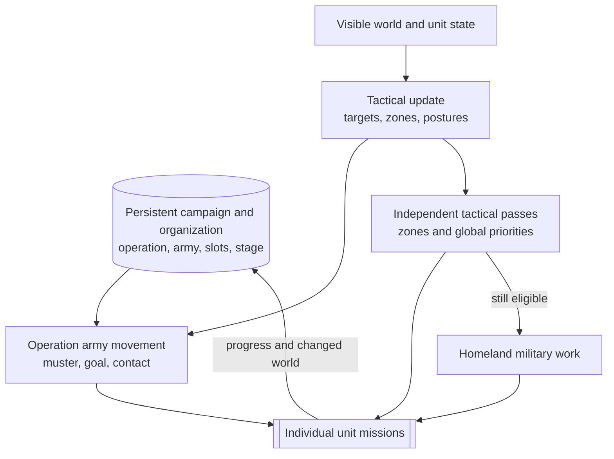

# Unit AI: Military Tactics

Military tactics turns persistent campaign state and the current visible map into unit missions for this turn. Tactical AI moves operation armies first, then assigns local combat and support work to independent units. Homeland AI receives eligible military units left over.

This page covers per-turn control. [Military campaign](military-campaign.md) explains why operations start and where they go. [Military organization](military-organization.md) explains armies, formation slots, recruitment, and mustering. [Military unit operation](military-unit-operation.md) is the overview of all three layers.

The relevant code is in `civ5-dll/CvGameCoreDLL_Expansion2`, primarily `CvTacticalAI.cpp`, `CvTacticalAnalysisMap.cpp`, `CvAIOperation.cpp`, `CvHomelandAI.cpp`, and `CvUnit.cpp`.

## Persistent state and local decisions

An operation target is not a tactical target. The operation target, muster point, army goal, formation, and stage survive across turns. Tactical targets, dominance zones, postures, and current-turn unit lists are refreshed from the visible map.

A zone can change how an army handles nearby contact or where an independent unit moves. It does not replace the operation's persistent target.

## Tactical turn order

`CvTacticalAI::Update` follows a stable sequence:

1. Refresh visibility, tactical targets, and expired focus areas.
2. Recruit current-turn units. Army members are tagged for operation movement instead of entering the independent pool.
3. Move operation armies, then process zone combat, reinforcement, global priorities, and the final review.
4. Review remaining tactical units, then pass eligible leftovers to Homeland AI.

The tactical map refresh builds zones, estimates local strength, chooses postures, and prioritizes the zones. These are current-turn observations, not another form of campaign state.

## Operation army movement

`PlotOperationalArmyMoves` calls each operation's `DoTurn`. Normal land, naval, and combined armies use `PlotArmyMovesCombat`; escorted civilian armies use the escort path. The operation provides a waypoint, then Tactical AI positions individual members rather than issuing one indivisible group order.

| Army stage | Waypoint |
| --- | --- |
| Recruiting or gathering | The operation's muster point |
| Moving | The army's current goal plot |

Before formation positioning, Tactical AI checks for nearby enemy contact. Healthy army members can take an opportunity fight, with nearby independent units helping when suitable. Contact can hold the planned advance at the army's center of mass for the turn, and hostile local dominance can make the fight too dangerous. Remaining members still use ordinary reachability and danger checks while moving around the waypoint.

The operation records the movement result for its persistent lifecycle. Recruitment, removal, and formation-strength rules belong to [military organization](military-organization.md#recruitment-and-stages).

## Independent units, zones, and postures

Ordinary tactical recruitment admits movable, unprocessed combat, ranged, air, and combat-support units that do not belong to an army. It excludes explorers, carrier-role ships, nuclear-role units, and automated human units from the normal pool. Combat-ready aircraft enter unless Tactical AI leaves them for Homeland rebasing. Army members are tagged for operation movement instead of entering this pool.

Dominance zones group nearby revealed plots around a city or local area. Each zone records territory, nearby friendly and enemy strength, and a posture. Neighboring zones can influence that posture when a threatened area needs support or an adjacent force makes aggression unsafe.

| Posture | Local intent |
| --- | --- |
| Withdraw | Leave exposed ground and preserve units. |
| Hedgehog | Hold a defensive concentration and accept low-risk attacks. |
| Attrition | Prefer lower-risk attacks against enemy units. |
| Exploit flanks | Concentrate enough force to finish vulnerable units. |
| Steamroll | Press attacks against units and then the city. |
| Surgical city strike | Try to capture the city first. |
| Counterattack | Concentrate fire in a threatened friendly zone. |

The posture selects a family of local behavior, not one fixed mission. Reachable plots, expected damage, danger, support, stacking, movement left, and requested aggression still constrain each assignment.

## Priority and fallthrough

For a normal civilization, `ProcessDominanceZones` gives earlier work the first claim:

| Priority | Main work |
| --- | --- |
| Global high | Heal frontline units, move operation armies, and handle urgent garrison moves and sorties. |
| Zone combat | Consider an emergency purchase, then run the zone posture against its current targets. |
| Reinforcement | Move suitable independent units toward zones that need more strength. |
| Global middle | Handle air patrol, civilian attacks, bastions, safety, healing, pillage, trade-route plunder, and blockade. |
| Global low | Guard improvements, escort embarked units, and move exposed remaining units. |
| Review | Review remaining tactical units, try a final safety move, and leave eligible leftovers for Homeland AI. |

Earlier passes have first claim, but an assignment can leave movement for a later pass. The shared [control state](unit-operation.md#control-state) defines when a unit can fall through to Homeland AI. Barbarians use a separate camp, attack, pillage, roam, and safety order rather than the normal city-zone postures.

## Missions and Homeland military work

Tactical routines select usable units and a target, search reachable positions and attack combinations, then issue unit-level missions. A mission can move, attack, capture, pillage, heal, use a power, hold position, or move to safety. If combat or newly revealed information invalidates the planned sequence, the caller can search again with the surviving units.

Tactical AI retains a unit only while it can still use it for a later pass. Homeland AI receives a military unit only when it remains movable and unprocessed and has no Army ID. See [unit operation control state](unit-operation.md#control-state) for the shared claim rules.

| Homeland pass | Remaining military work |
| --- | --- |
| Conservative heal | Preserve wounded units before routine positioning. |
| Aircraft rebase | Move aircraft withheld from Tactical AI to a better city or carrier. |
| Safety | Move exposed units out of danger after civilian role passes. |
| Upgrade and opportunity attack | Modernize eligible units or take a safe local attack without abandoning an essential garrison. |
| Garrison, heal, sentry, and patrol | Fill city needs and position remaining land and naval units. |
| Final review | Continue a valid mission or return idle units toward friendly cities or waters where possible. |

Homeland AI does not pull a unit from an army or create a persistent campaign for a leftover unit. It closes gaps in the current turn after Tactical AI has made the stronger claims.

## Implementation trace

1. `CvTacticalAI::Update` refreshes targets and recruits units.
2. `CvTacticalAI::ProcessDominanceZones` runs army movement, zone postures, reinforcement, global priorities, and review.
3. `CvAIOperation::DoTurn` and `Move` consume the persistent army stage and write back progress or transitions.
4. Tactical assignment helpers push individual `CvUnit` missions and record claim state.
5. `CvHomelandAI::RecruitUnits` and `AssignHomelandMoves` claim eligible leftovers.

For cross-system logs, see [reading operation logs](unit-operation.md#reading-operation-logs).
