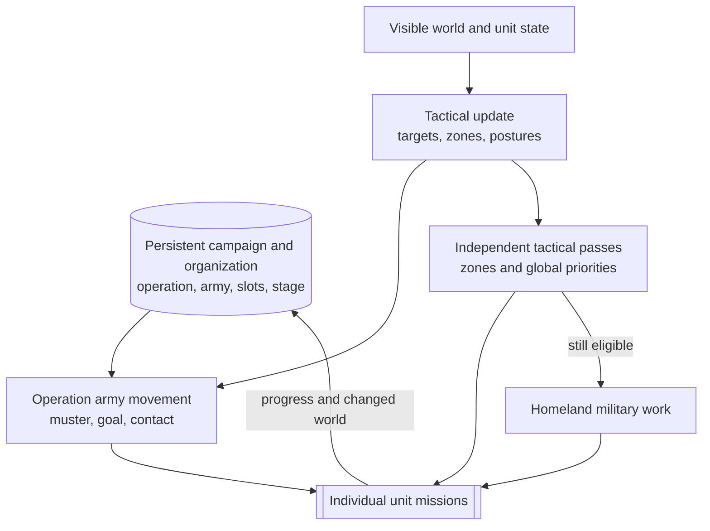
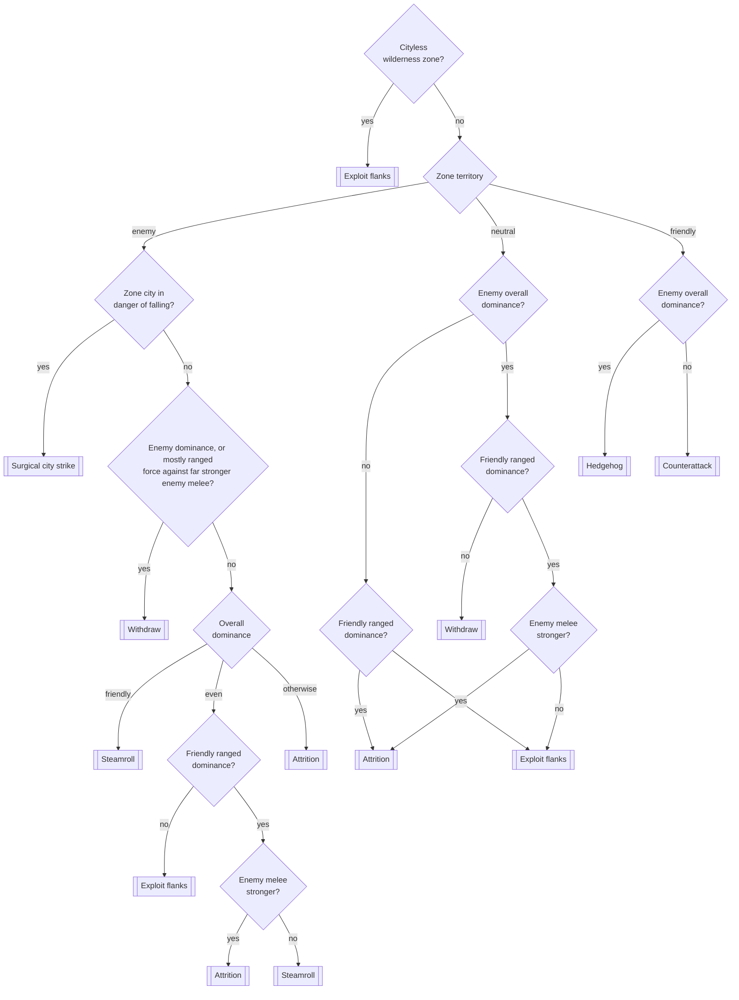
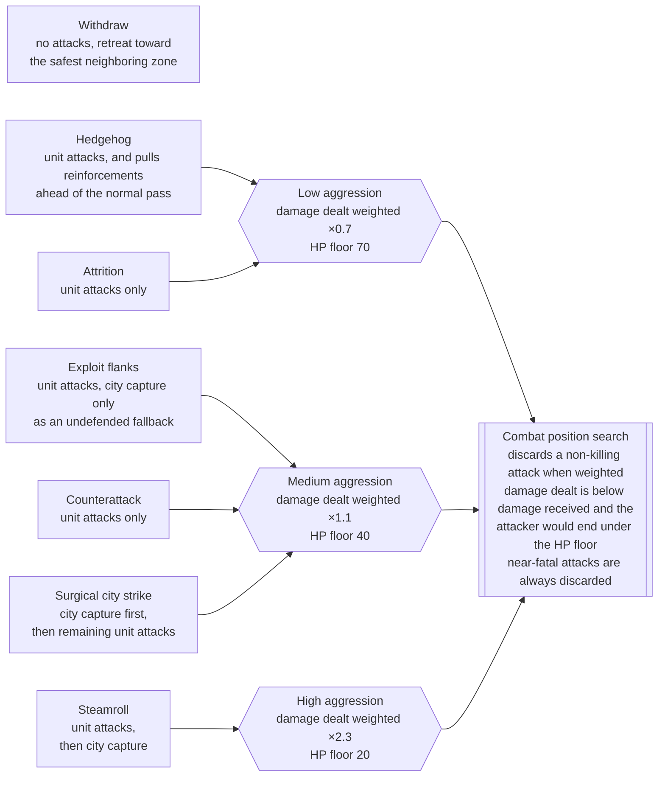
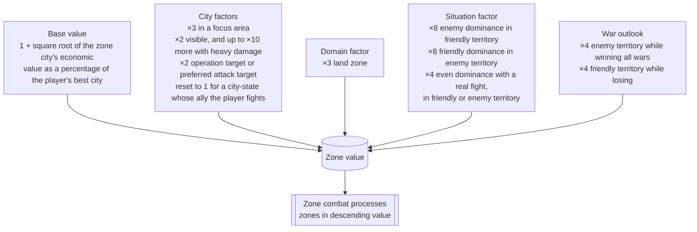

# Unit AI: Military Tactics

Military tactics turns persistent campaign state and the current visible map into unit missions for this turn. Tactical AI moves operation armies first, then assigns local combat and support work to independent units. Homeland AI receives eligible military units left over.

This page covers per-turn control. [Military campaign](military-campaign.md) explains why operations start and where they go. [Military organization](military-organization.md) explains armies, formation slots, recruitment, and mustering. [Military unit operation](military-unit-operation.md) is the overview of all three layers.

The relevant code is in `civ5-dll/CvGameCoreDLL_Expansion2`, primarily `CvTacticalAI.cpp`, `CvTacticalAnalysisMap.cpp`, `CvAIOperation.cpp`, `CvHomelandAI.cpp`, and `CvUnit.cpp`.

## Persistent state and local decisions

An operation target is the plot a campaign stores as its lasting destination, normally an enemy or friendly city plot or the water beside a coastal one. It survives across turns together with the muster point, army goal, formation, and stage, while Tactical AI recomputes its own targets, zones, postures, and unit lists from the visible map each turn. From this page's perspective, the operation target is read-only input with a fixed set of possible events:

| Operation target event | Effect on tactics |
| --- | --- |
| Operation initialization | The army goal is set to the target, so a moving army walks toward it. Recruiting and gathering armies aim at the muster point instead. |
| Retargeting | The campaign layer replaces the target and army goal together, never the muster point, and the army simply follows the new waypoint next turn. |
| Target invalidated | An ownership change or a missing replacement aborts the operation and releases its units back to the tactical pool. |
| Deployment range reached | The operation completes, except for never-ending carrier groups that keep holding their area. |

[Military campaign](military-campaign.md) owns each family's target choice and the retargeting rules; Tactical AI never changes an operation target itself.



A zone can change how an army handles nearby contact or where an independent unit moves. It does not replace the operation's persistent target.

## Tactical turn order

`CvTacticalAI::Update` follows a stable sequence:

1. Refresh visibility, tactical targets, and expired focus areas.
2. Recruit current-turn units. Army members are tagged for operation movement instead of entering the independent pool.
3. Move operation armies, then process zone combat, reinforcement, global priorities, and the final review.
4. Review remaining tactical units, then pass eligible leftovers to Homeland AI.

The tactical map refresh builds zones, estimates local strength, chooses postures, and prioritizes the zones. These are current-turn observations, not another form of campaign state.

## Operation army movement

`PlotOperationalArmyMoves` calls each operation's `DoTurn`. Normal land, naval, and combined armies use `PlotArmyMovesCombat`; escorted civilian armies use the escort path. The operation provides a waypoint, then Tactical AI positions individual members rather than issuing one indivisible group order.

| Army stage | Waypoint |
| --- | --- |
| Recruiting or gathering | The operation's muster point |
| Moving | The army's current goal plot |

Before formation positioning, Tactical AI checks for nearby enemy contact. Healthy army members can take an opportunity fight, with nearby independent units helping when suitable. Contact can hold the planned advance at the army's center of mass for the turn, and hostile local dominance can make the fight too dangerous. Remaining members still use ordinary reachability and danger checks while moving around the waypoint.

The operation records the movement result for its persistent lifecycle. Recruitment, removal, and formation-strength rules belong to [military organization](military-organization.md#recruitment-and-stages).

## Dominance zones

The tactical map divides the world into dominance zones keyed by a city and a domain. Every revealed plot within five plots of its nearest city, regardless of that city's owner, joins the city's zone, and each city can have a land zone and a separate water zone. Plots farther than five plots from any city form cityless wilderness zones, one per connected land or water area, and unrevealed plots share a single unknown zone. Each player builds their own map, so territory is decided from that player's perspective when the zone is created. Each player's map is rebuilt lazily, at most once per game turn when Tactical AI first needs it.

| Zone | Condition | Territory type |
| --- | --- | --- |
| City zone | The zone city belongs to the player's own team | Friendly |
| City zone | The player is at war (NOT planning wars) with the city's team | Enemy |
| City zone | Any other city owner | Neutral |
| Wilderness zone | No city within five plots | Always neutral |
| Unknown zone | Unrevealed plots | None |

A zone accumulates nearby strength from every player's combat units, split into melee, ranged, naval, and naval ranged totals. Units are sorted from the same perspective, and a unit's side is its owner's diplomatic side, not the zone it stands in. The war check wins when both rows could apply.

| Unit owner | Side in the zone totals |
| --- | --- |
| A team the map's player is at war with | Enemy |
| The player's own team | Friendly |
| The city-state's ally, on a city-state's own map | Friendly |
| A major civilization at war with exactly the same set of players | Friendly |
| Any other player | Neutral, a separate total that never enters the dominance comparison |
| Barbarians | Ignored entirely |

Army membership does not matter here: a unit assigned to an operation army still counts toward its side's zone strength like any other combat unit. Civilians do not count, and the zone city's own strength joins its side's ranged total. Each contribution is computed as:

```text
city contribution = city strength value × remaining hit points / maximum hit points

unit contribution = base attack or ranged strength × (100 + modifiers) / 100
  modifiers, additive:
    −50  embarked, not visible, or wrong domain for the zone
    +50  range or base moves above 2
    +50  within three plots of the zone city
   +100  standing in an owned citadel
```

The invisibility modifier is a deliberate small AI cheat: a known but currently unseen enemy unit still counts at half strength. Overall dominance then compares the two sides:

```text
overall strength = melee × 4/3 + ranged + naval + naval ranged

friendly dominant when 100 × friendly / enemy > 100 + margin + (30 in enemy territory)
enemy dominant when 100 × enemy / friendly > 100 + margin
even otherwise
```

The margin is `AI_TACTICAL_MAP_DOMINANCE_PERCENTAGE`, 70 by default, and the extra 30 inside enemy territory allows for unseen defenders. Melee is weighted above ranged because siege units are vulnerable up close. Two special cases bypass the ratio: a zone with no strength on either side reads as no units visible, and a zone where the enemy has one unit and the player at most one reads as even.

Territory and dominance together select the zone's posture, with ranged dominance and the melee balance breaking ties. Water zones make the same decisions with their naval strengths. Posture has no memory: it is recomputed from scratch at every refresh.



A second pass lets neighboring zones adjust the single-zone result. A water zone downgrades steamroll to exploit flanks when an adjacent enemy-dominated land zone out-ranges its naval ranged strength, and a zone outside friendly territory switches to withdraw when a same-domain friendly neighbor is enemy-dominated and its city is not already about to fall, so that support can matter there.

## Independent units and postures

Ordinary tactical recruitment admits movable, unprocessed combat, ranged, air, and combat-support units that do not belong to an army. It excludes units pending delayed death, explorers, carrier-role ships, and nuclear-role units from the normal pool. Human players never reach this recruitment at all: Tactical AI does not process human units, and a separate Homeland pass moves only their automated units. Combat-ready aircraft enter unless Tactical AI leaves them for Homeland rebasing. Army members are tagged for operation movement instead of entering this pool.

A posture decides what the zone attacks, in what order, and how much risk the combat position search accepts for each attack:



The posture selects a family of local behavior, not one fixed mission. Reachable plots, expected damage, danger, support, stacking, and movement left still constrain each assignment.

Zone postures move independent units only, while army members never enter the independent pool, and every posture's attack routine selects units from that pool. An army's contact fights use a fixed medium aggression rather than the local zone's posture. A zone still affects an army in two ways: army members count in the zone's strength totals, and an enemy-dominated city zone at the army's destination can make a contact fight too dangerous to take.

## Priority and fallthrough

The passes below consume tactical targets: single plots worth acting on this turn, collected during the tactical map refresh and typed by what stands there. A target can be an enemy city or combat unit, a high- or low-priority civilian, a land or sea trade unit, a barbarian camp or goody hut, an improvement or resource improvement to pillage, an enemy citadel, a naval blockade point, or something to hold, such as a friendly city, a defensive bastion, or an improvement to defend. Each target records its dominance zone, so zone combat pulls only the targets that belong to it, while the global passes sweep target types across the whole map.

For a normal civilization, `ProcessDominanceZones` gives earlier work the first claim:

| Priority | Main work |
| --- | --- |
| Global high | Heal frontline units, move operation armies, and handle urgent garrison moves and sorties. |
| Zone combat | Consider an emergency purchase, then run the zone posture against its current targets. |
| Reinforcement | Move suitable independent units toward zones that need more strength. |
| Global middle | Handle air patrol, goody and barbarian-camp capture, civilian attacks, bastions, safety, healing, pillage, trade-route plunder, and blockade. |
| Global low | Guard improvements, escort embarked units, and move exposed remaining units. |
| Review | Review remaining tactical units, try a final safety move, and leave eligible leftovers for Homeland AI. |

Within the zone-combat pass, zones are handled highest value first, so the fights that matter get units and emergency purchases before quieter fronts. The map refresh computes each zone's value:



Earlier passes have first claim, but an assignment can leave movement for a later pass. The shared [control state](unit-operation.md#control-state) defines when a unit can fall through to Homeland AI. Barbarians use a separate camp, attack, pillage, roam, and safety order rather than the normal city-zone postures.

## Missions and Homeland military work

Tactical routines select usable units and a target, search reachable positions and attack combinations, then issue unit-level missions. A mission can move, attack, capture, pillage, heal, use a power, hold position, or move to safety. If combat or newly revealed information invalidates the planned sequence, the caller can search again with the surviving units.

Tactical AI retains a unit only while it can still use it for a later pass. Homeland AI receives a military unit only when it remains movable and unprocessed and has no Army ID. See [unit operation control state](unit-operation.md#control-state) for the shared claim rules.

| Homeland pass | Remaining military work |
| --- | --- |
| Conservative heal | Preserve wounded units before routine positioning. |
| Aircraft rebase | Move aircraft withheld from Tactical AI to a better city or carrier. |
| Safety | Move exposed units out of danger after civilian role passes. |
| Upgrade and opportunity attack | Modernize eligible units or take a safe local attack without abandoning an essential garrison. |
| Garrison, heal, sentry, and patrol | Fill city needs and position remaining land and naval units. |
| Final review | Continue a valid mission or return idle units toward friendly cities or waters where possible. |

Homeland AI does not pull a unit from an army or create a persistent campaign for a leftover unit. It closes gaps in the current turn after Tactical AI has made the stronger claims.

## Implementation trace

1. `CvTacticalAI::Update` refreshes targets and recruits units.
2. `CvTacticalAI::ProcessDominanceZones` runs army movement, zone postures, reinforcement, global priorities, and review.
3. `CvAIOperation::DoTurn` and `Move` consume the persistent army stage and write back progress or transitions.
4. Tactical assignment helpers push individual `CvUnit` missions and record claim state.
5. `CvHomelandAI::RecruitUnits` and `AssignHomelandMoves` claim eligible leftovers.

For cross-system logs, see [reading operation logs](unit-operation.md#reading-operation-logs).
