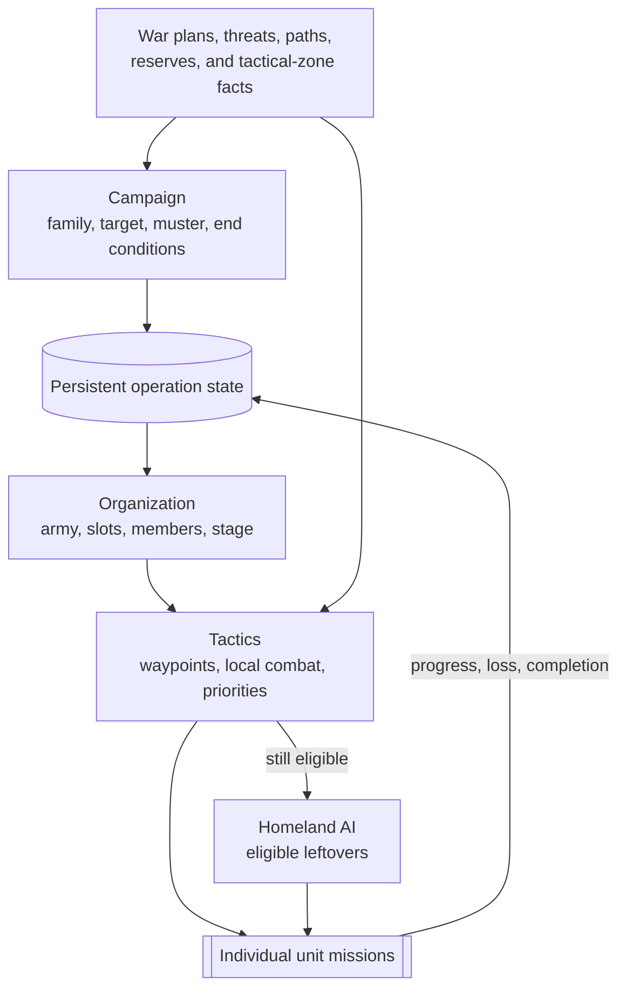

# Unit AI: Military Unit Operation

Military unit operation connects three layers. Campaign logic creates a persistent operation, organization assigns units to its army, and Tactical AI turns that state into missions each turn. The operation preserves a target, muster point, formation, and stage across turns. It does not replace local combat AI.

The shared [unit operation](unit-operation.md#per-turn-lifecycle) page explains the Tactical-to-Homeland handoff for all units. This page traces that military branch through the three layers.

The relevant code is in `civ5-dll/CvGameCoreDLL_Expansion2`, primarily `CvMilitaryAI.cpp`, `CvAIOperation.cpp`, `CvArmyAI.cpp`, `CvTacticalAI.cpp`, `CvTacticalAnalysisMap.cpp`, `CvHomelandAI.cpp`, and `CvUnit.cpp`.

## Military control layers

| Layer | Scope | Detailed guide |
| --- | --- | --- |
| Campaign | Operation families, strategic requests, targets, muster points, and end conditions | [Military campaign](military-campaign.md) |
| Organization | Armies, formation slots, recruitment, mustering, and release | [Military organization](military-organization.md) |
| Tactics | Army movement, local combat, priorities, and the Homeland handoff | [Military tactics](military-tactics.md) |

## Persistent operations

A military operation is not always an attack. City attack, pillage, and nuclear operations support offensive campaigns. Rapid response, city defense, and naval superiority answer threats, while carrier groups maintain a deployment instead of finishing at the first destination. Each operation type has its own initialization and target logic rather than sharing a single score.

Tactical-zone territory and dominance provide several campaign inputs, including defensive demand, pillage eligibility, carrier deployment areas, and nuclear target value. Zone posture remains a per-turn tactical decision and does not replace the persistent operation target.

## Armies and mustering

Built-in military operations create one army, and each unit can have only one current Army ID. [Military organization](military-organization.md#organization-and-control) explains why the stored army-ID list still behaves as a single army.

An operation normally recruits a formation, gathers its assigned units around the current muster point, then moves toward its goal. It begins in the movement stage when no required slots are open, and gathering ends once the assigned units are within tolerance. Campaign progress can also relocate the muster point. During normal Tactical recruitment, army members are routed through operation movement instead of the independent pool, and Homeland AI skips them while their Army ID remains set. They can still receive army-controlled movement, safety moves, and nearby contact fights. [Military organization](military-organization.md#recruitment-and-stages) covers recruitment, stage changes, removal, and release.

## Flavor boundary

Military unit operation has no general flavor-to-action or flavor-to-operation weight map. `FLAVOR_USE_NUKE` directly affects nuclear-operation requests. `FLAVOR_NAVAL`, `FLAVOR_DEFENSE`, and `FLAVOR_OFFENSE` shape force allocation and can therefore affect whether enough units are available. `FLAVOR_OFFENSE` also changes local combat-simulation risk thresholds in Tactical AI. These flavors do not choose a city target or operation approach. [Military campaign](military-campaign.md#flavors-and-tactical-zones) places them beside the actual operation requests.

Per-turn action selection depends on current danger, reachable plots, tactical posture, army state, and role directives.

## Implementation map

| Focus | Main entry points | Guide |
| --- | --- | --- |
| Campaign creation and goals | `CvDiplomacyAI::DoUpdateWarTargets`, `CvMilitaryAI::UpdateAttackTargets`, `CvMilitaryAI::UpdateOperations`, operation `Init` methods | [Military campaign](military-campaign.md) |
| Army membership and mustering | `CvAIOperation::SetUpArmy`, `GrabUnitsFromTheReserves`, `CvArmyAI::AddUnit`, `CvArmyAI::RemoveUnit` | [Military organization](military-organization.md) |
| Per-turn army and unit missions | `CvTacticalAI::Update`, `ProcessDominanceZones`, `PlotArmyMovesCombat`, `CvHomelandAI::AssignHomelandMoves` | [Military tactics](military-tactics.md) |

For logs and claim diagnostics, see [reading operation logs](unit-operation.md#reading-operation-logs).
