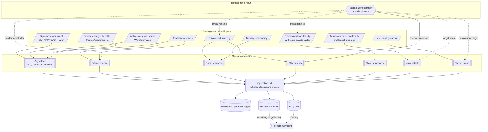
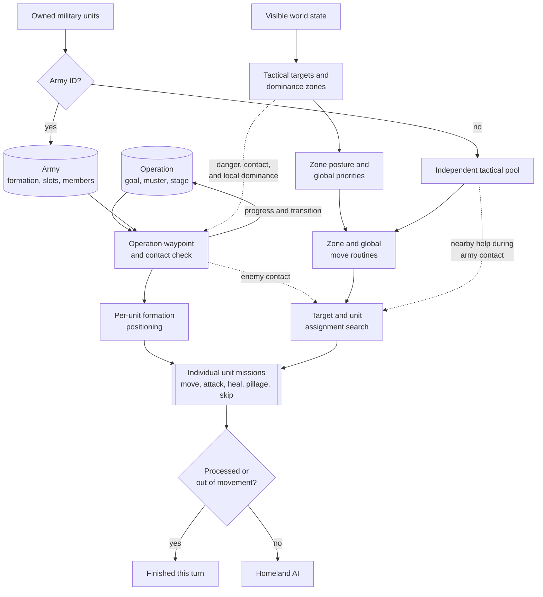
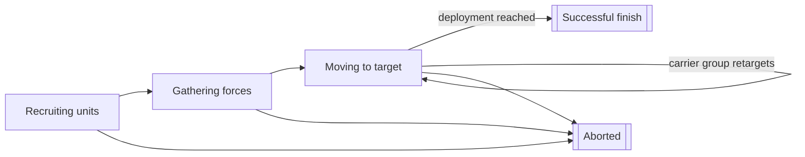

# Unit AI: Military Unit Operation

Military unit operation turns campaign state and local tactical conditions into actions for armies and individual combat units. Persistent `CvAIOperation` and `CvArmyAI` objects keep multi-turn structure, Tactical AI handles the first per-turn claim, and Homeland AI handles eligible military units left over. See [unit operation](unit-operation.md#per-turn-lifecycle) for the shared handoff rules.

The relevant code is in `civ5-dll/CvGameCoreDLL_Expansion2`, primarily `CvMilitaryAI.cpp`, `CvAIOperation.cpp`, `CvArmyAI.cpp`, `CvTacticalAI.cpp`, `CvTacticalAnalysisMap.cpp`, `CvHomelandAI.cpp`, and `CvUnit.cpp`.

## Military control paths

| Path | Durable input | Per-turn owner |
| --- | --- | --- |
| Operation army | Operation type, target, muster point, formation, slots, and army state | `CvAIOperation::DoTurn` with Tactical AI army movement |
| Independent combat unit | Unit capabilities, tactical targets, dominance zone, posture, danger, and reachable plots | Tactical AI |
| Remaining military unit | Homeland targets, local danger, city needs, upgrade eligibility, and role | Homeland AI |
| Barbarian unit | Barbarian targets and camp context | Tactical AI's separate barbarian move order |

Operations and dominance zones are different layers. An operation coordinates a selected army across turns. A dominance zone groups nearby plots around a city or local area and supplies the posture for this turn's combat.

## Flavor boundary

Flavors do not generally select military operations, targets, or army approaches.

- `FLAVOR_USE_NUKE` directly affects the chance of starting a nuclear operation.
- `FLAVOR_NAVAL`, `FLAVOR_DEFENSE`, and `FLAVOR_OFFENSE` shape the recommended land and naval force allocation. They can therefore affect whether an attack has enough ready forces, but they do not choose its target or approach.
- `FLAVOR_OFFENSE` also changes Tactical AI's assignment risk tolerance. That affects per-unit combat choices, not operation creation or campaign target selection.

## Operation type and goal selection

There is no single comparison among all military operation types. Specific triggers select an operation family, which then applies its own target and muster logic.

`Init` stores the operation target and muster, then assigns the army goal. The goal normally begins as the target. Naval and combined attacks use adjacent coastal-water plots for those destinations. Recruiting and gathering point each turn's waypoint toward the muster; movement points it toward the army goal. Dynamic operation classes can later replace both the stored target and army goal.

`CvDiplomacyAI::DoUpdateWarTargets` turns diplomatic approach scores and commitments into war intent, represented by `CIV_APPROACH_WAR`; cooperative-war preparation can force the same intent. During attack preparation, Diplomacy AI calls `CvMilitaryAI::RequestCityAttack`, which can gather an army before war is declared. For an existing war, `CvDiplomacyAI::DoUpdateWarStates` derives `WarStateTypes` from war score, endangered and besieged cities, important-city damage, and tactical dominance. `CvMilitaryAI::UpdateOperations` uses that assessment, threatened-city ranking, and available forces to start or stop defensive operations and request further attacks.

`UpdateAttackTargets` builds concrete enemy-city candidates from land and water paths. It chooses the best land, naval, or combined approach only when that approach has the best score of the three and exceeds 30. It then ranks the candidates by distance, city value, conquest, liberation, and quest factors. `RequestCityAttack` maps the selected army type to the matching city-attack operation. `RequestBullyingOperation` reuses `CITY_ATTACK_LAND` or `CITY_ATTACK_NAVAL`, selected from the muster and target's shared land or water area. The target list is cleared and rebuilt on each Military AI turn.

| Operation family | When it is chosen | How its goal is chosen |
| --- | --- | --- |
| `CITY_ATTACK_LAND`, `CITY_ATTACK_NAVAL`, `CITY_ATTACK_COMBINED` | A scored, reachable enemy-city path supports the corresponding best approach. Bullying reuses the land or naval type. | Land attack stores the selected enemy city. Naval and combined attacks convert the requested city and muster to adjacent coastal-water plots, which become the stored target, muster, and army goal. |
| `PILLAGE_ENEMY` | A wartime offensive request has enough available units for harassment. | The best valid enemy border city and its worked resources supply the target plot; the nearest compatible friendly city supplies muster. |
| `NUKE_ATTACK` | A nuke is available and the launch decision succeeds. | The highest-value eligible enemy city in range is selected, with friendly dominance reducing its value. The nuke unit supplies muster. |
| `RAPID_RESPONSE`, `CITY_DEFENSE` | Threatened land cities request a quick response or, when the city is in an enemy-dominated zone, a longer city-defense force. | `RAPID_RESPONSE` starts from the threatened city at war declaration, or from the city owning a selected nearby enemy plot during later checks. It may then switch to a nearby blocking position. `CITY_DEFENSE` uses the threatened city itself. |
| `NAVAL_SUPERIORITY` | A threatened coastal city has a valid coastal-water target during defense checks. | It starts beside the requested coastal city, then selects the shortest valid water path among the three highest-ranked threatened coastal cities. |
| `CARRIER_GROUP` | An idle, healthy carrier is available. | It initially chooses a suitable deployment zone closest to home. Without one, it stays at the carrier's current plot, or adjacent coastal water when the carrier is in a city. Once moving, it follows the nearest suitable zone or returns to friendly coastal water. |

Tactical zone postures generally direct independent per-turn tactics and do not choose campaign operations. Zone territory and dominance nevertheless cross that boundary: they gate `CITY_DEFENSE`, filter pillage targets to border zones, supply carrier deployment zones, de-emphasize nuke targets already under friendly dominance, contribute to threatened-city ranking, and affect operation-army contact movement. Nearby enemies can stop an army's advance for an opportunity fight, while hostile local dominance can make that fight too dangerous; nearby independent units may help with the contact fight. The threatened-city ranking also uses temporary focus areas and revealed nearby foreign territory weighted by diplomatic opinion. It is distinct from volatile plot danger, and diplomatic warmonger threat is a separate value.

### Target changes and abandonment

An operation does not normally retarget solely because another target receives a better score.

- `CITY_ATTACK_LAND`, `CITY_ATTACK_NAVAL`, `CITY_ATTACK_COMBINED`, `CITY_DEFENSE`, and `NUKE_ATTACK` do not switch for a better score. They retain their stored target until validation or an external check stops the operation.
- `PILLAGE_ENEMY` switches whenever its best valid target plot changes. There is no improvement margin.
- `NAVAL_SUPERIORITY` resets to the shortest reachable target among the three highest-ranked threatened coastal cities. There is no improvement margin.
- `RAPID_RESPONSE` switches only when the new target is more than five plots from the old target.
- `CARRIER_GROUP` follows the nearest valid deployment zone or returns to friendly coastal water, with no score margin. Its never-ending flag exempts it from the general timeout, but it can still abort after losing the carrier or failing to find a retreat target.

Every military operation except `CARRIER_GROUP` aborts after more than 42 elapsed turns. An army disappearing, or a unit removal that leaves it below the formation's required-slot half-strength check, can also abort it. Military AI can stop operation classes externally after forced peace, invalid war legality, an adverse war-state change, or disappearing defensive demand. Stalled army movement only produces an operation-level diagnostic. Individual checkpoint failures remove units, which can indirectly lead to a no-unit or half-strength abort.

## Per-turn operation and tactical execution

The operation owns the army and its campaign state. The army records which unit occupies each formation slot, but it does not issue one indivisible group order. `CvAIOperation::Move` computes this turn's waypoint, then `PlotArmyMovesCombat` turns the army movement into assignments for its member units.

Both paths converge on individual unit assignments and missions. A mission can consume and process the unit, or leave it eligible for another Tactical pass. After Tactical AI finishes, any unit with movement, no army ID, and no processed flag can enter Homeland AI. The army's resulting position then feeds operation progress and the transition to its next persistent stage.

## Persistent operation lifecycle

`CvMilitaryAI::UpdateOperations` starts and stops operations from the diplomatic inputs, city-threat ranking, attack targets, and available forces before unit movement. The operation then owns an army whose units fill formation slots.

| State | Army behavior |
| --- | --- |
| Recruiting units | Reserve units fill compatible slots. Open required slots can request production, commitment, or a final-unit purchase. |
| Gathering forces | Filled units converge at the muster point and wait within the operation's gather tolerance. |
| Moving to target | The operation computes a waypoint toward the army goal and Tactical AI moves the formation. Reaching deployment range normally completes a military operation. |
| Successful or aborted | The operation records the result, releases or marks its units as appropriate, and is removed. |

Ordinary military operations skip the stored `AI_OPERATION_STATE_AT_TARGET` state: reaching deployment range marks the operation successful, and the army is disbanded on the next cleanup. Civilian operations use the at-target state to retry their final mission when needed.

`CvAIOperation::Move` refreshes reserve recruitment when needed, removes units that cannot keep up, verifies the target, and dispatches the army by movement type. Land, naval, and combined military armies use `CvTacticalAI::PlotArmyMovesCombat`. Escort armies use `PlotArmyMovesEscort`, including the [civilian operations](civilian-unit-operation.md#civilian-operations) that pair a mission unit with protection.

The data structure can hold multiple army IDs, but the current movement and transition paths operate on the first army. Formation slots still matter: their primary and secondary `UnitAI` roles control reserve recruitment and requests for missing units.

For target changes, timeout, and abandonment conditions, see [Target changes and abandonment](#target-changes-and-abandonment). Carrier aircraft are not formation members and rebase independently. Nuclear attacks use specialized air-operation recruitment and completion logic.

## Tactical recruitment

`CvTacticalAI::RecruitUnits` resets current move tags and calls `CvUnit::canUseForTacticalAI`. The normal list admits units that can still move and are combat, ranged, or combat support. It excludes delayed-death and processed units, explorers, carrier-role ships, nuclear-role units, and automated human units.

Army members do not enter ordinary tactical selection. They receive the operation move tag and are reached through `PlotOperationalArmyMoves`. Combat-ready aircraft enter the ordinary list unless Tactical AI decides that Homeland AI should rebase them.

## Zones and postures

Tactical AI discovers visible targets, associates them with dominance zones, and applies the zone's posture. The posture selects a family of local combat behavior rather than a single mission.

| Posture | Local intent |
| --- | --- |
| Withdraw | Give up exposed ground and preserve units. |
| Hedgehog | Hold a defensive concentration around the zone. |
| Attrition | Prefer lower-risk attacks against enemy units. |
| Exploit flanks | Concentrate enough force to finish vulnerable units. |
| Steamroll | Press attacks against units and cities. |
| Surgical city strike | Prioritize capturing the city. |
| Counterattack | Concentrate fire on enemy units in a threatened zone. |

Within a zone, combat routines select eligible units and targets, search reachable plots and attack sequences, and execute the chosen assignments as unit missions. Unit capability, expected damage, danger, support, stacking, movement left, and the requested aggression level constrain the search.

## Tactical priority order

| Pass | Main work |
| --- | --- |
| Global high priority | Move badly wounded units out of blocking positions, move operation armies, and handle nearby garrison moves and sorties. |
| Zone combat | Apply each zone posture after allowing an emergency purchase for the zone. |
| Reinforcement | Move suitable units toward zones that need more strength. |
| Global middle priority | Air patrol, goody capture, civilian attacks, bastions, safety, healing, pillage, trade-route plunder, and blockade. |
| Global low priority | Guard improvements, escort embarked units, and move recruited nondefending or embarked units out of danger. |
| Review | Mark the diagnostic move as unassigned, try a last safety move, and leave still-usable units for Homeland AI. |

The first matching routine does not always end a unit's turn. For example, an attack can leave movement, while a completed tactical assignment can deliberately set `TurnProcessed`. The [shared control state](unit-operation.md#control-state) determines whether Homeland AI sees the unit.

## Homeland military work

Homeland AI is the second military controller as well as the civilian controller.

| Pass | Purpose |
| --- | --- |
| Conservative heal | Claims units that should heal before ordinary role work. |
| Aircraft rebase | Moves aircraft that Tactical AI withheld to better cities or carriers. |
| Safety | Moves exposed remaining units before routine military positioning. |
| Upgrade | Ranks and performs eligible upgrades, or requests upgrade savings when gold is short. |
| Opportunity attack | Takes a safe local attack without abandoning an essential land garrison. |
| Garrison and heal | Fills city needs and handles less urgent recovery. |
| Sentry, naval sentry, and patrol | Positions remaining land and sea units for visibility and local defense. |
| Final review | Returns idle land units toward friendly cities and stranded naval units toward home waters where possible. |

This second pass explains why a unit can have no decisive Tactical assignment and still move sensibly. It also means a Tactical action that should end ownership must set the processed state consistently.

## Implementation trace

1. `CvMilitaryAI::DoTurn` refreshes military counts, strategies, war type, and attack targets, then updates operations before unit movement. Diplomacy AI and `CvPlayer::UpdateCityThreatCriteria` provide the war and city-threat inputs.
2. `CvTacticalAI::Update` discovers targets and recruits eligible units.
3. `CvTacticalAI::ProcessDominanceZones` moves operation armies, executes zone postures, and runs global priorities.
4. `CvAIOperation::DoTurn`, `Move`, and the operation's transition method maintain army progress and completion.
5. `CvHomelandAI::AssignHomelandMoves` applies the remaining military passes after the Tactical handoff.

For unit creation and formation gaps, see [military production](military-production.md). For logs and claim diagnostics, see [reading operation logs](unit-operation.md#reading-operation-logs).
