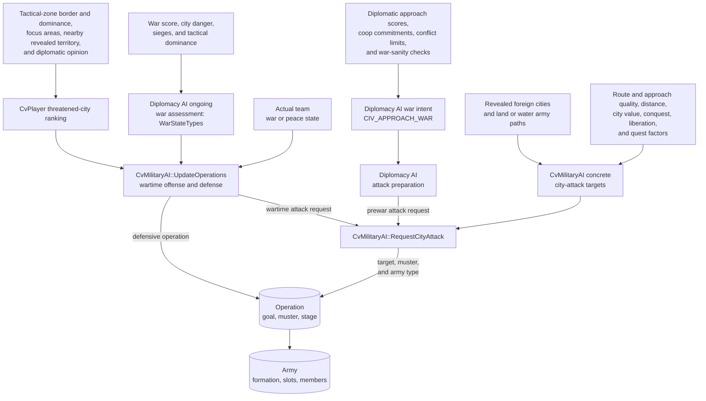
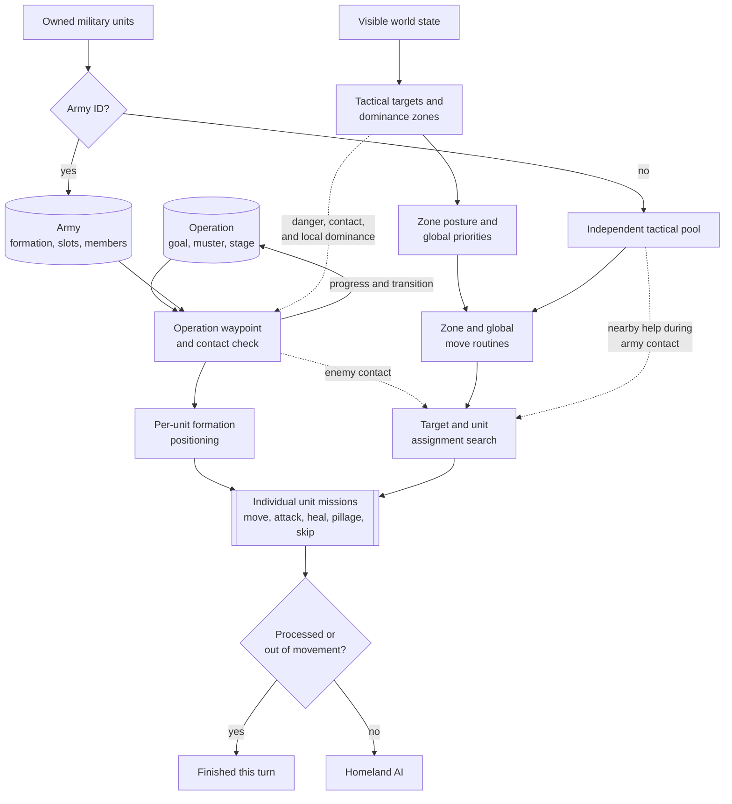
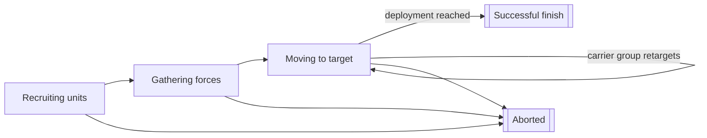

# Unit AI: Military Unit Operation

Military unit operation turns campaign state and local tactical conditions into actions for armies and individual combat units. Persistent `CvAIOperation` and `CvArmyAI` objects keep multi-turn structure, Tactical AI handles the first per-turn claim, and Homeland AI handles eligible military units left over. See [unit operation](unit-operation.md#per-turn-lifecycle) for the shared handoff rules.

The relevant code is in `civ5-dll/CvGameCoreDLL_Expansion2`, primarily `CvMilitaryAI.cpp`, `CvAIOperation.cpp`, `CvArmyAI.cpp`, `CvTacticalAI.cpp`, `CvTacticalAnalysisMap.cpp`, `CvHomelandAI.cpp`, and `CvUnit.cpp`.

## Military control paths

| Path | Durable input | Per-turn owner |
| --- | --- | --- |
| Operation army | Operation type, target, muster point, formation, slots, and army state | `CvAIOperation::DoTurn` with Tactical AI army movement |
| Independent combat unit | Unit capabilities, tactical targets, dominance zone, posture, danger, and reachable plots | Tactical AI |
| Remaining military unit | Homeland targets, local danger, city needs, upgrade eligibility, and role | Homeland AI |
| Barbarian unit | Barbarian targets and camp context | Tactical AI's separate barbarian move order |

Operations and dominance zones are different layers. An operation coordinates a selected army across turns. A dominance zone groups nearby plots around a city or local area and supplies the posture for this turn's combat.

## Flavor boundary

Flavors do not generally select military operations, targets, or army approaches.

- `FLAVOR_USE_NUKE` directly affects the chance of starting a nuclear operation.
- `FLAVOR_NAVAL`, `FLAVOR_DEFENSE`, and `FLAVOR_OFFENSE` shape the recommended land and naval force allocation. They can therefore affect whether an attack has enough ready forces, but they do not choose its target or approach.
- `FLAVOR_OFFENSE` also changes Tactical AI's assignment risk tolerance. That affects per-unit combat choices, not operation creation or campaign target selection.

Ordinary military operations and their targets come from diplomatic and war state, threatened cities, path and approach scoring, reserves, and available units.

## How the layers connect

Diplomacy AI supplies two different decisions. `CvDiplomacyAI::DoUpdateWarTargets` turns diplomatic approach scores and commitments into war intent, represented by `CIV_APPROACH_WAR`; cooperative-war preparation can force the same intent. During attack preparation, Diplomacy AI calls `CvMilitaryAI::RequestCityAttack` to create a prewar operation around one of Military AI's concrete city targets. The operation can gather an army before the declaration.

`WarStateTypes` instead describes how an existing war is going. `CvDiplomacyAI::DoUpdateWarStates` derives it from war score, endangered and besieged cities, important-city damage, and tactical dominance. Once the teams are actually at war, `CvMilitaryAI::UpdateOperations` uses that assessment, the threatened-city ranking, and available forces to start or stop defensive operations and request further city attacks.

The operation chooses the campaign goal and owns the army. The army records which unit occupies each formation slot, but it does not issue one indivisible group order. `CvAIOperation::Move` computes this turn's waypoint, then `PlotArmyMovesCombat` turns the army movement into assignments for its member units.

The city threat value is a ranking used to find threatened friendly cities. `CvPlayer::UpdateCityThreatCriteria` derives it from tactical-zone border scores and dominance, temporary focus areas, and revealed nearby foreign territory weighted by diplomatic opinion. It is not the same as plot danger. `CvDangerPlots` calculates volatile possible-attacker and combat danger, while tactical dominance summarizes local force balance. Diplomatic warmonger threat is a separate diplomacy value and does not select military attack targets.

`CvMilitaryAI::UpdateAttackTargets` generates concrete enemy-city targets from land and water army paths. It filters route feasibility, selects land, naval, or combined approach types, and scores distance, city value, conquest, liberation, and quest factors. `RequestCityAttack` converts the chosen target, muster city, and army type into an operation. The target list is cleared and rebuilt on each Military AI turn.

Zones do not choose the operation's goal or army membership. Their postures drive the parallel path for independent units. They also provide local context to army movement: nearby enemies can stop the advance for an opportunity fight, and hostile local dominance can make that fight too dangerous. That contact fight may include nearby independent units that can help.

Both paths converge on individual unit assignments and missions. A mission can consume and process the unit, or leave it eligible for another Tactical pass. After Tactical AI finishes, any unit with movement, no army ID, and no processed flag can enter Homeland AI. The army's resulting position then feeds operation progress and the transition to its next persistent stage.

## Persistent operation lifecycle

`CvMilitaryAI::UpdateOperations` starts and stops operations from the diplomatic inputs, city-threat ranking, attack targets, and available forces before unit movement. The operation then owns an army whose units fill formation slots.

| State | Army behavior |
| --- | --- |
| Recruiting units | Reserve units fill compatible slots. Open required slots can request production, commitment, or a final-unit purchase. |
| Gathering forces | Filled units converge at the muster point and wait within the operation's gather tolerance. |
| Moving to target | The operation computes a waypoint toward the army goal and Tactical AI moves the formation. Reaching deployment range normally completes a military operation. |
| Successful or aborted | The operation records the result, releases or marks its units as appropriate, and is removed. |

Ordinary military operations skip the stored `AI_OPERATION_STATE_AT_TARGET` state: reaching deployment range marks the operation successful, and the army is disbanded on the next cleanup. Civilian operations use the at-target state to retry their final mission when needed.

`CvAIOperation::Move` refreshes reserve recruitment when needed, removes units that cannot keep up, verifies the target, and dispatches the army by movement type. Land, naval, and combined military armies use `CvTacticalAI::PlotArmyMovesCombat`. Escort armies use `PlotArmyMovesEscort`, including the [civilian operations](civilian-unit-operation.md#civilian-operations) that pair a mission unit with protection.

The data structure can hold multiple army IDs, but the current movement and transition paths operate on the first army. Formation slots still matter: their primary and secondary `UnitAI` roles control reserve recruitment and requests for missing units.

An operation can retarget or abort when its assumptions fail. Common causes include no units, no target or path, a captured target, changed war or diplomatic state, failure to gather, loss of required strength, or the general timeout. Carrier groups are intentionally never-ending and retarget among useful deployment zones. Their aircraft are not formation members and rebase independently. Nuclear attacks use specialized air-operation recruitment and completion logic.

## Tactical recruitment

`CvTacticalAI::RecruitUnits` resets current move tags and calls `CvUnit::canUseForTacticalAI`. The normal list admits units that can still move and are combat, ranged, or combat support. It excludes delayed-death and processed units, explorers, carrier-role ships, nuclear-role units, and automated human units.

Army members do not enter ordinary tactical selection. They receive the operation move tag and are reached through `PlotOperationalArmyMoves`. Combat-ready aircraft enter the ordinary list unless Tactical AI decides that Homeland AI should rebase them.

## Zones and postures

Tactical AI discovers visible targets, associates them with dominance zones, and applies the zone's posture. The posture selects a family of local combat behavior rather than a single mission.

| Posture | Local intent |
| --- | --- |
| Withdraw | Give up exposed ground and preserve units. |
| Hedgehog | Hold a defensive concentration around the zone. |
| Attrition | Prefer lower-risk attacks against enemy units. |
| Exploit flanks | Concentrate enough force to finish vulnerable units. |
| Steamroll | Press attacks against units and cities. |
| Surgical city strike | Prioritize capturing the city. |
| Counterattack | Concentrate fire on enemy units in a threatened zone. |

Within a zone, combat routines select eligible units and targets, search reachable plots and attack sequences, and execute the chosen assignments as unit missions. Unit capability, expected damage, danger, support, stacking, movement left, and the requested aggression level constrain the search.

## Tactical priority order

| Pass | Main work |
| --- | --- |
| Global high priority | Move badly wounded units out of blocking positions, move operation armies, and handle nearby garrison moves and sorties. |
| Zone combat | Apply each zone posture after allowing an emergency purchase for the zone. |
| Reinforcement | Move suitable units toward zones that need more strength. |
| Global middle priority | Air patrol, goody capture, civilian attacks, bastions, safety, healing, pillage, trade-route plunder, and blockade. |
| Global low priority | Guard improvements, escort embarked units, and move recruited nondefending or embarked units out of danger. |
| Review | Mark the diagnostic move as unassigned, try a last safety move, and leave still-usable units for Homeland AI. |

The first matching routine does not always end a unit's turn. For example, an attack can leave movement, while a completed tactical assignment can deliberately set `TurnProcessed`. The [shared control state](unit-operation.md#control-state) determines whether Homeland AI sees the unit.

## Homeland military work

Homeland AI is the second military controller as well as the civilian controller.

| Pass | Purpose |
| --- | --- |
| Conservative heal | Claims units that should heal before ordinary role work. |
| Aircraft rebase | Moves aircraft that Tactical AI withheld to better cities or carriers. |
| Safety | Moves exposed remaining units before routine military positioning. |
| Upgrade | Ranks and performs eligible upgrades, or requests upgrade savings when gold is short. |
| Opportunity attack | Takes a safe local attack without abandoning an essential land garrison. |
| Garrison and heal | Fills city needs and handles less urgent recovery. |
| Sentry, naval sentry, and patrol | Positions remaining land and sea units for visibility and local defense. |
| Final review | Returns idle land units toward friendly cities and stranded naval units toward home waters where possible. |

This second pass explains why a unit can have no decisive Tactical assignment and still move sensibly. It also means a Tactical action that should end ownership must set the processed state consistently.

## Implementation trace

1. `CvMilitaryAI::DoTurn` refreshes military counts, strategies, war type, and attack targets, then updates operations before unit movement. Diplomacy AI and `CvPlayer::UpdateCityThreatCriteria` provide the war and city-threat inputs.
2. `CvTacticalAI::Update` discovers targets and recruits eligible units.
3. `CvTacticalAI::ProcessDominanceZones` moves operation armies, executes zone postures, and runs global priorities.
4. `CvAIOperation::DoTurn`, `Move`, and the operation's transition method maintain army progress and completion.
5. `CvHomelandAI::AssignHomelandMoves` applies the remaining military passes after the Tactical handoff.

For unit creation and formation gaps, see [military production](military-production.md). For logs and claim diagnostics, see [reading operation logs](unit-operation.md#reading-operation-logs).
