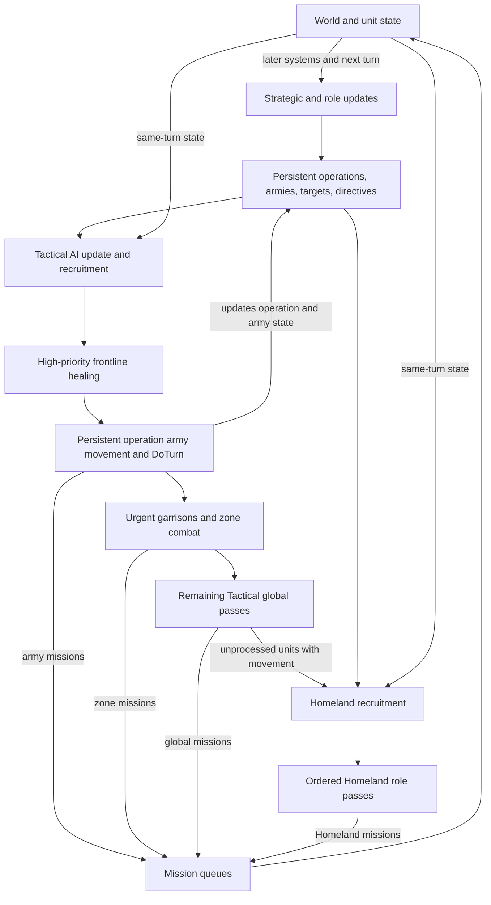

# Unit AI: Operation

**Operation** is the shared per-turn process that turns persistent-operation state, tactical targets, role objectives, and remaining movement into unit missions. A **persistent operation** is a `CvAIOperation` plan that retains an army, formation, muster point, target, and state across turns. **Military operation** applies this process to combat formations, while **civilian operation** applies it to civilian roles. This page defines the shared ownership rules.

The primary implementation is in `civ5-dll/CvGameCoreDLL_Expansion2/CvPlayerAI.cpp`, `CvTacticalAI.cpp`, `CvHomelandAI.cpp`, `CvAIOperation.cpp`, `CvArmyAI.cpp`, and `CvUnit.cpp`.

## Per-turn lifecycle

Persistent operations provide durable context for Tactical work. Tactical and Homeland passes read current world and unit state, issue missions, and pass eligible units to later controllers. Completed missions update the state used by later systems and the next turn.

`CvPlayerAI::AI_unitUpdate` calls Tactical AI before Homeland AI for a normal AI player. Tactical AI refreshes visibility and targets, then recruits combat and support units. Its high-priority pass heals frontline units, advances persistent-operation armies through `CvAIOperation::DoTurn`, and handles urgent garrisons. It then continues through zone combat and its remaining global priorities. Homeland AI rebuilds its own list from units that remain available, refreshes role targets, and runs its ordered civilian and military passes.

`CvAIOperation::DoTurn` updates reserve membership, checkpoint timing, target validity, movement progress, army state, operation state, and abort reason. Completion and cleanup release army IDs and remove obsolete armies or operations, allowing surviving units to enter later ownership paths.

## Control state and claims

| Concept | Definition and effect |
| --- | --- |
| **TurnProcessed** | A per-turn unit flag that prevents later AI controllers from claiming the unit. It can be set after a special action while movement remains. |
| **Move tags** | Tactical and Homeland move categories that record the controller's last claim for diagnostics. Setting a Homeland tag clears the Tactical tag. The tags record current-turn work; operations, army membership, directives, and saved targets hold durable intent. |
| **Army membership** | An army ID and formation slot that bind a unit to persistent-operation movement. Homeland recruitment excludes units whose army ID remains set. |
| **Mission queue** | The unit's executable queue of movement, attack, build, or special missions. A valid unfinished mission can continue in the final review; fallback checks clear a contradictory current-turn queue. |
| **Current-turn lists** | Separate Tactical and Homeland working lists. Each controller removes a unit when it calls `UnitProcessed`. |

Tactical and Homeland AI use the same general claim pattern: filter the current list, score or choose a local action, push missions, and record completed work. A unit neither claimed by an operation nor marked `TurnProcessed` can pass from Tactical AI to Homeland AI with remaining movement.

## Ownership and handoff

| Unit kind | Initial owner | Handoff or later handling |
| --- | --- | --- |
| Persistent operation army member | Persistent operation through Tactical AI | Moves with its army until cleanup releases its army ID. |
| Independent combat, ranged, or combat-support unit | Tactical AI | Homeland AI receives it when Tactical leaves it unprocessed with movement. |
| Explorer | Homeland AI | `CvUnit::canUseForTacticalAI` excludes land and sea explorer roles. |
| Ordinary civilian | Homeland AI | A role action, safety response, or escorted civilian operation supplies its work. |
| Combat-ready aircraft | Tactical AI | Homeland receives aircraft retained for rebasing. |
| Carrier or nuclear operation member | Persistent operation and army movement | Specialized operation logic supplies the target and formation behavior. |
| Automated human unit | Homeland automation | Normal AI operations and ordinary Tactical recruitment leave it to its automation path. |

This **Tactical-to-Homeland handoff** gives Tactical AI the first claim on combat urgency. Homeland AI then handles upgrades, opportunity attacks, garrisoning, healing, sentry work, patrols, aircraft rebasing, civilian roles, and unassigned fallbacks.

## Pass order and fallthrough

Tactical AI gives persistent-operation armies and urgent combat work early claims, then processes dominance zones, reinforcements, opportunistic global work, defensive positioning, and safety. Homeland AI runs specialized role passes in their configured order, moves endangered remaining units before routine military housekeeping, and ends with fallback handling.

The final Homeland review continues a valid queued mission, sends an idle unit toward friendly territory where possible, skips it, or applies stranded naval-unit handling. Per-turn control comes from pass order, eligibility, local scoring, movement, and `TurnProcessed`. Strategy flavors primarily shape upstream demand and force composition. [Military operation](military-operation.md) documents the military flavor effects.

## Implementation and diagnostics

1. `CvPlayerAI::AI_unitUpdate` calls `CvTacticalAI::Update`, then `CvHomelandAI::Update`.
2. `CvTacticalAI::RecruitUnits`, persistent-operation movement, and tactical passes claim army and tactical units.
3. `CvAIOperation::DoTurn` and `Move` advance persistent-operation state and dispatch army movement.
4. `CvHomelandAI::RecruitUnits`, `FindHomelandTargets`, and `AssignHomelandMoves` claim remaining units.
5. `CvTacticalAI::UnitProcessed` or `CvHomelandAI::UnitProcessed` sets the relevant move tag and `TurnProcessed`.
6. `CvUnit` executes the queued missions that change position, movement, health, ownership, and map state.

With AI logging enabled, use `PlayerTacticalAILog.csv` for recruitment, zones, targets, and tactical assignments; `PlayerHomelandAILog.csv` for role passes and fallbacks; and `OperationalAILog.csv` for operation states, armies, targets, transitions, and aborts. Start from the unit's move tag, then inspect its army ID, `TurnProcessed`, remaining movement, and mission queue. For an army member, correlate the same turn in the operational and tactical logs.
