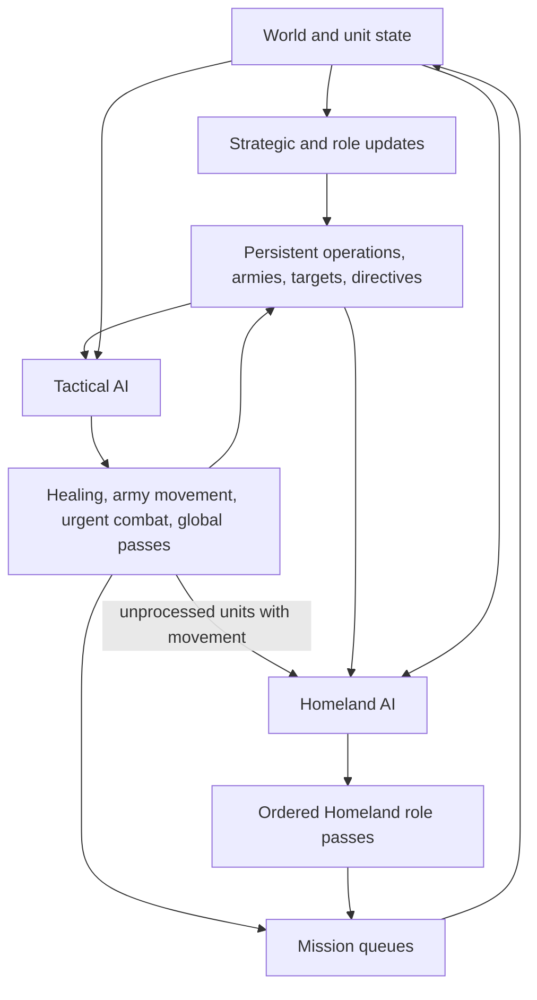
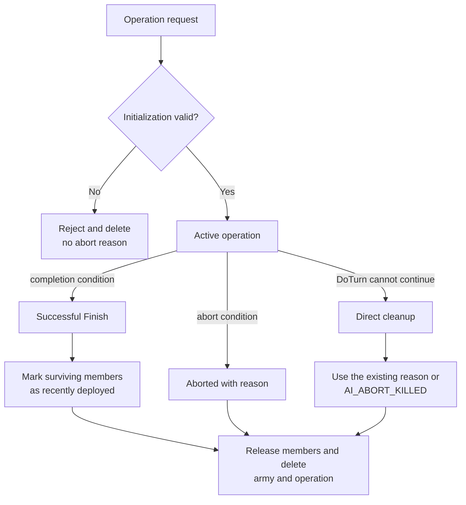

# Unit AI: Operation Lifecycle

The **operation lifecycle** is the shared per-turn process that turns persistent-operation state, Tactical targets, role objectives, and available movement into unit missions. A **persistent operation** is a `CvAIOperation` plan that retains an army, formation, muster point, target, and state across turns. Military and civilian pages describe their own operation behavior. This page is the authority for shared lifecycle, control state, Tactical-to-Homeland handoff, and diagnostics.

The main implementation is in `civ5-dll/CvGameCoreDLL_Expansion2/CvPlayerAI.cpp`, `CvTacticalAI.cpp`, `CvHomelandAI.cpp`, `CvAIOperation.cpp`, `CvArmyAI.cpp`, and `CvUnit.cpp`.

## Operation lifecycle

For a normal AI player, `CvPlayerAI::AI_unitUpdate` runs Tactical AI before Homeland AI. Tactical AI refreshes targets, recruits combat and support units, heals urgent frontline units, advances persistent-operation armies through `CvAIOperation::DoTurn`, and completes its combat priorities. Homeland AI then rebuilds its candidate list from eligible units, refreshes role targets, and runs its ordered passes. The resulting missions change the state seen by later passes and by the next turn.

`CvAIOperation::DoTurn` maintains reserve membership, target validity, movement progress, army and operation state, and abort reason. Cleanup releases Army IDs and removes obsolete armies or operations. See [military organization](military-organization.md) for formation stages and release, and [civilian operation](civilian-operation.md) for civilian-specific ownership.

## Completion, abort, and cleanup

An active operation normally ends by entering **Successful Finish** or **Aborted**. A third path exists when `DoTurn` cannot continue without setting either state. Initialization failure is earlier: an invalid operation is rejected and deleted before it becomes active, so it has no abort reason.

`ShouldAbort` checks operations in the pre-unit terminal sweep and before and after army movement. A terminal state found during `Move` releases its members and is deleted in that Tactical operation-movement pass. An ordinary military operation instead sets Successful Finish after `Move`, so the next pre-unit terminal sweep deletes it. If `DoTurn` returns false without a terminal state, the same Tactical pass deletes it.

After initialization, common abort triggers include:

- The operation exceeds 42 turns. Never-ending carrier groups skip this timeout.
- Target validation cannot keep or replace the current target.
- Tactical movement cannot find a usable path or rejects an unsafe route.
- Member loss removes a critical civilian or carrier, leaves no army, or violates the post-Recruiting formation-strength rule.
- Military or Diplomacy AI cancels the operation because war state, target validity, threat, or diplomatic intent changed.

Each family supplies its successful completion rule and additional abort checks:

| Operation family | Finishes successfully when | Family-specific terminal behavior |
| --- | --- | --- |
| Standard military | The army reaches deployment range and its furthest member is within twice that range. During a planned peacetime attack, exposure of more than two members also counts as deployment. | Invalid targets are retargeted where supported, otherwise the operation aborts. See [military target lifecycle](military-campaign.md#target-lifecycle). |
| Civilian | The civilian reaches its target and its settlement, delegation, purchase, or concert mission succeeds. | It retargets when the role supports another valid destination. It aborts when the civilian is lost or no safe, legal target or path remains. See [civilian operations](civilian-operation.md#escorted-civilian-operations). |
| Nuclear | A recruited nuclear unit can move, can legally strike the target, and issues the nuclear mission. | It has no Gathering or Moving phase. If setup cannot fire, its next Tactical operation-movement pass has no air-army movement handler, so `DoTurn` returns false and cleanup records `AI_ABORT_KILLED`. |
| Carrier group | Never through ordinary deployment. | It stays in Moving and retargets until the carrier is projected to die next turn, its carrier slot is lost, no deployment or fallback target remains, or another abort rule applies. It has no normal timeout. |

`CvAIOperation::Kill` records `AI_ABORT_SUCCESS` for Successful Finish, preserves a specific abort reason, or uses `AI_ABORT_KILLED` when an active operation reaches cleanup without either one. Invalid operations discarded during initialization do not pass through `Kill`.

## Control state

| Concept | Purpose |
| --- | --- |
| **TurnProcessed** | Per-turn flag that prevents a later controller from claiming the unit. A special action can set it while movement remains. |
| **Move tags** | Tactical and Homeland categories that record the controller's current-turn claim for diagnostics. A Homeland tag clears the Tactical tag. |
| **Army membership** | An Army ID and formation slot that bind a unit to persistent-operation movement. Homeland recruitment excludes a unit while its Army ID is set. |
| **Mission queue** | Executable movement, attack, build, or special missions. The final review can continue a valid unfinished mission and clears a contradictory queue. |
| **Working lists** | Separate Tactical and Homeland candidate lists. Each controller removes a unit when it calls `UnitProcessed`. |

Move tags record work this turn. Persistent operations, Army IDs, directives, and saved targets hold durable intent. **Activity state** is also durable: missions set a stance such as sleep, heal, sentry, intercept, or an unfinished mission. `CvUnit::doTurn` applies the matching wake checks so a controller can claim the unit again when appropriate.

| Activity | Wake behavior |
| --- | --- |
| Awake | Available for orders. |
| Hold | Wakes on the next turn. |
| Sleep | Wakes only when projected to die next turn. |
| Heal | Wakes after damage last turn or at full health. |
| Sentry | Wakes for a visible enemy, or sufficient danger or damage. |
| Intercept | AI units wake every turn so interception duty is reconsidered. |
| Mission | Wakes when its unfinished queue completes, fails, or clears. |

**Automation** is the human-side entry to Homeland work. `CvHomelandAI::FindAutomatedUnits` gathers automated human units instead of the AI recruitment list, and role passes accept a matching [UnitAI role](concepts.md#unitai-roles) or automate type. Automation ends when the unit enters combat, receives a manual order, or finds no work.

## Tactical-to-Homeland handoff

| Unit kind | Owner this turn | Later handling |
| --- | --- | --- |
| Persistent-operation army member | Persistent operation through Tactical AI | Moves with its army until cleanup releases its Army ID. |
| Independent combat, ranged, or combat-support unit | Tactical AI | Homeland AI receives it when Tactical leaves it unprocessed with movement. |
| Explorer | Homeland AI | Tactical eligibility excludes land and sea explorer roles. |
| Ordinary civilian | Homeland AI | A role action, safety response, or escorted civilian operation supplies its work. |
| Combat-ready aircraft | Tactical AI | Homeland can rebase aircraft Tactical AI retains. |
| Carrier or nuclear operation member | Persistent operation | Specialized operation logic provides target and formation behavior. |
| Automated human unit | Homeland automation | Normal AI operations and ordinary Tactical recruitment leave it to automation. |

Tactical AI claims persistent-operation armies and combat urgency first. Homeland AI then handles eligible upgrades, opportunity attacks, garrisoning, healing, sentry work, patrols, rebasing, civilian roles, and fallbacks. The final Homeland review continues a valid mission, moves an idle unit toward friendly territory where possible, skips it, or applies stranded naval-unit handling.

## Diagnostics

Trace a unit in this order: move tag, Army ID, `TurnProcessed`, remaining movement, then mission queue. For an army member, correlate the same turn in Tactical and operation logs.

| Log | Use it for |
| --- | --- |
| `PlayerTacticalAILog.csv` | Recruitment, zones, targets, and tactical assignments. |
| `PlayerHomelandAILog.csv` | Role passes and fallbacks. |
| `OperationalAILog.csv` | Operation states, armies, targets, transitions, and aborts. |
