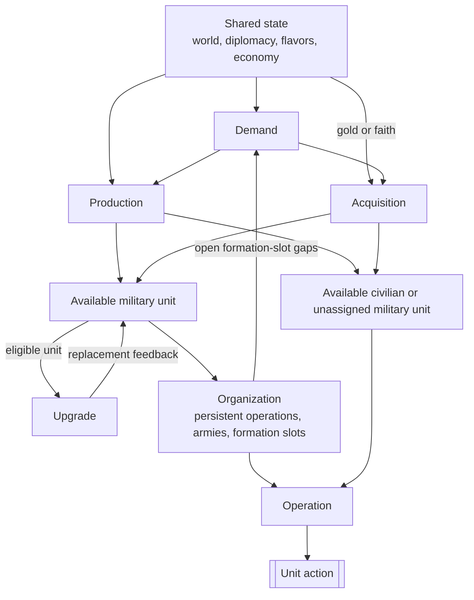

# Civilization V Unit AI: Overview

This guide introduces the non-strategic unit AI in the **Vox Populi 5.2.7** baseline. Its code lives in `civ5-dll/CvGameCoreDLL_Expansion2`.

## The six responsibilities

The unit AI is easiest to navigate through six responsibilities. They describe ownership and information flow. [Runtime order](#runtime-order-and-conflicts) shows when the systems execute.

| Responsibility | Definition | Primary owner |
| --- | --- | --- |
| **Demand** | A source-owned need or recommendation for a unit or role. | Military AI and role-specific civilian systems |
| **Production** | A city's selection of a queue-head order. | City Strategy AI and Unit Production AI |
| **Acquisition** | An immediate unit purchase with gold or faith. | Economic, Religion, Military, and Tactical AI |
| **Upgrade** | Replacement of an eligible existing unit with a newer type. | Homeland AI and unit upgrade code |
| **Organization** | Durable military structure: persistent operations, armies, and formation slots. | Military AI, Operation AI, and Army AI |
| **Operation** | Per-turn missions and actions for eligible units. | Tactical, Homeland, and role-specific civilian AI |

Free-unit grants and Great Person spawns follow their own game rules.

## Relationships

This diagram shows information and state relationships. World state, diplomacy, flavors, and the economy are shared inputs throughout.

Production and acquisition provide available units. Organization feeds its open formation slots back into demand. Operation directs each unit's actions for the turn.

## Runtime order and conflicts

AI turn order determines which system has already spent gold, movement, or an eligible unit.

| Phase | Key work | Later-state effect |
| --- | --- | --- |
| Economic AI | `CvEconomicAI::DoTurn`, including `DoHurry` | Ordinary purchases honor savings reservations and spend gold before Military AI. |
| Military AI | Updates state and operations, attempts final-slot purchases, and performs force cleanup | Uses gold that remains after Economic AI. |
| Religion and player AI | `CvReligionAI::DoFaithPurchases` and related work | Faith uses a separate currency path. |
| Cities | `CheckForOperationUnits`, then `doProduction` | A city can buy or queue an operation unit before normal production completes. Units completed here can act later that turn. |
| Tactical AI | Recruits units, moves armies, considers emergency purchases, and handles zone combat | Claims eligible movement first. Purchased units usually arrive without movement unless their type can move after purchase. |
| Homeland AI | Uses remaining eligible units and runs `PlotUpgradeMoves` late in `AssignHomelandMoves` | Upgrade savings protect future gold, while immediate upgrades use current gold. |

Tactical and Homeland AI rebuild separate `m_CurrentTurnUnits` lists. Army membership, remaining movement, and `TurnProcessed` coordinate their claims.

## Flavors

**Flavors** are numeric preference values. `CvUnitProductionAI` combines a city's effective flavor values with each unit type's XML flavor affinities to form base weights. Current-state rules then revise or reject candidates.

| Mode | City flavor values | Direct personality reads |
| --- | --- | --- |
| Vox Deorum custom flavors active | `CvFlavorManager::SetCustomFlavors` maps supplied values to signed adjustments and adds them to city flavor recipients. City AI and specialization adjustments remain additive. | Direct reads return custom values. `CvGrandStrategyAI::GetPersonalityAndGrandStrategy` omits the active grand-strategy modifier. |
| Normal Vox Populi | Randomized leader personality, active Economic and Military AI state adjustments, city state adjustments, and production specialization contribute to the city vector. Only state definitions with city-flavor rows change it. | Personality and grand-strategy reads follow the normal Vox Populi path. |

Custom values expire after a set number of turns unless replaced. Their Lua entry point also rewrites selected Economic and Military AI state flags. Those flags can alter role gates and bonuses, and the rewrite does not apply their normal XML flavor adjustments.

Relevant entry points are `CvLuaPlayer::lSetCustomFlavors`, `CvFlavorManager::SetCustomFlavors`, `CvFlavorManager::CheckCustomFlavorExpiration`, `CvCityStrategyAI::FlavorUpdate`, and `CvUnitProductionAI::AddFlavorWeights`.

`FLAVOR_OFFENSE` also adjusts Tactical AI risk tolerance for wounded units and some large, high-offense groups in `TacticalAIHelpers::FindBestUnitAssignments`.

## Responsibilities in detail

### Demand

Military demand combines flavors, war plans, force counts, threats, supply, and formation gaps. `CvMilitaryAI::DoTurn` coordinates it and `SetRecommendedArmyNavySize` calculates force targets. Civilian systems retain demand for their own roles, including settlers, workers, explorers, traders, religious units, diplomats, and antiquity or culture units.

### Production

`CvUnitProductionAI` supplies city-level unit candidates, and `CvCityStrategyAI::ChooseProduction` compares them with buildings, projects, and processes. [Production](production.md) defines the shared lifecycle. [Military production](military-production.md) and [civilian production](civilian-production.md) define the role-specific inputs.

### Acquisition

`CvEconomicAI::DoHurry` handles ordinary gold purchases, `CvReligionAI::DoFaithPurchases` handles faith purchases, `CvCity::CheckForOperationUnits` fills operation needs, and `CvTacticalAI::PlotEmergencyPurchases` responds to threatened cities. `CvCity::IsCanPurchase` checks eligibility and `CvCity::PurchaseUnit` creates ordinary purchases. [Acquisition](acquisition.md) explains the paths and priorities.

> **Optional modmod note:** `MOD_BALANCE_UNIT_INVESTMENTS` enables unit investments. In the VP 5.2.7 baseline, ordinary units are purchased outright and spaceship-project units use the built-in investment-style path.

### Upgrade

`CvUnit::DoUpgrade` replaces an eligible unit while preserving valid history and state. `CvHomelandAI::PlotUpgradeMoves` ranks candidates, applies current gold and safety, and requests `PURCHASE_TYPE_UNIT_UPGRADE` savings for ranked candidates remaining after the pass. Tactical AI and `CvArmyAI::AddUnit` can upgrade opportunistically. [Upgrade](upgrade.md) provides the detailed rules.

### Organization

`CvMilitaryAI::UpdateAttackTargets` and `UpdateOperations`, together with `CvAIOperation` and `CvArmyAI`, maintain defense state, role-balance flags, attack targets, persistent operations, armies, and `OperationSlot` assignments. Open slots feed demand. Civilian operations use army and slot machinery for military escorts. [Military organization](military-organization.md) explains membership, mustering, and release.

### Operation

`CvTacticalAI::Update`, `CvAIOperation`, and `CvArmyAI` run the per-turn work of military operations. Homeland AI then controls the remaining military units. `CvHomelandAI::AssignHomelandMoves`, `CvBuilderTaskingAI`, `CvTradeAI`, `CvReligionAI`, and civilian `CvAIOperation` families direct civilian operations and other civilian work. `CvPlayerAI::ProcessGreatPeople` supplies Great Person directives.

## Force cleanup

`CvMilitaryAI::DisbandObsoleteUnits` evaluates healing, war safety, finances, supply, obsolescence, resources, and geographic usefulness. It can gift a selected unit to a city-state.

## Unit AI guides

- [Production](production.md): shared city comparison and candidate gates.
- [Military production](military-production.md): military demand and formation requests.
- [Civilian production](civilian-production.md): civilian role demand and scoring.
- [Acquisition](acquisition.md): gold and faith purchases, including operation and emergency purchases.
- [Upgrade](upgrade.md): upgrade ranking and replacement.
- [Operation](operation.md): Tactical-to-Homeland handoff and per-turn control.
- [Military operation](military-operation.md): campaign, organization, and tactical control.
- [Military campaign](military-campaign.md): operation families, goals, retargeting, and abandonment.
- [Military organization](military-organization.md): armies, formation slots, membership, and mustering.
- [Military tactics](military-tactics.md): operation movement, dominance zones, combat priorities, and the Homeland handoff.
- [Civilian operation](civilian-operation.md): civilian operations, Homeland role passes, and civilian missions.
