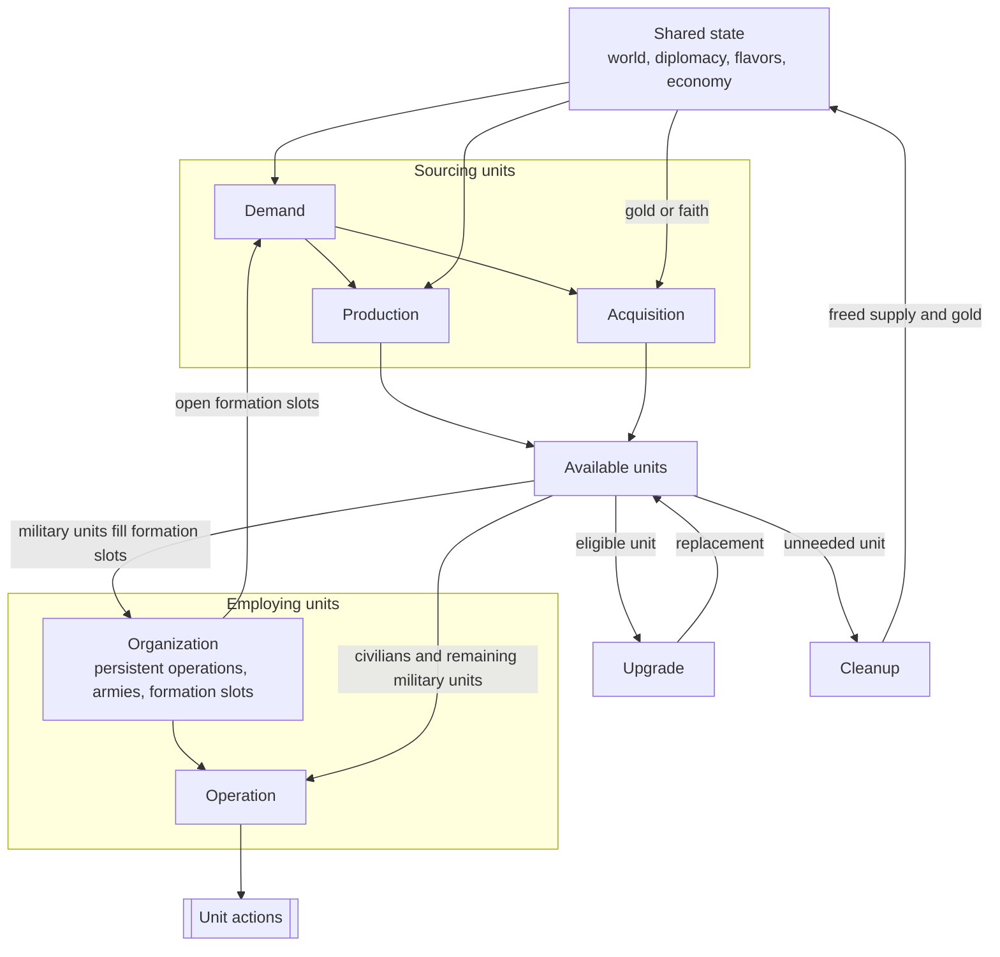

# Civilization V Unit AI: Overview

This guide introduces the non-strategic unit AI in the **Vox Populi 5.2.7** baseline. Its code lives in `civ5-dll/CvGameCoreDLL_Expansion2`.

## The seven responsibilities

The unit AI is easiest to navigate through seven responsibilities. They describe ownership and information flow. [Runtime order](#runtime-order-and-conflicts) shows when the systems execute.

| Responsibility | Definition | Primary owner |
| --- | --- | --- |
| **Demand** | A source-owned need or recommendation for a unit or role. | Military AI and role-specific civilian systems |
| **Production** | A city's selection of a queue-head order. | City Strategy AI and Unit Production AI |
| **Acquisition** | An immediate unit purchase with gold or faith. | Economic, Religion, Military, and Tactical AI |
| **Upgrade** | Replacement of an eligible existing unit with a newer type. | Homeland AI and unit upgrade code |
| **Organization** | Durable military structure: persistent operations, armies, and formation slots. | Military AI, Operation AI, and Army AI |
| **Operation** | Per-turn missions and actions for eligible units. | Tactical, Homeland, and role-specific civilian AI |
| **Cleanup** | Removal or gifting of units the empire no longer needs. | Military, Economic, and Homeland AI |

Free-unit grants and Great Person spawns follow their own game rules.

## Relationships

This diagram shows information and state relationships. World state, diplomacy, flavors, and the economy are shared inputs throughout.

Production and acquisition fill a shared pool of available units. Organization claims military units for formation slots and feeds its open slots back into demand, while operation directs each unit's actions for the turn. Two stages maintain the pool itself: upgrade replaces eligible units with newer types, and cleanup removes unneeded ones, returning their supply and gold to the shared state that drives demand.

## Runtime order and conflicts

AI turn order determines which system has already spent gold, movement, or an eligible unit.

| Phase | Key work | Later-state effect |
| --- | --- | --- |
| Economic AI | `CvEconomicAI::DoTurn`, including `DoHurry` | Ordinary purchases honor savings reservations and spend gold before Military AI. |
| Military AI | Updates state and operations, attempts final-slot purchases, and runs [military disband](cleanup.md#military-disband) | Uses gold that remains after Economic AI. |
| Religion and player AI | `CvReligionAI::DoFaithPurchases` and related work | Faith uses a separate currency path. |
| Cities | `CheckForOperationUnits`, then `doProduction` | A city can buy or queue an operation unit before normal production completes. Units completed here can act later that turn. |
| Tactical AI | Recruits units, moves armies, considers emergency purchases, and handles zone combat | Claims eligible movement first. Purchased units usually arrive without movement unless their type can move after purchase. |
| Homeland AI | Begins with [city-state gifting](cleanup.md#city-state-gifting), uses remaining eligible units, and runs `PlotUpgradeMoves` late in `AssignHomelandMoves` | Upgrade savings protect future gold, while immediate upgrades use current gold. |

Tactical and Homeland AI rebuild separate `m_CurrentTurnUnits` lists. Army membership, remaining movement, and `TurnProcessed` coordinate their claims.

## Flavors

**Flavors** are numeric preference values that steer decisions throughout the unit AI, from production base weights to combat risk tolerance. Vox Deorum can override the normal personality-derived values with custom flavors supplied through Lua. [Shared concepts](concepts.md#flavors) defines the mechanism: the custom and normal modes, expiration, and entry points. For the `FLAVOR_OFFENSE` effect on Tactical AI risk tolerance, see [entry points and aggression](military-tactical-simulation.md#entry-points-and-aggression).

## Responsibilities in detail

### Demand

[Military demand](military-production.md#military-demand) combines flavors, war plans, force counts, threats, supply, and formation gaps. `CvMilitaryAI::DoTurn` coordinates it and `SetRecommendedArmyNavySize` calculates force targets. [Civilian demand](civilian-production.md#civilian-demand) remains role-owned for settlers, workers, work boats, land explorers, trade units, messengers, and archaeologists. Religion AI keeps separate faith-purchase demand, which [Acquisition](acquisition.md#faith-priority-and-legality) explains.

### Production

`CvUnitProductionAI` supplies city-level unit candidates, and `CvCityStrategyAI::ChooseProduction` compares them with buildings, projects, and processes. [Production](production.md) defines the shared lifecycle. [Military production](military-production.md) and [civilian production](civilian-production.md) define the role-specific inputs.

### Acquisition

`CvEconomicAI::DoHurry` handles ordinary gold purchases, `CvReligionAI::DoFaithPurchases` handles faith purchases, `CvCity::CheckForOperationUnits` fills operation needs, and `CvTacticalAI::PlotEmergencyPurchases` responds to threatened cities. `CvCity::IsCanPurchase` checks eligibility and `CvCity::PurchaseUnit` creates ordinary purchases. [Acquisition](acquisition.md) explains the paths and priorities.

> **Optional modmod note:** `MOD_BALANCE_UNIT_INVESTMENTS` enables unit investments. In the VP 5.2.7 baseline, ordinary units are purchased outright and spaceship-project units use the built-in investment-style path.

### Upgrade

`CvUnit::DoUpgrade` replaces an eligible unit while preserving valid history and state. `CvHomelandAI::PlotUpgradeMoves` ranks candidates, applies current gold and safety, and requests `PURCHASE_TYPE_UNIT_UPGRADE` savings for ranked candidates remaining after the pass. Tactical AI and `CvArmyAI::AddUnit` can upgrade opportunistically. [Upgrade](upgrade.md) provides the detailed rules.

### Organization

`CvMilitaryAI::UpdateAttackTargets` and `UpdateOperations`, together with `CvAIOperation` and `CvArmyAI`, maintain defense state, role-balance flags, attack targets, persistent operations, armies, and `OperationSlot` assignments. Open slots feed demand. Civilian operations use army and slot machinery for military escorts. [Military organization](military-organization.md) explains membership, mustering, and release.

### Operation

`CvTacticalAI::Update`, `CvAIOperation`, and `CvArmyAI` run the per-turn work of military operations. Homeland AI then controls the remaining military units. `CvHomelandAI::AssignHomelandMoves`, `CvBuilderTaskingAI`, `CvTradeAI`, `CvReligionAI`, and civilian `CvAIOperation` families direct civilian operations and other civilian work. `CvPlayerAI::ProcessGreatPeople` supplies Great Person directives.

### Cleanup

`CvMilitaryAI::DisbandObsoleteUnits` disbands or gifts away obsolete and unaffordable military units, `CvEconomicAI` runs fixed-order disband passes for civilian roles, and `CvHomelandAI::ExecuteUnitGift` gifts units to city-states. [Cleanup](cleanup.md) explains the triggers, candidate scoring, and gifting rules.

## Unit AI guides

- [Concepts](concepts.md): shared vocabulary — roles, flavors, strategy flags, supply, war states, danger, and dominance zones.
- [Production](production.md): shared city comparison and candidate gates.
- [Military production](military-production.md#military-demand): military force targets and formation requests.
- [Civilian production](civilian-production.md#civilian-demand): civilian role demand and scoring.
- [Acquisition](acquisition.md): gold and faith purchases, including operation and emergency purchases.
- [Upgrade](upgrade.md): upgrade ranking, replacement, and promotion.
- [Cleanup](cleanup.md): disbanding, civilian disband passes, and city-state gifting.
- [Operation](operation.md): Tactical-to-Homeland handoff and per-turn control.
- [Military operation](military-operation.md): campaign, organization, and tactical control.
- [Military campaign](military-campaign.md): operation families, goals, retargeting, and abandonment.
- [Military organization](military-organization.md): armies, formation slots, membership, and mustering.
- [Military tactics](military-tactics.md): operation movement, zone postures and combat priorities, air and barbarian handling, and the Homeland handoff.
- [Military tactical simulation](military-tactical-simulation.md): coordinated combat planning and pathfinding as AI policy.
- [Civilian operation](civilian-operation.md): civilian operations, Homeland role passes, and civilian missions.
