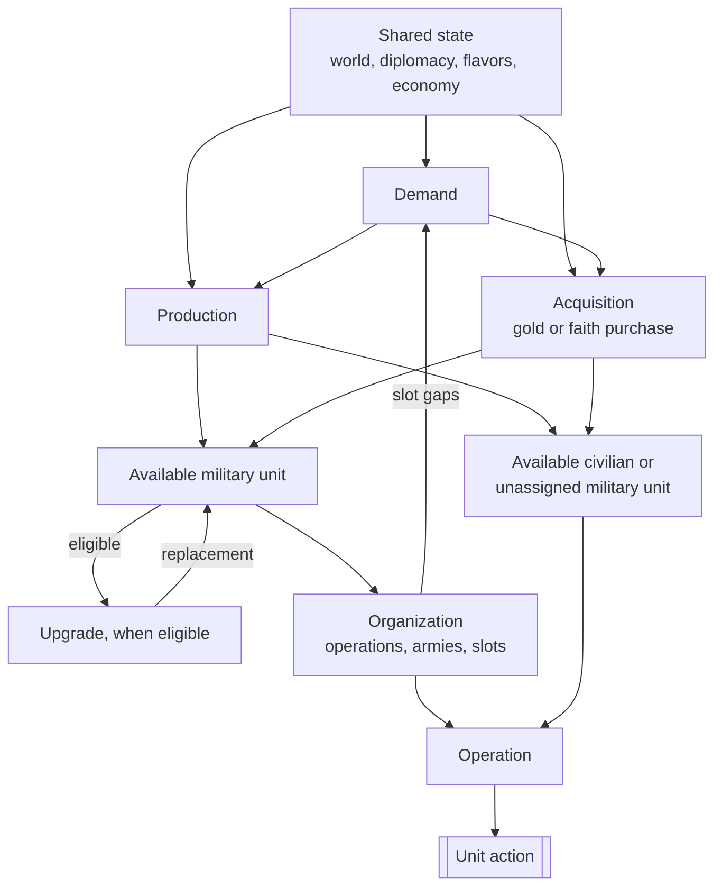

# Civilization V Unit AI: Overview

This page is for C++ contributors who are new to the Vox Deorum DLL. It explains the unit AI in the **Vox Populi 5.2.7** baseline: how it decides which units to make, organize, modernize, and move.

<!-- Instruction for further documentation: prioritize flavor over military/economic strategies, since Vox Deorum directly overrides flavors. -->

The relevant code is in `civ5-dll/CvGameCoreDLL_Expansion2`. Read it in this conceptual order to trace dependencies. This conceptual order does not describe runtime precedence:

1. **Demand** decides which units the empire needs.
2. **Production** chooses what each city builds.
3. **Acquisition** usually buys an ordinary unit immediately with gold or faith.
4. **Upgrade** modernizes an eligible existing unit. Military upgrades can require army bookkeeping.
5. **Organization** primarily maintains military forces and also supports escorted civilian operations.
6. **Operation** chooses each eligible unit's action for this turn.

Military demand is primarily `CvMilitaryAI`; civilian demand is spread across role-specific systems. The distinction matters because civilian units usually go from creation to operation, while military units can be assigned to armies and formation slots first.

Free-unit grants and Great Person spawns are automatic game rules, not AI decisions. They are outside this overview's decision model.

## Dependencies

The diagram shows information and state dependencies, not function-call order. World state, diplomacy, flavors, and the economy are shared inputs throughout.

Production and ordinary immediate acquisitions create available units. The upgrade loop shows the military case, where an improved unit returns to organization. Organization holds durable state; operation uses a unit in the current turn.

## Responsibilities in detail

### Demand

Military demand turns current flavors, war plans, force counts, threats, and supply into recommended army and navy sizes, role-balance flags, formation gaps, and operation purchase needs. `CvMilitaryAI::DoTurn` coordinates this work, and `SetRecommendedArmyNavySize` calculates force targets. City production turns those inputs into weighted candidates.

Civilian demand is distributed across Economic AI, city strategies, Trade AI, Religion AI, and related systems. These systems supply role-specific production signals, purchase checks, and objectives for settlers, workers, explorers, traders, religious units, antiquity and culture units, and diplomats.

### Production

`CvUnitProductionAI` produces weighted military and civilian candidates for one city. `CvCityStrategyAI::ChooseProduction` adjusts them for construction time, compares them with other buildables, then `CvCity::pushOrder` records the winner. Demand produces candidate weights, while city production chooses the next order.

### Acquisition

Acquisition purchases ordinary units outright with gold or faith. `CvEconomicAI::DoHurry` makes ordinary gold-purchase decisions, `CvReligionAI::DoFaithPurchases` handles faith purchases, `CvCity::CheckForOperationUnits` can fill an operation slot, and `CvTacticalAI::PlotEmergencyPurchases` can respond to a threatened city. Emergency is a trigger for acquisition, not a separate system.

`CvCity::IsCanPurchase` checks eligibility, and ordinary `CvCity::PurchaseUnit` paths create the unit. Economic savings plans can preserve gold for higher-priority purchases.

> **Optional modmod note:** `MOD_BALANCE_UNIT_INVESTMENTS` can enable unit investments. In the VP 5.2.7 baseline, ordinary units are purchased outright. Spaceship-project units are the built-in exception and use an investment-style path.

### Upgrade

Upgrade is separate from acquisition. `CvUnit::DoUpgrade` replaces an eligible unit with a newer type while preserving valid history and state. `CvHomelandAI::PlotUpgradeMoves` is the main prioritizer: it scans all player units, ranks eligible upgrades by unit strength, immediate safety, domain, and experience, and requests `PURCHASE_TYPE_UNIT_UPGRADE` savings when gold is short. Civilian upgrade chains use the same replacement action.

Tactical AI and `CvArmyAI::AddUnit` can also upgrade opportunistically. When an upgrade affects an army, callers restore the replacement to its relevant slot when appropriate.

### Organization

Organization maintains defense state, role-balance flags, attack targets, operations, armies, and `OperationSlot` assignments. `CvMilitaryAI::UpdateAttackTargets` and `UpdateOperations`, with `CvAIOperation` and `CvArmyAI`, build this state across turns. Open formation slots feed demand as production and purchase needs.

Organization records a force's durable structure. Operation decides what its units do now. Civilian operations reuse army and slot machinery where needed, including military escorts, but civilian units otherwise have no general organization pass.

### Operation

Military operation uses `CvTacticalAI::Update`, `CvAIOperation`, and `CvArmyAI` to analyze targets and dominance zones, move operation armies, and issue missions such as movement, attacks, pillaging, or fortification. Homeland then considers eligible military units for garrison, healing, sentry, patrol, and rebase moves.

Civilian operation uses `CvHomelandAI::AssignHomelandMoves`, `CvBuilderTaskingAI`, `CvTradeAI`, `CvReligionAI`, and the civilian `CvAIOperation` families to move, build, found cities, spread religion, trade, or use Great Person abilities. `CvPlayerAI::ProcessGreatPeople` supplies directives once a Great Person exists.

## Force cleanup

> `CvMilitaryAI::DisbandObsoleteUnits` is independent force cleanup. It does not read recommended army or navy targets, or formation demand. It considers healing, war safety, finances, supply, obsolescence, resources, and geographic usefulness. It can gift a selected unit to a city-state instead of disbanding it.

## Execution order and conflicts

This table shows the broad execution order for an AI turn. Earlier work can spend gold, use movement, or mark a unit processed, constraining later work.

| Phase or system | What runs | Conflict consequence |
| --- | --- | --- |
| Economic AI | `CvEconomicAI::DoTurn`, including `DoHurry` | Ordinary economic purchases run before Military AI purchases. `CanWithdrawMoneyForPurchase` honors existing savings reservations. |
| Military AI | `CvMilitaryAI::DoTurn`: state updates, `UpdateOperations`, final-slot purchases through `MakeEmergencyPurchases` and `BuyFinalUnit`, then cleanup | A military purchase uses gold left after Economic AI. `DisbandObsoleteUnits` runs after the military purchase attempt. |
| Religion and other player AIs | Includes `CvReligionAI::DoFaithPurchases` | Faith acquisition is a separate currency path from gold purchases. |
| Cities | `CheckForOperationUnits`, then `doProduction` | A city can buy or queue an operation unit before production completes. Units completed before unit processing have movement and can act that turn. |
| Tactical AI | Visibility and targets, recruitment, high-priority healing, operation armies, garrisons, then dominance zones and their emergency purchases | Tactical gets the first claim on eligible unit movement. Purchased units, including tactical emergency purchases, arrive with their moves already spent for the turn unless the unit type has `CanMoveAfterPurchase`. |
| Homeland AI | Remaining eligible units, then late `PlotUpgradeMoves` inside `AssignHomelandMoves` | Upgrade savings are requested late, so they normally protect gold on later turns. Immediate upgrades use the gold still available. Tactical and army upgrades can occur earlier. |

### Current-turn coordination

Tactical and Homeland rebuild separate `m_CurrentTurnUnits` lists and do not transfer a worklist between systems. Army ID excludes army members from Homeland; remaining movement and `TurnProcessed` coordinate other claims. Homeland respects that state and does not issue a second move.

## Flavors

Flavors are the primary preference vector, not commands. `CvUnitProductionAI` combines each city's effective flavor values with the XML flavor affinities of every unit type to produce base unit weights. Current game state can then revise or reject those candidates.

Vox Deorum custom flavors take priority while active. `CvFlavorManager::SetCustomFlavors` maps the supplied values into signed deltas and applies them directly to city flavor recipients. Existing city AI and specialization deltas remain additive. Direct personality reads return the custom values, and `CvGrandStrategyAI::GetPersonalityAndGrandStrategy` omits the active grand-strategy flavor modifier. The custom values expire after ten turns unless replaced.

The custom-flavor Lua entry point also rewrites Economic and Military AI state. Selected flags are enabled by flavor thresholds or named game-state checks. Other non-exempt Economic flags and all other Military flags are disabled. These direct changes affect gates and bonuses, but do not apply the flags' normal XML flavor deltas.

Without custom flavors, normal Vox Populi builds a city's effective vector from randomized leader personality values, the city-flavor deltas of active Economic and Military AI states, the city's own active states, and its production specialization. Only state definitions with city-flavor rows alter this vector.

The relevant entry points are `CvLuaPlayer::lSetCustomFlavors`, `CvFlavorManager::SetCustomFlavors`, `CvFlavorManager::CheckCustomFlavorExpiration`, `CvCityStrategyAI::FlavorUpdate`, and `CvUnitProductionAI::AddFlavorWeights`.

`FLAVOR_OFFENSE` has one narrow direct Tactical AI use: `TacticalAIHelpers::FindBestUnitAssignments` adjusts risk tolerance for wounded units and some large, high-offense groups. It does not choose targets or force attacks.

## Where to read next

The production pages are:

1. [Production](production.md): How cities compare unit candidates with other buildables.
2. [Military production](military-production.md): How military demand becomes weighted unit candidates.
3. [Civilian production](civilian-production.md): How role-specific civilian needs shape production.

The remaining six planned pages are:

4. `acquisition.md`: How gold and faith purchases create units, including emergency purchases.
5. `upgrade.md`: How eligible units are replaced with newer unit types.
6. `military-organization.md`: How armies, operations, and formation slots maintain force structure.
7. `unit-operation.md`: How eligible units receive actions for the current turn.
8. `military-unit-operation.md`: How tactical and Homeland AI move and use military units.
9. `civilian-unit-operation.md`: How civilian units move, build, trade, and pursue role objectives.
