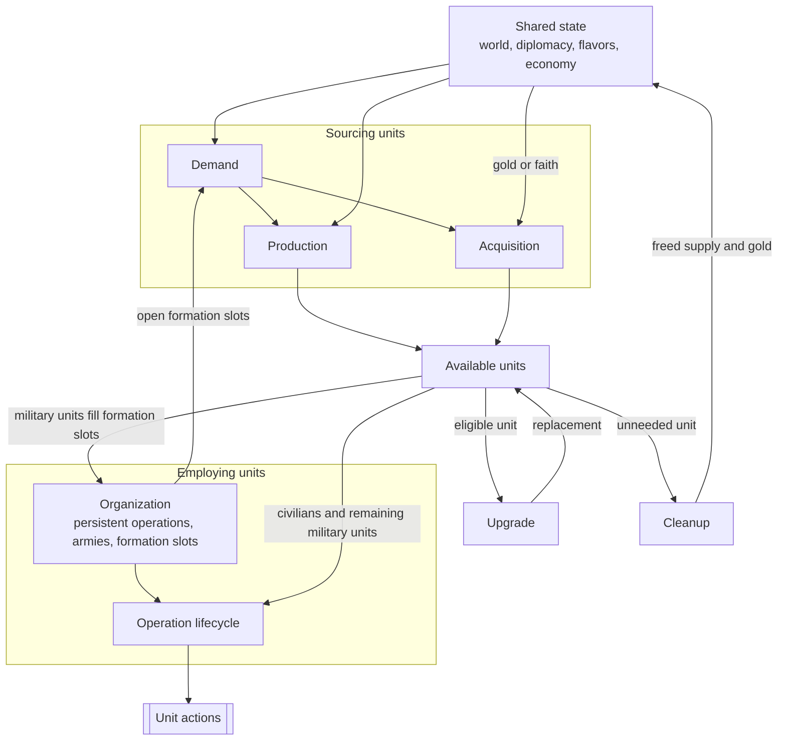

# Civilization V Unit AI: Overview

This guide orients contributors to the non-strategic unit AI in the **Vox Populi 5.2.7** baseline. The implementation is primarily in `civ5-dll/CvGameCoreDLL_Expansion2`.

Choose a guide based on the task:

- Need a shared definition, such as supply, danger, or a UnitAI role: read [Concepts](concepts.md).
- Need a city to select, train, or buy a unit: read [Production](production.md), then [military production](military-production.md) or [civilian production](civilian-production.md).
- Need to change unit control during a turn: read [Operation](operation.md), then the military or civilian guide for the owning controller.
- Need to remove, gift, replace, or promote a unit: read [Cleanup](cleanup.md) or [Upgrade](upgrade.md).
- Need a durable military structure: read [Military organization](military-organization.md). A **persistent operation** is a `CvAIOperation`; its **formation slots** are the membership records it recruits and maintains.

## The seven responsibilities

The unit AI divides work by responsibility. [Runtime order](#runtime-order-and-conflicts) explains when each owner runs.

| Responsibility | Definition | Primary owner |
| --- | --- | --- |
| **Demand** | A source-owned need or recommendation for a unit or role. | Military AI and role-specific civilian systems |
| **Production** | A city's selection of a queue-head order. | City Strategy AI and Unit Production AI |
| **Acquisition** | An immediate unit purchase with gold or faith. | Economic, Religion, Military, and Tactical AI |
| **Upgrade** | Replacement of an eligible existing unit with a newer type. | Homeland AI and unit upgrade code |
| **Organization** | Durable military structure: persistent operations, armies, and formation slots. | Military AI, Operation AI, and Army AI |
| **Operation lifecycle** | Per-turn work and actions for eligible units. | Tactical, Homeland, and role-specific civilian AI |
| **Cleanup** | Removal or gifting of units the empire no longer needs. | Military, Economic, and Homeland AI |

Free-unit grants and Great Person spawns follow separate game rules.

## Relationships

World state, diplomacy, flavors, and the economy inform every stage.

Production and acquisition create a shared pool of available units. Organization assigns military units to formation slots and turns open slots back into demand. The operation lifecycle directs the units it owns. Upgrade replaces eligible units, while cleanup releases units and their costs.

## Runtime order and conflicts

AI turn order determines which system has already spent gold, movement, or an eligible unit.

| Phase | Key work | Later-state effect |
| --- | --- | --- |
| Economic AI | `CvEconomicAI::DoTurn`, including `DoHurry` | Ordinary purchases honor savings reservations and spend gold before Military AI. |
| Military AI | Updates state and persistent operations, attempts final-slot purchases, and runs [military disband](cleanup.md#military-disband) | Uses gold that remains after Economic AI. |
| Religion and player AI | `CvReligionAI::DoFaithPurchases` and related work | Faith uses a separate currency path. |
| Cities | `CheckForOperationUnits`, then `doProduction` | A city can buy or queue an operation unit before normal production completes. Units completed here can act later that turn. |
| Tactical AI | Recruits units, moves armies, considers emergency purchases, and handles zone combat | Claims eligible movement first. Purchased units usually arrive without movement unless their type can move after purchase. |
| Homeland AI | Starts with first-turn settler moves, then [city-state gifting](cleanup.md#city-state-gifting), uses remaining eligible units, and runs `PlotUpgradeMoves` late in `AssignHomelandMoves` | Upgrade savings protect future gold, while immediate upgrades use current gold. |

Tactical and Homeland AI rebuild separate `m_CurrentTurnUnits` lists. Army membership, remaining movement, and `TurnProcessed` coordinate their claims.

## Cross-cutting inputs

**Flavors** steer production weights, force sizing, and combat risk. Vox Deorum can replace personality-derived values with custom Lua-supplied flavors. See [flavors](concepts.md#flavors) for the mode, expiration, and entry points, and [entry points and aggression](military-tactical-simulation.md#entry-points-and-aggression) for `FLAVOR_OFFENSE` in Tactical AI.

## Guide index

- [Concepts](concepts.md): shared vocabulary, including roles, flavors, strategy flags, supply, war states, danger, and dominance zones.
- [Production](production.md): city comparison and candidate gates.
- [Military production](military-production.md#military-demand): force targets, formation requests, and operation commitment paths.
- [Civilian production](civilian-production.md#civilian-demand): civilian role demand and scoring.
- [Acquisition](acquisition.md): gold and faith purchases, including operation and emergency purchases.
- [Upgrade](upgrade.md): upgrade ranking, replacement, and promotion selection.
- [Cleanup](cleanup.md): disbanding, civilian passes, and city-state gifting.
- [Operation](operation.md): Tactical-to-Homeland handoff and per-turn control.
- [Military operation](military-operation.md): campaign, organization, and tactical control.
- [Military campaign](military-campaign.md): operation families, goals, retargeting, and abandonment.
- [Military organization](military-organization.md): armies, formation slots, membership, and mustering.
- [Military tactics](military-tactics.md): movement, postures, combat priorities, air and barbarian handling, and the Homeland handoff.
- [Military tactical simulation](military-tactical-simulation.md): coordinated combat planning and pathfinding policy.
- [Civilian operation](civilian-operation.md): civilian persistent operations, Homeland role passes, and missions.
