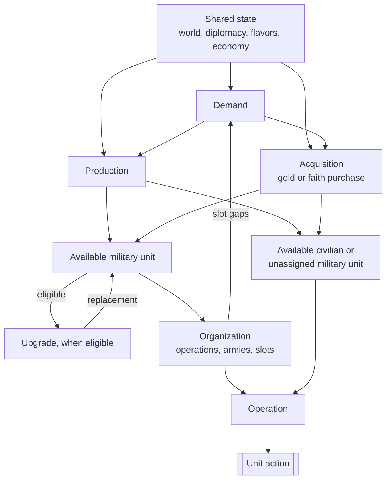

# Civilization V Unit AI: Overview

This page explains the non-strategic unit AI in the **Vox Populi 5.2.7** baseline: how it decides which units to create, organize, modernize, and use.

The relevant code is in `civ5-dll/CvGameCoreDLL_Expansion2`. These six responsibilities form a conceptual model, not a function-call sequence.

| Responsibility | Question it answers | Primary owner |
| --- | --- | --- |
| Demand | Which units or roles does the empire need? | Military AI and role-specific civilian systems |
| Production | What should this city place at the head of its queue? | City Strategy AI and Unit Production AI |
| Acquisition | What should the empire buy now with gold or faith? | Economic, Religion, Military, and Tactical AI |
| Upgrade | Which existing unit should be replaced with a newer type? | Homeland AI and unit upgrade code |
| Organization | Which military units belong to operations, armies, and formation slots? | Military AI, Operation AI, and Army AI |
| Operation | What should each eligible unit do this turn? | Tactical, Homeland, and role-specific civilian AI |

Free-unit grants and Great Person spawns follow game rules rather than this decision model.

## Dependencies

This diagram shows information and state dependencies, not runtime order. World state, diplomacy, flavors, and the economy are shared inputs throughout.

Production and acquisition create available units. Organization retains durable military structure, while operation issues this turn's actions.

## Runtime order and conflicts

The conceptual model does not match AI turn order. Earlier systems can spend gold, use movement, or mark a unit processed, constraining later systems.

| Phase | Key work | Effect on later phases |
| --- | --- | --- |
| Economic AI | `CvEconomicAI::DoTurn`, including `DoHurry` | Ordinary economic purchases run before Military AI purchases. Existing savings reservations are honored. |
| Military AI | Updates military state and operations, attempts final-slot purchases, then performs force cleanup | Military purchases use the gold left after Economic AI. |
| Religion and other player AIs | Includes `CvReligionAI::DoFaithPurchases` | Faith purchases use a separate currency path. |
| Cities | `CheckForOperationUnits`, then `doProduction` | A city can buy or queue an operation unit before normal production completes. Units completed here can act later in the same turn. |
| Tactical AI | Recruits eligible units, moves operation armies, considers emergency purchases for each zone, then handles zone combat work | Tactical AI gets the first claim on eligible movement. Purchased units normally arrive with no movement unless their type can move after purchase. |
| Homeland AI | Uses remaining eligible units and runs `PlotUpgradeMoves` late in `AssignHomelandMoves` | Upgrade savings usually protect gold on later turns. Immediate upgrades use whatever gold remains. |

Tactical and Homeland AI rebuild separate `m_CurrentTurnUnits` lists. Army membership, remaining movement, and `TurnProcessed` coordinate their claims. Homeland respects that state and does not issue a second move.

## Flavors

Flavors are preference values, not commands. `CvUnitProductionAI` combines a city's effective flavor values with each unit type's XML flavor affinities to produce base weights. Current game state can then revise or reject a candidate.

| Mode | City flavor values | Direct personality reads |
| --- | --- | --- |
| Vox Deorum custom flavors active | `CvFlavorManager::SetCustomFlavors` maps supplied values to signed adjustments and adds them to city flavor recipients. City AI and specialization adjustments remain additive. | Direct personality reads return the custom values. `CvGrandStrategyAI::GetPersonalityAndGrandStrategy` omits the active grand-strategy modifier. |
| Normal Vox Populi | Randomized leader personality, active Economic and Military AI state adjustments, city state adjustments, and production specialization contribute to the city vector. Only state definitions with city-flavor rows change it. | Personality and grand-strategy reads use the normal Vox Populi path. |

Custom flavor values expire after a set number of turns unless replaced. Their Lua entry point also rewrites selected Economic and Military AI state flags. Those flags can alter role gates and bonuses, but the rewrite does not apply the flags' normal XML flavor adjustments.

The relevant entry points are `CvLuaPlayer::lSetCustomFlavors`, `CvFlavorManager::SetCustomFlavors`, `CvFlavorManager::CheckCustomFlavorExpiration`, `CvCityStrategyAI::FlavorUpdate`, and `CvUnitProductionAI::AddFlavorWeights`.

`FLAVOR_OFFENSE` also has one narrow Tactical AI use. `TacticalAIHelpers::FindBestUnitAssignments` adjusts risk tolerance for wounded units and some large, high-offense groups. It does not choose targets or force attacks.

## Responsibilities in detail

### Demand

Demand is a source-owned need or recommendation, not a city order and not always a quota. Military demand combines flavors, war plans, force counts, threats, supply, and formation gaps. `CvMilitaryAI::DoTurn` coordinates this work, while `SetRecommendedArmyNavySize` calculates force targets.

Civilian demand is distributed across Economic AI, city strategies, Trade AI, Religion AI, and related systems. Each role supplies its own signals for settlers, workers, explorers, traders, religious units, diplomats, and antiquity or culture units. There is no common civilian force target.

### Production

`CvUnitProductionAI` turns flavor weights and current demand into military and civilian unit candidates for one city. `CvCityStrategyAI::ChooseProduction` compares them with buildings, projects, and processes, then `CvCity::pushOrder` records the winner. Production chooses a queue order, but does not create the finished unit or spend a purchase currency.

The [production guide](production.md) explains the shared comparison. [Military production](military-production.md) and [civilian production](civilian-production.md) explain the role-specific inputs.

### Acquisition

Acquisition creates a unit immediately with gold or faith. `CvEconomicAI::DoHurry` handles ordinary gold purchases, `CvReligionAI::DoFaithPurchases` handles faith purchases, `CvCity::CheckForOperationUnits` can fill an operation slot, and `CvTacticalAI::PlotEmergencyPurchases` can respond to a threatened city. Economic savings plans can reserve gold for higher-priority purchases.

`CvCity::IsCanPurchase` checks eligibility, and the ordinary `CvCity::PurchaseUnit` paths create the unit. Emergency is a purchase trigger, not a separate system.

The [acquisition guide](acquisition.md) explains shared eligibility, ordinary spending, formation purchases, emergency defense, and faith priorities.

> **Optional modmod note:** `MOD_BALANCE_UNIT_INVESTMENTS` can enable unit investments. In the VP 5.2.7 baseline, ordinary units are purchased outright. Spaceship-project units are the built-in exception and use an investment-style path.

### Upgrade

Upgrade is separate from acquisition. `CvUnit::DoUpgrade` replaces an eligible unit with a newer type while preserving valid history and state. `CvHomelandAI::PlotUpgradeMoves` ranks upgrade candidates, performs what current gold and safety allow, and requests `PURCHASE_TYPE_UNIT_UPGRADE` savings when a ranked candidate remains after the pass. Civilian upgrade chains use the same replacement action.

Tactical AI and `CvArmyAI::AddUnit` can also upgrade opportunistically. When an army unit is upgraded, callers restore the replacement to the relevant slot when appropriate.

The [upgrade guide](upgrade.md) explains target resolution, eligibility, Homeland ranking and savings, opportunistic callers, and replacement state.

### Organization

Organization maintains defense state, role-balance flags, attack targets, operations, armies, and `OperationSlot` assignments. `CvMilitaryAI::UpdateAttackTargets` and `UpdateOperations`, with `CvAIOperation` and `CvArmyAI`, build this state across turns. Open formation slots feed demand as production and purchase needs.

The [military organization guide](military-organization.md) explains army membership, formation slots, recruitment, mustering, and release.

Civilian operations reuse army and slot machinery when they need military escorts. Other civilian units have no general organization pass.

### Operation

Military operation uses `CvTacticalAI::Update`, `CvAIOperation`, and `CvArmyAI` to analyze targets and dominance zones, move operation armies, and issue missions. Homeland AI then considers remaining military units for garrison, healing, sentry, patrol, and rebase moves.

The [military unit operation overview](military-unit-operation.md) separates campaign goals, organization, and per-turn tactics.

Civilian operation uses `CvHomelandAI::AssignHomelandMoves`, `CvBuilderTaskingAI`, `CvTradeAI`, `CvReligionAI`, and civilian `CvAIOperation` families to move, build, found cities, spread religion, trade, or use Great Person abilities. `CvPlayerAI::ProcessGreatPeople` supplies directives after a Great Person exists.

## Force cleanup

`CvMilitaryAI::DisbandObsoleteUnits` is independent force cleanup. It does not read recommended army or navy targets or formation demand. It considers healing, war safety, finances, supply, obsolescence, resources, and geographic usefulness. It can gift a selected unit to a city-state instead of disbanding it.

## Unit AI guides

- [Production](production.md) explains how a city compares unit candidates with other buildables.
- [Military production](military-production.md) explains how military demand becomes weighted unit candidates.
- [Civilian production](civilian-production.md) explains how role-specific civilian needs become weighted unit candidates.
- [Acquisition](acquisition.md) explains how gold and faith purchases create units, including operation and emergency purchases.
- [Upgrade](upgrade.md) explains how eligible units are ranked and replaced with newer unit types.

## Unit-operation guides

- [Unit operation](unit-operation.md) explains the shared Tactical-to-Homeland handoff and per-turn control state.
- [Military unit operation](military-unit-operation.md) is the overview of military campaign, organization, and tactical control.
- [Military campaign](military-campaign.md) explains operation families, goals, retargeting, and abandonment.
- [Military organization](military-organization.md) explains armies, formation slots, membership, and mustering.
- [Military tactics](military-tactics.md) explains operation movement, dominance zones, combat priorities, and the Homeland handoff.
- [Civilian unit operation](civilian-unit-operation.md) explains civilian operations, Homeland role passes, and civilian missions.
