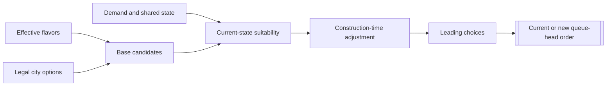

# Unit AI: Production

This page describes the city production interface in the **Vox Populi 5.2.7** baseline. Its job is to decide whether to keep or replace the order at the head of a city's production queue. It does not decide what the empire needs, and it does not create the finished unit.

The relevant code is in `civ5-dll/CvGameCoreDLL_Expansion2`, primarily `CvCityStrategyAI.cpp`, `CvUnitProductionAI.cpp`, `CvCityAI.cpp`, and `CvCity.cpp`.

## Inputs and outputs

| Inputs | What they supply |
| --- | --- |
| Effective city flavors | The primary preference vector for units, buildings, projects, and processes. Vox Deorum custom flavors feed this vector directly when active. |
| Legal build options | What this city can train, construct, create, or maintain now. |
| Demand state | Unit-role shortages, operation and army slots, expansion needs, worker needs, trade priorities, and other subsystem recommendations. |
| Local and empire state | Construction time, current production, city safety and development, resources, maintenance, supply, unit counts, and current priorities. |
| Selection rules | Duration penalty, current-build inertia, the handicap cutoff for top choices, and interruption flags. |

Production can retain the current order, replace it with one `OrderTypes` entry, or make no selection when no candidate has a positive legal weight. The possible orders are:

- `ORDER_TRAIN` for a unit;
- `ORDER_CONSTRUCT` for a building;
- `ORDER_CREATE` for a project;
- `ORDER_MAINTAIN` for a process.

When the city selects an order, `CvCity::pushOrder` places it at the queue head. In the ordinary AI replacement path it clears the previous queue first. A rush flag records that the selected finite build exceeds the configured duration threshold, but production selection does not itself spend a currency or complete the order.

The choice can also update two feedback counters. Skipping a viable settler increases later pressure to choose one. Skipping a requested operation unit does the same for operation production. Selecting that unit resets its counter.

## Decision model

`CvCityStrategyAI::ChooseProduction` owns the comparison. It first builds one list of legal units, buildings, projects, and processes with positive base weights. A process enters that list only when raw production is at least five per turn, unless no other precheck candidate exists. Each candidate type then applies its own current-state suitability scoring. A negative result normally removes the candidate, and a positive result becomes its revised weight.

The city discounts the survivors by turns remaining, then compares them on one scale. If its current unit, building, or project remains within half of the leading score, the city keeps it. Otherwise it makes a weighted choice from the leading band defined by `CityProductionChoiceCutoffThreshold`. A leading defense process is selected directly, and processes never receive current-build inertia.

If every candidate fails current-state suitability, the city falls back to the legal, positive-base-weight precheck list, including units that failed their unit suitability checks. This prevents an idle city, but means the suitability checks express preferences rather than unconditional rules.

## How flavors become base weights

Each city retains an effective flavor vector, built from Vox Deorum custom flavors or the normal Vox Populi sources as described in [the overview](overview.md#flavors). The active grand strategy is not part of this city vector.

Each production AI maps that vector through the XML flavor affinities of its own entries. For a unit, `CvUnitProductionAI::AddFlavorWeights` compresses each signed city flavor, multiplies it by the unit's affinity for that flavor, and sums the results. The result is the unit's base weight. The military and civilian suitability layers revise that base weight before city production compares it with other buildables.

These base weights are cached. `CvCityStrategyAI::FlavorUpdate` rebuilds them after a flavor update. A specialization change updates the stored city vector and marks production for reconsideration, but does not itself rebuild the cache, so the specialization's new weights can wait until the next flavor update.

## Candidate contracts

| Candidate | Base input | Current-state adjustment |
| --- | --- | --- |
| Ordinary unit | Unit XML flavors combined with effective city flavors | `CvUnitProductionAI::CheckUnitBuildSanity` applies military or civilian role demand, local suitability, resources, supply, and economy. |
| Operation unit | The next required formation role for which this city is the muster city | Receives a dedicated base value, offense pressure, unit flavor value, and skipped-request pressure before the unit check. |
| Army unit | A trainable unit for an open required army slot | Receives a dedicated offense-weighted value before the unit check. |
| Building | Building XML flavors combined with effective city flavors | `CvBuildingProductionAI::CheckBuildingBuildSanity` applies building-specific state. |
| Project | Project XML flavors combined with effective city flavors | `CvProjectProductionAI::CheckProjectBuildSanity` applies project-specific state. |
| Process | Process XML flavors combined with effective city flavors | `CvProcessProductionAI::CheckProcessBuildSanity` applies process-specific state. |

Two universal gates in `CheckUnitBuildSanity` reject any ordinary unit request, military or civilian, before role-specific scoring: an AI-controlled puppet city, and an underdeveloped city with fewer than two buildings. Like other suitability rejections, these candidates remain available to the all-failed fallback.

The special operation and army forms nominate a concrete military unit, but they still enter the same city comparison. Checked-list admission for both requires the next operation slot to name this city as its muster city. Otherwise an army nomination remains only in the precheck list and can win through the all-failed fallback. Neither form reserves the city's production or guarantees that a unit wins.

## State and timing

The per-city production AIs retain flavor-derived weights. `CvCityStrategyAI::FlavorUpdate` rebuilds them when effective flavors change. Demand and current-state inputs are read again when a production choice is made, so the final weight reflects the city and empire now, not only the last flavor update.

`CvCity::doProduction` requests a choice when the city has no production, is maintaining a process, or has been marked dirty. Finishing the last queued order can also request another choice. Production therefore reacts at queue boundaries and explicit reconsideration points, not continuously during every production calculation.

Several systems sit outside this interface:

- Player-level spaceship planning owns spaceship-part production.
- Wonder specialization can preserve or directly start a selected wonder before the common comparison.
- Purchase systems use related weights and sanity checks, but produce an immediate acquisition decision rather than a queue order.
- The queue and later production processing turn the selected order into accumulated production and, eventually, a completed object.

## Reading the implementation

Follow this path to inspect a specific choice:

1. `CvCity::doProduction` determines whether a choice is needed.
2. `CvCityAI::AI_chooseProduction` handles spaceship and wonder boundaries.
3. `CvCityStrategyAI::ChooseProduction` constructs and compares all candidates.
4. The relevant production AI supplies its base weight and sanity result.
5. `CvCity::pushOrder` records the winner.

With AI logging enabled, `ChooseProduction` records lists before and after its unit checks. Their difference shows whether an option was never legal, had no positive base weight, failed current-state checks, lost value to construction time, or remained eligible but lost the final choice.

The unit-specific inputs are detailed in [military production](military-production.md) and [civilian production](civilian-production.md).
