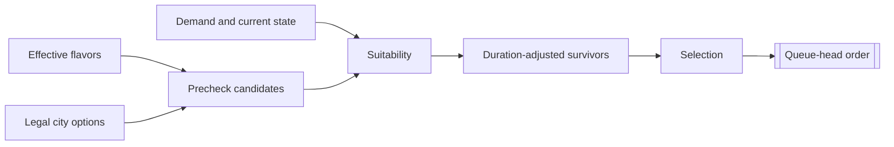

# Unit AI: Production

**City production** selects a **queue-head order**, the next order for one city. In the **Vox Populi 5.2.7** baseline, `CvCityStrategyAI::ChooseProduction` compares units, buildings, projects, and processes using legal options, flavor-derived preferences, and current demand. The selected order becomes `ORDER_TRAIN`, `ORDER_CONSTRUCT`, `ORDER_CREATE`, or `ORDER_MAINTAIN`.

This page defines the shared comparison. [Military production](military-production.md) and [civilian production](civilian-production.md) define the demand and suitability rules that supply unit candidates.

## Candidate lifecycle

A **candidate** is an option the city can compare. A **precheck candidate** is a legal option with a positive base weight. **Suitability** is the current-state evaluation that revises a candidate's weight or removes it from normal selection. A **survivor** is a candidate with a positive suitability result.

1. **Build the precheck list.** The city collects ordinary units, buildings, projects, processes, and requested units with positive base weights. A process enters the list when raw production is at least five per turn, or when no other precheck candidate exists. A legal defense process receives a base weight of 100.
2. **Evaluate suitability.** The production AI for each candidate type returns a revised weight when the candidate reaches its sanity check. Positive results become survivors. Nonpositive results are excluded from normal selection and recorded as `SKIPPED`.
3. **Adjust for duration.** The city discounts every survivor by its remaining construction time, sorts the result, and records `POST`.
4. **Restore the precheck list when all candidates fail.** The **all-failed fallback** uses the precheck list when suitability produces no survivors. It can therefore select a candidate that suitability rejected.
5. **Select the queue head.** The city keeps a current unit, building, or project within half of the leading score, subject to interruption rules. A valid victory-condition project within that band and a leading defense process are selected directly. Otherwise the city makes a weighted random choice among candidates above `CityProductionChoiceCutoffThreshold` percent of the leading score. Processes do not receive current-build inertia.

`PRE` records the sorted precheck list, and `POST` records the duration-adjusted survivors. Both lists contain only legal candidates with positive base weights.

## Shared candidate gates

**Common city gates** decide whether unit candidates can enter or proceed through the shared comparison. Role-specific gates and score effects belong to the [military](military-production.md) and [civilian](civilian-production.md) guides.

| Gate | Effect |
| --- | --- |
| Trainability and base weight | An ordinary unit must be trainable in the city and have a positive flavor-derived base weight. Requested units must resolve to a concrete trainable unit. |
| Puppet city | Every non-purchase unit candidate is rejected. |
| Developing city | A city with fewer than two buildings rejects non-purchase unit candidates, except while under siege. |
| Siege | During siege, ordinary noncombat candidates are rejected. Combat-capable explorers can remain eligible. |
| Request muster city | An operation-request or army-request candidate reaches `CheckUnitBuildSanity` only when the next operation request names this city as its muster city. [Military production](military-production.md#shared-muster-city-gate) explains the army-request consequence. |

An operation request and an army request can identify the same concrete unit as an ordinary candidate. Each form remains a separate candidate with its own weight.

## Candidate sources and base weights

| Candidate | Source | Base weight |
| --- | --- | --- |
| Ordinary unit | A trainable unit's XML flavor affinities mapped through the city's effective flavors. | Flavor-derived unit weight. |
| Operation request | The concrete unit for the city's next operation slot. | Operation base value, offense flavor, operation skip counter, and the unit's flavor-derived weight. |
| Army request | The concrete unit for a free required army slot. | Army base value and offense flavor. |
| Building | A legal building's XML flavor affinities. | Flavor-derived building weight. |
| Project | A legal project's XML flavor affinities. | Flavor-derived project weight. |
| Process | A legal process's XML flavor affinities. | Flavor-derived process weight, or 100 for a defense process. |

**Effective flavors** are city preference values. Each production AI combines them with an entry's XML flavor affinities to form its base weight. Vox Deorum custom flavors add signed adjustments to the normal flavor state. [Flavors](overview.md#flavors) explains their inputs and duration.

## Timing and feedback

`CvCityStrategyAI::FlavorUpdate` rebuilds flavor-derived caches in the city's production AIs. A specialization change marks production dirty, and the next flavor update refreshes the cached base weights. Demand and suitability are evaluated each time the city chooses production.

`CvCity::doProduction` requests a choice when a city has no production, maintains a process, or is marked dirty. Completing the final queued order also requests a choice.

The **operation skip counter** is a player-level pressure value: entering an operation-request candidate in precheck increments it, and selecting that candidate resets it. The **settler skip counter** increments once when a city skips an available settler, then resets when a city starts a settler or no settler is available.

## Boundaries and implementation

The shared lifecycle starts when `CvCity::doProduction` requests a choice. `CvCityAI::AI_chooseProduction` handles spaceship and wonder boundaries, `CvCityStrategyAI::ChooseProduction` builds and selects candidates, type-specific production AI supplies base weights and suitability, and `CvCity::pushOrder` records the order.

Related paths have their own owners:

- Player-level spaceship planning coordinates spaceship-part production.
- Wonder specialization can preserve or directly start a selected wonder.
- Purchase paths create a unit immediately rather than adding a queue order.
- `CvCity::CheckForOperationUnits` can commit a city to train an operation unit or purchase one.

## Reading production logs

With AI logging enabled, read the lifecycle through `PRE`, `SKIPPED`, `POST`, and `CHOSEN`. `CHOSEN` can differ from the first `POST` entry because normal selection is weighted and random among leading candidates. A requested candidate can occur in `PRE` and disappear before `POST` without `SKIPPED` if it fails the muster-city gate. Together, the records show whether a candidate did not enter precheck, failed suitability, lost selection, or returned through the all-failed fallback.
