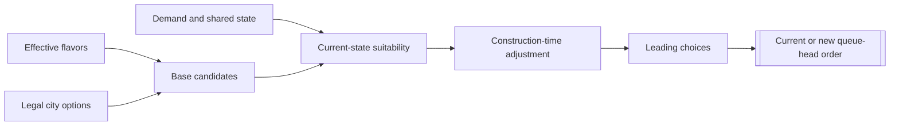

# Unit AI: Production

City production chooses whether to keep the current queue head or replace it with one unit, building, project, or process. It turns legal city options, flavor-derived base weights, and current demand into an `OrderTypes` entry. It does not decide empire-wide needs or complete the selected item.

The common candidate lifecycle lives in `CvCityStrategyAI::ChooseProduction`. Unit-specific suitability rules are detailed in [military production](military-production.md) and [civilian production](civilian-production.md).

## Candidate lifecycle

The terms below describe one pass through `ChooseProduction`.

1. **Build precheck candidates.** A precheck candidate is a legal option with a positive base weight. The city collects ordinary units, buildings, projects, processes, and any requested units. A process is considered only when raw production is at least five per turn, unless no other precheck candidate exists. A legal defense process always receives base weight 100 in place of its flavor weight.

2. **Record the precheck list.** The `PRE` production log records these candidates after they are sorted. The list cannot contain an illegal option or one with a nonpositive base weight.

3. **Apply suitability.** Each candidate that reaches its current-state sanity check receives a suitability result. A positive result is the revised weight. A nonpositive result rejects the candidate from the normal comparison and records it as `SKIPPED`. A requested unit that fails the muster-city gate does not reach the sanity check, so it can disappear without a `SKIPPED` entry.

4. **Form survivors.** A survivor is a precheck candidate with a positive suitability result. The city discounts each survivor by its remaining construction time, sorts the results, and records them as `POST`. Like `PRE`, `POST` contains neither illegal nor nonpositive-base options.

5. **Use the all-failed fallback when necessary.** If there are no survivors, the city restores the precheck list. This all-failed fallback can select an option that suitability rejected, so suitability rules express current preferences rather than absolute prohibitions.

6. **Select an order.** The city keeps a current unit, building, or project whose weight stays at least half of the leading score, subject to interruption rules. A project tied to a valid victory condition is selected directly when it is within that half-of-leading band, even if it is not the current build. When the top choice is a defense process, it is also selected directly. Otherwise the city makes a weighted random choice among the candidates above `CityProductionChoiceCutoffThreshold` percent of the leading score. Processes do not receive current-build inertia. The winner becomes `ORDER_TRAIN`, `ORDER_CONSTRUCT`, `ORDER_CREATE`, or `ORDER_MAINTAIN` at the queue head.

## Implementation trace

The lifecycle begins when `CvCity::doProduction` requests a choice. `CvCityAI::AI_chooseProduction` handles spaceship and wonder boundaries, then `CvCityStrategyAI::ChooseProduction` builds, evaluates, and selects candidates. The type-specific production AI supplies the flavor weight and suitability result. Finally, `CvCity::pushOrder` records the selected order.

Related paths stay outside this lifecycle:

- Player-level spaceship planning owns spaceship-part production.
- Wonder specialization can preserve or directly start a selected wonder.
- Purchase paths use related weights and suitability checks, but make an immediate acquisition rather than a queue order.
- `CvCity::CheckForOperationUnits` can separately commit a city to an operation unit.

## Candidate types

| Candidate type | Precheck source and base weight | Suitability result |
| --- | --- | --- |
| Ordinary unit candidate | A trainable unit with a positive flavor-derived base weight. | `CvUnitProductionAI::CheckUnitBuildSanity` applies shared, military, or civilian conditions. |
| Operation-request candidate | The concrete unit returned for this city's next operation request. Its base weight combines the operation base value, offense flavor, the operation skip counter, and the unit's flavor-derived weight. | It is checked only while this city is the request's muster city. |
| Army-request candidate | A concrete trainable unit for a free required army slot. Its base weight combines the army base value and offense flavor. | It uses the same muster-city gate as an operation-request candidate before its unit suitability check. |
| Building candidate | A legal building with a positive flavor-derived base weight. | `CvBuildingProductionAI::CheckBuildingBuildSanity` applies building state. |
| Project candidate | A legal project with a positive flavor-derived base weight. | `CvProjectProductionAI::CheckProjectBuildSanity` applies project state. |
| Process candidate | A legal process with a positive flavor-derived base weight, except that a defense process receives 100. | `CvProcessProductionAI::CheckProcessBuildSanity` applies process state. |

The ordinary, operation-request, and army-request forms can name the same unit and still compete as separate candidates. Neither request reserves production or guarantees a win. The role, demand, and feasibility rules behind unit suitability belong in [military production](military-production.md) and [civilian production](civilian-production.md).

All non-purchase unit candidates are rejected in puppet cities. The fewer-than-two-buildings rejection also applies to non-purchase unit candidates, except while the city is under siege. A rejected unit can still return through the all-failed fallback.

## Flavors

Each production AI maps the city's effective flavors through an entry's XML flavor affinities to make its base weight. Vox Deorum custom flavors are additive adjustments to the normal flavor state. [The flavor overview](overview.md#flavors) explains their inputs and lifetime.

## Timing and feedback

`CvCityStrategyAI::FlavorUpdate` rebuilds the flavor-derived caches in the per-city production AIs. A specialization change updates the city flavor state and marks production dirty, but its cached base weights wait for the next flavor update. Demand and suitability are evaluated again whenever a production choice runs.

`CvCity::doProduction` requests a choice when the city has no production, maintains a process, or is marked dirty. Completing the final queued order can also request one. The lifecycle runs at queue boundaries and explicit reconsideration points, not during every production calculation.

Two player-level counters provide feedback:

- When an operation-request candidate enters precheck, the operation skip counter increments. Selecting that operation-request candidate resets it.
- When an available settler is not started, the settler skip counter increments once for that production choice. Starting a settler, or having no available settler, resets it.

## Reading production logs

With AI logging enabled, use `PRE` to see legal positive-base candidates, `SKIPPED` for nonpositive sanity results, `POST` for duration-adjusted survivors, and `CHOSEN` for the selected order. Because selection is a weighted random choice among the leading candidates, `CHOSEN` is not always the first `POST` entry. A requested candidate can appear in `PRE` and disappear before `POST` without a `SKIPPED` entry when it fails the muster-city gate. Otherwise, comparing entries shows whether an option was absent before precheck, rejected by suitability, survived but lost, or returned through the all-failed fallback.
