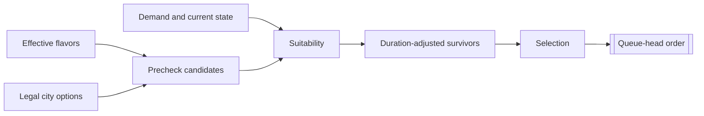

# Unit AI: Production

**City production** selects the next order for one city. In the **Vox Populi 5.2.7** baseline, `CvCityStrategyAI::ChooseProduction` compares legal units, buildings, projects, and processes using flavor preferences and current demand. The result becomes a train, construct, create, or maintain order.

This page defines the shared comparison. [Military production](military-production.md) and [civilian production](civilian-production.md) define the demand and suitability rules that supply unit candidates.

## Candidate lifecycle

A **candidate** is a legal option with a positive base weight. **Suitability** adjusts that weight for current conditions or removes the candidate from normal selection.

1. **Build the precheck list.** The city collects legal options with positive base weights. Processes normally require at least five production per turn, but can enter when no other option does.
2. **Evaluate suitability.** Each production AI adjusts its candidates for current conditions. Nonpositive results leave normal selection and are logged as `SKIPPED`.
3. **Adjust for duration.** A nonlinear penalty lowers the weight of slow builds. Normal production applies it after suitability; purchase evaluation applies it before suitability.
4. **Recover from an empty result.** If every candidate fails suitability, the **all-failed fallback** restores the precheck list. It can therefore select an option that suitability rejected.
5. **Select the order.** Current production receives some inertia, and valid victory projects or defense processes can win directly. Otherwise the city chooses randomly among candidates close enough to the leading weight. Processes receive no current-build inertia.

`PRE` records the sorted precheck list, and `POST` records the duration-adjusted survivors. Both lists contain only legal candidates with positive base weights.

## Shared candidate gates

**Common city gates** decide whether unit candidates can enter or proceed through the shared comparison. Role-specific gates and score effects belong to the [military](military-production.md) and [civilian](civilian-production.md) guides.

| Gate | Effect |
| --- | --- |
| Trainability and base weight | An ordinary unit must be trainable in the city and have a positive flavor-derived base weight. Requested units must resolve to a concrete trainable unit. |
| Puppet city | Every non-purchase unit candidate is rejected. |
| Developing city | A city with fewer than two buildings rejects non-purchase unit candidates, except while under siege. |
| Siege | During siege, ordinary noncombat candidates are rejected. Combat-capable explorers can remain eligible. |
| Request muster city | An operation-request or army-request candidate reaches `CheckUnitBuildSanity` only when the next operation request names this city as its muster city. [Military production](military-production.md#formation-requests-and-commitments) explains the army-request consequence. |

An operation request and an army request can identify the same concrete unit as an ordinary candidate. Each form remains a separate candidate with its own weight.

## Candidate sources and base weights

| Candidate | Source | Base weight |
| --- | --- | --- |
| Ordinary unit | A trainable unit's XML flavor affinities mapped through the city's effective flavors. | Flavor-derived unit weight. |
| Operation request | The concrete unit for an operation's next required formation slot. | Operation base value, offense flavor, operation skip counter, and the unit's flavor-derived weight. |
| Army request | The concrete unit for a free required formation slot selected across armies. | Army base value and offense flavor. |
| Building | A legal building's XML flavor affinities. | Flavor-derived building weight. |
| Project | A legal project's XML flavor affinities. | Flavor-derived project weight. |
| Process | A legal process's XML flavor affinities. | Flavor-derived process weight, or 100 for a defense process. |

**Effective flavors** are city preference values. Each production AI combines them with an entry's XML flavor affinities to form its base weight. For each unit flavor, `CvUnitProductionAI::AddFlavorWeights` multiplies the unit's XML affinity by the signed square root of ten times the city flavor value, then sums the products. The square root compresses large swings in city flavors, keeping XML differences between unit types decisive. Vox Deorum custom flavors add signed adjustments to the normal flavor state. [Flavors](concepts.md#flavors) explains their inputs and duration.

## Timing and feedback

`CvCityStrategyAI::FlavorUpdate` rebuilds flavor-derived caches in the city's production AIs. A specialization change marks production dirty, and the next flavor update refreshes the cached base weights. Demand and suitability are evaluated each time the city chooses production.

`CvCity::doProduction` requests a choice when a city has no production, maintains a process, or is marked dirty. Completing the final queued order also requests a choice.

Two player-level counters add pressure to repeatedly skipped needs. An operation request gains pressure whenever it enters precheck and resets after a related purchase, training selection, or committed order. A settler gains pressure when a city skips an available settler and resets when production starts one or no settler is available.

## Boundaries and implementation

The shared lifecycle starts when `CvCity::doProduction` requests a choice. `CvCityAI::AI_chooseProduction` handles spaceship and wonder boundaries, `CvCityStrategyAI::ChooseProduction` builds and selects candidates, type-specific production AI supplies base weights and suitability, and `CvCity::pushOrder` records the order.

Related paths have their own owners:

- Player-level spaceship planning coordinates spaceship-part production.
- Wonder specialization can preserve or directly start a selected wonder.
- Purchase paths create a unit immediately rather than adding a queue order.
- `CvCity::CheckForOperationUnits` can commit a city to train an operation unit or purchase one.

## Reading production logs

With AI logging enabled, read the lifecycle through `PRE`, `SKIPPED`, `POST`, and `CHOSEN`. `CHOSEN` can differ from the first `POST` entry because normal selection is weighted and random among leading candidates. A requested candidate can occur in `PRE` and disappear before `POST` without `SKIPPED` if it fails the muster-city gate. Together, the records show whether a candidate did not enter precheck, failed suitability, lost selection, or returned through the all-failed fallback.
