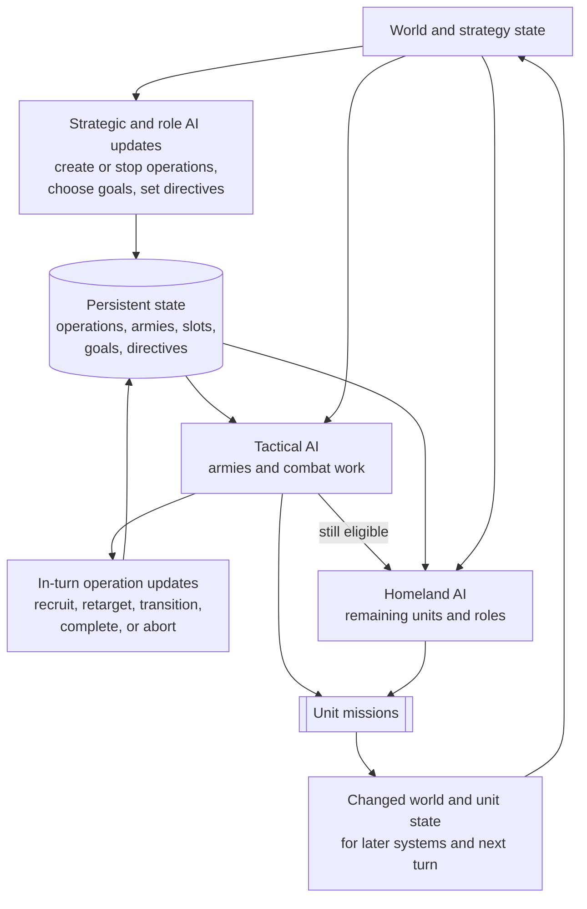

# Unit AI: Unit Operation

Unit operation assigns actions to units that already exist. During the player unit update, it turns persistent operation state, tactical targets, role objectives, and remaining movement into missions such as moving, attacking, building, founding, trading, or skipping. It does not decide which units to create or when the empire should start a military campaign.

This page explains the shared control flow. [Military unit operation](military-unit-operation.md) covers armies and combat units. [Civilian unit operation](civilian-unit-operation.md) covers civilian roles and missions.

The relevant code is in `civ5-dll/CvGameCoreDLL_Expansion2`, primarily `CvPlayerAI.cpp`, `CvTacticalAI.cpp`, `CvHomelandAI.cpp`, `CvAIOperation.cpp`, `CvArmyAI.cpp`, and `CvUnit.cpp`.

## Per-turn lifecycle

Here, **unit operation** means the full per-turn assignment process. A `CvAIOperation` is narrower: it is a persistent plan that keeps an army, formation, muster point, and target across turns.

Persistent state is both input and output. Several systems write it before, during, and after unit movement:

| Writer | Persistent changes |
| --- | --- |
| Economic and Military AI | Create operations, refresh strategic targets, stop obsolete operations, and choose new targets and muster points through operation initialization. |
| City and unit events | Commit or uncommit requested slots, attach finished or recruited units to formation slots, and reopen slots when units are removed. |
| `CvAIOperation::DoTurn` | Update reserve membership, checkpoint timing, target validity, movement progress, last-moved turn, army state, operation state, and abort reason. |
| Operation and army cleanup | Release unit army IDs, delete finished or invalid armies and operations, and leave surviving units available to later controllers. |
| Role systems | Refresh durable directives, such as Great Person use, and reconstruct per-turn role plans such as builder, trade, religion, and exploration targets. |

Missions then change unit position, movement, health, ownership, and the map. Later systems see those changes immediately, while the next strategic update uses them to revise or replace the persistent state. `CvPlayerAI::AI_unitUpdate` runs Tactical AI before Homeland AI for a normal AI player, so Homeland AI sees both the updated operation state and the results of Tactical missions.

1. **Update durable intent.** Strategic, role, city, and lifecycle systems create, revise, or remove operations, armies, slots, goals, and directives.
2. **Refresh tactical state.** `CvTacticalAI::Update` refreshes visibility, removes expired focus areas, and discovers targets before recruiting units.
3. **Recruit tactical units.** `CvTacticalAI::RecruitUnits` builds a current-turn list from eligible combat, ranged, air, and combat-support units. Army members are marked for operation movement instead of entering the ordinary list.
4. **Move operations and update their state.** Tactical AI calls each operation's `DoTurn`, which moves its army and then checks the transition to the next stage. Failed and completed operations release their units through cleanup.
5. **Assign other tactical work.** Tactical AI processes combat zones and global priorities, and leaves any still-eligible units available for the later pass.
6. **Recruit the remainder.** `CvHomelandAI::RecruitUnits` rebuilds its own list. It excludes dead units, units without movement, units already processed, and units that still belong to an army.
7. **Assign homeland work.** Homeland AI plans improvements, builds role targets, and runs ordered passes for civilian jobs and remaining military jobs.
8. **Close gaps.** Each system reviews unassigned units. Homeland AI finally continues a valid queued mission, sends an idle unit toward friendly territory where possible, skips it, or applies its stranded naval-unit fallback.

An assignment can issue more than one mission or leave movement for a later pass. `TurnProcessed` means that later AI systems should not claim the unit again. It is not simply a synonym for zero movement.

## Control state

| State | Purpose |
| --- | --- |
| Remaining movement and `canMove` | Determine whether the unit can still receive an action this turn. |
| `TurnProcessed` | Excludes a unit after an AI path has finished with it, even if a special action left movement available. |
| Army ID and formation slot | Keep an operation unit under army movement and out of ordinary Homeland recruitment. |
| Tactical and Homeland move tags | Record which move category last claimed the unit for diagnostics. They are results, not durable objectives. |
| Current-turn unit lists | Give Tactical and Homeland AI separate working sets. A unit is removed when that system calls `UnitProcessed`. |
| Mission queue | Carries the executable move, attack, build, or special action. A valid unfinished mission can continue; a contradictory current-turn queue is cleared by the fallback checks. |

The move tags are mutually exclusive in normal use. Setting a Homeland move clears the Tactical move. Persistent intent instead lives in operation state, army membership, a role-specific directive, or a saved target such as `TacticalAIPlot`.

## Routing by unit kind

| Unit kind | First normal owner | Later handling |
| --- | --- | --- |
| Operation army member | `CvAIOperation` and Tactical AI | Moves with its army. Homeland AI excludes it while the army ID remains set. |
| Independent combat, ranged, or combat-support unit | Tactical AI | Homeland AI can use it if Tactical AI leaves it unprocessed with movement. |
| Explorer | Homeland AI | `CvUnit::canUseForTacticalAI` explicitly excludes land and sea explorer roles. |
| Ordinary civilian | Homeland AI | Safety, role logic, or a civilian `CvAIOperation` owns its work. |
| Combat-ready aircraft | Tactical AI | Aircraft that should rebase are left for Homeland AI. |
| Carrier or nuclear unit assigned to an operation | Operation and army movement | Their specialized operation logic supplies the target and formation behavior. |
| Automated human unit | Homeland AI automation path | Normal AI operations and ordinary AI Tactical recruitment do not take control. |

This routing is a claim order, not a permanent division between two unit types. Homeland AI also performs military upgrades, opportunity attacks, garrisoning, healing, sentry moves, patrols, and aircraft rebasing.

## Priority and fallthrough

Both controllers use ordered move passes. A pass filters the current-turn list for suitable units, scores or selects an action, issues missions, and normally marks completed units processed. Later passes see only what remains eligible.

Tactical AI gives operation armies and urgent combat work the first claim. It then handles zone combat, reinforcements, opportunistic global work, defensive positioning, and safety. Homeland AI gives special and role-specific actions their configured order, moves endangered units to safety before most remaining military housekeeping, and ends with role fallbacks.

This differs from [production](production.md#candidate-lifecycle). There is no shared weighted comparison in which every possible unit action competes at once. Ordering, eligibility, local scoring, and whether an earlier pass consumes movement determine the result.

## Flavors and boundaries

Unit operation has no general flavor-to-action weight map. Flavors and AI strategy state usually act upstream by creating operations, choosing targets, or defining strategic demand. Current danger, reachable plots, tactical posture, army state, and role directives dominate the per-turn action.

The one direct tactical flavor use, `FLAVOR_OFFENSE` in `TacticalAIHelpers::FindBestUnitAssignments`, is described in the [flavor overview](overview.md#flavors) together with the broader custom-flavor behavior.

## Implementation trace

Follow a normal AI unit turn through these entry points:

1. `CvPlayerAI::AI_unitUpdate` calls `CvTacticalAI::Update`, then `CvHomelandAI::Update`.
2. `CvTacticalAI::RecruitUnits` and `ProcessDominanceZones` route armies and tactical units.
3. `CvAIOperation::DoTurn` and `Move` dispatch army movement through Tactical AI.
4. `CvHomelandAI::RecruitUnits`, `FindHomelandTargets`, and `AssignHomelandMoves` route the remaining units.
5. `CvTacticalAI::UnitProcessed` or `CvHomelandAI::UnitProcessed` records the move category and sets `TurnProcessed`.
6. The selected path pushes one or more `CvUnit` missions, which perform the actual game actions.

## Reading operation logs

With AI logging enabled, use `PlayerTacticalAILog.csv` for recruitment, zones, targets, and tactical assignments; `PlayerHomelandAILog.csv` for role passes and fallbacks; and `OperationalAILog.csv` for persistent operation states, armies, targets, transitions, and aborts. When split AI logs are enabled, the player name is added to each filename.

Start with the unit's Tactical or Homeland move tag, then check whether it belonged to an army and whether `TurnProcessed` or remaining movement prevented a later pass. For an army member, correlate the same turn in the operational and tactical logs.
