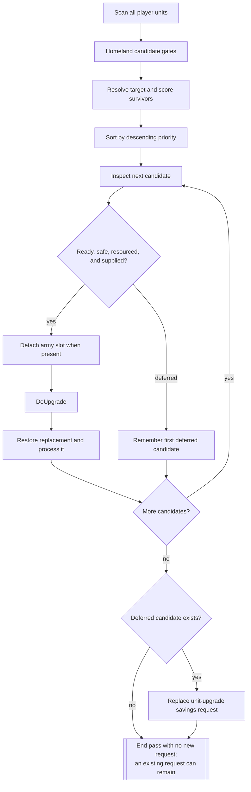
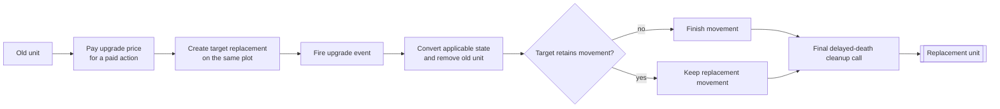

# Unit AI: Upgrade

An **upgrade** replaces an existing unit with a newer civilization-specific unit. A **replacement** is the new unit that inherits the old unit's applicable state. The **upgrade target** is the civilization-specific type resolved from the unit's upgrade class, including a valid trait-provided special target. This page covers both ways a veteran unit grows: replacing it through an upgrade and choosing its promotions ([Promotion AI](#promotion-ai)).

The main ranked pass is a **Homeland pass**, an ordered `CvHomelandAI` assignment pass for units available to Homeland control. Tactical AI and Army AI also use the shared upgrade action at tactical opportunities. The relevant code is in `civ5-dll/CvGameCoreDLL_Expansion2/CvHomelandAI.cpp`, `CvUnit.cpp`, `CvTacticalAI.cpp`, `CvArmyAI.cpp`, `CvEconomicAI.cpp`, and `CvPlayerAI.cpp`.

## Homeland upgrade pass

`CvHomelandAI::PlotUpgradeMoves` scans all AI-controlled units, including those currently associated with armies. It ranks candidates, upgrades each candidate that remains legal and safe as gold is spent, then reserves gold for the leading deferred candidate through a [savings request](acquisition.md#savings-priorities).

Takeaway: Homeland continues after each upgrade or deferral. It replaces the savings request only for the first candidate that remains deferred, and an existing request can remain when no candidate is deferred.

| Layer | Applied rules |
| --- | --- |
| Homeland candidate | The unit is AI-controlled, can move, is alive beyond this turn, stands in owner territory in its native domain, and is unembarked. |
| Upgrade target | `CvUnit::GetUpgradeUnitType` resolves the civilization-specific target. The Homeland pass also requires its prerequisite technology. Game events can veto the normal target and traits can supply a special target. |
| Shared action | `CvUnit::CanUpgradeRightNow` reaches `CanUpgradeTo`, which validates readiness, the target technology and project, a legal end-turn plot and upgrade territory, capacity, cargo compatibility, gold, strategic resources, and an air-unit city or carrier. Game events can veto the action. |
| Homeland safety and supply | Danger stays below current hit points. `HasResourceForNewUnit` repeats the replacement resource check. An out-of-supply unit cannot become supply-consuming while the player is at or above its [supply cap](concepts.md#supply). |

The shared territory rule accepts the applicable vassal or city-state territory. Homeland candidates start on owner plots, which makes its pass narrower than the shared action.

## Ranking and gold reservation

| Signal | Effect on Homeland priority |
| --- | --- |
| Current unit power | Lower-power unit types rank first. |
| Immediate readiness and safe local danger | Adds the largest upgrade boost. |
| Owner territory | Adds a smaller fallback boost for a unit that cannot upgrade immediately. |
| Air or sea domain | Doubles the score before experience. |
| Experience | Adds the final experience bonus. |

The stable descending sort determines the upgrade order and the first candidate retained for savings. Each completed action spends gold before the next candidate is tested. When candidates remain, Homeland cancels the existing `PURCHASE_TYPE_UNIT_UPGRADE` request and starts a new one for the first deferred candidate's price. Its priority is 500 plus 100 per point of the military-training flavor; at war the flavor value counts fifty-fold, so a wartime upgrade request outranks every competing [savings priority](acquisition.md#savings-priorities). When no candidates remain, the current source calls cancellation only when no unit-upgrade request is recorded, leaving an existing request in place.

## Replacement state

`CvUnit::DoUpgrade` calls `DoUpgradeTo`, pays the upgrade price for a paid action, creates the replacement on the unit's plot, converts its state, and removes the old unit.

Takeaway: an upgrade pays and creates the replacement first, then conversion removes the old identity. The replacement follows its movement rule before final cleanup runs.

| State area | Replacement handling |
| --- | --- |
| Identity and location | Receives the resolved target type, owner, plot, name, and applicable visual state. |
| Combat progress | Carries promotions, experience, damage, movement state, and other unit conversion state. |
| Commands and missions | Clears current activity and mission state for the replacement action. |
| Army membership | Homeland removes the old unit from its army slot before upgrade, then restores the replacement to that slot when the army still exists. [Membership changes and release](military-organization.md#membership-changes-and-release) covers the slot mechanics. |
| Turn ownership | Homeland processes the old unit ID and marks the replacement `TurnProcessed`, preventing another controller from claiming it that turn. |

`CvUnit::convert` carries compatible promotions, experience, level, name, damage, origin, transport relationships, and ownership history. Promotions that no longer fit the target combat class can convert to replacement experience. The target unit's upgrade rule decides whether movement ends. `CvUnit::upgradePrice` combines base cost, positive production difference, era, handicap, AI, unit discount, player modifier, exponent, and display-rounding settings. Minor civilizations and barbarians receive a zero price.

## Caller-specific policies

| Caller | Opportunity and policy |
| --- | --- |
| Homeland AI | Performs the all-unit ranked pass, owner-territory candidate gate, danger test, repeated resource test, supply policy, army-slot restoration, and savings request. |
| Tactical AI | Attempts upgrades during several tactical moves when the unit is ready and unharmed. It applies the supply policy, then processes the replacement. |
| Army AI | Can upgrade army units through its shared action path. The caller retains responsibility for the army context and follow-up processing. |
| Automatic free upgrade | Technology acquisition and unit creation can apply a free target upgrade when the target can train. It uses the shared target and replacement primitives without Homeland ranking or gold cost. |
| Human or scripted action | Unit commands and Lua wrappers expose the shared eligibility and replacement actions. |

The supply policy permits an upgrade when the player has [supply](concepts.md#supply) capacity or the original unit already consumes supply. It avoids adding a supply burden from a no-supply unit while the player is over capacity.

## Promotion AI

**Promotion selection** spends a unit's earned promotions. `CvPlayerAI::AI_doTurnUnitsPost` runs it for every unit after the movement phase, at the end of `CvPlayer::doTurnUnits`; an [emergency purchase](acquisition.md) promotes its fresh unit immediately because that pass has already run for the turn.

`CvUnit::AI_promote` scores every promotion the unit can legally take through `AI_promotionValue`, an additive sum over more than a hundred promotion effect fields. Each field's weight combines up to ten personality flavors — offense, defense, city defense, ranged, recon, mobile, naval, naval recon, air, and anti-air — with the unit's domain and whether it attacks at range. The unit's [UnitAI role](concepts.md#unitai-roles) is never consulted. Custom flavors override the personality reads ([flavors](concepts.md#flavors)), so promotion taste is externally steerable.

Four adjustments then shape the raw scores:

- A tier-1 root promotion, one with no prerequisite, is scaled by (level − 1)/(level + 1) from level 2 upward, nudging leveled units into deeper promotion trees.
- Each candidate adds half the value of the best promotion it unlocks, a one-ply lookahead.
- A uniform random bonus between zero and 100 percent of the score makes near-equal candidates coin flips.
- An instant-heal promotion gains a flat bonus large enough to usually win outright when the unit is at half health or less.

The best candidate is taken, and the pass recurses so a unit with several banked promotions spends them all in one turn. With AI logging enabled, every scored candidate and the chosen promotion appear in `PromotionLog.csv`.

## Implementation and diagnostics

1. `CvHomelandAI::AssignHomelandMoves` calls `PlotUpgradeMoves` late in the Homeland turn, after Tactical AI and most earlier Homeland passes.
2. `PlotUpgradeMoves` ranks candidates, performs safe upgrades, restores army membership, and refreshes the unit-upgrade savings request.
3. `CvUnit::CanUpgradeRightNow`, `CanUpgradeTo`, `DoUpgrade`, and `DoUpgradeTo` validate and create the replacement.
4. Tactical and Army AI can invoke the same action during their own movement paths.

With AI logging enabled, `PlayerHomelandAILog.csv` records candidate selection, upgrades, and savings requests. Inspect the unit's target, local danger, strategic-resource state, supply count, gold, and army slot when a ranked candidate remains deferred.
