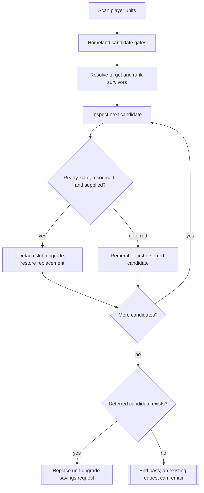
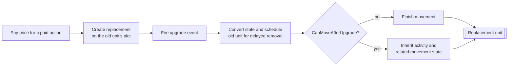

# Unit AI: Upgrade

An **upgrade** replaces an existing unit with a newer civilization-specific type. The **upgrade target** is the type resolved from the unit's upgrade class, including a valid trait-provided special target. The **replacement** inherits the old unit's applicable state.

This page also covers **promotion selection**, the separate process that spends earned promotions. Read [Promotion AI](#promotion-ai) if that is your task; promotion selection does not use the upgrade ranking or replacement path.

The main code is in `civ5-dll/CvGameCoreDLL_Expansion2/CvHomelandAI.cpp`, `CvUnit.cpp`, `CvTacticalAI.cpp`, `CvArmyAI.cpp`, `CvEconomicAI.cpp`, and `CvPlayerAI.cpp`.

## Homeland upgrade pass

`CvHomelandAI::PlotUpgradeMoves` scans AI-controlled units, including army members. It ranks candidates, upgrades those still legal and safe as it spends gold, then makes a [savings request](acquisition.md#savings-and-investment) for the leading deferred candidate.

| Layer | Applied rules |
| --- | --- |
| Homeland candidate | AI-controlled, able to move, alive beyond this turn, on an owner-territory plot in its native domain, and unembarked. |
| Upgrade target | `CvUnit::GetUpgradeUnitType` resolves the civilization-specific target. Homeland also requires its prerequisite technology. Events can veto the normal target; traits can supply a special target. |
| Shared action | `CvUnit::CanUpgradeRightNow` and `CanUpgradeTo` validate readiness, target technology and project, a legal end-turn plot and territory, capacity, cargo compatibility, gold, strategic resources, and an air-unit city or carrier. Events can veto the action. |
| Homeland safety and supply | Local danger must stay below current hit points. `HasResourceForNewUnit` repeats the replacement resource check. An out-of-supply unit cannot become supply-consuming while the player is at or above the [supply cap](concepts.md#supply). |

The shared territory rule also accepts applicable vassal or city-state territory. Homeland is narrower because its candidates begin on owner plots.

## Ranking and reservation

Homeland ranks lower-power unit types first. Immediate readiness and safe danger give the largest boost; owner territory gives a smaller fallback boost. Air and sea units double their score before experience adds the final bonus. The stable descending order determines both upgrade order and the first deferred candidate.

Every completed action spends gold before the next candidate is tested. When candidates remain, Homeland cancels the current `PURCHASE_TYPE_UNIT_UPGRADE` request and replaces it with the first deferred candidate's price. Its priority is 500 plus 100 per military-training flavor point, with that flavor counted fifty-fold at war. Any positive wartime flavor makes this the highest [savings request](acquisition.md#savings-and-investment); a zero flavor leaves it tied with the ordinary unit category. When no candidate is deferred, the current source cancels only if no unit-upgrade request is recorded. An existing request can therefore remain.

## Replacement state

`CvUnit::DoUpgrade` pays a paid action's price, creates the replacement on the old unit's plot, and fires the upgrade event. Conversion transfers state and schedules the old unit for delayed removal. The target's movement rule then either finishes the replacement's movement or copies activity and related movement state from the old unit. Minor civilizations and barbarians pay no price.

| State area | Replacement handling |
| --- | --- |
| Identity and location | Receives the resolved target type, owner, plot, name, and applicable visual state. |
| Combat progress | Carries compatible promotions, experience, damage, movement state, origin, transport relationships, and ownership history. Incompatible promotions can become replacement experience. |
| Commands and missions | Starts with no mission queue. A target that can move after upgrading copies the old unit's activity and related movement state; otherwise `finishMoves` ends movement without explicitly clearing activity. |
| Movement | The target's upgrade rule decides whether movement ends. |
| Army membership | Homeland removes the old unit from its formation slot before upgrade and restores the replacement when the army still exists. [Membership and release](military-organization.md#membership-and-release) covers the mechanics. |
| Turn ownership | Homeland processes the old unit ID and marks the replacement `TurnProcessed`, stopping another controller from claiming it that turn. |

`CvUnit::upgradePrice` accounts for base cost, positive production difference, era, handicap, AI and player modifiers, discounts, exponent, and display rounding.

## Caller-specific policies

| Caller | Opportunity and policy |
| --- | --- |
| Homeland AI | Runs the ranked all-unit pass, owner-territory and danger rules, resource and supply checks, formation-slot restoration, and savings request. |
| Tactical AI | Attempts ready, unharmed units at several tactical opportunities. It applies the supply policy and processes the replacement. |
| Army AI | Can use the shared action for army units; its caller retains army context and follow-up processing. |
| Automatic free upgrade | Technology acquisition and unit creation can apply a free target upgrade when the target can train. It uses shared target and replacement primitives without Homeland ranking or gold cost. |
| Human or scripted action | Unit commands and Lua wrappers expose the shared eligibility and replacement actions. |

The shared supply policy permits an upgrade when capacity exists or the old unit already consumes supply. It prevents a no-supply unit adding a supply burden while the player is over capacity.

## Promotion AI

`CvPlayerAI::AI_doTurnUnitsPost` runs promotion selection for every unit after movement, at the end of `CvPlayer::doTurnUnits`. An [emergency purchase](acquisition.md) promotes its fresh unit immediately because that pass has already run.

`CvUnit::AI_promote` scores every legal promotion through `AI_promotionValue`. The score uses promotion effects, the ten relevant personality flavors, unit domain, and ranged capability. It does not use the [UnitAI role](concepts.md#unitai-roles). Custom flavors override the personality reads, so Lua can steer promotion taste.

The scorer prefers deeper trees as level rises, includes half the value of the best newly unlocked promotion, adds a random bonus up to the candidate's score, and strongly favors instant heal at half health or less. It takes the best candidate and repeats until the unit has spent all banked promotions. `PromotionLog.csv` records scored candidates and the selection when AI logging is enabled.

`PlayerHomelandAILog.csv` records Homeland candidates, upgrades, and savings requests. For a deferred ranked candidate, inspect its target, local danger, strategic resources, supply count, gold, and formation slot.
