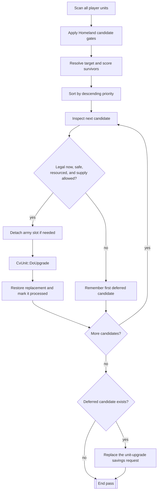
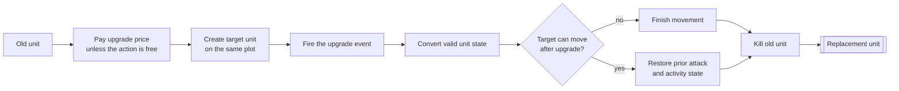

# Unit AI: Upgrade

Unit upgrade replaces an existing unit with a newer civilization-specific type. It does not add another unit or enter the city production comparison. Homeland AI owns the ranked, savings-aware pass, while Tactical AI and Army AI can use the same replacement action opportunistically.

The relevant code is in `civ5-dll/CvGameCoreDLL_Expansion2`, primarily `CvHomelandAI.cpp`, `CvUnit.cpp`, `CvTacticalAI.cpp`, `CvArmyAI.cpp`, and `CvEconomicAI.cpp`. The [unit AI overview](overview.md#runtime-order-and-conflicts) places upgrades within the full AI turn.

## Homeland upgrade flow

`CvHomelandAI::PlotUpgradeMoves` scans every AI-controlled unit, including military and civilian units. It builds one ranked list, attempts as many upgrades as current state and gold permit, then requests savings for the leading unit left behind.

The Homeland candidate gates are stricter than the shared upgrade action:

| Layer | Rules |
| --- | --- |
| Homeland candidate | The unit is AI-controlled, has movement left, is not awaiting death or projected to die next turn, occupies the owner's territory, and is in its native domain rather than embarked. |
| Upgrade target | `CvUnit::GetUpgradeUnitType` resolves an upgrade class to the owner's civilization-specific unit. Game events can veto a normal target, and a trait-provided special upgrade can replace it. Homeland also requires the target's prerequisite technology. |
| Shared action | `CvUnit::CanUpgradeTo`, normally reached through the `CanUpgradeRightNow` readiness wrapper, requires the target's technology and project, a legal end-turn plot and upgrade territory, no embarkation, unit-class capacity, compatible cargo state, enough gold and strategic resources, and a city or carrier for an air unit. Game events can veto the action. |
| Homeland policy | Danger must be lower than the unit's current hit points. The resource check is repeated for the replacement, and a no-supply unit cannot become supply-consuming when the player is already at or above the supply limit. |

The shared territory rule can allow some vassal or city-state territory. The Homeland pass still considers only units standing on plots owned by the player. A blocked unit remains available for later turns.

## Priority and savings

Homeland assigns each candidate a numeric priority before checking whether it can upgrade immediately.

| Signal | Priority effect |
| --- | --- |
| Current power | Lower-power unit types rank ahead of stronger ones. |
| Immediate action | A unit that can upgrade now and is safe from lethal local danger receives a large boost. |
| Owned territory | A candidate that cannot act immediately receives a smaller fallback boost while in owned territory. |
| Domain | Air and sea units double their pre-experience score. |
| Experience | More experienced units receive a final additive bonus. |

The stable descending sort determines both action order and the first deferred candidate. Each successful upgrade spends gold before the next candidate is checked, so one pass can modernize several units and then stop when later candidates no longer qualify.

If any ranked candidate remains, Homeland replaces the `PURCHASE_TYPE_UNIT_UPGRADE` savings request with that unit's current upgrade price. Its priority starts with `AI_GOLD_PRIORITY_UPGRADE_BASE` and adds `FLAVOR_MILITARY_TRAINING` pressure. War multiplies that flavor contribution. Economic AI arbitrates this request with other planned purchases, so it mainly protects gold for a later turn rather than restoring gold already spent earlier in the current turn.

## Replacement action

All ordinary AI paths eventually call `CvUnit::DoUpgrade`, a thin wrapper that resolves the normal target with `GetUpgradeUnitType` and calls `DoUpgradeTo`. The action creates a new unit on the same plot and removes the old unit, so callers must continue with the returned replacement pointer and ID.

`CvUnit::convert` carries forward or recalculates compatible promotions, experience, level, name, damage, origin, transport relationships, and ownership history. Promotions that no longer fit a changed combat class can become replacement experience. The target's upgrade rules decide whether movement ends. Squad membership is restored by `DoUpgradeTo`; army membership belongs to the caller, so Homeland removes the old unit from its slot and adds the replacement back to the same slot.

See [military organization](military-organization.md#replacement-loss-and-release) for the surrounding army-slot lifecycle.

`CvUnit::upgradePrice` starts with a base cost and the positive production difference between the unit types. Era, handicap, AI, unit discount, player modifier, exponent, and display-rounding settings then revise it. Minor civilizations and barbarians pay no upgrade price.

## Other upgrade paths

| Path | Behavior |
| --- | --- |
| Tactical AI | Garrison, defensive, safety, and processed-unit paths can upgrade an unharmed unit when shared legality and supply allow it. These checks use current gold and do not create the ranked Homeland savings request. A barbarian camp defender uses a separate free-upgrade path. |
| Army assignment | `CvArmyAI::AddUnit` can upgrade a legal unit before writing it into a formation slot. It applies the supply safeguard, but not Homeland's danger ranking or Tactical AI's unharmed-unit rule. |
| Automatic free upgrade | Technology acquisition and unit creation can immediately upgrade units covered by a free-upgrade unit or player trait, provided the target can be trained. This bypasses Homeland ranking and gold cost. |
| Human or scripted action | The unit command and Lua wrappers expose the same eligibility and replacement primitives. They are action entry points, not AI prioritization systems. |

These paths share `GetUpgradeUnitType`, `CanUpgradeRightNow`, and `DoUpgrade`, but their caller-specific safety and supply rules differ. `CanUpgradeRightNow` alone does not express the complete AI policy.

## Implementation trace

1. `CvHomelandAI::AssignHomelandMoves` reaches `PlotUpgradeMoves` late in the Homeland turn, after Tactical AI and earlier Homeland work have already constrained movement and gold.
2. `PlotUpgradeMoves` collects and ranks candidates, then calls `CanUpgradeRightNow` and its own danger, resource, and supply checks in priority order.
3. `CvUnit::DoUpgradeTo` pays the price, creates the target type, converts retained state, and removes the old unit.
4. Homeland restores army membership, marks both identities processed where appropriate, and sends the first deferred candidate to Economic AI as an upgrade savings request.

With AI logging enabled, successful Homeland upgrades record the old and new unit types plus the replacement location. A deferred request records the unit, available gold, required gold, and savings priority.
