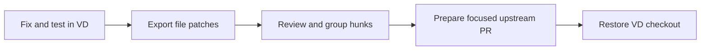
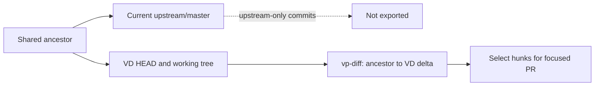

# civ5-dll: Upstream contributions

Fix and validate the behavior in a Vox Deorum line first. Then export the working delta, select the hunks that belong in Vox Populi, and prepare one focused upstream pull request.



The gamecore is the `civ5-dll` Git submodule. Its `origin` is the Vox Deorum fork (`CIVITAS-John/vox-populi`) and its `upstream` is `LoneGazebo/Community-Patch-DLL`. Maintained branches are listed in `scripts/vp-lines.txt`, currently with `vox-deorum-5.2` as the default line. Do not commit a temporary PR checkout as the outer repository's `civ5-dll` gitlink.

## The workflow

1. Make the fix on the relevant `vox-deorum-<line>` branch and test it. Build the DLL with the [civ5-dll build guide](building.md). The local batch file runs the clang SDK build; CI also checks the MSVC build.
2. Refresh the local `upstream/master` ref if needed, then export the complete delta for review:

   ```powershell
   npm run vp-diff -- --output temp/upstream-review/my-review
   ```

   `vp-diff` uses the **merge base**, the latest shared ancestor of `HEAD` and the local `upstream/master` ref. It includes committed, staged, and unstaged tracked changes, plus non-ignored untracked files. It does not fetch, check out, stage, or filter out Vox Deorum infrastructure. The output is a new directory with `index.md`, `manifest.json`, `status.txt`, one patch per file, and a combined `changes.patch`. Use `--base <ancestor>` when the automatic ancestor is not the intended comparison, and `--repo <path>` for another DLL checkout. Without `--output`, each run creates a fresh directory under the ignored `temp/upstream-review/`. Existing output directories are refused. Renames appear as deletion and addition; binary patches are included.

3. Read `index.md` and the file patches. Group only related hunks into a focused PR. Exclude connection and other Vox Deorum-only infrastructure.
4. For a committed fix, start with a clean DLL checkout, create a `pr/<slug>` branch, and port the selected change. Run these commands from the repository root:

   ```powershell
   npm run vp-pr -- new <slug>
   npm run vp-pr -- pick <commit>... --from vox-deorum-<line>
   ```

   Author the change directly on the PR branch when that is clearer. Use `new <slug> --carry` only when the current uncommitted edits are the fix; use `--stash` when unrelated edits must return with `restore`. The normal base is `upstream/master`; `new --base <ref>` is available for an explicit base.

5. Clean, build, and test the extracted change, then commit any edits. Run `npm run vp-pr -- status` and resolve the marker census before finishing:

   ```powershell
   npm run vp-pr -- finish <slug> --title "Short upstream title"
   ```

   `--body-file <path>` is optional. `--allow-markers` is an exceptional escape hatch, not the normal completion path. `finish` requires the named slug and title, checks the marker census, squashes the branch to one commit, and prints the push command and compare URL. The script never pushes or opens a pull request.

6. For a shared fix, backport the squashed commit only to maintained lines that do not already contain the fix. `backport` uses `git cherry-pick -x`; add `// Vox Deorum: upstreamed <PR URL>` markers to the backported hunks by hand, then push when ready. Restore the original checkout afterward:

   ```powershell
   npm run vp-pr -- backport <squashed-sha> --line <X.Y>
   npm run vp-pr -- restore
   ```

   An extraction of existing Vox Deorum behavior stays in the line branches until upstream accepts it. Removing that copy is a later change.



The export compares the ancestor with the current VD tree, so commits added only on the newer upstream tip are excluded. A selected PR is then recreated from the upstream base and contains only the chosen change.

## Rules for an upstream PR

- Remove `// Vox Deorum:` and Lua `-- Vox Deorum:` markers.
- Do not include `CvConnectionService.cpp`, `CvConnectionService.h`, `CvConnectionSchema.cpp`, `CvConnectionSchema.h`, `ThirdPartyLibs/ArduinoJson.hpp`, `ThirdPartyLibs/msinttypes`, or IPC glue.
- Remove `MOD_IPC_CHANNEL`. Keep a purely additive, cost-free change unconditional. If behavior or unused hot-path cost requires a switch, use a generalized VP-style CustomMods option defaulting off.
- Add no save-relevant enum values or save fields. Extend shared signatures only with defaulted parameters that preserve existing callers. Add Lua bindings without changing existing binding behavior.
- Keep the PR branch at one squashed commit based on upstream. The `pull-request-1` branch is the shape precedent.

For the detailed procedure and conflict handling, see the repository's [upstream-pr skill](../../../.agents/skills/upstream-pr/SKILL.md). The `vp-pr` source is `scripts/utilities/vp-pr.mjs`.
