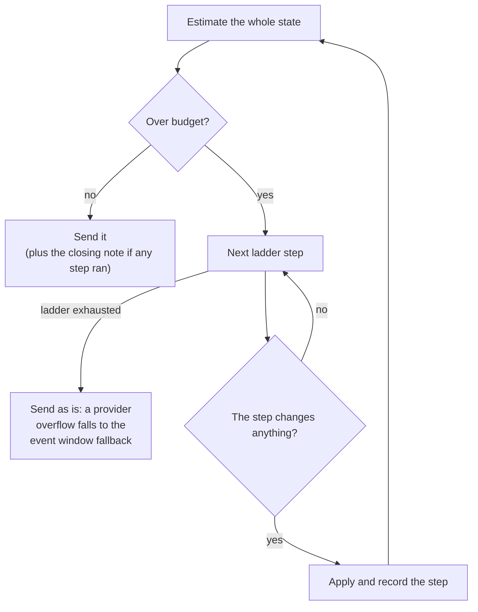

# Evaluator trimming

The evaluator strategist answers a whole decision in one evaluation call over one markdown state (see [Evaluators](evaluators.md#evaluator-strategist)). Late in a game that state outgrows the model's input limit, so `buildStrategistEvaluationState` in `src/strategist/agents/evaluator-questions.ts` shortens it with a **trim ladder**: an ordered list of cuts that removes event tiers and report details until the state fits. [Strategist triage](evaluators.md#strategist-triage) builds its state the same way, through the shared `evaluateStrategistState`, so everything here applies to it too. This page covers the budget, the ladder, what is never trimmed, how to retune it, and what trimming reports.

Paths are relative to `vox-agents/`.

## Why it exists

Late in a game, the state can stay over the limit even with every event dropped. The Players report (opinion lists and city-state relationships), the Cities report, and the Military report are large on their own. So the ladder mixes event tiers with report details, cutting low-value detail from each before the more important event tiers go.

## The budget

The state may use a share of the model's input limit, set by `evaluatorTrimConfig.budgetShare` in `src/strategist/agents/evaluator-trim-config.ts` and checked against `inputTokenLimit` in `src/utils/models/models.ts`. A model with no input limit set gets the state untrimmed.

The share leaves headroom below the limit because the token count is a local estimate (`countTokens` in `src/utils/models/token-counter.ts`) that counts fewer tokens than Jev does. The config comment records the measured gap.

## How the ladder walks

`trimToFit` in `src/strategist/agents/evaluator-trimming.ts` applies the ladder from `evaluator-trim-config.ts` to the trimmable reports (events, players, cities, military). Each step works on copies, so the cached `GameState` is never changed, and each size check re-renders the whole state, so the parts that are never trimmed still count against the budget.

- Steps run in order and are cumulative: every applied step stays in place for the next check.
- The walk stops at the first step after which the state fits.
- A step that would change nothing (the tier holds no events left, the fields are not present, the opinion lists are already short) is skipped: it is not applied, not reported, and costs no size check.
- If the whole ladder is not enough, the most trimmed state goes out as it is. A provider overflow error then falls into the event window fallback (`withEventWindowFallback`, see [Strategist](strategist.md#event-windows)), which the player loop runs for the decision and triage runs for itself.

## The ladder

The steps live in `evaluatorTrimConfig.ladder` in `src/strategist/agents/evaluator-trim-config.ts`, which is the source of truth for their order and contents; comments there explain why each group sits where it does. The general rule is to order steps by how much each cut matters to the evaluator's macro decisions (flavors, grand strategy, research, persona, and relationships), least first:

- **Early:** detail that is useless without tools (such as IDs and coordinates) or purely tactical.
- **Then:** detail the reports already sum up elsewhere, such as per-city yields that add up to civilization totals.
- **Last:** the inputs closest to war, diplomacy, and victory decisions.

The event tiers are defined by `eventImportanceTiers` in `src/utils/prompts/event-importance.ts`, shared with the player loop's event window fallback. The ladder drops them in the same order as that fallback does, from the least important up, so both paths agree on what matters.

## Never trimmed

Anything the ladder does not name stays in the state in full. Beyond that, the actions themselves set some limits no config can cross:

| Report or section | What always stays |
| --- | --- |
| System prompt, Situation, Your Civilization, Options, Strategies, Victory Progress, turn context | These are not trimmable reports, so they are always sent whole. |
| Players | Every civilization entry stays, and so does our own city-state relationship. Opinion lists can be compressed but never removed. |
| Cities | Every city stays; steps only delete listed fields from each one. |
| Military | Every tactical zone stays; steps only delete listed sections or zone fields. |
| Events | The ladder stops before `diplomacy` and `turning-points`. The outer overflow fallback may drop diplomacy last, but always preserves turning points across the pending window. |

## Opinion compression

An `opinions` step shortens both opinion lists of every major civilization with one rule (`compressOpinions` in `src/strategist/agents/evaluator-trimming.ts`):

- Factor lines end with a weight, such as `(-30)` or `(+12)`. The `keep` lines with the largest weight by absolute value stay, in their original order, and the rest merge into one line carrying their summed weight.
- Lines without a weight are summaries, such as the leader's real approach, and always stay.
- A list with no weights at all is left alone, since it cannot be ranked. Whether weights show depends on game settings, not on which list it is.
- A list that is already short enough is left alone, and if no player has anything left to compress the whole step is skipped.

For example, with `keep` at 3, a weighted list of one unweighted summary line plus factors at `(-51)`, `(-30)`, `(-12)`, `(-8)`, `(-6)`, and `(-4)` comes out as:

- The summary line, kept.
- The three largest factors (`-51`, `-30`, `-12`), kept in their original order.
- One merged line: "3 smaller factors combined (-18)".

## Editing the ladder

`evaluator-trim-config.ts` is data only: each step is an id, a short note for the model, and exactly one action. You can reorder steps, retune what they target, or add new ones without touching `evaluator-trimming.ts`, which applies whatever the config lists.

| Action | Effect |
| --- | --- |
| `events` | Drops one event tier by name. Valid names in removal order are `noise`, `economy`, `combat`, `units`, `force-changes`, `progress`, `diplomacy`, and `turning-points`. Unlisted and malformed event types count as `noise`. |
| `cityFields` | Deletes the listed fields from every city in # Cities. |
| `militaryKeys` | Deletes the listed top-level sections from # Military. |
| `militaryZoneFields` | Deletes the listed fields from every tactical zone in # Military. |
| `cityStateRelationships` | Deletes city-states' relationship entries for other civilizations, keeping ours. |
| `opinions` | Compresses major civilizations' weighted opinion lists to their `keep` largest factors plus one merged line. |

When editing:

- Step ids are kebab-case and appear in the `strategist.trim` telemetry, so prefer retuning a step's contents over renaming its id.
- Step notes are joined into the closing note, so write them as short lowercase phrases that read well after "this state was shortened".
- Adding steps is cheap: a step that matches nothing in the current state is skipped and not reported.
- Keep event steps in the shared tier order, least important first; a test checks this.
- Do not add steps for the `diplomacy` or `turning-points` tiers, so both survive every evaluator trim.

## The closing note

When at least one step ran, the state ends with a note so the model knows it is reading a partial picture. The note says the state was shortened to fit the input limit, gives the number of dropped events when there were any, and lists the applied steps' notes. For example: "Note: To fit the input limit, this state was shortened (41 events left out): minor tile and movement events left out; city economy events left out." `buildStrategistEvaluationState` appends the note after the walk ends; the walk itself is what satisfies the budget.

## Telemetry

- The active span gets `strategist.trim` (the agent span for the evaluator strategist, the turn span for triage): JSON with `steps` (the applied step ids, in order), `droppedEvents`, and `fits` (false when even the whole ladder was not enough). The shape is `StrategistTrim` in `src/types/evaluation.ts`.
- `evaluateStrategistState` in `src/strategist/agents/evaluator-questions.ts` sets the attribute before every evaluation call: JSON when trimming ran, an empty string when no trimming ran, so a retry cannot leave an earlier attempt's trim record behind.
- Error logs: `sanitizeAIError` in `src/utils/logger.ts` redacts the state and question set carried in an evaluation request, alongside the existing message redaction, so a provider overflow error does not write the game state into the logs.

## Tests

| File | Covers |
| --- | --- |
| `tests/mock/strategist/evaluator-trimming.test.ts` | The ladder walk: cumulative steps, skipped no-ops, stopping at the first fit, event steps in tier order, and the opinion compression rules |
| `tests/mock/strategist/evaluator-questions.test.ts` | State building: the budget check, the closing note, and the trim record |
| `tests/mock/utils/event-importance.test.ts` | Event tier grouping and dropping |
| `tests/mock/utils/logger-sanitize.test.ts` | Redaction of the evaluation state and questions in error logs |
