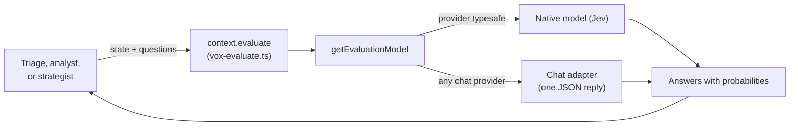
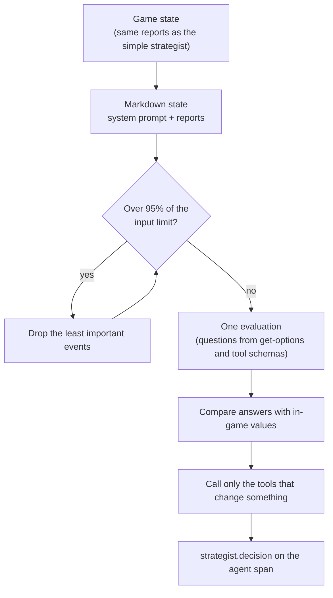

# Evaluators

An evaluator answers a fixed set of typed questions about one piece of state, in a single model call, with a probability for every possible answer. Vox Agents uses evaluators for three jobs:

| Job | What it decides | Section |
| --- | --- | --- |
| Triage | Which model tier runs an agent's turn | [Triage](#triage) |
| Diplomatic analyst | Whether to relay a diplomat's report, and how | [Diplomatic analyst](#diplomatic-analyst) |
| Evaluator strategist | A strategist seat's whole decision, without a chat loop | [Evaluator strategist](#evaluator-strategist) |

All three go through `context.evaluate`, so they share concurrency, retries, telemetry, and token accounting with ordinary agent runs.

## Questions and answers

Evaluation follows the AI SDK's `experimental_evaluate` contract. Each question has one of three types:

| Type | The question lists | The answer gives |
| --- | --- | --- |
| `choice` | Named options, each with an optional description | The most likely option, plus the probability of each option |
| `score` | Two or more ordered levels, each with a description | A probability for each level, plus their weighted position (for example 2.5, between the third and fourth levels) |
| `boolean` | Optional descriptions of true and false | The probability of true |

Tips for writing questions:

- A score is not rounded to a level. Callers map it onto their own values, so a score halfway between two levels can land halfway between their values.
- Give each level a short label as well as its value (for example `50: warm`). The model rates against the labels.

## Backends

`getEvaluationModel` in `src/utils/models/evaluation.ts` builds an evaluator from any model configuration.

| Backend | When | How it works |
| --- | --- | --- |
| Native (TypeSafe's Jev, `typesafe/jev-latest`) | The provider is `typesafe`. Needs `TYPESAFE_AI_API_KEY`. | Answers questions directly. It cannot chat, so chat model pickers hide it. |
| Chat adapter (`createLanguageModelEvaluator`) | Any other provider | Sends the state and questions in one prompt, asks for a JSON reply with a probability for every option or level, and normalizes the reply into valid answers. Helpers live in `src/utils/models/evaluation-questions.ts`. |

Anything that works with Jev also works with a chat model, without a TypeSafe key.

## Configuration

Evaluators live in the same `llms` registry as chat models, with the same alias rules, at the seat or global level.

| Key | Used by | With no assignment |
| --- | --- | --- |
| `<agent>.evaluator` | Triage for that one agent | Falls back to `evaluator` |
| `evaluator` | Triage for every agent that has it enabled | Triage is skipped, never routed to `default`. A warning appears at session start if triage was enabled. |
| `<agent>` | Evaluation agents (`diplomatic-analyst`, `evaluator-strategist`), on their ordinary model assignment | Runs on `default` through the chat adapter |

In the dashboard, Settings has an Evaluator dropdown for the shared `evaluator` alias, and the Setup wizard saves its optional Judge AI there.

**Input limit.** The `maxInputTokens` model option caps the state size in estimated tokens (`inputTokenLimit` in `src/utils/models/models.ts`).

- Default: 30,000 for TypeSafe (below Jev's 32k cap), no limit for other models.
- A larger state is refused with a context-length error before the provider is called, so callers can trim and retry.

## The evaluate call

`context.evaluate(model, state, { questions })` runs in `src/infra/vox-evaluate.ts`.

- It must run inside an active run, and the run's abort signal cancels it.
- The state can be a string or a JSON-serializable object.
- It opens an `evaluate` span under the run, named after the requesting agent, recording the model, state, questions, answers, confidence, and tokens.
- Usage counts toward the run and seat totals.

**Evaluation agents.** An agent that answers through evaluation alone implements `executeEvaluation` instead of the chat loop. The engine still prepares the system prompt and messages, resolves the model, updates the in-game model label, and opens the agent span, then hands the prepared state and the model to the hook. An empty system prompt still means "nothing to do this time".

## Triage

Triage picks a model tier (`small`, `default`, or `large`) once at the start of an agent's execution. The tier lookup is described under [Models and configuration](overview.md#models-and-configuration).

| Topic | Details |
| --- | --- |
| Turning it on | The `triage` setting takes `true` (every agent with a triage hook), a list of agent names or the roles `strategist` and `diplomat`, or `false` (the default). Set it on a seat, in the session config, or in the root `config.json`; the highest level that sets a value wins. `resolveSeatTriage` in `src/strategist/seat-config.ts` resolves it, and a malformed value fails session preflight before the game launches. |
| Writing a hook | Use `createTriage` in `src/infra/triage.ts` with questions and a router from answers to a tier. The evaluator sees the agent's prepared prompt by default. An optional projector builds a smaller state instead, and a `TriageShortcut` decides obvious cases without a call. |
| Failures | The agent keeps its own tier and the span notes `triage failed`. Cancellation still stops the run. |
| Bypassing it | Pass a decision through the execute options, or `Tier` on any `call-*` tool. Neither needs triage enabled. |

Only the diplomat has a hook today. It rates intent and stakes from the recent conversation and any open deal, then routes small talk to `small`, high-stakes deals and threats to `large`, and everything else to `default` (see [Envoys](envoy.md)). The `strategist` role is accepted, but strategists do not triage yet.

## Diplomatic analyst

The [diplomatic analyst](support-agents.md) judges each diplomat report in one evaluation: whether to relay it, its message type, its categories, its confidence, and its importance. Code then decides from the answers whether to call `relay-message`. There is no free-text step.

## Evaluator strategist

`evaluator-strategist` (`src/strategist/agents/evaluator-strategist.ts`) plays a strategist seat with one evaluation per decision and issues the action tools straight from the answers.

- **Using it.** Set the seat's `strategist` to `evaluator-strategist` and assign it a model in the seat's `llms`. It is not offered in setup.
- **Mode.** Flavor mode only. Strategy mode fails with an error.
- **Cadence.** It decides every time the player loop runs it, but only sends the parts of the decision that change something.

### What it reads

The state is one markdown text, built by `buildStrategistEvaluationState` in `src/strategist/agents/evaluator-questions.ts`:

1. **System prompt.** Evaluation calls have no separate system slot, so the text starts with the agent's `getSystem` prompt. It reuses the simple strategist's explanation of the game (`SimpleStrategistBase`), without the lines about calling tools, and adds a short section on what the answers decide.
2. **Reports.** The same markdown the simple strategist sees, from `renderStrategistReports` in `src/strategist/strategy-parameters.ts`: situation, your civilization, options, current strategies, victory progress, players, cities, military, events since the last decision, and the turn context.

When the text is over 95% of the model's input limit, events are trimmed:

- Events are grouped by importance in `src/utils/prompts/event-importance.ts`, from turning points such as wars and deals down to noise such as revealed tiles.
- The least important group goes first, until the whole text fits. The top group is never dropped.
- A closing note says how many events were left out, so the model knows the history is partial.

### What it asks

`buildStrategistQuestions` builds the questions from the `get-options` report and the MCP tool schemas. A question with nothing to choose from is left out.

| Question | Type | One per | Levels or options |
| --- | --- | --- | --- |
| `grand_strategy` | choice | Decision | The offered grand strategies |
| `flavor_<Name>` | score | Offered flavor | The `set-flavors` schema scale: 0 forbid, 30 enough, 50 balanced, 70 prioritize, 100 emergency focus |
| `research` | choice | Decision | The offered technologies |
| `policy` | choice | Decision | The offered policies and branches |
| `persona_<Axis>` | score | Axis in the `set-persona` schema, with its schema description | 1 minimal, 3 low, 5 balanced, 7 high, 10 extreme |
| `relationship_public_<ID>` | score | Met major civilization | -100 coldest, -50 cold, 0 neutral, 50 warm, 100 warmest |
| `relationship_private_<ID>` | score | Met major civilization | -100 deep enmity, -50 enmity, 0 indifferent, 50 goodwill, 100 a lot of goodwill |

The strategist fails with a clear error if the MCP server does not provide the `set-flavors`, `set-persona`, or `set-relationship` schema.

### What it does

`strategistActionsFromAnswers` turns the answers into tool calls by comparing them with the current values in the `get-options` report.

**Score to value.** Each score becomes the probability-weighted average of its level values. For example, a public stance answered coldest 2%, cold 1%, neutral 51%, warm 38%, warmest 8% becomes +25.

**When a value counts as changed:**

| Value | Changed when |
| --- | --- |
| Flavors, relationships | It moves more than 2 points (`scoreDeadband`) from the in-game value, or there is no in-game value yet. This absorbs sampling noise between turns. |
| Persona | It differs at all (values are whole numbers). |
| Grand strategy, research | The choice differs from the game's. |
| Policy | The name differs, ignoring the kind in parentheses, so `Sovereignty (Policy)` matches `Sovereignty (Continuing Tradition Branch)`. |

**Calls, in order:**

1. `set-flavors` with only the changed flavors, plus the grand strategy if it changed. If neither changed, `keep-status-quo` instead, which re-applies the current flavors so the in-game AI does not take over.
2. `set-persona` with only the changed axes, or nothing if none changed.
3. `set-relationship` for each civilization with a changed side. Both sides are sent; a side inside the deadband keeps its current value.
4. `set-research` and `set-policy`, each only if the choice changed.

Every call carries the same fixed rationale with no probabilities, because `get-options` feeds rationales back into later decisions. Calls go through `context.callTool`. A failed call is logged and skipped, so one rejected action does not void the rest.

### Telemetry

| Where | What |
| --- | --- |
| `evaluate` span | Raw state, questions, answers, and confidence |
| Agent span, `strategist.decision` | JSON record of each question's current value, proposed value, and whether it was sent, plus each call and its status (applied, failed, or dropped) |

The record shapes live in `src/types/evaluation.ts`. `labelEvaluation` in `src/utils/models/evaluation-record.ts` labels the raw answers for display.

## Tests

All under `vox-agents/tests/mock/`:

| Area | Files |
| --- | --- |
| Both backends | `utils/evaluation-questions.test.ts`, `utils/evaluation.test.ts` |
| The evaluate call | `context/vox-context-evaluate.test.ts` |
| Evaluator strategist | `strategist/evaluator-questions.test.ts`, `strategist/evaluator-strategist.test.ts` |
| Event trimming | `utils/event-importance.test.ts` |
| Answer labeling | `utils/evaluation-record.test.ts` |
