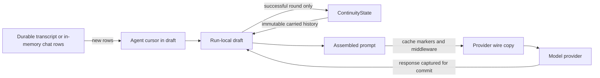
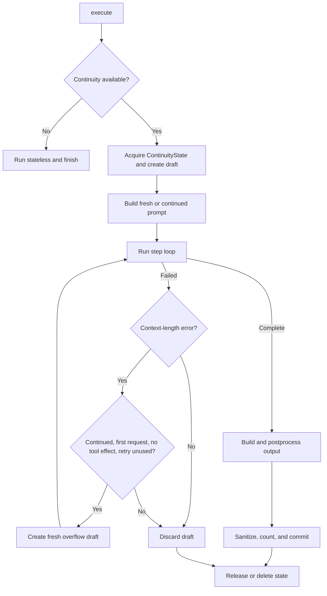
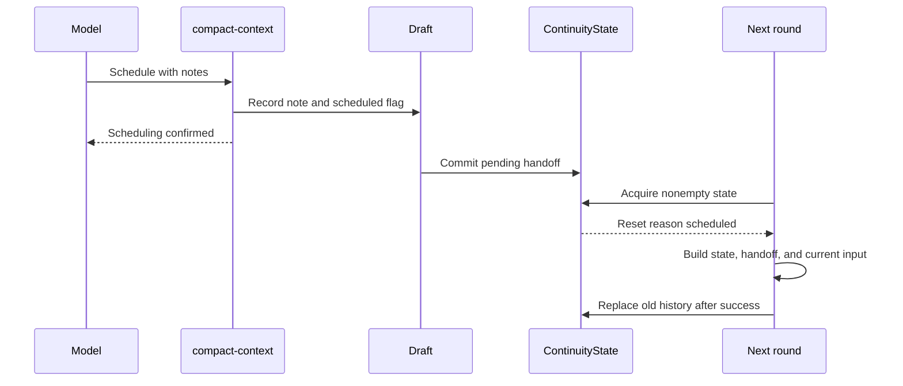

# Context continuity across agent executions

This plan adds optional cross-round prompt continuity to `VoxContext.execute()`. Envoys adopt it
first, replacing memory-only trace replay with engine-owned carried history. For contributors,
paths use `vox-agents/`.

## Goal and success criteria

A **round** is one `VoxContext.execute()` call. Today it builds and discards a message array from
the system prompt and `getInitialMessages()`. With continuity, compatible rounds for one agent and
conversation reuse sanitized history held by `VoxContext`.

History stays immutable, state and cursor changes commit atomically, compaction occurs only between
rounds, and retries never repeat a completed or externally visible tool effect. Live Envoys and
Telepathists must survive refresh, compaction, special messages, deletion, and shutdown.

## High-level conceptual review

The engine owns continuation, while the transcript remains the source of conversation facts. It
retains the successful native model trajectory, including the stable system prompt. An Envoy cursor
identifies transcript rows not yet attached, and a run-local draft makes all changes atomic.

| Design choice | Benefit | Required invariant |
| --- | --- | --- |
| Engine-owned continuity state | One continuity mechanism for every agent | A stateless call invalidates stale history for the same key |
| Draft then commit | A failed round leaves the previous ContinuityState usable | Hooks mutate only draft-backed continuity state |
| Immutable carried messages | Stable provider prefixes and predictable cache reuse | Cleanup and annotations operate on copies |
| Between-round compaction | Prompt shape changes only at a clear boundary | Scheduling is evaluated before ordinary continuation |
| Agent-owned transcript cursor | Envoys attach only conversation rows the engine has not carried | Cursor changes commit only after success |
| Wire-only middleware markers | Provider instructions can vary without contaminating history | Every tail insertion has a provider-valid role |

### Ownership

The in-memory `ContinuityState` belongs to one `VoxContext`; the transcript remains durable chat
state. `VoxContext` owns a `continuityStates` collection keyed by each agent's continuity key.
Compaction replaces carried history, never the transcript or `EnvoyThread.pastMessageID`.

## Terms

A **step** is one model and tool iteration within a **round**. A **ContinuityState** is engine-owned
state for one key; its **carried history** is sanitized `ModelMessage[]` retained between rounds. A
**fresh build** has no carried history, while a **continued build** appends current input to it.
**Compaction** replaces it with a smaller fresh prompt. A **ContinuityDraft** commits only after
success; a **wire copy** is provider-facing and may have temporary annotations. **Transient**
messages are sent but not stored, and a **continuity cursor** is the agent-owned transcript or list
position.

## Agent ownership and resolution

Continuity is a boolean capability owned by each agent. Add `contextContinuity` to `VoxAgent`,
defaulting to `false`. The Envoy base sets it to `true`; Strategists, Librarians, Narrators, and
other agents remain `false` unless they explicitly opt in. An enabled agent receives the full
continuity behavior: carried history, threshold reset, safe overflow retry, reminders, and the
`compact-context` control tool. A special call can resolve continuity to `false` for that call.

`PlayerConfig` exposes `strategistContinuity?: boolean` and `envoyContinuity?: boolean` rather than
a generic agent-name record. Each agent family declares which field can override its default.
`VoxPlayer` passes a narrow `ContinuitySeatConfig` containing those fields into `VoxContext`, keeping
the engine independent of the rest of `PlayerConfig`. Resolution order is:

1. an explicit per-call override, such as an Envoy greeting or Initialize resolving to `false`;
2. the applicable seat-family field in `PlayerConfig`;
3. the agent's `contextContinuity` default.

The seat-family mapping is explicit:

| Seat family | PlayerConfig field | Default |
| --- | --- | --- |
| Strategist | `strategistContinuity` | `false` |
| Envoy | `envoyContinuity` | `true` |

Negotiators keep the base `false` default and have no seat override. They are invoked only by
diplomats and receive the complete task context in that call, so they never acquire continuity
state of their own.

Agents that cannot implement the hooks report `supportsContinuity = false`; the engine warns once
and resolves those calls to `false`. A disabled call deletes an idle matching `ContinuityState` or
dooms a busy one. A busy collision also runs stateless and dooms its owner so stale state cannot
later commit over the stateless result.

## Agent contract and prompt hooks

`VoxAgent` gains the following public contract.

| Member | Purpose |
| --- | --- |
| `contextContinuity` | Boolean agent default, `false` on `VoxAgent` and `true` on the Envoy base |
| `continuityConfigKey` | Optional `ContinuitySeatConfig` field that overrides the agent default |
| `resolveContextContinuity()` | Applies per-call behavior and the seat override |
| `getContinuityKey()` | Identifies a `ContinuityState` within one `VoxContext`; defaults to the agent name |
| `continuityOnFailure` | Chooses whether failure keeps or discards the previous ContinuityState |
| `supportsContinuity` | Explicit capability flag for hook-based agents |
| `getStateMessages()` | Returns the current state block |
| `getRoundDelimiter()` | Returns an optional delimiter for a continued round |
| `getRoundMessages()` | Returns current input and per-round scaffolding |
| `commitContinuityState()` | Applies run-local agent commit state through a synchronous, non-throwing hook |

`RoundInfo.fresh` means no carried history; `compacted` means the fresh build follows scheduled,
threshold, or overflow compaction. `ContinuityState` is the long-lived engine object. Do not use
`VoxSession` for it: `VoxSession` already names an unrelated existing abstraction.

The base `getInitialMessages()` composes `getStateMessages()` and
`getRoundMessages({ fresh: true, compacted: false })`. Agents keeping a custom implementation stay
compatible but report `supportsContinuity = false`. With continuity disabled, hook output is unchanged: parity
excludes only retired `metadata.trace` replay, removed with its plumbing. Enabled continuity applies the
role and transience rules below.

## Prompt composition

Carried history includes the stable agent system prompt, so a continued build starts with that prefix
and does not add it again. State hooks may add leading system messages, but after user or assistant
content every hook or middleware insertion uses the `user` role.

| Build | Message order |
| --- | --- |
| Fresh | Agent system, leading state system messages, remaining state, handoff if scheduled, current round |
| Continued | Carried history, changed state, delimiter, current round |
| Compacted | The fresh order with `round.compacted = true` |

For continuity, a shared helper retains system roles only in the leading prefix and rewrites later
ones to user. It applies to state, delimiters, round messages, Envoy hints, reminders, and middleware
additions, fixing the trailing Envoy hint for continuity without changing disabled-call parity.

State is recomputed and compared with `ContinuityState.lastState` by role and content, ignoring provider
options. A continued round appends changed state as user content and skips unchanged state. Preambles,
postscripts, hints, reminders, and deal tables call `markTransient()`, so they are sent but not
committed. Delimiters and handoff notes remain.

The round boundary is the first current-round message after the leading system prefix. Its wire-only
marker lets middleware insert guidance without putting user content before later state system messages.

Every model step stores its complete provider-independent request in the existing immutable
`step.messages` field. That snapshot includes carried history, current state and delimiter, current
round additions, and all prior response and tool traffic from the same round. It is the authoritative
input for replay and telemetry. Do not add a second carried-history telemetry blob. Oracle currently
replays the first step; extend its extraction path to select any recorded target step. An overflow
retry remains the same logical step, but replaces its telemetry snapshot with the fresh messages
used by the successful attempt and records an explicit retry marker.

## Continuity state

Add `src/infra/vox-continuity.ts` for pure types and helpers.

### Shared state

| Field | Meaning |
| --- | --- |
| `key`, `stateId` | ContinuityState identity |
| `system` | Stable agent system prompt used for compatibility |
| `modelFingerprint` | Provider, model, and prompt-affecting model options |
| `messages` | Immutable carried history |
| `lastState` | Last state hook output used for change detection |
| `historyTokens` | Estimate of the sanitized committed history |
| `calls` | Committed round count |
| `pendingHandoff` | Note that forces scheduled compaction |
| `agentState` | Opaque cursor state owned by the agent |
| `busy`, `doomed` | Ownership and deferred-deletion flags |

The fingerprint serializes the resolved model, excluding engine-only options, to catch changes to
provider, model, reasoning, tool middleware, thinking extraction, host tools, framing, or system handling.

### Run-local state

`ExecutionFrame.continuity` points to a `ContinuityRunState` containing the `ContinuityState`, its draft,
the current threshold, carried counts, scheduling and reminder flags, completed-step count,
`toolEffectStarted`, overflow-retry state, and ephemeral `agentCommitState`.

Only shared `busy` and `doomed` change during a round. Everything else changes on the draft.
`context.continuityState` reads and writes persistent `draft.agentState`. A separate
`context.continuityCommitState` stages values used only by the commit hook and is never stored in the
ContinuityState. Hooks cannot mutate durable state while assembling.

## Round lifecycle

### Acquisition

Evaluate the matching `ContinuityState` in this order:

1. no state: `new`;
2. an existing state has `pendingHandoff`: `scheduled`;
3. existing history is empty: `new`;
4. the system changed: `system-changed`;
5. the model fingerprint changed: `model-changed`;
6. `historyTokens` reached the current threshold: `threshold`;
7. otherwise: continued.

Scheduled handoff precedes empty-history evaluation, so a nonempty state still resets. A reset
creates a cleared draft with a new ID; the shared state remains untouched until commit. A scheduled
draft keeps the handoff through insertion after state, then clears it. Under `keep`, failure leaves
the original state and handoff available for retry.

### Step loop

The one-step-at-a-time loop remains. Before each request it resolves model and threshold; a successful
step records input usage and makes overflow retry ineligible. A compaction-only step is completed.

`ExecutionFrame.toolEffectStarted` is set immediately before the simple, MCP, agent, or compaction
wrapper invokes its implementation. Provider-hosted tools disable retry as soon as they are offered,
because their effects cannot be observed locally.

If `prepareStep()` substitutes a model, use its threshold and log it. Commit stores its compatibility
fingerprint so the next acquisition detects a return to the base model.

### Commit

After `getOutput()` and `postprocessOutput()` succeed:

1. apply any agent-specific history projection;
2. sanitize messages without mutating the assembled array;
3. estimate tokens from the sanitized history, including the final response and retained results;
4. update draft messages, state, cursor, counters, model fingerprint, and pending handoff;
5. verify that the state is still owned and not doomed;
6. invoke the agent's synchronous, non-throwing continuity commit hook;
7. assign the draft to the state;
8. release the state.

`keep` discards only the draft; `discard` clears the state because an Envoy may have created durable
effects outside it. With continuity enabled, `Envoy.stopCheck()` stages copied response rows in
`agentCommitState`; the commit hook appends them to the thread only after fallible output and
sanitization complete. Disabled calls retain direct insertion, with `ChatTurn.finish()` as the outer
rollback safeguard.

Shutdown marks busy states doomed, clears idle states, and prevents a late draft commit after
the context starts closing.

### Safe overflow retry

A continued round retries once from a fresh overflow build only if the context-length error precedes
every completed step, `toolEffectStarted` is false, no provider-hosted tool was offered, and no retry
has run. It creates new per-attempt messages, `allSteps`, output text, and counters. Later overflow
is final, preventing repeated support tools, `send-message`, deals, nested agents, or hosted actions;
the final failure keeps existing callback and `throwOnError` behavior.

## Thresholds, reminders, and reasoning

Add `LLMConfig.options.continuityThreshold`. The default is 100,000 tokens. The helper validates a
positive finite number and otherwise uses the default with a warning.

Provider `inputTokens` remains the request-usage authority, including cache reads and writes, but
does not measure the next round. Commit estimates `historyTokens` from sanitized history, including
the final assistant response. `estimateContextTokens()` in `src/utils/models/token-counter.ts` counts
text, reasoning, tool names and inputs, and serialized tool results. Use it only for committed-history
thresholds and test large results.

- Acquisition compacts when `historyTokens >= continuityThreshold(model)`.
- Enabled continuity adds one reminder per round when a successful request reaches 75 percent of the
  current threshold and no compaction has been scheduled.
- When a step reaches the threshold and the round must continue, the engine removes reasoning parts
  from older assistant messages. It retains the most recent assistant reasoning needed to accompany
  pending Anthropic tool results.
- Reasoning removal copies only changed messages and parts. It never mutates the state's carried
  objects.

## Compaction control tool

Add the `compact-context` dynamic tool with required `Notes` preserving standing goals, rationale,
in-progress work, important facts, and risks.

The tool is offered only when continuity is enabled:

- an agent with `activeTools: []` remains tool-free;
- an explicit nonempty list receives `compact-context`;
- `undefined` is materialized from registered tools and filtered by the agent's ordinary tool rules;
- the agent's original active list determines `toolChoice`, so adding the control tool cannot make
  an otherwise tool-free step required.

The first successful call records its note and schedules compaction; later calls that round error.
The tool stays registered so the provider tool prefix remains stable.

Commit stores the note as `ContinuityState.pendingHandoff`. At the next eligible acquisition it wins over
ordinary continuation, producing a fresh build with the note after current state.

### Stop semantics

Before `agent.stopCheck()`, a view of the last step and `allSteps` excludes `compact-context` calls
and paired results from `toolCalls`, `toolResults`, `content`, and `response.messages`; actual step
messages remain in history. With no valid call or text below `maxSteps`, continue without a stop rule.
A shared completion still ends the round. Filtering `response.messages` keeps internal traffic out of
Envoy chat rows.

## Stored-history rules

`src/utils/prompts/reminders.ts` adds identity-based `WeakSet<ModelMessage>` helpers
`markTransient()` and `isTransient()`; `appendReminder()` marks its message.
`src/utils/prompts/message-history.ts` owns `dropOrphanToolParts()` and `sanitizeCarriedHistory()`.

| Content | Stored? |
| --- | --- |
| Visible user content | Yes |
| Visible assistant content | Yes |
| Successful tool calls and paired results | Yes |
| Failed, denied, or MCP `isError` calls and results | No |
| Per-round hints, reminders, preambles, postscripts, and deal tables | No |
| Empty messages and orphaned tool parts | No |
| Reasoning | Yes, unless the threshold rule removes older parts |
| Forced-tool Envoy free text hidden from the counterpart | No |

Sanitization detects SDK errors, execution denial, and MCP JSON `isError: true`. It removes failed
call/result pairs, transients, empty rows, and orphans while retaining untouched identity.

Before generic sanitization, an Envoy with `speaksOnlyViaSendMessage` removes host-suppressed string
assistant messages and text parts, but retains reasoning and successful paired traffic, including
`send-message`, which records what the counterpart received.

Move existing `_markdownConfig` removal out of shared step input. Run it on a wire or committed copy,
copying only the affected result part, before messages become shared history.

## Cache breakpoints and middleware

Move `cacheBreakpoint`, `MAX_CACHE_BREAKPOINTS`, and `markBreakpointOnLast()` from `src/envoy/envoy.ts`
to `src/utils/prompts/cache-breakpoints.ts`, with an Envoy re-export during migration.

On a continued round, the engine may add one Anthropic breakpoint to the last carried message within
the four-breakpoint budget. It annotates only a wire copy.

The engine marks a copied boundary message as `providerOptions.vox.roundStart`; every boundary-aware
middleware reads and preserves it. An innermost cleanup middleware removes only `vox` from a copied
prompt immediately before the provider adapter. The marker reaches every middleware layer, never
the provider. Integrated tests cover the full stack and assert no `vox` metadata on the final request.

| Injection | Continuity placement | Disabled-call placement |
| --- | --- | --- |
| Required tool-choice guidance | User message at the round boundary | Existing leading-system behavior |
| Host-capability guidance | User message at the round boundary | Existing leading-system behavior |
| Tool-rescue protocol | User message at the round boundary | Existing provider-specific behavior |
| `systemPromptFirst` rescue | Merge into the first system message | Existing behavior |
| Cache breakpoint | Last carried message on a wire copy | Existing Envoy anchors |

`requiredToolChoiceMiddleware` and `hostCapabilityMiddleware` use `insertAtRoundBoundary()` when
marked. Tool rescue does too, except `systemPromptFirst`, whose provider requires one leading system
message. Its tool-list cache cost is known and documented.

Anthropic also keys caches on the tools list, so `removeUsedTools` and the diplomat deal gate remain
cache breakers.

## Model options

`buildProviderOptions()` removes engine-only options before every provider-specific branch:

- `continuityThreshold`;
- `concurrencyLimit`.

The normalized copy flows through OpenRouter, OpenAI-compatible, Anthropic, Google, and default
translation. Provider-branch tests prove neither reaches the wire.

## Envoy integration

`Envoy` defaults to enabled continuity and `continuityOnFailure = discard`; its key is
`agentName:threadId`. Greeting and Initialize special calls resolve to `false`.

Envoys use a staged cursor selected by thread type:

| Thread | Cursor |
| --- | --- |
| Durable diplomacy transcript | Last consumed durable row ID |
| In-memory live observer thread | Next unconsumed array index |
| Database-backed Telepathist thread | Next unconsumed array index |

The cursor lives only in `context.continuityState`; prompt assembly never changes `pastMessageID`.

### LiveEnvoy

`getStateMessages()` returns `buildGameContextMessages()`. Changed turn state reattaches as user
content during continuation.

`getRoundMessages()` behaves as follows:

| Build | Content |
| --- | --- |
| Fresh, not compacted | Transient preamble, compiled past block, ongoing rows, transient postscript, transient hint |
| Continued | Unconsumed counterpart rows, plus transient preamble, postscript, and hint |
| Fresh, compacted | Older rows compiled into one text block, the current caller row natively, and transient attachments |

Durable rows have IDs greater than the staged cursor; id-less rows begin at its index. Exclude rows
from the voiced agent and raw tools because the engine carries their native trajectory.

A compacted build compiles rows before the current caller into text and attaches that caller natively.
It works for durable and id-less threads without mutation; the new cursor commits only with the draft.

`Envoy.stopCheck()` copies responses and clones each `tool-call` input before echo stripping. With
continuity enabled it stages rows in `agentCommitState`; `commitContinuityState()` appends them after
fallible work succeeds. The ephemeral rows are then discarded rather than assigned to the state.
Carried response objects remain untouched.

Remove trace replay from `convertToModelMessages()`. Keep `pastMessageID`, `boundaryIndex`,
`autoCompact()`, and `maybeAutoCompact()` for disabled calls and transcript maintenance.

### Telepathist

Telepathist inherits enabled continuity and uses the index cursor.

- Fresh non-compacted builds preserve today's full history replay.
- Fresh compacted builds compile prior user and assistant text, discard tool and non-text rows, and
  attach the current caller natively.
- Continued builds attach rows after the staged cursor that were not already carried by the engine.
- The hint remains a transient user message.
- `{{{Initialize}}}` still runs `runPreparation()` before `getStateMessages()` fetches refreshed
  summaries. It remains a special call and creates no ContinuityState.

A compacted projection ends on provider-valid user or assistant text, never an unpaired native tool row.

## Chat lifecycle

Remove the memory-only trace from:

- `src/types/chat.ts`;
- `src/utils/diplomacy/turn/chat-turn-commit.ts`;
- `src/utils/diplomacy/transcript/transcript.ts`;
- `src/utils/diplomacy/transcript/transcript-utils.ts`;
- `src/web/chat/turn.ts`.

`syncThreadMessages()` no longer preserves trace metadata. Durable refresh and `pastMessageID`
behavior remain for disabled calls.

On reopen with a different voice or context, `src/web/chat/factory.ts` drops matching continuity
state from the previous context. `src/web/chat/store.ts` does the same before database-context shutdown. Busy
states are doomed and disappear on release.

Add the required invalidation dependency contracts to `src/types/web-chat.ts`. The factory and store
tests use those injected seams instead of reaching through generic context types.

## Telemetry

Each model step keeps the existing `step.messages` snapshot as its complete, immutable,
provider-independent request. It already contains every carried message and same-round response or
tool result needed to reproduce that call, so telemetry must not create a parallel history payload.
Keep `step.tools`, `step.tools.choice`, `step.tool_framing`, host capability facts, and `step.responses`
alongside it.

Add these diagnostics to every step under the `continuity.*` namespace:

- `continuity.enabled`, `continuity.state_id`, `continuity.key`, and `continuity.build` (`fresh`, `continued`, or
  `compacted`);
- `continuity.reset_reason` when a fresh build replaces carried history;
- `continuity.carried_tokens` and `continuity.carried_messages` before current-round additions;
- `continuity.state_changed`, `continuity.compaction_scheduled`, and
  `continuity.reasoning_stripped`;
- `continuity.overflow_retry` with `attempted`, `succeeded`, or `not-eligible`.

Provider request input tokens remain separate from the committed-history estimate. Extend Oracle's
extractor to select a target step, while preserving the first step as the default. This lets Oracle
replay any recorded model call from that step's complete request snapshot. Wire-only middleware
annotations stay outside `step.messages`; replay reconstructs them from the recorded model, tools,
host capabilities, and tool framing. If overflow recovery succeeds, the logical step stores the fresh
successful request in `step.messages` and records `continuity.overflow_retry = succeeded`. Document
the attributes in `docs/developers/vox-agents/observability.md`.

## Implementation facts

Verified AI SDK 6.0.174 and Anthropic-provider behavior:

- `usage.inputTokens` includes prompt and cache reads or writes, not the later response;
- thrown and invalid tools appear as call/result error parts even when `StepResult.toolResults` omits them;
- MCP failures are JSON results with `isError: true`;
- deleting message `providerOptions` leaves part-level reasoning signatures;
- Anthropic rejects a system message after user or assistant content;
- current middleware instructions depend on the request's effective tool list.

## Files by responsibility

| Area | Files |
| --- | --- |
| Continuity core | `src/infra/vox-context.ts`, `src/infra/vox-run.ts`, new `src/infra/vox-continuity.ts` |
| Agent contract and configuration | `src/infra/vox-agent.ts`, `src/types/config.ts`, `src/strategist/vox-player.ts` |
| Prompt and token utilities | prompt reminders, new history and breakpoint helpers, `src/utils/models/token-counter.ts` |
| Tool execution tracking | simple, MCP, agent, terminal, and new compaction tool modules under `src/utils/tools/` |
| Provider integration | `src/utils/models/models.ts`, provider system, tool-choice, host-capability, and tool-rescue modules |
| Envoys | `src/envoy/envoy.ts`, `src/envoy/live-envoy.ts`, `src/telepathist/telepathist.ts` |
| Chat and transcript | chat types, web-chat types, chat turn, factory, store, transcript, and transcript utilities |
| Tests and docs | mock tests, Envoy guides, overview, observability, and `vox-agents/AGENTS.md` |

## Test matrix

| Area | Required proof |
| --- | --- |
| Disabled parity | No ContinuityState; unchanged prompt except retired trace replay |
| Enabled continuation | Reuse untouched prefix objects; attach only current input |
| State changes | Skip unchanged state; append changed state with valid roles |
| Scheduled compaction | Nonempty handoff state starts the next round fresh |
| Role ordering | No system message after conversation content |
| Threshold accounting | Large final responses and tool results trigger next-round compaction |
| Safe retry | First-request overflow retries once; steps, local tools, and hosted tools disable it |
| Draft rollback | Step, output, staged rows, cursor, and deletion failures cannot partially commit |
| Immutability | Cleanup, reasoning removal, and breakpoints do not mutate carried objects |
| Tool scheduling | Duplicate error; compaction-only continues; shared completion stops |
| Sanitization | Remove transient, failed, denied, hidden Envoy, and orphaned parts |
| Envoy cursors | Durable-ID and id-less threads continue and compact correctly |
| Telepathist | Full replay parity and Initialize preparation remain intact |
| Lifecycle | Collisions, reopen, deletion, shutdown, and doomed release remove stale states |
| Model options | Engine-only keys are absent from every provider branch |
| Middleware | Every layer sees the boundary; final request has no marker |

Use `tests/mock/context/vox-context-execute-runs.test.ts` for engine coverage, with focused suites
for continuity, message history, reminders, boundary insertion, Envoy cursors, Telepathist resets,
factory invalidation, and store deletion.

## Documentation updates

After implementation, update overview with ownership and hooks, Envoy docs with engine history and
cursors, observability with continuity attributes, and `vox-agents/AGENTS.md` with continuity-state
ownership and middleware placement.

## Implementation sequence

1. Add config, option filtering, transient, history, token, cache, and boundary helpers with unit tests.
2. Add agent hooks and capability, run slot, continuity types, fingerprint, and acquisition helpers.
3. Implement lifecycle, effect tracking, retry, sanitization, commit, doom, and telemetry.
4. Add `compact-context`, stop filtering, reminder, and enabled-continuity tool selection.
5. Migrate LiveEnvoy and Telepathist to staged cursors and projections, then remove trace plumbing.
6. Add factory and store invalidation, dependency types, integration tests, and documentation.

Each stage passes its focused tests before the next begins.

## Verification

From `vox-agents/`, run:

1. `npm run type-check`
2. `npm run lint`
3. `npm test`

Manual verification covers:

- three diplomat messages, then one after a turn change;
- low-threshold fresh compaction with current state and an explicit handoff;
- id-less observer compaction; `{{{Greeting}}}` and `{{{Initialize}}}` with no ContinuityState;
- deletion during a run leaving no ContinuityState after release;
- Anthropic and Codex continued-round cache reads;
- required-tool and host-capability guidance at the round boundary.

## Risks and follow-ups

### Implementation risks

- Enabled-tool changes still alter Anthropic's cached tools prefix.
- Provider and local committed-history estimates differ. Leave threshold headroom for current state
  and per-round attachments.
- Transcript replacement can invalidate an index cursor. Durable threads recover by ID; id-less
  replacements reset their ContinuityState.
- Hosted tools may lack an execution-start callback. Retry stays limited to request-time rejection
  when effect-free execution cannot be proven.

### Follow-ups

- Strategist adoption requires stable learned-strategist system prompts and a turn delimiter.
- UI controls for `contextContinuity` can follow the configuration-file implementation.
- More stable active-tool lists would improve Anthropic cache reuse but are not required for
  correctness.
