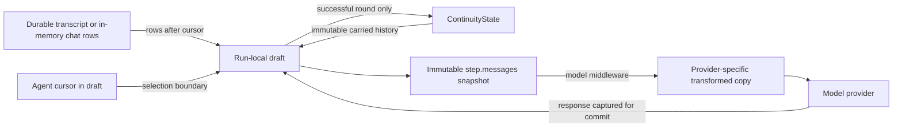
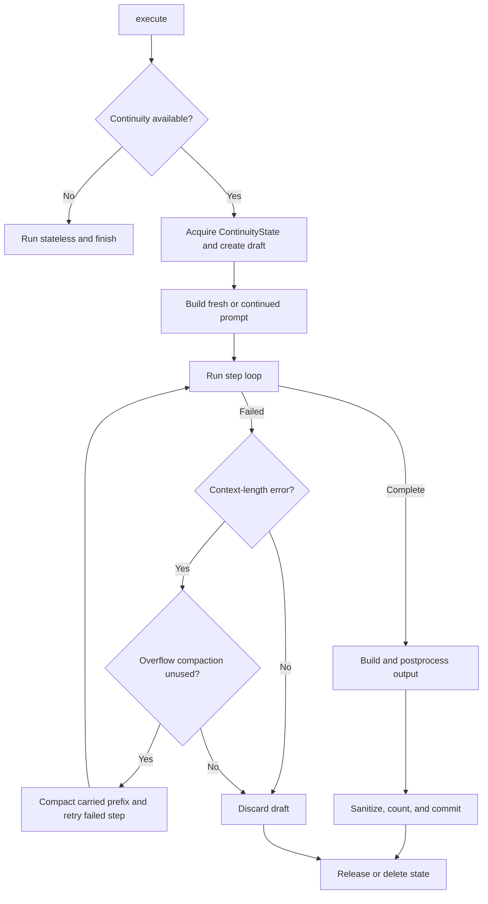
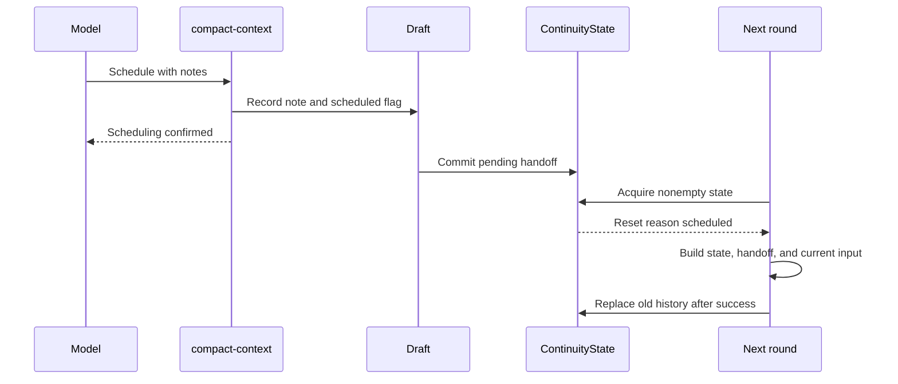

# Context continuity across agent executions

This plan adds optional cross-round prompt continuity to `VoxContext.execute()`. Envoys adopt it
first, replacing memory-only trace replay with engine-owned carried history. For contributors,
paths use `vox-agents/`.

## Goal and success criteria

A **round** is one `VoxContext.execute()` call. Today it builds and discards a message array from
the system prompt and `getInitialMessages()`. With continuity, compatible rounds for one agent and
conversation reuse sanitized history held by `VoxContext`.

History stays immutable, and state and cursor changes commit atomically. Scheduled and threshold
compaction run between rounds. An overflow at any step compacts only carried history once, preserving
the current round and completed steps; a subsequent overflow fails. Live Envoys and Telepathists must
survive refresh, compaction, special messages, deletion, and shutdown.

Strategist continuity is experimental and defaults to disabled because it increases token use.
Disabled Strategists preserve their existing execution and replay behavior except for the shared
tool-protocol placement change described below. Envoys default to enabled and may simplify their
existing prompt, trace replay, and chat lifecycle behavior.

## High-level conceptual review

The engine owns continuation, while the transcript remains the source of conversation facts. It
retains the successful native model trajectory, including the stable system prompt. An Envoy cursor
identifies transcript rows not yet attached, and a run-local draft makes all changes atomic.

| Design choice | Benefit | Required invariant |
| --- | --- | --- |
| Engine-owned continuity state | One continuity mechanism for every agent | A stateless call invalidates stale history for the same key |
| Draft then commit | A failed round cannot partially commit history or cursors | Hooks mutate only draft-backed continuity state; failure invalidates the matching state |
| Immutable carried messages | Stable provider prefixes and predictable cache reuse | Cleanup and annotations operate on copies |
| Compaction boundaries | Ordinary resets happen between rounds; overflow preserves current work | Overflow replaces only carried history and never replays completed steps |
| Agent-owned transcript cursor | Envoys attach only conversation rows the engine has not carried | Cursor changes commit only after success |
| Complete step snapshots | Telemetry and replay read one record without continuity knowledge | `step.messages` contains all engine-owned history and current input |

### Ownership

The in-memory `ContinuityState` belongs to one `VoxContext`; the transcript remains durable chat
state. `VoxContext` owns a `continuityStates` collection keyed by each agent's continuity key.
Compaction replaces carried history, never the transcript or `EnvoyThread.pastMessageID`.

## Terms

A **step** is one model and tool iteration within a **round**. A **ContinuityState** is engine-owned
state for one key; its **carried history** is sanitized
`ModelMessage[]` retained between rounds. A **fresh build** has no prior engine-carried history,
though it may include transcript-derived messages. A **continued build** appends current input to
carried history.
**Compaction** replaces prior-round history with a smaller prefix. Between rounds this starts a fresh
build; during overflow it leaves current-round inputs and completed steps intact. A **ContinuityDraft** commits only after
success; a **wire copy** is provider-facing and may have temporary annotations. **Transient**
messages are sent but not stored, and a **continuity cursor** is the agent-owned transcript or list
position.

## Agent ownership and resolution

Continuity is a boolean capability owned by each agent. Add `contextContinuity` to `VoxAgent`,
defaulting to `false`. The Envoy base sets it to `true`; Strategists and every other non-Envoy agent
default to `false`. An enabled agent receives the full
continuity behavior: carried history, threshold reset, overflow compaction, reminders, and the
`compact-context` control tool. A special call can resolve continuity to `false` for that call.

`PlayerConfig` exposes `strategistContinuity?: boolean` and `envoyContinuity?: boolean` rather than
a generic agent-name record. Only Strategist agents use the first field and Envoy agents use the
second; other agent families have no `PlayerConfig` continuity override.
`VoxPlayer` passes a narrow `ContinuitySeatConfig` containing those fields into `VoxContext`, keeping
the engine independent of the rest of `PlayerConfig`. Resolution order is:

1. an explicit per-call override, such as an Envoy greeting or Initialize resolving to `false`;
2. the applicable seat-family field in `PlayerConfig`;
3. the agent's `contextContinuity` default.

The seat-family mapping is explicit:

| Seat family | PlayerConfig field | Default |
| --- | --- | --- |
| Strategist | `strategistContinuity` | `false` |
| Envoy | `envoyContinuity` | `true` |

Negotiators keep the base `false` default and have no seat override. They are invoked only by
diplomats and receive the complete task context in that call, so they never acquire continuity
state of their own.

A disabled call deletes an idle matching `ContinuityState` or dooms a busy one. A busy collision also
runs stateless and dooms its owner so stale state cannot later commit over the stateless result.

## Agent contract and prompt hooks

`VoxAgent` gains the following public contract.

| Member | Purpose |
| --- | --- |
| `contextContinuity` | Boolean agent default, `false` on `VoxAgent` and `true` on the Envoy base |
| `continuityConfigKey` | Optional `ContinuitySeatConfig` field that overrides the agent default |
| `getContinuityKey()` | Identifies a `ContinuityState` within one `VoxContext`; defaults to the agent name |
| `getStateMessages()` | Returns the current state block |
| `getRoundMessages()` | Returns current input and per-round scaffolding |
| `commitContinuityState()` | Applies run-local agent commit state through a synchronous, non-throwing hook |

Resolve the per-call override, seat field, and agent default in one engine helper rather than adding
a resolution method to every agent. Envoy special-call detection supplies the per-call override.
Delimiters are ordinary round messages, not a separate hook. Every failed round invalidates its
matching continuity state, so there is no per-agent failure policy.

`RoundInfo.fresh` means no carried history; `compacted` means the initial fresh build follows scheduled
or threshold compaction. Overflow changes the carried prefix without invoking prompt hooks again.
`ContinuityState` is the long-lived engine object. Do not use
`VoxSession` for it: `VoxSession` already names an unrelated existing abstraction.

The disabled path continues to call `getInitialMessages()`. For enabled continuity,
`getStateMessages()` defaults to an empty array and the base `getRoundMessages()` delegates to the
agent's existing `getInitialMessages()` implementation. Existing Strategists can therefore use the
base round adapter when `strategistContinuity` enables them. Envoys override the new hooks to separate
stable state from newly attached transcript rows. Other agent families have no `PlayerConfig`
override, but a subclass may opt in through `contextContinuity`; a future seat-family field can add
per-player override control. Disabled Strategists keep their existing initial-message construction.
Envoys remove `metadata.trace` replay and its plumbing. Shared tool-protocol placement applies to
enabled and disabled calls alike; enabled continuity additionally applies the history rules below.

## Prompt composition

Carried history includes the stable agent system prompt, so a continued build starts with that prefix
and does not add it again. State hooks may add leading system messages, but after user or assistant
content every hook or middleware insertion uses the `user` role.

| Build | Message order |
| --- | --- |
| Fresh | Agent system, leading state system messages, remaining state, handoff if scheduled, current round |
| Continued | Carried history, changed state, current round (including any delimiter) |
| Compacted | The fresh order with `round.compacted = true` |

For continuity, a shared helper retains system roles only in the leading prefix and rewrites later
ones to user. LiveEnvoy's final hint and Negotiator's final instruction become user messages in all
calls, matching Telepathist's existing hint role. Existing Strategist prompts already keep their
system messages in the leading prefix. Generated tool protocols use the user role in every call.

State is recomputed and compared with `ContinuityState.lastState` by role and content, ignoring provider
options. A continued round appends changed state as user content and skips unchanged state. Preambles,
postscripts, hints, reminders, and deal tables call `markTransient()`, so they are sent but not
committed. Delimiters and handoff notes remain.

Every execution has a round boundary, including disabled continuity and Oracle replay. On a fresh or
stateless build it follows the leading system and state prefix; on a continued build it follows
carried history and changed state. It precedes the first round message, including any delimiter.
Mark it with internal metadata, removed from the provider copy, so the tool-rescue middleware can
insert its generated protocol there. With no round messages, use the end of the prefix. Disabled
Strategists retain their complete leading system block before this boundary.

The loop maintains a `roundHistory` containing carried messages, current-round additions, and
completed response and tool traffic. Before each model call it creates an immutable copy as
`step.messages`. This is the complete provider-independent source prompt, including all carried
history and current input, but before the selected model's middleware transforms it.

Provider middleware applies its own prompt conventions to a fresh copy. This includes tool protocol
instructions, required-tool and host-capability guidance, tool-history conversion, framing, system
normalization, response formatting, and cache annotations. These transformations never enter
`roundHistory` or `ContinuityState.messages` and never mutate `step.messages`.

`step.messages` is the single authoritative record of the source prompt. Do not add a second
carried-history payload. Replay consumes the record as committed: Oracle submits the complete
ordered array through the replay model's normal middleware, so it never needs to know continuity
exists. The goal is to replay the complete source prompt, not to reproduce another provider's wire
request.

## Continuity state

Add `src/infra/vox-continuity.ts` for pure types and helpers.

### Shared state

| Field | Meaning |
| --- | --- |
| `system` | Stable agent system prompt used for compatibility |
| `modelFingerprint` | Provider, model, and prompt-affecting model options |
| `messages` | Immutable carried history |
| `lastState` | Last state hook output used for change detection |
| `historyTokens` | Estimate of the sanitized committed history |
| `pendingHandoff` | Note that forces scheduled compaction |
| `agentState` | Opaque cursor state owned by the agent |
| `busy`, `doomed` | Ownership and deferred-deletion flags |

The map key identifies the conversation and the stored object identity establishes ownership; no
duplicate key field, generated state ID, or round counter is needed.

The fingerprint serializes the resolved model, excluding engine-only options, to catch changes to
provider, model, reasoning, tool middleware, thinking extraction, host tools, framing, or system handling.

### Run-local state

`ExecutionFrame.continuity` points to a `ContinuityRunState` containing the acquired state and draft,
the carried-prefix boundary, prepared compaction inputs, one reminder flag, one overflow-attempt flag,
and ephemeral `agentCommitState`. Read the threshold from the resolved model, scheduling from
`draft.pendingHandoff`, and completed steps from the existing `allSteps`; do not duplicate them.

Only shared `busy` and `doomed` change during a round. Everything else changes on the draft.
`context.continuityState` reads and writes persistent `draft.agentState`. A separate
`context.continuityCommitState` stages values used only by the commit hook and is never stored in the
ContinuityState. Hooks cannot mutate durable state while assembling.

## Round lifecycle

### Acquisition

Evaluate the matching `ContinuityState` in this order:

1. no state: `new`;
2. an existing state has `pendingHandoff`: `scheduled`;
3. existing history is empty: `new`;
4. the system changed: `system-changed`;
5. the model fingerprint changed: `model-changed`;
6. `historyTokens` reached the current threshold: `threshold`;
7. otherwise: continued.

Scheduled handoff precedes empty-history evaluation, so it is consumed even when history is empty.
A reset creates a cleared draft; the shared state remains untouched until commit or failure
invalidation. A scheduled draft keeps the handoff through insertion after state, then clears it.

### Step loop

The one-step-at-a-time loop remains. Before each request it resolves the model and threshold, then
records the complete source prompt in the existing step span. A successful step records input usage,
appends only its response and tool traffic to `roundHistory`, including failed tool exchanges.
The next step snapshots the updated history. Provider guidance is regenerated by middleware for each
call and never accumulates in carried history. A compaction-only step is completed.

The shared retry helper already terminates immediately for `isContextLengthError()`, allowing
`VoxContext` to own the single fallback that compacts the carried prefix at any step. Leave the
generic transport retry behavior unchanged; it is not part of context continuity.

If `prepareStep()` substitutes a model, use its threshold and log it. Commit stores its compatibility
fingerprint so the next acquisition detects a return to the base model.

### Commit

After `getOutput()` and `postprocessOutput()` succeed:

1. apply any agent-specific history projection;
2. sanitize `roundHistory` without mutating the assembled array;
3. estimate tokens from the sanitized history, including the final response and retained results;
4. update draft messages, state, cursor, token estimate, model fingerprint, and pending handoff;
5. verify that the state is still owned and not doomed;
6. invoke the agent's synchronous, non-throwing continuity commit hook;
7. assign the draft to the state;
8. release the state.

Failure discards the draft and invalidates the acquired state for every agent, without removing a
replacement owned by another run. This also handles Envoys that may have created durable effects
outside it. With continuity enabled, `Envoy.stopCheck()` stages copied response rows in
`agentCommitState`; the commit hook appends them to the thread only after fallible output and
sanitization complete. Disabled calls retain direct insertion, with `ChatTurn.finish()` as the outer
rollback safeguard.

Shutdown marks busy states doomed, clears idle states, and prevents a late draft commit after
the context starts closing.

### Overflow compaction

On the first context-length error at any step of an enabled round, compact only its carried history
and retry the failed step. Keep current-round inputs, completed response and tool traffic, `allSteps`,
accumulated output, usage, staged cursor changes, and any pending handoff. A second overflow in the
same round is final, with the existing callback and `throwOnError` behavior. Disabled calls retain
their existing overflow behavior.

Keep carried history separate from the current-round suffix so compaction replaces only the prefix.
Use the same compacted projection as a between-round reset, derived from inputs captured during
initial preparation. For Strategists the replacement uses the stable system and prepared current
state; the already-prepared round reports remain in the suffix. Envoys derive their prior-conversation
text from the captured transcript, excluding rows already represented in the current-round suffix.
No prompt hooks, briefing calls, preparation effects, or completed tools run again. If there is no
carried history to reduce, the retry has no additional history to remove; another overflow fails.

Keep the failed step's logical span open across the retry and replace only its `step.messages` with
the compacted request. Earlier step snapshots stay unchanged. Reuse the failed step's prepared
configuration and regenerate its provider copy. The rejected request is not another logical step.

## Thresholds, reminders, and reasoning

Add `LLMConfig.options.continuityThreshold`. The default is 100,000 tokens. The helper validates a
positive finite number and otherwise uses the default with a warning.

Provider `inputTokens` remains the request-usage authority, including cache reads and writes, but
does not measure the next round. Commit estimates `historyTokens` from sanitized history, including
the final assistant response. `estimateContextTokens()` in `src/utils/models/token-counter.ts` counts
text, reasoning, tool names and inputs, and serialized tool results. Use it only for committed-history
thresholds and test large results.

- Acquisition compacts when `historyTokens >= continuityThreshold(model)`.
- Enabled continuity adds one reminder per round when a successful request reaches 75 percent of the
  current threshold and no compaction has been scheduled.
- When a step reaches the threshold and the round must continue, the engine removes reasoning parts
  from older assistant messages. It retains the most recent assistant reasoning needed to accompany
  pending Anthropic tool results.
- Reasoning removal copies only changed messages and parts. It never mutates the state's carried
  objects.

## Compaction control tool

Add the `compact-context` dynamic tool with required `Notes` preserving standing goals, rationale,
in-progress work, important facts, and risks.

The tool is offered only when continuity is enabled:

- an agent with `activeTools: []` remains tool-free;
- an explicit nonempty list receives `compact-context`;
- `undefined` is materialized from registered tools and filtered by the agent's ordinary tool rules;
- the agent's original active list determines `toolChoice`, so adding the control tool cannot make
  an otherwise tool-free step required.

The first successful call records its note and schedules compaction; later calls that round error.
The tool stays registered so the provider tool prefix remains stable.

Commit stores the note as `ContinuityState.pendingHandoff`. At the next eligible acquisition it wins over
ordinary continuation, producing a fresh build with the note after current state.

### Stop semantics

Before `agent.stopCheck()`, a view of the last step and `allSteps` excludes `compact-context` calls
and paired results from `toolCalls`, `toolResults`, `content`, and `response.messages`; actual step
messages remain in history. With no valid call or text below `maxSteps`, continue without a stop rule.
A shared completion still ends the round. Filtering `response.messages` keeps internal traffic out of
Envoy chat rows.

## Stored-history rules

`src/utils/prompts/reminders.ts` adds identity-based `WeakSet<ModelMessage>` helpers
`markTransient()` and `isTransient()`; `appendReminder()` marks its message.
`src/utils/prompts/message-history.ts` owns `dropOrphanToolParts()` and `sanitizeCarriedHistory()`.

| Content | Stored? |
| --- | --- |
| Visible user content | Yes |
| Visible assistant content | Yes |
| Successful tool calls and paired results | Yes |
| Failed, denied, or MCP `isError` calls and results | No |
| Per-round hints, reminders, preambles, postscripts, and deal tables | No |
| Empty messages and orphaned tool parts | No |
| Reasoning | Yes, unless the threshold rule removes older parts |
| Forced-tool Envoy free text hidden from the counterpart | No |

Sanitization detects SDK errors, execution denial, and MCP JSON `isError: true`. It removes failed
call/result pairs, transients, empty rows, and orphans while retaining untouched identity.
This is a commit-time projection for the next round. Failed tool exchanges remain in the current
round's messages and step records, including across overflow compaction. Never apply this cleanup
to the current-round suffix during an overflow retry.

Before generic sanitization, an Envoy with `speaksOnlyViaSendMessage` removes host-suppressed string
assistant messages and text parts, but retains reasoning and successful paired traffic, including
`send-message`, which records what the counterpart received.

Move existing `_markdownConfig` removal out of shared step input. Run it on a wire or committed copy,
copying only the affected result part, before messages become shared history.

## Step input, cache breakpoints, and middleware

Move `cacheBreakpoint`, `MAX_CACHE_BREAKPOINTS`, and `markBreakpointOnLast()` from `src/envoy/envoy.ts`
to `src/utils/prompts/cache-breakpoints.ts`, with an Envoy re-export during migration.

On a continued round, the engine may add one Anthropic breakpoint to the last carried message within
the four-breakpoint budget. It annotates only a provider copy.

Keep model-specific transformations in provider middleware. Generated protocol text depends on the
effective tool list, tool choice, framing, and structured-output conventions. Regenerating identical
text does not disturb a stable prefix, but changing that text does. Strategists enable
`removeUsedTools`, so their protocol can change between steps. Envoy tool lists are generally stable
within a round but can differ across rounds, including the Diplomat deal gate.

Use one placement rule for prompt-mode tool rescue in every execution, including disabled
Strategists and Oracle: insert the generated protocol as a user message at the round boundary.
Remove the action-framing, system-first merging, and leading-system insertion branches from protocol
placement. Framing and structured output still determine its content. This preserves the prefix
before the boundary when the protocol changes; it does not promise cache reuse for the suffix or
for providers whose native tool definitions also changed.

The engine supplies the boundary on every execution. Middleware callers without a marker use the
end of the leading system prefix. Oracle uses that same ordinary fallback or engine boundary and
does not reconstruct the source run's continuity boundary.

Required-tool guidance, host-capability guidance, tool-history conversion, action wording,
response-format selection, tool removal, response parsing, and provider system normalization retain
their existing placement and behavior. They operate on provider copies. This change addresses the
generated tool-rescue protocol; it is not a guarantee that all other prefix content stays stable.

| Transformation | Placement |
| --- | --- |
| Tool-rescue protocol | User message at the round boundary in every execution |
| Required tool-choice guidance | Unchanged |
| Host-capability guidance | Unchanged |
| Provider system normalization | Provider copy only |
| Cache breakpoint | Last carried message on a provider copy |

Tests assert that the rescue protocol follows the leading prefix in stateless calls and the carried
prefix in continued calls, appears once on the provider copy, and never mutates `step.messages` or
committed history. Change the effective tool list between steps and verify that only the generated
protocol changes, with preceding source content intact.

Anthropic also keys caches on the tools list, so `removeUsedTools` and the diplomat deal gate remain
cache breakers.

## Model options

`buildProviderOptions()` removes engine-only options before every provider-specific branch:

- `continuityThreshold`;
- `concurrencyLimit`.

The normalized copy flows through OpenRouter, OpenAI-compatible, Anthropic, Google, and default
translation. Provider-branch tests prove neither reaches the wire.

## Envoy integration

`Envoy` defaults to enabled continuity; its key is
`agentName:threadId`. Greeting and Initialize special calls resolve to `false`.

Envoys use a staged, discriminated cursor selected by thread type:

| Thread | Cursor |
| --- | --- |
| Durable diplomacy transcript | `{ kind: 'durable', lastConsumedId }` |
| In-memory live observer thread | `{ kind: 'indexed', nextIndex, generation }` |
| Database-backed Telepathist thread | `{ kind: 'indexed', nextIndex, generation }` |

The cursor lives only in `context.continuityState`; prompt assembly never changes `pastMessageID`.
Durable selection advances by row ID and ignores id-less rows voiced by the local Envoy because their
native model trajectory is already carried. Indexed selection is valid only for the same thread-array
generation. Append-only changes retain the generation; refresh, replacement, or transcript compaction
increments it. A generation mismatch invalidates the matching continuity state and performs a fresh
build, preventing both skipped and duplicated rows.

### LiveEnvoy

`getStateMessages()` returns `buildGameContextMessages()`. Changed turn state reattaches as user
content during continuation.

`getRoundMessages()` behaves as follows:

| Build | Content |
| --- | --- |
| Fresh, not compacted | Transient preamble, compiled past block, ongoing rows, transient postscript, transient hint |
| Continued | Unconsumed counterpart rows, plus transient preamble, postscript, and hint |
| Fresh, compacted | Older rows compiled into one text block, the current caller row natively, and transient attachments |

Durable rows have IDs greater than the staged durable cursor. Indexed rows begin at `nextIndex` after
the generation check. Exclude rows from the voiced agent and raw tools because the engine carries
their native trajectory.

A compacted build compiles rows before the current caller into text and attaches that caller natively.
It works for durable and id-less threads without mutation; the new cursor commits only with the draft.

`Envoy.stopCheck()` copies responses and clones each `tool-call` input before echo stripping. With
continuity enabled it stages rows in `agentCommitState`; `commitContinuityState()` appends them after
fallible work succeeds. The ephemeral rows are then discarded rather than assigned to the state.
Carried response objects remain untouched.

Remove trace replay from `convertToModelMessages()`. Keep `pastMessageID`, `boundaryIndex`,
`autoCompact()`, and `maybeAutoCompact()` for disabled calls and transcript maintenance.

### Telepathist

Telepathist inherits enabled continuity and uses the index cursor.

- Fresh non-compacted builds preserve today's full history replay.
- Fresh compacted builds compile prior user and assistant text, discard tool and non-text rows, and
  attach the current caller natively.
- Continued builds attach rows after the staged cursor that were not already carried by the engine.
- The hint remains a transient user message.
- `{{{Initialize}}}` still runs `runPreparation()` before `getStateMessages()` fetches refreshed
  summaries. It remains a special call and creates no ContinuityState.

A compacted projection ends on provider-valid user or assistant text, never an unpaired native tool row.

## Chat lifecycle

Remove the memory-only trace from:

- `src/types/chat.ts`;
- `src/utils/diplomacy/turn/chat-turn-commit.ts`;
- `src/utils/diplomacy/transcript/transcript.ts`;
- `src/utils/diplomacy/transcript/transcript-utils.ts`;
- `src/web/chat/turn.ts`.

`syncThreadMessages()` no longer preserves trace metadata. Durable refresh and `pastMessageID`
behavior remain for disabled calls.

Run diplomacy refresh through the same per-thread lock used by chat turns and status actions. Add the
lock operation to `ChatThreadStoreDependencies` so `read()` can call `syncDiplomacyThread()` without
introducing a module cycle. A concurrent refresh or active turn receives the existing
`ThreadBusyError`, which the discovery route maps to the standard busy response. Ordinary in-memory
chat reads remain unlocked. This prevents replacement of `thread.messages` while a turn holds indices
into that array.

On reopen with a different voice or context, `src/web/chat/factory.ts` drops matching continuity
state from the previous context. Every `ChatThreadStore.delete()` resolves the thread's current
context and invalidates its continuity key before removing the thread. This applies to live diplomacy,
live observer, and database Telepathist threads; database-context shutdown follows invalidation. Busy
states are doomed and disappear on release.

Add the required invalidation dependency contracts to `src/types/web-chat.ts`. The factory and store
tests use those injected seams instead of reaching through generic context types.

## Telemetry

Keep the existing logical step spans directly beneath the agent span. Each span's `step.messages`
contains the complete, ordered, immutable source prompt: all carried messages, current input, and
response or tool traffic from earlier completed steps in the same round. Provider-generated
instructions and wire annotations remain model-specific transformations and are not copied into
history.

Stateless calls record no continuity attributes; their spans stay exactly as they are today. A
continuity-enabled round records three round-level attributes on the agent span, each merging several
internal states into one value:

- `continuity.build`: `fresh`, `continued`, or `compacted`. Absence means stateless, `fresh` covers
  every reset except compaction, and `compacted` covers scheduled, threshold, and overflow compaction
  alike;
- `continuity.carried_tokens`: the committed-history estimate before current-round additions;
- `continuity.overflow`: `not-attempted`, `succeeded`, or `failed`.

No state IDs, keys, or round counters are recorded; the goal is not to capture continuity's internal
state. The UI already receives streamed agent spans, so it can show the user that a round was
compacted from `continuity.build = 'compacted'`. Generic transport retries reuse the same source
prompt and need no extra step identity. An overflow retry updates only the failed step's snapshot to
the compacted prompt and retains all earlier step records.

Provider request input tokens remain separate from the committed-history estimate. Add
`OracleConfig.targetStep?: number` and a matching CLI override. It is one-based and defaults to `1`.
Retrieval validates the step, passes it to `extractPrompt()`, and reports available step numbers when
no match exists. Oracle needs no continuity awareness: it replays the recorded `step.messages`
through the replay model's normal middleware without consulting continuity attributes.
Document the attributes in `docs/developers/vox-agents/observability.md`.

`extractPrompt()` reads the selected step's complete `step.messages`, keeps its leading system prefix,
and preserves every remaining message in order. The existing `system` and `messages` callback API
continues unchanged. Provider middleware then derives tool framing, protocol, host guidance, and other
call conventions from the replay model. No prompt-composition mode or new Oracle cache identity is
needed. Existing experiment cache behavior remains unchanged; callers use a new experiment name or
`forceReplay` when changing replay configuration.

## Expected prompt and replay changes

This table collects the intentional differences for review. Complete `step.messages` recording and
applying the replay model's middleware are existing behavior, not new Oracle features. Oracle does
not need to know whether a recorded prompt contains carried history.

| Area | Expected change |
| --- | --- |
| Tool-rescue placement, all calls | Today action framing inserts a system protocol before the first user message, system-first mode merges it into the first system message, and other modes prepend a system message. All modes will insert a user protocol at the round boundary, including disabled Strategists and Oracle. |
| LiveEnvoy and Negotiator hints | Their trailing system instructions become user messages in enabled and disabled calls. Telepathist already uses a user hint. |
| Envoy replay | Remove memory-only trace capture and replay. Enabled rounds carry engine history; disabled rounds retain transcript replay without native trace restoration. |
| Oracle system extraction | Keep only the leading system prefix in `system`; preserve later messages in order. Existing LiveEnvoy and Negotiator recordings with trailing systems will no longer have them hoisted. Normal Strategist prompts already have leading systems, so their extraction order stays unchanged. Provider middleware retains its own normalization. |
| Oracle protocol position | Replay uses the common placement rule at its ordinary input boundary. It does not reproduce the source continuity boundary or continuity-specific cache breakpoint. |
| Oracle step selection | Optional one-based `targetStep` selects a later recorded step; the default stays at step 1. |
| Enabled continuity | Append current input to retained history, send transient scaffolding, and compact history under the rules above. Cache annotations are provider-copy hints, not recorded source content. |

Disabled Strategists retain initial-message construction, active-tool selection, stop behavior,
transport retries, outputs, and telemetry structure. The shared tool-protocol relocation is the
intentional prompt exception. Envoy refresh locking and trace removal may change Envoy behavior
regardless of whether continuity is enabled.

## Implementation facts

Verified AI SDK 6.0.174 and Anthropic-provider behavior:

- `usage.inputTokens` includes prompt and cache reads or writes, not the later response;
- thrown and invalid tools appear as call/result error parts even when `StepResult.toolResults` omits them;
- MCP failures are JSON results with `isError: true`;
- deleting message `providerOptions` leaves part-level reasoning signatures;
- Anthropic rejects a system message after user or assistant content;
- current middleware instructions depend on the request's effective tool list.

## Files by responsibility

| Area | Files |
| --- | --- |
| Continuity core | `src/infra/vox-context.ts`, `src/infra/vox-run.ts`, new `src/infra/vox-continuity.ts` |
| Agent contract and configuration | `src/infra/vox-agent.ts`, `src/types/config.ts`, `src/strategist/vox-player.ts` |
| Prompt and token utilities | prompt reminders, new history and breakpoint helpers, `src/utils/models/token-counter.ts` |
| Provider integration | model boundary metadata and the tool-rescue middleware |
| Oracle replay | `src/oracle/types.ts`, CLI configuration, retriever, prompt extractor, and replay tests |
| Envoys | `src/envoy/envoy.ts`, `src/envoy/live-envoy.ts`, `src/envoy/agents/negotiator.ts`, `src/telepathist/telepathist.ts` |
| Chat and transcript | chat types, web-chat types, chat turn, factory, store, transcript, and transcript utilities |
| Tests and docs | mock tests, Envoy guides, overview, observability, and `vox-agents/AGENTS.md` |

## Test matrix

| Area | Required proof |
| --- | --- |
| Disabled Strategist parity | No ContinuityState; preserve existing execution and replay except shared tool-protocol placement |
| Agent ownership | Envoys default enabled, other agents default disabled, and each seat override wins |
| Enabled continuation | Reuse untouched prefix objects; attach only current input |
| State changes | Skip unchanged state; append changed state with valid roles |
| Scheduled compaction | Nonempty handoff state starts the next round fresh |
| Role ordering | No system message after conversation content |
| Threshold accounting | Large final responses and tool results trigger next-round compaction |
| Overflow retry | First overflow at any step compacts only carried history; preserve preparation, completed steps, output, and current-round failures; second overflow errors |
| Draft rollback | Step, output, staged rows, cursor, and deletion failures cannot partially commit |
| Immutability | Cleanup, reasoning removal, and breakpoints do not mutate carried objects |
| Tool scheduling | Duplicate error; compaction-only continues; shared completion stops |
| Sanitization | Retain failed exchanges throughout their round, including overflow; remove failed, denied, transient, hidden Envoy, and orphaned parts from next-round history |
| Envoy cursors | Durable-ID and generation-bound index cursors survive append, locked refresh, replacement, and compaction |
| Telepathist | Full replay parity and Initialize preparation remain intact |
| Lifecycle | Collisions, reopen, live and database deletion, shutdown, and doomed release remove stale states |
| Model options | Engine-only keys are absent from every provider branch |
| Middleware placement | Shared user-protocol placement for enabled, disabled, and replay calls; changing tools leaves the preceding prefix intact; other transformations keep their placement |
| Telemetry | Every logical step records its complete ordered source prompt; continuity rounds record the three merged attributes and stateless calls record none |
| Oracle replay | Target-step extraction preserves message order and uses the replay model's transformations |

Use `tests/mock/context/vox-context-execute-runs.test.ts` for engine coverage, with focused suites
for continuity, message history, reminders, boundary insertion, Envoy cursors, Telepathist resets,
factory invalidation, locked diplomacy refresh, and store deletion.

## Documentation updates

After implementation, update overview with ownership and hooks, Envoy docs with engine history and
cursors, observability with continuity attributes, and `vox-agents/AGENTS.md` with continuity-state
ownership and middleware placement.

## Implementation sequence

1. Add config, option filtering, transient, history, token, cache, and universal boundary helpers with unit tests.
2. Add agent hooks and capability, run slot, continuity types, fingerprint, and acquisition helpers.
3. Implement lifecycle, overflow fallback, sanitization, commit, doom, and telemetry.
4. Add `compact-context`, stop filtering, reminder, and enabled-continuity tool selection.
5. Migrate LiveEnvoy and Telepathist to staged cursors and projections, remove trace plumbing, and
   change LiveEnvoy and Negotiator trailing instructions to user messages.
6. Add Oracle target-step replay, factory and store invalidation, dependency types, integration tests,
   and documentation.

Each stage passes its focused tests before the next begins.

## Verification

From `vox-agents/`, run:

1. `npm run type-check`
2. `npm run lint`
3. `npm test`

Manual verification covers:

- three diplomat messages, then one after a turn change;
- low-threshold fresh compaction with current state and an explicit handoff;
- id-less observer compaction; `{{{Greeting}}}` and `{{{Initialize}}}` with no ContinuityState;
- live diplomacy, live observer, and database Telepathist deletion, including deletion during a run;
- Anthropic and Codex continued-round cache reads;
- the prompt-mode tool protocol after the prefix with continuity enabled and disabled, including
  Strategist tool-list changes across steps;
- an overflow after completed tool steps, then a second overflow that fails without repeating work;
- a diplomacy refresh rejected by the existing thread lock while a turn is active.

## Risks and follow-ups

### Implementation risks

- Enabled-tool changes still alter Anthropic's cached tools prefix.
- Provider and local committed-history estimates differ. Leave threshold headroom for current state
  and per-round attachments.
- Indexed-thread generation must change on every wholesale replacement or compaction. Missing a
  generation change can duplicate or skip rows, so store and transcript tests enforce it.

### Follow-ups

- Strategists can use the base round adapter when enabled; later hook overrides may separate stable
  state and add a clearer turn delimiter for better cache reuse.
- UI controls for `contextContinuity` can follow the configuration-file implementation.
- More stable active-tool lists would improve Anthropic cache reuse but are not required for
  correctness.
