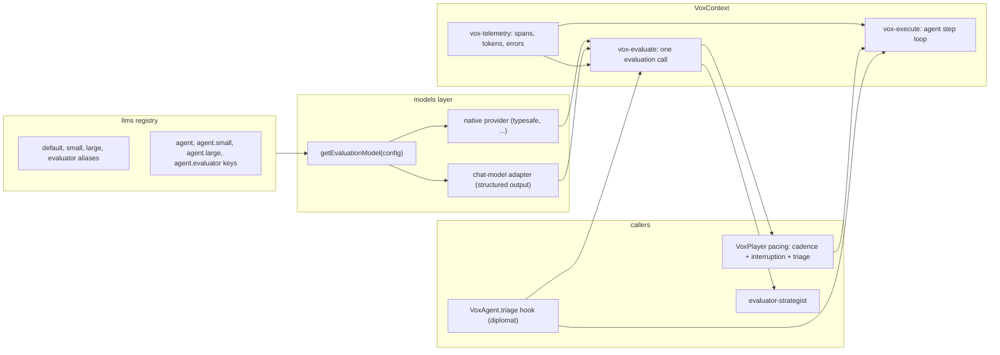

# Evaluation models and tiered execution

This plan brings **evaluation models** (TypeSafe AI's Jev and any provider like it) into vox-agents and uses them for two jobs: judging how serious a situation is so an agent can run on the right model tier, and playing a strategist seat outright. It also splits `VoxContext.execute()` into its own module beside a new `evaluate()` primitive so both share one telemetry layer. For contributors, paths use `vox-agents/` unless stated otherwise.

## Goal and success criteria

An **evaluation model** answers a fixed set of typed questions about one piece of state in a single request: a `choice` among named options, a `score` on an ordered rubric, or a `boolean`, each with a probability distribution. AI SDK 7 exposes this through `experimental_evaluate`, and its provider contract is small enough for vox-agents to implement its own backend.

When this plan is complete:

- Evaluation models are configured in the same `llms` registry as chat and embedding models, with the same alias rules, per-model concurrency, retry, spans, and token accounting. TypeSafe AI is the first native provider, and adding another is one case in a switch.
- Any configured chat model (for example `openai-compatible/gpt-oss-120b`) can serve as an evaluator through a structured-output adapter, so evaluation-based features work without a TypeSafe key.
- Model selection has three **tiers**, `small`, `default`, and `large`. Strategists pick a tier per turn through **pacing**, which gains an evaluator-backed triage step beside the existing cadence and event interruption. Other agents (the diplomat first) pick a tier through a `triage` hook run at the start of each execution.
- An `evaluator-strategist` plays a seat by asking a native evaluation model for the full action space and issuing the action tools directly, with no prompt loop.
- `VoxContext.execute()` and `VoxContext.evaluate()` live in parallel modules that share span, token, and error helpers, and every evaluation shows up in telemetry next to the agent runs it influenced.

## Decisions

| Question | Decision |
| --- | --- |
| Tier names | `small`, `default`, `large`. Tiers select models only; switching agents per tier is a possible follow-up. |
| Which reference wins when triage picks a tier | The tier wins. For tier `T` other than `default`: `<agent>.T`, then `T`, then `<agent>`, then `default`. |
| Where strategist triage lives | In pacing, as a step separate from the event interruption. Both remain configurable per seat. |
| How cadence and triage combine | Triage runs every turn and may say skip, small, default, or large. `everyTurns` and event interruptions only raise the floor to a default-tier decision. |
| Skipped turns | Carry a named reason: `[turn-skipped]` for the cadence, `[evaluator-skipped]` when triage decided nothing changed. |
| How other agents opt into triage | The `evaluator` alias (or `<agent>.evaluator`) supplies the model, and the agent's own model assignment carries `options.triage: true`. |
| Evaluator strategist backends | Native evaluation providers only. The chat-model adapter serves triage and other evaluation calls. |
| Evaluator input for strategists | Current strategies and rationale, victory progress, events since the last decision, and a compact players summary, as JSON. Cities and military stay out. |

## Design



### Evaluation models in the registry

`getEvaluationModel(config)` in `src/utils/models/evaluation.ts` mirrors `getEmbeddingModel`. The provider is the discriminator: `typesafe` builds the native model from `@ai-sdk/typesafe-ai`; every chat provider gets `createLanguageModelEvaluator(config, context)`, an object implementing the AI SDK evaluation-model contract over `getModel(config)`. The adapter turns the questions into a zod schema and a prompt, runs one chat step through `streamTextWithConcurrency` with structured output, parses leniently (jaison plus the schema, the `VoxAgent.getOutput` idiom), and normalizes the reply into distributions that pass the SDK's strict answer validation (choice is the argmax, score is the weighted mean, probabilities sum to one). Pure question-to-schema, prompt, and normalization helpers live in `src/utils/models/evaluation-questions.ts` so they are testable without mocks.

`experimental_evaluate` stays the single entry point for both backends. It validates questions and answers, retries transient failures, and infers typed answers from the question map, so routing code is type-checked against the criteria it declares.

Provider registration follows the existing pattern: `typesafe` joins `llmProviders`, `providerCredentials`, and `apiKeyFields` in `src/types/constants.ts` with `TYPESAFE_AI_API_KEY`; discovery returns a static catalog (`jev-latest`); `getModel` rejects evaluation-only providers with a clear error; chat-model pickers in the web config route and the discovery dialog filter them out.

### Three tiers

`ModelSize` in `src/types/config.ts` becomes `'small' | 'default' | 'large'`. `selectModelReference(name, size, overrides)` in `src/utils/models/resolution.ts` keeps today's order for `default` and uses the tier-wins order for the other two. `ensureModelsResolved` verifies the `large` alias at both scopes the way it verifies `small`, and the `tierRules` in `src/utils/models/rules.ts` may recommend a `large` model per provider where one is obvious.

New `selectEvaluatorReference(name, overrides)` checks `<name>.evaluator` then `evaluator` at both scopes and returns undefined otherwise. It never falls back to `default`, because that would add an evaluator call to every seat that only configured a chat model.

Configuration keys, all in the `llms` map (global `config.json` or per seat `PlayerConfig.llms`):

| Key | Meaning |
| --- | --- |
| `small`, `large` | Seat or global tier models. `default` keeps its current meaning. |
| `<agent>.small`, `<agent>.large` | Tier models for one agent. |
| `evaluator` | Evaluation model for triage. Native or chat model. |
| `<agent>.evaluator` | Evaluation model for one agent's triage. |
| `<agent>` with `options.triage: true` | Turns the `triage` hook on for a non-strategist agent. Strategists use `pacing.triage` instead. |
| `evaluator-strategist` | The native evaluation model that plays a seat assigned that strategist. |

Example seat:

```json
{
  "strategist": "simple-strategist",
  "pacing": { "everyTurns": 5, "interruption": "importantEvents", "triage": true },
  "llms": {
    "simple-strategist": "codex/gpt-6-astra",
    "diplomat": { "provider": "codex", "name": "gpt-6-astra", "options": { "triage": true } },
    "small": "codex/gpt-5.6-luna",
    "large": "codex/gpt-6-astra@high",
    "evaluator": "typesafe/jev-latest"
  }
}
```

Replacing the evaluator with `openai-compatible/gpt-oss-120b` keeps everything else the same.

### Execute and evaluate as parallel modules

`src/infra/vox-context.ts` keeps thin `execute()` and `evaluate()` methods and the run model; the bodies move out:

- `src/infra/vox-telemetry.ts` holds what both need: opening a span under the active run with the standard context, turn, and agent attributes; recording an error and closing; accruing usage to the active root's token sink, the seat totals, and an optional per-call token output; and the in-game model label update (`set-metadata`) that today sits inline in `execute`.
- `src/infra/vox-execute.ts` holds the agent loop: the frame push, the triage step, model resolution, prompt assembly, `executeAgentStep`, stop checks, and output conversion.
- `src/infra/vox-evaluate.ts` holds one evaluation call: require an active frame, open an `evaluate` span with the model reference, state, and questions, call `experimental_evaluate` with the factory's model and the run's abort signal, record answers, confidence (from provider metadata when present), and tokens, and accrue usage.

Both modules reach the context through a narrow `ExecutionHost` interface (`tracer`, the execution frame store, tools, tool map, model overrides, the current signal, token totals, logger) that `VoxContext` implements, so neither module depends on private fields.

### Triage for non-strategist agents

`VoxAgent` in `src/infra/vox-agent.ts` gains an optional async `triage(parameters, input, context)` hook returning a `TriageDecision` (`tier`, optional `answers`, optional `note`), and `getModel` gains an optional `tier` parameter defaulting to `this.modelSize`. `vox-execute` runs the hook once before model selection, stores the decision on the execution frame (exposed as `context.currentTriage`, matching `currentInput`), passes the tier to `getModel`, and records `triage.tier` and `triage.note` on the agent span. A caller can also hand a decision in through the execute options, which is how pacing supplies the strategist's tier; a supplied decision preempts the hook. A triage failure logs a warning and continues at the default tier so an evaluator outage never blocks a turn. A shared `triageEnabled(overrides)` helper reads `options.triage` from the agent's resolved assignment and confirms an evaluator reference exists.

The diplomat adopts it first. `src/envoy/agents/diplomat-triage.ts` declares an `intent` choice (deal, threat, request, small talk) and a `stakes` score over four levels, builds the state from the last few thread messages and the open proposal, and routes small talk to `small`, high-stakes deals and threats to `large`, and everything else to `default`. Greeting mode is always `small`.

### Pacing with triage

`PacingConfig` gains `triage?: boolean`. Interruption stays a separate, cheap, deterministic trigger. The per-turn gate in `src/strategist/pacing.ts` becomes a pure `resolvePacingVerdict({ scheduled, interrupted, triage })` returning a **verdict**: either a skip with its reason (`turn` or `evaluator`) or a decision at a tier with the reasons that produced it. The rules:

- Triage off: scheduled or interrupted decides at `default`; otherwise skip with `[turn-skipped]`. This is today's behavior.
- Triage on: the evaluator's answer maps to skip, `small`, `default`, or `large`. A scheduled or interrupted turn raises the floor to `default`, so triage can still escalate to `large` but can no longer skip or demote. An unscheduled, uninterrupted turn takes the evaluator's answer as is, and a skip carries `[evaluator-skipped]`.

This function is the seam for future pacing strategies; a new strategy replaces the combination rule without touching the player loop.

`src/strategist/pacing/triage.ts` owns the strategist questions (a `shift` score over none, minor, moderate, major), the state builder described in the decisions table, the mapping to a verdict, and `runStrategistTriage(context, parameters, state)` which calls `context.evaluate` with the strategist's evaluator reference. It runs inside the turn's root run, after the game-state refresh, so the `evaluate` span sits under the turn span.

`VoxPlayer` in `src/strategist/vox-player.ts` computes `scheduled` and `interrupted` as today, runs triage when enabled and an evaluator resolves, resolves the verdict, records `pacing.verdict`, `pacing.triage.tier`, and `pacing.triage.note` on the turn span, and either calls `keep-status-quo` with the named skip reason or passes the tier into `execute`. `lastDecisionTurn` advances only on a real decision, as now.

On the MCP side, `mcp-server/src/tools/actions/keep-status-quo.ts` replaces the single `[skipped]` sentinel with a small set of skip reasons (`[turn-skipped]`, `[evaluator-skipped]`) recognized by one helper, refreshing the in-game AI without recording a decision for any of them. The human strategist's comment about the sentinel updates accordingly.

### Evaluator strategist

`src/strategist/agents/evaluator-strategist.ts` registers `evaluator-strategist` and follows the null and human strategist idiom: all work happens in `getSystem`, which returns an empty string so the prompt loop never runs. It resolves its own assignment through `getModel`, rejects a non-evaluation provider with a clear error, builds the state and question set, calls `context.evaluate`, and issues each action through `context.callTool`.

`src/strategist/agents/evaluator-questions.ts` keeps the pure parts: `buildStrategistEvaluationState(parameters, state)` from the same game-state pieces the simple strategist renders; `buildStrategistQuestions(state, mode)` covering the full action space (a keep-status-quo boolean; a grand strategy choice over the offered grand strategies; in Flavor mode a five-level score per offered flavor axis, in Strategy mode a boolean per economic and military strategy; research and policy choices only when nothing is queued, the null-strategist rule; a score per persona axis; a relationship score per known major civilization); and `strategistActionsFromAnswers(answers, questions, mode)` returning the action tool calls with rationales built from the answer probabilities. The in-game model label shows the evaluation model's name for this agent rather than `VPAI`.

## Stages

Each stage is independently verifiable in the mock tier. Implement in order.

### Stage 1: telemetry split

Extract `execute` into `src/infra/vox-execute.ts` with the shared helpers in `src/infra/vox-telemetry.ts` and the `ExecutionHost` interface, leaving `VoxContext.execute()` as a delegator. No behavior change. Add `src/infra/vox-evaluate.ts` as a stub that throws until stage 3 fills it, so the parallel shape exists from the start.

Verify: the existing `tests/mock/context/` suites pass unchanged; a new test asserts the agent span attributes and token accrual are identical before and after the move.

### Stage 2: evaluation models and providers

Install `@ai-sdk/typesafe-ai` from the repo root and read its type declarations to confirm the factory name, `evaluationModel(id)`, supported question types, and the API key variable. Then add the provider registration, discovery catalog, `getModel` rejection, picker filters, `evaluation-questions.ts`, and `evaluation.ts` with both backends.

Verify: `tests/mock/utils/evaluation-questions.test.ts` (schema per question type, prompt names every criterion, normalized answers pass `experimental_evaluate` with a stub model) and `tests/mock/utils/evaluation.test.ts` (mocked TypeSafe factory receives the model id; the adapter turns a scripted JSON step into answers and usage and throws on garbage; `getModel` rejects `typesafe`).

### Stage 3: tiers, references, and the evaluate primitive

Widen `ModelSize`, update `selectModelReference` and `ensureModelsResolved`, add `selectEvaluatorReference` and `getEvaluatorConfig`, fill in `vox-evaluate.ts`, and extend `modelReferencesForPlayer` in `src/strategist/strategist-session.ts` to preflight tier and evaluator references for agents that have triage on (strategists through `pacing.triage`, others through `options.triage`). Add a recorded `evaluate` stub and `currentTriage` to `tests/helpers/fake-vox-context.ts`.

Verify: `tests/mock/utils/model-resolution.test.ts` covers the tier order for `small` and `large`, evaluator lookup at both scopes and its undefined result, and preflight of a `typesafe/jev-latest` reference through mocked discovery. `tests/mock/context/vox-context-evaluate.test.ts` covers the active-run requirement, usage accrual to the run handle and seat totals, and the span contents.

### Stage 4: triage hook and the diplomat

Add `TriageDecision`, the `triage` hook, the `tier` parameter on `getModel`, the frame field, the execute option, and the diplomat adopter.

Verify: a stub agent whose `triage` returns `small` makes `getModel` receive `small` and `getSystem` see `currentTriage`; an agent without `triage` is unchanged; a throwing triage falls back to `default`; a supplied decision preempts the hook. Pure route tests for the diplomat questions plus a diplomat test with scripted answers asserting the tier per scenario and undefined when the gate is off.

### Stage 5: pacing with triage

Add `pacing.triage`, `resolvePacingVerdict`, `pacing/triage.ts`, the `VoxPlayer` changes, the named skip reasons on both sides of MCP, and the pacing checkbox in `ui/src/components/session/config/PlayerConfigEditor.vue` with its summary line.

Verify: `tests/mock/strategist/pacing.test.ts` covers every verdict combination (triage off and on, scheduled, interrupted, each evaluator answer); `tests/mock/strategist/vox-player-runs.test.ts` covers a triaged skip calling `keep-status-quo` with `[evaluator-skipped]`, a cadence skip with `[turn-skipped]`, and a triaged decision passing its tier into `execute`; an MCP test covers both skip reasons refreshing without a recorded decision.

### Stage 6: evaluator strategist

Add `evaluator-questions.ts`, `evaluator-strategist.ts`, the registry entry, and the model label tweak.

Verify: `tests/mock/strategist/evaluator-questions.test.ts` (question sets and action mapping per mode) and `tests/mock/strategist/evaluator-strategist.test.ts` with a fake context and scripted answers, asserting the recorded action calls and rationales and the error for a chat-model assignment.

### Stage 7: docs

- `docs/developers/vox-agents/overview.md`, Models and configuration: evaluation models as a third kind, the three tiers and their lookup order, the `evaluator` keys, the TypeSafe provider, the chat-model adapter, the execute and evaluate modules, and the triage hook.
- `docs/developers/vox-agents/strategist.md`: pacing with triage and the named skip reasons, and a roster row for `evaluator-strategist`.
- `docs/developers/vox-agents/envoy.md`: the diplomat's triage.
- `docs/developers/mcp-server/tools.md`: the keep-status-quo skip reasons.
- `vox-agents/AGENTS.md`: one line under Critical Conventions mirroring the embedding-model line.

## Verification

- `npm run type-check` and `npm test` from `vox-agents/`, the MCP server's mock tests, then `npm run test:all` from the root.
- Manual check with a local chat model as the evaluator: set `"evaluator": "openai-compatible/gpt-oss-120b"`, enable `pacing.triage` on a seat, run `npm run strategist` for a few turns, and confirm in the dashboard's telemetry that each turn span carries an `evaluate` span, a `pacing.verdict`, and, on decided turns, an agent span reporting the tier.
- Manual check with a TypeSafe key: repeat with `"evaluator": "typesafe/jev-latest"`, open a diplomacy chat to see the diplomat's tier change between small talk and a deal, then switch the seat's strategist to `evaluator-strategist` and confirm action tool calls land in the replay log with their rationales.

## Follow-ups deliberately left out

- Tiers that switch the agent as well as the model (for example a major pivot running the staffed strategist).
- Additional pacing strategies built on `resolvePacingVerdict`, such as budget-aware pacing.
- Exposing tier and evaluator models in `PlayerAssignment` for the dashboard.
